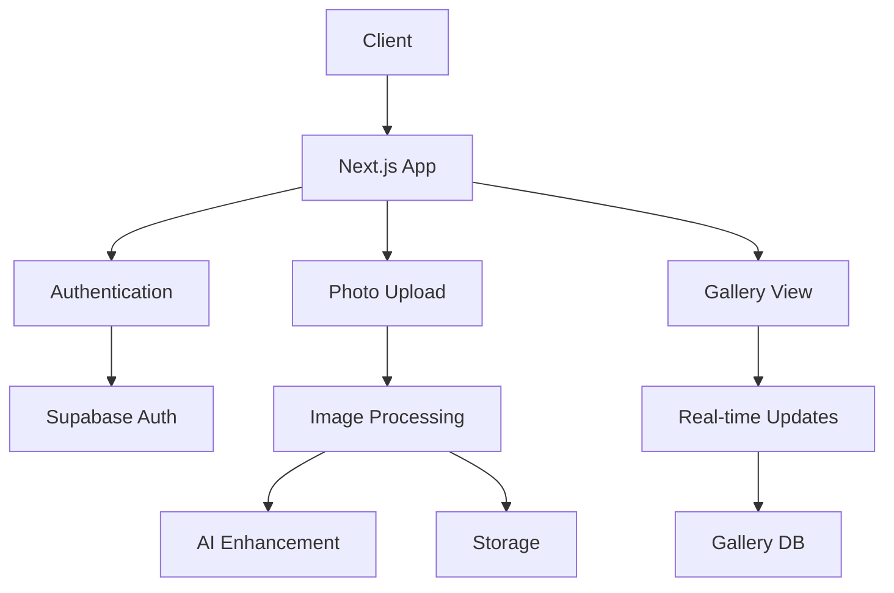
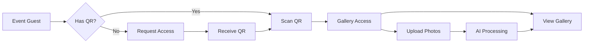
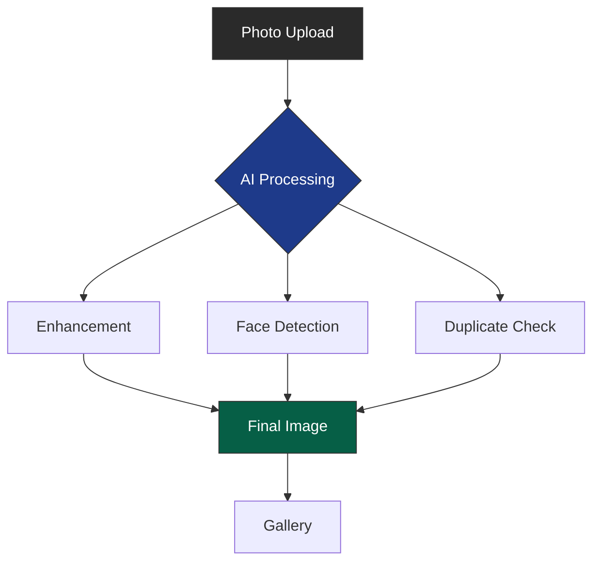
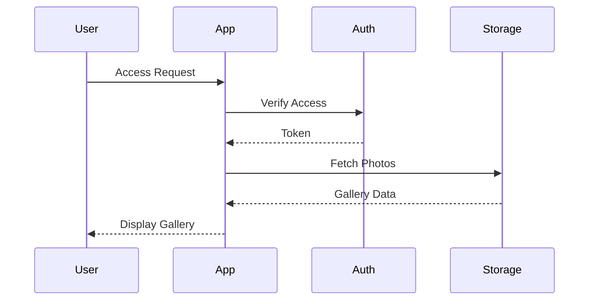

  

# Cloud Burst

## *Elevating Event Photography*

Remember the charm of disposable cameras at wedding tables? We're bringing that magic into the digital age. Cloud Burst transforms every event into a collaborative photo story, powered by AI and created by everyone who matters – your guests.
### [Live Demo](https://cb-beta.replit.app) • [Documentation](docs/) • [Contributing](CONTRIBUTING.md)

## 📸 Overview

### 📸 Capture Every Moment 📸
No apps to download, no accounts to create. Just scan a QR code and start capturing memories. It's that simple.
Cloud Burst revolutionizes event photography by bringing the charm of disposable cameras into the digital age. Our platform transforms every event into a collaborative photo story, powered by AI and created by all attendees. With no apps to download and no accounts to create, guests simply scan a QR code to instantly start capturing and sharing memories.

### Key Benefits
- **Instant Access**: One QR code connects all your guests
- **Real-Time Gallery**: Watch your event's story unfold live
- **AI-Powered**: Automatic photo enhancement and organization
- **Universal**: Works on any modern device
- **Secure**: Enterprise-grade security and privacy

## 🏗️ System Architecture

## 🔄 User Flow

## 🛠️ Tech Stack

```mermaid
graph TD
    CB[Cloud Burst Platform] --> FE[Frontend]
    CB --> BE[Backend]
    CB --> INFRA[Infrastructure]

    %% Frontend Stack
    FE --> F1[Next.js 14]
    FE --> F2[TypeScript 5.0]
    FE --> F3[UI Layer]
    FE --> F4[State Management]
    FE --> F5[Forms & Validation]

    F3 --> F3A[Shadcn/ui]
    F3 --> F3B[TailwindCSS]
    F3 --> F3C[Responsive Design]
    
    F4 --> F4A[Zustand]
    F4 --> F4B[TanStack Query]
    
    F5 --> F5A[React Hook Form]
    F5 --> F5B[Zod Schema]

    %% Backend Stack
    BE --> B1[Supabase]
    BE --> B2[AI Processing]
    BE --> B3[Storage]
    BE --> B4[Real-time]

    B1 --> B1A[PostgreSQL]
    B1 --> B1B[Auth]
    B1 --> B1C[RLS]

    B2 --> B2A[TensorFlow.js]
    B2 --> B2B[OpenCV]
    B2 --> B2C[OpenAI]

    B3 --> B3A[Image Storage]
    B3 --> B3B[CDN]
    B3 --> B3C[Optimization]

    %% Infrastructure
    INFRA --> I1[Replit]
    INFRA --> I2[CI/CD]
    INFRA --> I3[Monitoring]

    I1 --> I1A[Node 20.x]
    I2 --> I2A[GitHub Actions]
    I3 --> I3A[Sentry]

    style CB fill:#2A2A2A,stroke:#333,color:#fff
    style FE fill:#1E3A8A,stroke:#333,color:#fff
    style BE fill:#065F46,stroke:#333,color:#fff
    style INFRA fill:#7E22CE,stroke:#333,color:#fff
```

## 🤖 AI Capabilities

## 🔐 Security Architecture

## ✨ Feature Sets

### 🎯 Essential Features
- **Event Gallery**: Instant photo sharing and organization
- **AI Organization**: Smart photo categorization and enhancement
- **24/7 Access**: Continuous platform availability
- **Social Sharing**: Integrated social media connectivity
- **Standard Support**: Reliable customer assistance

### 💫 Advanced Capabilities
- **Custom Branding**: White-label solution options
- **Analytics Dashboard**: Comprehensive event insights
- **Extended Storage**: Flexible storage solutions
- **Priority Support**: Enhanced customer care
- **Advanced AI**: Premium photo organization

### 🚀 Enterprise Solutions
- **Unlimited Photos**: No storage restrictions
- **Premium AI Tools**: Advanced image processing
- **24/7 Priority Support**: Dedicated assistance
- **API Access**: Custom integration capabilities
- **Advanced Analytics**: Detailed performance metrics

### ⚡ Custom Features
- **Custom AI Models**: Tailored AI solutions
- **Dedicated Support**: Personal support team
- **Custom Integration**: Enterprise system integration
- **Advanced Security**: Enhanced protection measures
- **SLA Guarantee**: Performance guarantees

## 📊 System Performance

- **Response Time**: < 100ms
- **Image Processing**: < 2s
- **Availability**: 99.9%
- **Storage**: Unlimited
- **Concurrent Users**: 10,000+
- **Data Protection**: GDPR Compliant

## 📫 Connect With Us

- Email: joel@arcanaconcept.com
- Deployed: [Beta Platform](https://cb-beta.replit.app)

---

Made with ❤️ by [Arcana Concept](https://github.com/mrj0nesmtl)

