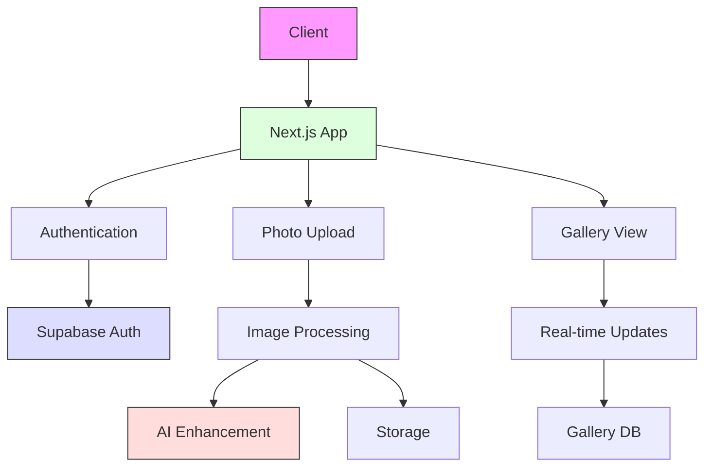
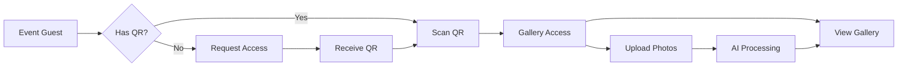
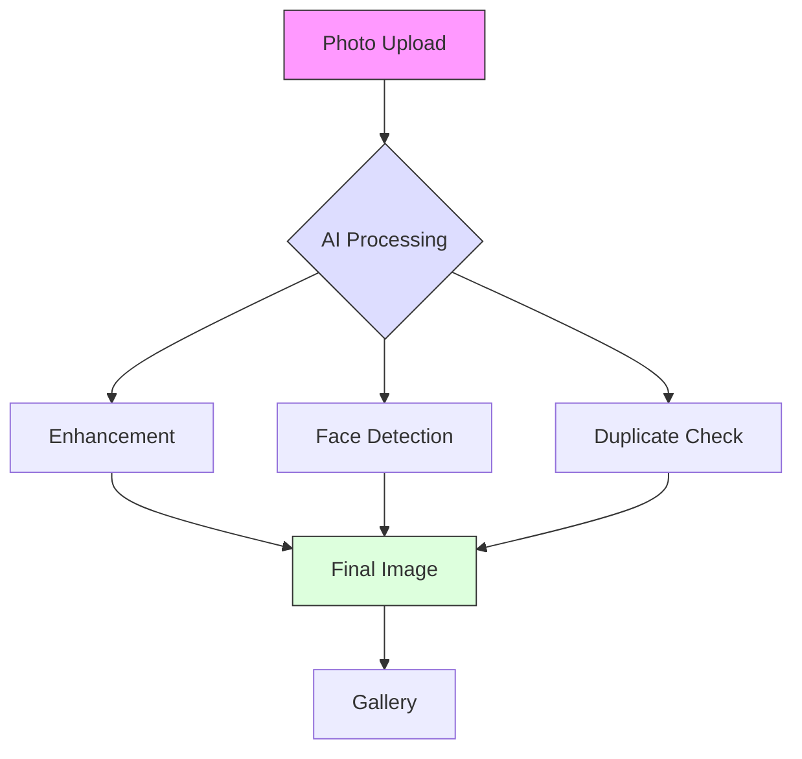
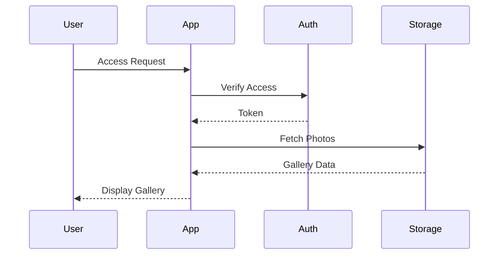

<div align="center">
  

# Cloud Burst

*Elevating Event Photography*

[](https://github.com/mrj0nesmtl/cloud-burst/releases)
[](https://nextjs.org/)
[](https://www.typescriptlang.org/)
[](https://supabase.io/)
[](https://tailwindcss.com/)
[](LICENSE)

Remember the charm of disposable cameras at wedding tables? We're bringing that magic into the digital age. Cloud Burst transforms every event into a collaborative photo story, powered by AI and created by everyone who matters – your guests.

[Live Demo](https://cb-beta.replit.app) • [Documentation](docs/) • [Contributing](CONTRIBUTING.md)

</div>

## 📊 System Architecture



## 🔄 User Flow



## ✨ The Magic Behind Cloud Burst

### 📸 Capture Every Moment
No apps to download, no accounts to create. Just scan a QR code and start capturing memories. It's that simple.

- **Instant Access** - One QR code connects all your guests
- **Real-Time Gallery** - Watch your event's story unfold live
- **Smart Organization** - AI automatically curates and enhances photos
- **Universal Compatibility** - Works on any modern device

### 🤖 AI-Powered Excellence



### 🔐 Security Flow



## 🛠️ Built With Excellence

```typescript
{
  frontend: {
    framework: "Next.js 14",
    language: "TypeScript",
    styling: "TailwindCSS + Shadcn/ui",
    experience: "Seamless & Responsive"
  },
  backend: {
    database: "Supabase",
    storage: "Enterprise-grade",
    ai: ["TensorFlow.js", "OpenCV", "OpenAI"]
  }
}
```

## 🚀 Project Status

Currently in beta (v0.1.13), with focus on:
- ✅ Core platform stability
- ✅ Authentication system
- ✅ Deployment optimization
- 🚧 Photo galleries
- 🚧 QR code system
- 🚧 Event management

## 🤝 Join Our Journey

Whether you're a developer, photographer, or event planner, we'd love your input. Check our [Contributing Guide](CONTRIBUTING.md) to get started.

## 📫 Connect With Us

- Email: joel@arcanaconcept.com
- GitHub: [Cloud Burst Repository](https://github.com/mrj0nesmtl/cloud-burst)
- Demo: [Beta Platform](https://cb-beta.replit.app)

---

<div align="center">

Made with ❤️ by [Arcana Concept](https://github.com/mrj0nesmtl)

</div>