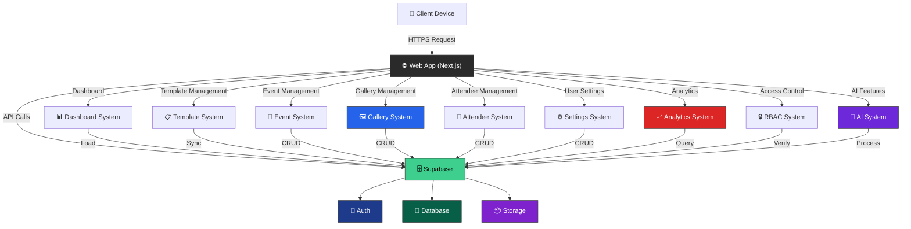
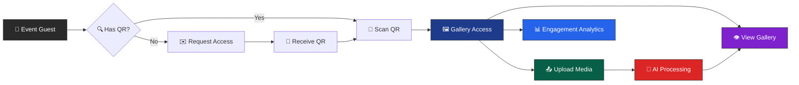
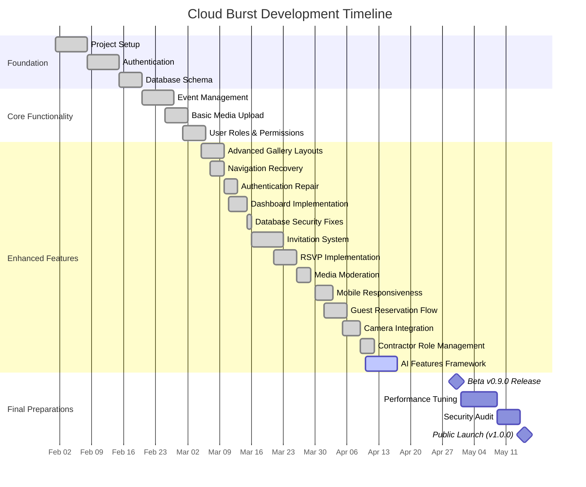

<div align="center">
  

# Cloud Burst

## Capture Every Moment

[](https://github.com/mrj0nesmtl/cloud-burst/releases)
[](https://nextjs.org/)
[](https://www.typescriptlang.org/)
[](https://supabase.io/)
[](https://tailwindcss.com/)
[](LICENSE)
</div>

## Abstract 💡

Cloud Burst represents the evolution of event media capture, bridging the gap between traditional charm and modern technology. With the implementation of role-based access control, custom event URLs, enhanced gallery functionality, invitation system, RSVP capabilities, and AI-powered features, our platform now offers a comprehensive solution for event media management. The latest enhancements include a sophisticated contractor management system with visual role indicators and specialized permissions, providing event organizers with powerful tools to collaborate with external professionals. Deployed in beta at [https://cb-beta.replit.app](https://cb-beta.replit.app), Cloud Burst maintains exceptional performance while delivering a seamless user experience across devices as we approach our April 30, 2025 beta release date.

## Crowd-Powered 🤳

No apps to download, no accounts to create. Just scan a QR code and start capturing memories. It's that simple.
Cloud Burst revolutionizes event media capture by bringing the charm of disposable cameras into the digital age. Our 
platform transforms every event into a collaborative media story, powered by AI and created by all attendees. With 
no apps to download and no accounts to create, guests simply scan a QR code to instantly start capturing and sharing 
photos and videos.

## Our Pitch 🎙️

Remember the magic of disposable cameras 📸 on wedding tables? We've reimagined that collaborative spirit for the digital age. Cloud Burst transforms every event into a living media story, powered by AI and created by everyone who matters – your guests. No apps to download, no accounts to create – just scan, snap, and share. With enterprise-grade security, AI-enhanced media, and real-time galleries, we're not just capturing moments; **We're revolutionizing how memories are made.**

<div align="center">

### [Live Demo](https://cb-beta.replit.app) • [Documentation](docs/) • [Contributing](CONTRIBUTING.md)

</div>

## Features

### Media Management

- **Unified Media Gallery**: Support for both photos and videos in a seamless gallery experience
- **Direct Camera Integration**: Capture media directly through the platform with QR code access
- **Automated Processing**: Efficient handling of uploads with progress tracking and error handling
- **Content Moderation**: Review and approval workflow to ensure appropriate content

### Event Management

- **Comprehensive Dashboard**: Create, manage, and track events from a single interface
- **Attendee Management**: Invite and manage event participants with role-based permissions
- **QR Code System**: Generate event-specific and personalized QR codes for streamlined access
- **Status Tracking**: Monitor event lifecycle from planning to completion

### Invitation System

- **Email Invitations**: Send personalized invitations with secure access links and QR codes
- **Attendee Tracking**: Monitor invitation status, RSVPs, and event participation
- **QR Code Access**: Scan event QR codes for immediate camera and gallery access
- **Guest Authentication**: Temporary access for invited users with streamlined registration
- **RSVP Management**: Comprehensive system for tracking responses with dietary preferences

### Security

- **Role-Based Access Control**: Comprehensive permission system with clearly defined capabilities
- **Row Level Security**: Database-level protection for all resources
- **Authentication Options**: Multiple secure login methods including QR code scanning
- **Content Protection**: Ensure media is only accessible to authorized users
- **Token-Based Authentication**: Secure access for guests without creating accounts

### AI Features

- **Facial Recognition**: Intelligent face detection and recognition for easy photo organization and search
- **Photo Enhancements**: Automated photo and video enhancement with customizable styles
- **Product Placements**: Smart product placement and brand integration for event photos
- **Smart Tagging**: Automated content tagging and organization powered by AI
- **AI Studio**: Advanced workspace for custom photo and video transformations using cutting-edge models

### Key Benefits

- **Instant Access**: One QR code connects all your guests
- **Real-Time Gallery**: Watch your event's story unfold live
- **AI-Powered**: Automatic media enhancement and organization
- **Universal**: Works on any modern device
- **Secure**: Enterprise-grade security and privacy
- **Analytics**: Gain valuable insights on engagement and interactions
- **Customizable**: Tailor the experience to match your event theme
- **Collaborative**: Everyone contributes to a shared visual story

## 🏗️ System Architecture


```mermaid
graph TD
    Client["📱 Client Device"] -->|"HTTPS Request"| WebApp["🌐 Web App (Next.js)"]
    WebApp -->|"API Calls"| Supabase["🗄️ Supabase"]
    WebApp -->|"Dashboard"| Dashboard["📊 Dashboard System"]
    WebApp -->|"Template Management"| Templates["📋 Template System"]
    WebApp -->|"Event Management"| Events["📅 Event System"]
    WebApp -->|"Gallery Management"| Gallery["🖼️ Gallery System"]
    WebApp -->|"Attendee Management"| Attendees["👥 Attendee System"]
    WebApp -->|"User Settings"| Settings["⚙️ Settings System"]
    WebApp -->|"Analytics"| Analytics["📈 Analytics System"]
    WebApp -->|"Access Control"| RBAC["🔒 RBAC System"]
    WebApp -->|"AI Features"| AI["🧠 AI System"]
    
    Dashboard -->|"Load"| Supabase
    Templates -->|"Sync"| Supabase
    Events -->|"CRUD"| Supabase
    Gallery -->|"CRUD"| Supabase
    Attendees -->|"CRUD"| Supabase
    Settings -->|"CRUD"| Supabase
    Analytics -->|"Query"| Supabase
    RBAC -->|"Verify"| Supabase
    AI -->|"Process"| Supabase
    
    Supabase --> Auth["🔑 Auth"]
    Supabase --> Database["💾 Database"]
    Supabase --> Storage["📦 Storage"]
    
    style WebApp fill:#2A2A2A,stroke:#333,color:#fff
    style Supabase fill:#3ECF8E,stroke:#333,color:#000
    style Auth fill:#1E3A8A,stroke:#333,color:#fff
    style Database fill:#065F46,stroke:#333,color:#fff
    style Storage fill:#7E22CE,stroke:#333,color:#fff
    style Analytics fill:#DC2626,stroke:#333,color:#fff
    style Gallery fill:#2563EB,stroke:#333,color:#fff
    style AI fill:#6D28D9,stroke:#333,color:#fff
```

## 👥 User Roles

Cloud Burst implements a sophisticated role-based access control system:

- **Super Admin**: Full system access (internal use only)
- **Admin**: Administrative access (internal use only)
- **Organizer**: Event management access (paid tier only)
- **Event Host**: Create and manage own events (cannot delete)
- **Event Staff**: Upload content and assist with event management
- **Contractor**: External partner with limited event access
- **Photographer**: External photographer with photo upload capabilities
- **Technician**: Technical support with event setup permissions
- **Marketing**: External partner with analytics and content access
- **Invited User**: Invited attendee with QR code access
- **User**: Standard user with basic platform access
- **Guest**: Public access to view public events and galleries


```mermaid
graph LR
    A["👤 Event Guest"] --> B{"🔍 Has QR?"}
    B -->|"Yes"| C["📱 Scan QR"]
    B -->|"No"| D["✉️ Request Access"]
    C --> E["🖼️ Gallery Access"]
    D --> F["📲 Receive QR"]
    F --> C
    E --> G["📤 Upload Media"]
    E --> H["👁️ View Gallery"]
    G --> I["🤖 AI Processing"]
    I --> H
    E --> J["📊 Engagement Analytics"]
    
    style A fill:#2A2A2A,stroke:#333,color:#fff
    style E fill:#1E3A8A,stroke:#333,color:#fff
    style G fill:#065F46,stroke:#333,color:#fff
    style H fill:#7E22CE,stroke:#333,color:#fff
    style I fill:#DC2626,stroke:#333,color:#fff
    style J fill:#2563EB,stroke:#333,color:#fff
```

## 📱 User Experience

### For Event Organizers
- Create and manage events
- Send invitations to attendees
- Monitor event analytics
- Review and approve media uploads
- Generate event QR codes
- Access AI features for media enhancement

### For Photographers
- Upload and organize media
- Create albums and galleries
- Edit and enhance content with AI tools
- Share with event participants
- Track engagement metrics
- Apply automated tagging and organization

### For Invited Guests
- Receive personalized invitations
- Scan QR codes for instant access
- Capture media directly from the event
- View and download shared content
- Connect with other attendees
- Respond to invitations with RSVP
- Enjoy AI-enhanced photos and videos

## 🔄 Current Status

Cloud Burst is currently in beta (v0.8.9) with approximately 97% of core features implemented:

- ✅ Event management system
- ✅ Role-based access control
- ✅ QR code generation and scanning
- ✅ Direct camera integration
- ✅ Media upload and gallery foundation
- ✅ Event card navigation and interactivity
- ✅ Mobile navigation and responsive design
- ✅ Enhanced modal dialogs and UI components
- ✅ RSVP system foundation
- ✅ Public gallery access
- ✅ Invitation management enhancements
- ✅ Beta partner integration
- ✅ Email system improvements
- ✅ Profile management
- ✅ Mobile responsiveness optimization
- ✅ Chart components for data visualization
- ✅ AI Features framework
- ✅ Guest reservation onboarding
- ✅ Camera functionality implementation
- ✅ Staff management with contractor roles
- ✅ Role badge visualization system
- 🟡 Media moderation (85% complete)
- 🟡 Gallery masonry layout (95% complete)
- 🟡 Analytics dashboard (65% complete)
- 🟡 Album management system (60% complete)
- 🟡 AI integration with media processing (25% complete)

### Technical Debt (Session 39)
- Integration of camera functionality with event galleries
- Enhanced error handling for upload components
- Additional test coverage for new components
- AI features integration with TensorFlow.js
- Analytics dashboard finalization
- Enhanced keyboard navigation for improved accessibility

We're targeting Beta 0.9.0 for internal testing by April 30, 2025, with public launch (v1.0.0) planned for May 15, 2025.

## 📅 Project Timeline

Cloud Burst has evolved from concept to robust beta platform since its inception. Here's our development roadmap:


```mermaid
gantt
    title Cloud Burst Development Timeline
    dateFormat  YYYY-MM-DD
    axisFormat %b %d
    
    section Foundation
    Project Setup           :done, f1, 2025-02-01, 7d
    Authentication          :done, f2, 2025-02-08, 7d
    Database Schema         :done, f3, 2025-02-15, 5d
    
    section Core Functionality
    Event Management        :done, c1, 2025-02-20, 7d
    Basic Media Upload      :done, c2, 2025-02-25, 5d
    User Roles & Permissions:done, c3, 2025-03-01, 5d
    
    section Enhanced Features
    Advanced Gallery Layouts:done, e1, 2025-03-05, 5d
    Navigation Recovery     :done, e2, 2025-03-07, 3d
    Authentication Repair   :done, e3, 2025-03-10, 3d
    Dashboard Implementation:done, e4, 2025-03-11, 4d
    Database Security Fixes :done, e5, 2025-03-15, 1d
    Invitation System       :done, e6, 2025-03-16, 7d
    RSVP Implementation     :done, e7, 2025-03-21, 5d
    Media Moderation        :done, e8, 2025-03-26, 3d
    Mobile Responsiveness   :done, e9, 2025-03-30, 4d
    Guest Reservation Flow  :done, e10, 2025-04-01, 5d
    Camera Integration      :done, e11, 2025-04-05, 4d
    Contractor Role Management :done, e12, 2025-04-09, 3d
    AI Features Framework   :active, e13, 2025-04-10, 7d
    
    section Final Preparations
    Beta v0.9.0 Release     :milestone, b1, 2025-04-30, 0d
    Performance Tuning      :o1, 2025-05-01, 8d
    Security Audit          :o2, 2025-05-09, 5d
    Public Launch (v1.0.0)  :milestone, l3, 2025-05-15, 0d
```

### Key Development Phases

1. **Foundation Phase** (Feb 1-15, 2025): Project setup, authentication system, database schema design
2. **Core Functionality Phase** (Feb 16-Mar 1, 2025): Event management, basic media upload, user roles
3. **Enhanced Features Phase** (Mar 2-Apr 9, 2025): Advanced gallery, navigation, authentication refinements, invitation system, RSVP functionality, guest reservation, camera integration, contractor role management
4. **Final Preparations Phase** (Apr 10-Apr 30, 2025): AI features, performance tuning, security audit, public launch preparations

## 🚀 Getting Started

### Prerequisites
- Node.js 18.0+
- npm or yarn

### Installation
1. Clone the repository
   ```bash
   git clone https://github.com/yourusername/cloud-burst.git
   ```
2. Install dependencies
   ```bash
   cd cloud-burst
   npm install
   ```
3. Set up environment variables
   ```bash
   cp .env.example .env.local
   ```
4. Start the development server
   ```bash
   npm run dev
   ```

## 📚 Documentation

For complete documentation of the Cloud Burst platform, please visit our [Documentation Center](./docs/).

Our documentation includes:

- [Architecture Documentation](./docs/architecture/)
  - [Application Design](./docs/architecture/application_design_document.md)
  - [System Architecture Flowchart](./docs/architecture/system_architecture_flowchart.md)
  - [Security Architecture](./docs/architecture/security.md)

- [Deployment Guides](./docs/deployment/)
  - [Deployment Guides](./docs/deployment/deployment_guides.md)
  - [Deployment Fixes](./docs/deployment/deployment_fixes.md)
  - [Replit Deployment](./docs/deployment/replit_deployment.md)
  - [Replit Quick Reference](./docs/deployment/replit-quick-reference.md)

- [Design Documentation](./docs/design/)
  - [UI Components](./docs/design/UI_components.md)
  - [Style Guide](./docs/design/style.md)
  - [Website Overview](./docs/design/website_overview.md)
  - [Gallery Implementation](./docs/design/gallery_implementation.md)
  - [Media Schema Migration](./docs/design/media_schema_migration.md)
  - [Consistent Layout](./docs/design/consistent-layout.md)
  - [Layout Troubleshooting](./docs/design/layout-troubleshooting.md)
  - [AI Features Implementation](./docs/design/ai_features_implementation.md)
  - [Chart Components](./docs/design/chart_components.md)

- [Development Documentation](./docs/development/)
  - [Status Notes](./docs/development/STATUS_NOTES.md)
  - [Version Control](./docs/development/VERSION_CONTROL.md)
  - [Contributing Guidelines](./docs/development/contributing.md)
  - [Session 33 Resources](./docs/development/SESSION_33_RESOURCES.md)

- [User Flows & RBAC](./docs/rbac/)
  - [Role-Based Access Control](./docs/rbac/role_based_access_control.md)
  - [User Flow Overview](./docs/user-flows/user_flow_overview.md)
  - [User Flow Chart](./docs/user-flows/user_flow_chart.md)
  - [Invited User Flow](./docs/user-flows/invited_user_flow_design_document.md)
  - [Invitation System Documentation](./docs/user-flows/invitation_system_development_plan.md)
  - [Invitation System Testing](./docs/user-flows/invitation_system_testing_plan.md)
  - [RSVP System Design](./docs/user-flows/rsvp_system_design.md)

## 🤝 Contributing

We welcome contributions! Please read our [Contributing Guide](./CONTRIBUTING.md) for details on our code of conduct and the process for submitting pull requests.

## 📝 License

This project is licensed under the [MIT License](LICENSE).

---

<div align="center">

Built with ❤️ by Joel and the Cloud Burst Team

</div>