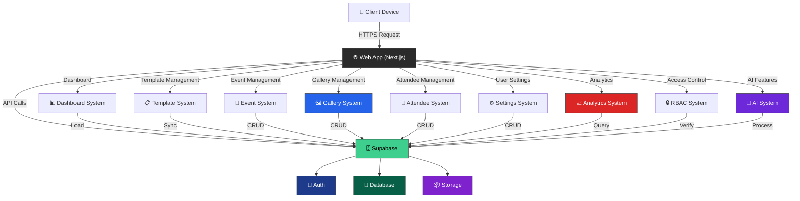
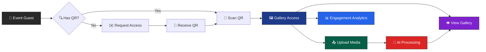
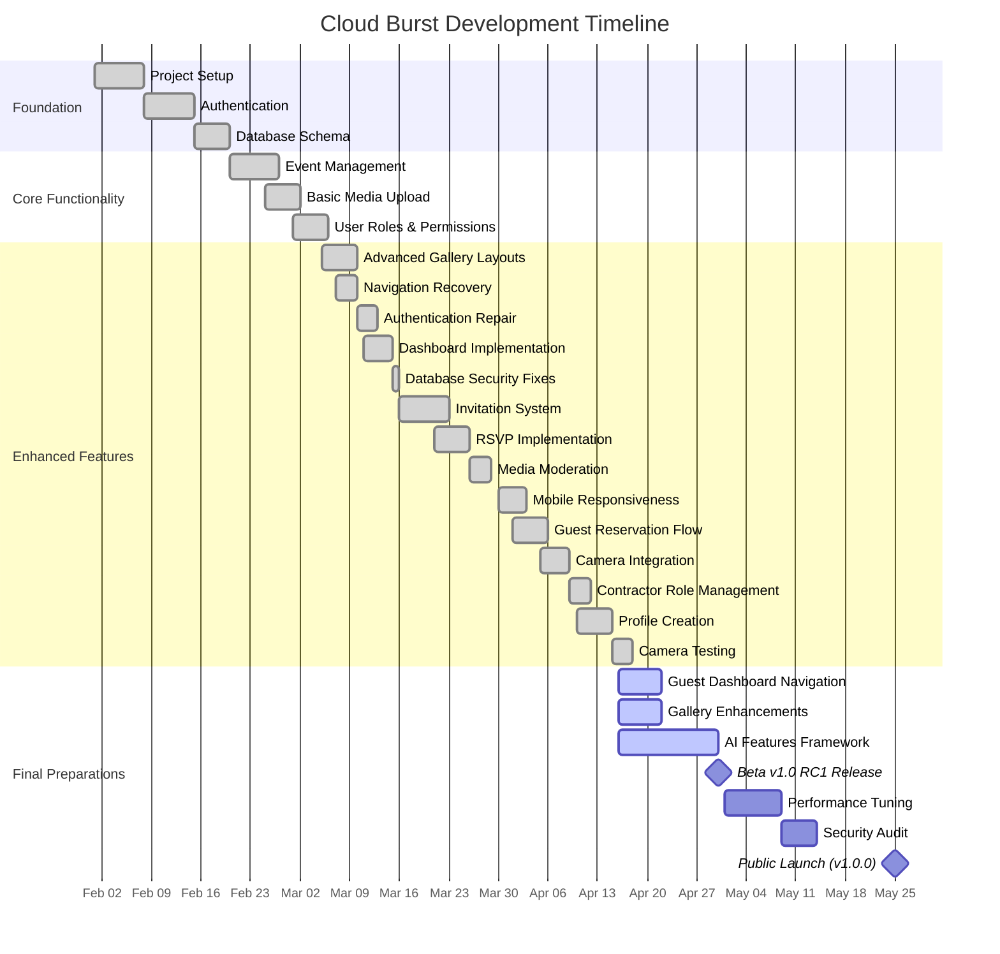

# Cloud Burst Documentation

> **Version:** 0.9.2   
> **Last Updated:** April 15, 2025

## 📌 Situational Abstract

Cloud Burst has evolved significantly since its inception, with all core features now implemented. Recent milestones include the successful integration of a guest profile creation system with avatar upload functionality, camera testing interface with flashlight control, and enhanced mobile responsiveness. The platform now provides a comprehensive event management system with invitation, RSVP, and guest onboarding capabilities, ensuring a consistent and intuitive experience across both desktop and mobile devices. As we approach our April 30, 2025 Beta 1.0 RC1 release date, current development is focused on fixing navigation issues to the guest dashboard after setup completion, implementing beautiful gallery layouts for guests, enhancing the AI features integration, and finalizing the analytics dashboard.

## 🔄 Recent Updates

- ✅ Implemented guest profile page with avatar upload component
- ✅ Created camera access testing feature with real-time preview
- ✅ Added flashlight toggle for camera testing in different lighting conditions
- ✅ Fixed framer-motion dependency to resolve dashboard build errors
- ✅ Enhanced avatar component with improved styling and hover effects
- ✅ Updated confirmation page UI with consistent black buttons
- ✅ Fixed styling issues on event confirmation page
- ✅ Enhanced UI consistency across guest-facing interfaces
- ✅ Removed redundant brand elements from headers for cleaner UI
- ✅ Updated technical documentation including CHANGELOG and roadmap
- ✅ Generated comprehensive project structure documentation

### 🔐 Auth System Enhancements

- ✅ Comprehensive role-based middleware implemented
- ✅ Permission hooks for capability checking
- ✅ Conditional UI rendering based on permissions
- ✅ Resource ownership verification
- ✅ Session management improved
- ✅ Cookie security strengthened
- ✅ Error boundaries implemented
- ✅ Type safety enhanced with Zod schemas
- ✅ Email verification flow
- ✅ Template-based notifications

## 📚 Documentation Structure

### 🏗️ Architecture

- [Application Design](architecture/application_design_document.md)
- [System Architecture Flowchart](architecture/system_architecture_flowchart.md)
- [Security Architecture](architecture/security.md)
- [AI Implementation](architecture/ai_implementation.md)

### 🚀 Deployment

- [Deployment Guides](deployment/deployment_guides.md)
- [Deployment Fixes](deployment/deployment_fixes.md)
- [Replit Deployment](deployment/replit_deployment.md)
- [Replit Quick Reference](deployment/replit-quick-reference.md)

### 🎨 Design

- [UI Components](design/UI_components.md)
- [Style Guide](design/style.md)
- [Website Overview](design/website_overview.md)
- [Consistent Layout](design/consistent-layout.md)
- [Layout Troubleshooting](design/layout-troubleshooting.md)
- [Media Schema Migration](design/media_schema_migration.md)

### 💻 Development

- [Status Notes](development/STATUS_NOTES.md)
- [Version Control](development/VERSION_CONTROL.md)
- [Version Sync Plan](development/version-sync.plan)
- [Contributing Guidelines](development/contributing.md)

#### 📋 Current Session Resources

- [Session 40 Checklist](session_notes/session_40_checklist.md)
- [Session 41 Checklist](development/session_41_checklist.md)

#### 📝 Development Archive

- [Session History](development/prompt_archive/)
  - Sessions 1-39 Documentation
  - Session Checklists and Kickoffs
  - Session Narratives and Summaries
  - Session Resources and Plans

### 🌟 Features

- [Gallery Implementation](features/gallery_implementation.md)
- [QR Scan Components](features/qr-scan-components.md)
- [QR Scanner Types](features/qr-scanner-types.md)

### 📋 Planning

- [Auth Cleanup](planning/auth-cleanup.md)
- [Business Proposition](planning/business_proposition.md)
- [Payment & Subscription Design](planning/payment_subscription_design.md)
- [Project Budget](planning/project_budget_overview.md)
- [Product RFP](planning/request_for_product_RFP.md)
- [Roadmap](planning/roadmap.md)
- [Statement of Work](planning/statement_of_work.md)
- [Permissions Analysis](planning/permissions-analysis.md)
- [Deck](planning/deck.md)

### 🔧 Project Structure

- [Project Overview](project-structure/README.md)
- Application Trees
  - [Full Project Tree](project-structure/FULL_TREE.md)
  - [Source Tree](project-structure/SRC_TREE.md)
  - [App Router Tree](project-structure/app_tree.md)
  - [Components Tree](project-structure/components_tree.md)
  - [Protected Tree](project-structure/protected_tree.md)
  - [Events Tree](project-structure/events_tree.md)
  - [Gallery Tree](project-structure/gallery_tree.md)
  - [Hooks Tree](project-structure/hooks_tree.md)
  - [Library Tree](project-structure/lib_tree.md)
  - [Types Tree](project-structure/types_tree.md)
  - [Store Tree](project-structure/store_tree.md)
  - [Auth Tree](project-structure/auth_tree.md)
  - [Dashboard Tree](project-structure/dashboard_tree.md)
  - [Styles Tree](project-structure/styles_tree.md)
  - [Supabase Tree](project-structure/supabase_tree.md)
  - [UI Tree](project-structure/ui_tree.md)
  - [Utils Tree](project-structure/utils_tree.md)
  - [Camera Tree](project-structure/camera_tree.md)
  - [Scan Tree](project-structure/scan_tree.md)
  - [Invitation Tree](project-structure/invitation_tree.md)
- Documentation Trees
  - [Architecture Tree](project-structure/architecture_tree.md)
  - [Development Tree](project-structure/development_tree.md)
  - [Documentation Tree](project-structure/DOCS_TREE.md)
  - [Planning Tree](project-structure/planning_tree.md)
  - [Public Tree](project-structure/public_tree.md)
  - [GitHub Tree](project-structure/GITHUB_TREE.md)
  - [Cursor Tree](project-structure/cursor_tree.md)

### 👥 User Flows & RBAC

- [RBAC Overview](rbac/role_based_access_control.md)
- [User Flow Overview](user-flows/user_flow_overview.md)
- [User Flow Chart](user-flows/user_flow_chart.md)
- [Invited User Flow](user-flows/invited_user_flow_design_document.md)
- [Photo Upload Sequence](user-flows/media_upload_sequence_diagram.md)
- [Create Test Users UI](user-flows/create_test_users_ui.md)
- [Event Management](user-flows/event_management.md)
- [Invitation System Development Plan](user-flows/invitation_system_development_plan.md)
- [Invitation System Testing Plan](user-flows/invitation_system_testing_plan.md)
- [RSVP Implementation Guide](user-flows/RSVP_IMPLEMENTATION_GUIDE.md)
- [Invitation and RSVP System Flow](user-flows/invitation%20and%20RSVP%20system%20flow.md)

## 🤝 Contributing

Please see our [Contributing Guidelines](development/contributing.md) for details on how to get involved.

## 📝 Style Guide

Please see our [Style Guide](design/style.md) for documentation standards.

## 🔐 Security

Please see our [Security Guidelines](architecture/security.md) for security standards and practices.

## 🧠 AI Development Guidelines

Cloud Burst uses AI pair programming to accelerate development. We've established comprehensive guidelines for AI collaboration:

- **Cursor Rules**: Located in `.cursor/rules/` directory, these provide structured guidance for AI assistants
- **Core Standards**: TypeScript, code style, and documentation standards
- **Architecture Guidelines**: Frontend and backend architecture patterns
- **Component Standards**: React component patterns and best practices
- **Quality Assurance**: Testing, performance, and error handling practices

## 🔍 Quick Links

- [Project README](../README.md)
- [Development Setup](../README.md#-getting-started)
- [Contributing Guidelines](development/contributing.md)
- [Security Guidelines](architecture/security.md)
- [Role-Based Access](rbac/role_based_access_control.md)
- [Component Library](design/UI_components.md)
- [Gallery Implementation](features/gallery_implementation.md)
- [Invitation System](user-flows/invitation_system_development_plan.md)
- [RSVP Implementation Guide](user-flows/RSVP_IMPLEMENTATION_GUIDE.md)
- [Project Structure](project-structure/README.md)

## 🔐 Security Implementation

- ✅ Comprehensive role-based access control system
- ✅ Permission-based UI rendering
- ✅ Resource ownership verification
- ✅ Protected routes with role-based middleware
- ✅ Enhanced session management
- ✅ Cookie security measures
- ✅ Rate limiting on sensitive endpoints
- ✅ Error boundaries for graceful failure
- ✅ Type safety with Zod schemas
- ✅ CSRF protection
- ✅ Secure file handling
- ✅ Row Level Security policies in database
- ✅ Audit logging
- ✅ Email verification system
- ✅ Template access control
- ✅ Invitation token security
- ✅ RSVP system security
- ✅ Public gallery access controls

## 🎯 Current Focus

- 🔴 Guest Dashboard Navigation (Fix token issues after setup)
- 🔴 Gallery Experience Enhancement for Guests
- 🟡 AI Features Integration (30% complete)
- ✅ Guest Profile Creation (100% complete)
- ✅ Camera Testing Integration (100% complete)
- 🟡 Analytics Dashboard (70% complete)
- ✅ RSVP System (100% complete)
- ✅ Mobile Responsive Design (100% complete)

## 🔄 Implementation Progress

As we approach our April 30, 2025 Beta 1.0 RC1 release date, the platform is approximately 90% complete. Recent implementations include:

  

# Cloud Burst

## *Elevating Event Photography*

## 📌 Abstract
Cloud Burst represents the evolution of event photography, bridging the gap between traditional charm and modern technology. Our platform offers a comprehensive solution for event photography management with role-based access control, custom event URLs, enhanced gallery functionality, invitation system, real-time interactive maps, RSVP capabilities, guest profile creation, and camera testing. Deployed at cb-beta.replit.app, Cloud Burst maintains exceptional performance while delivering a seamless user experience across devices as we approach our April 30, 2025 Beta 1.0 RC1 release date.

## 🎯 Pitch
Remember the magic of disposable cameras at wedding tables? We've reimagined that collaborative spirit for the digital age. Cloud Burst transforms every event into a living photo story, powered by AI and created by everyone who matters – your guests. No apps to download, no accounts to create – just scan, snap, and share. With enterprise-grade security, AI-enhanced photos, and real-time galleries, we're not just capturing moments; we're revolutionizing how memories are made.

### [Live Demo](https://cb-beta.replit.app) • [Documentation](docs/) • [Contributing](CONTRIBUTING.md)

 