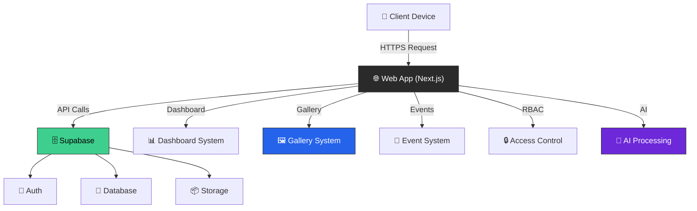
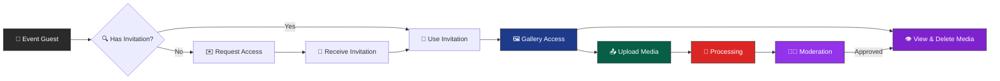
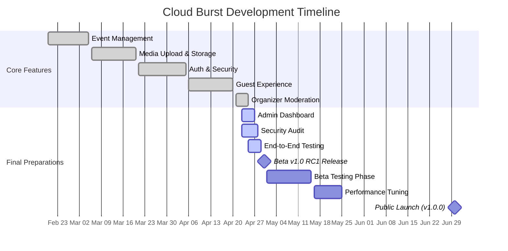

# Cloud Burst Documentation

> **Version:** 0.9.5   
> **Last Updated:** April 21, 2025

## 📌 Situational Abstract

Cloud Burst has completed the end-to-end guest experience with version 0.9.5, which includes comprehensive moderation tools, enhanced user workflows, and security improvements. The platform now provides complete event management, invitation handling, RSVP processing, and a fully functional guest photo sharing experience with efficient moderation capabilities. All core features have been implemented with a focus on intuitive navigation, mobile responsiveness, and security. Our Beta 1.0 RC1 release is scheduled for April 30, 2025, with final polishing of the user experience, security validation, and end-to-end testing across all user roles.

## 🔄 Recent Updates

- 🟡 Completed full guest journey from RSVP to profile creation to photo uploads
- 🟡 Added media deletion capability for guests to manage their own content
- 🔵 Implemented auto-redirect from media viewer back to gallery
- ✅ Fixed responsive layout issues in portrait mode for mobile users
- ✅ Optimized keyboard navigation and touch gestures for seamless interaction
- ✅ Resolved critical issues with media endpoints and error handling
- ✅ Enhanced security with comprehensive Row Level Security policies
- ✅ Updated application design document with current status (95% complete)
- ✅ Enhanced moderation interface with batch approval/rejection capabilities
- ✅ Created moderation statistics dashboard with real-time metrics
- ✅ Improved guest onboarding and profile creation workflow
- ✅ Enhanced media cards with status badges for clearer visual feedback
- ✅ Fixed layout issues in Gallery section with improved responsiveness
- ✅ Implemented robust security audit and vulnerability fixes
- ✅ Enhanced permission policies for user profiles and gallery settings
- ✅ Created comprehensive documentation for critical user flows

### 🔐 Auth & Security Enhancements

- 🟡 Row Level Security policies for guests and gallery permissions tables
- ✅ Security definer functions for server-side code with RLS enabled
- ✅ Token management service with multi-source retrieval strategy
- ✅ Token context provider for React components
- ✅ Enhanced error handling with user-friendly messages
- ✅ Redundant token storage across localStorage and cookies
- ✅ Proper constraint handling for guest profile creation
- ✅ Enhanced security with comprehensive Row Level Security policies
- 🟡 Addressed GitHub security scanning alerts
- ✅ Improved token management for prolonged sessions
- ✅ Enhanced permission enforcement for profile and gallery settings
- ✅ Comprehensive security audit documentation
- ✅ Improved API endpoint security validation
- ✅ Enhanced cross-organization data isolation

## 📚 Documentation Structure

### 🏗️ Architecture

- [Application Design Document](architecture/application_design_document.md) - Comprehensive overview of the application architecture
- [System Architecture Flowchart](architecture/system_architecture_flowchart.md) - Visual representation of system components
- [Security Architecture](architecture/security.md) - Security standards and implementation details
- [Architecture Diagram](architecture/architecture-diagram.md) - High-level architecture diagram
- [Navigation Structure](architecture/navigation-structure.md) - Application routing and navigation patterns
- [User Journeys](architecture/ux/user-journeys.md) - Key user journey flows through the application

### 🚀 Deployment

- [Deployment Guides](deployment/deployment_guides.md) - General deployment instructions
- [Deployment Fixes](deployment/deployment_fixes.md) - Solutions for common deployment issues
- [Replit Deployment](deployment/replit_deployment.md) - Replit-specific deployment instructions
- [Replit Quick Reference](deployment/replit-quick-reference.md) - Quick reference for Replit deployment

### 🎨 Design

- [UI Components](design/UI_components.md) - UI component documentation and examples
- [Style Guide](design/style.md) - Styling standards and guidelines
- [Website Overview](design/website_overview.md) - Overview of website structure and pages
- [Consistent Layout](design/consistent-layout.md) - Guidelines for maintaining consistent layouts
- [Layout Troubleshooting](design/layout-troubleshooting.md) - Solutions for common layout issues
- [Dashboard Components](design/dashboard-components.md) - Dashboard component documentation
- [Gallery Implementation](design/gallery_implementation.md) - Gallery feature implementation details
- [Moderation Interface](design/moderation-interface-enhancements.md) - Moderation system documentation
- [Progressive Web App](design/progressive-web-app.md) - PWA implementation details

### 💻 Development

- [Status Notes](development/STATUS_NOTES.md) - Current development status and progress
- [Version Control](development/VERSION_CONTROL.md) - Version control guidelines
- [Contributing Guidelines](development/contributing.md) - Guide for contributing to the project
- [Project Timeline](development/project-timeline.md) - Development timeline and milestones
- [Roadmap](development/roadmap.md) - Project roadmap and future plans
- [Version Sync Plan](development/version-sync.plan) - Plan for version synchronization
- [Name Change](development/name_change.md) - Documentation on project name change

#### 📋 Current Session Resources

- [Session 44 Checklist](development/session-44-checklist.md) - Checklist for current session
- [Session 44 Kickoff Prompt](development/session-44-kickoff-prompt.md) - Kickoff prompt for current session
- [Session 44 Resources Map](development/session-44-resources-map.md) - Resource map for current session

#### 📝 Development Archive

- [Session History](development/prompt_archive/) - Archive of past development sessions
  - Sessions 1-43 Documentation
  - Session Checklists, Kickoffs, and Narratives
  - Implementation Notes and Resources

### 🌟 Features

- [AI Implementation](features/ai_implementation.md) - AI features framework and implementation details
- [Payment & Subscription](features/payment_subscription_design.md) - Payment and subscription system design
- [QR Scan Components](features/qr-scan-components.md) - QR code scanning component documentation
- [QR Scanner Types](features/qr-scanner-types.md) - Types of QR scanners and their implementation
- [Service Worker](features/service-worker.md) - Service worker implementation details
- [Token Management System](features/token_management_system.md) - Token management system design

### 📋 Planning

- [Business Proposition](planning/business_proposition.md) - Business case and value proposition
- [Project Budget](planning/project_budget_overview.md) - Project budget planning and allocation
- [Product RFP](planning/request_for_product_RFP.md) - Product requirements and specifications
- [Statement of Work](planning/statement_of_work.md) - Detailed statement of work
- [Deck](planning/deck.md) - Presentation deck for stakeholders

### 🔧 Project Structure

- [Project Overview](project-structure/README.md) - Overview of project structure
- Application Trees
  - [Full Project Tree](project-structure/FULL_TREE.md) - Complete project structure
  - [Source Tree](project-structure/SRC_TREE.md) - Source code structure
  - [App Router Tree](project-structure/app_tree.md) - Next.js App Router structure
  - [Components Tree](project-structure/components_tree.md) - Component structure
  - [Protected Tree](project-structure/protected_tree.md) - Protected routes structure
  - [Events Tree](project-structure/events_tree.md) - Events module structure
  - [Gallery Tree](project-structure/gallery_tree.md) - Gallery module structure
  - [Auth Tree](project-structure/auth_tree.md) - Authentication module structure
  - [Dashboard Tree](project-structure/dashboard_tree.md) - Dashboard module structure
  - [Invitation Tree](project-structure/invitation_tree.md) - Invitation system structure
  - [Camera Tree](project-structure/camera_tree.md) - Camera module structure
  - [Scan Tree](project-structure/scan_tree.md) - QR scanning module structure
- Supporting Trees
  - [Hooks Tree](project-structure/hooks_tree.md) - Custom hooks structure
  - [Library Tree](project-structure/lib_tree.md) - Utility libraries structure
  - [Types Tree](project-structure/types_tree.md) - TypeScript types structure
  - [Store Tree](project-structure/store_tree.md) - State management structure
  - [Styles Tree](project-structure/styles_tree.md) - Styling structure
  - [Supabase Tree](project-structure/supabase_tree.md) - Supabase integration structure
  - [UI Tree](project-structure/ui_tree.md) - UI components structure
  - [Utils Tree](project-structure/utils_tree.md) - Utility functions structure
- Documentation Trees
  - [Documentation Tree](project-structure/DOCS_TREE.md) - Documentation structure
  - [Architecture Tree](project-structure/architecture_tree.md) - Architecture docs structure
  - [Development Tree](project-structure/development_tree.md) - Development docs structure
  - [Planning Tree](project-structure/planning_tree.md) - Planning docs structure
  - [Public Tree](project-structure/public_tree.md) - Public assets structure
  - [GitHub Tree](project-structure/GITHUB_TREE.md) - GitHub resources structure
  - [Cursor Tree](project-structure/cursor_tree.md) - Cursor AI rules structure

### 🔒 RBAC (Role-Based Access Control)

- [Role Based Access Control](rbac/role_based_access_control.md) - RBAC system documentation

### 👥 User Flows

- [User Flow Overview](user-flows/user_flow_overview.md) - Overview of user flows
- [User Flow Chart](user-flows/user_flow_chart.md) - Visual representation of user flows
- [User Flow Diagram](user-flows/user-flow-diagram.md) - Detailed user flow diagram
- [Invited User Flow](user-flows/invited_user_flow_design_document.md) - Invited user journey flow
- [Media Upload Sequence](user-flows/media_upload_sequence_diagram.md) - Media upload process flow
- [Media Upload Sequence (Alt)](user-flows/media-upload-sequence.md) - Alternative media upload flow
- [Event Management](user-flows/event_management.md) - Event management flow
- [Invitation System Plan](user-flows/invitation_system_development_plan.md) - Invitation system plan
- [Invitation System Testing](user-flows/invitation_system_testing_plan.md) - Invitation system testing
- [RSVP Implementation Guide](user-flows/RSVP_IMPLEMENTATION_GUIDE.md) - RSVP system implementation
- [Invitation and RSVP Flow](user-flows/invitation%20and%20RSVP%20system%20flow.md) - Combined flow

### 👤 UX (User Experience)

- [Event Organizer Journey](architecture/ux/event-organizer-journey.md) - Event organizer user journey
- [Guest Journey](architecture/ux/guest-journey.md) - Guest user journey

## 🤝 Contributing

Please see our [Contributing Guidelines](development/contributing.md) for details on how to get involved.

## 📝 Style Guide

Please see our [Style Guide](design/style.md) for documentation standards.

## 🔐 Security Implementation

- ✅ Comprehensive role-based access control system
- ✅ Row Level Security policies in Supabase
- ✅ Security definer functions for secure server-side operations
- ✅ Token validation and management
- ✅ Resource ownership verification
- ✅ Protected routes with role-based middleware
- ✅ Enhanced session management
- ✅ Cookie security measures
- ✅ Type safety with Zod schemas
- ✅ CSRF protection
- ✅ Secure file handling
- ✅ Audit logging
- ✅ Invitation token security
- ✅ RSVP system security
- ✅ Public gallery access controls
- ✅ Security vulnerability remediation
- ✅ Permission policy enforcement

## 🎯 Current Focus

- 🟡 Super Admin Dashboard (50% complete)
- 🟡 Security Audit (75% complete)
- 🟡 End-to-End Testing (60% complete)
- 🟡 Permission Policy Verification (80% complete)
- ✅ Organizer Moderation Interface (100% complete)
- ✅ Guest Experience (100% complete)
- ✅ Media Deletion Capability (100% complete)
- ✅ Responsive Layout Improvements (100% complete)
- ✅ Progressive Web App Implementation (100% complete)

## 🔄 Implementation Progress

As we approach our April 30, 2025 Beta 1.0 RC1 release date, the platform is approximately 96% complete. Current sprint focuses on finalizing the Super Admin dashboard, conducting security audits, and comprehensive end-to-end testing:

## 🔍 Quick Links

- [Project README](../README.md)
- [Development Setup](../README.md#-getting-started)
- [Status Notes](development/STATUS_NOTES.md)
- [Application Design Document](architecture/application_design_document.md)
- [Security Guidelines](architecture/security.md)
- [Gallery Implementation](design/gallery_implementation.md)
- [Moderation Interface](design/moderation-interface-enhancements.md)
- [User Flow Overview](user-flows/user_flow_overview.md)
- [RSVP Implementation](user-flows/RSVP_IMPLEMENTATION_GUIDE.md)
- [Project Structure](project-structure/README.md)
- [Roadmap](development/roadmap.md)
- [Security Audit](development/session-44-resources-map.md#security-vulnerabilities-initial-assessment)

  

# Cloud Burst

## *Elevating Event Photography*

## 📌 Abstract
Cloud Burst represents the evolution of event photography, bridging the gap between traditional charm and modern technology. Our platform offers a comprehensive solution for event photography management with role-based access control, custom event URLs, enhanced gallery functionality, invitation system, real-time interactive maps, RSVP capabilities, guest profile creation, and camera integration. Deployed at cb-beta.replit.app, Cloud Burst maintains exceptional performance while delivering a seamless user experience across devices as we approach our April 30, 2025 Beta 1.0 RC1 release date.

## 🎯 Pitch
Remember the magic of disposable cameras at wedding tables? We've reimagined that collaborative spirit for the digital age. Cloud Burst transforms every event into a living photo story, powered by AI and created by everyone who matters – your guests. No apps to download, no accounts to create – just scan, snap, and share. With enterprise-grade security, AI-enhanced photos, and real-time galleries, we're not just capturing moments; we're revolutionizing how memories are made.

### [Live Demo](https://cb-beta.replit.app) • [Documentation](docs/) • [Contributing](CONTRIBUTING.md)

 