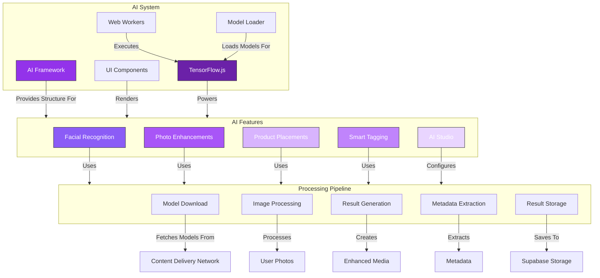

# 🤖 **AI Implementation Document**

## Cloud Burst
📅 *Updated: April 17, 2025*  
📊 *Version: 0.8.3*

## 📌 Situational Abstract

Cloud Burst's AI implementation strategy leverages client-side machine learning to provide intelligent photo and video processing capabilities while maintaining user privacy and data security. By implementing TensorFlow.js for browser-based processing, we avoid transmitting sensitive media to external servers while still offering powerful AI-driven features.

The AI system is designed with a modular architecture that supports five core capabilities: Facial Recognition, Enhancements, Product Placements, Smart Tagging, and an AI Studio for customized processing. Each module addresses specific user needs while sharing a common infrastructure for model loading, processing pipelines, and UI integration.

Phase 1 (current) focuses on establishing the framework, UI components, and infrastructure for AI processing. Phase 2 will integrate TensorFlow.js and implement basic processing capabilities, while Phase 3 will enhance the capabilities with more sophisticated models and features.

## 📊 Implementation Status

| Component | Status | Priority | Dependencies | Progress |
|-----------|--------|----------|--------------|----------|
| 🏗️ AI Framework | ✅ Done | P1 | None | 100% |
| 🎨 UI Components | ✅ Done | P1 | Shadcn/ui | 100% |
| 🧠 TensorFlow.js | 🟢 Active | P0 | None | 15% |
| 👤 Facial Recognition | 🟡 Planned | P1 | TensorFlow.js | 5% |
| ✨ Enhancements | 🟡 Planned | P1 | TensorFlow.js | 5% |
| 🛍️ Product Placements | 🟡 Planned | P2 | TensorFlow.js | 5% |
| 🏷️ Smart Tagging | 🟡 Planned | P1 | TensorFlow.js | 5% |
| 🎨 AI Studio | 🟡 Planned | P3 | All AI Features | 0% |

---

## 🏗️ System Architecture



## 👤 Facial Recognition

### Overview
The Facial Recognition module uses computer vision techniques to detect, analyze, and recognize faces in photos and videos. This enables automatic organization of media by individuals, simplifying the process of finding photos containing specific people.

### Key Features
- **Face Detection**: Automatically locate and highlight faces in photos
- **Face Recognition**: Match detected faces to known individuals
- **Photo Organization**: Group photos by detected individuals
- **Privacy Controls**: User-controlled recognition settings
- **Client-side Processing**: All processing occurs in the user's browser

### Technical Implementation
The implementation uses TensorFlow.js with pre-trained models for face detection and recognition:

```typescript
// Face detection model implementation
class FaceDetectionModel {
  private model: FaceDetection;
  private isLoaded = false;

  async load() {
    try {
      // Load the model from the CDN
      this.model = await tfjs.loadLayersModel(
        'https://assets.cloudburst.photo/models/face-detection/model.json'
      );
      this.isLoaded = true;
      return true;
    } catch (error) {
      console.error('Failed to load face detection model:', error);
      return false;
    }
  }

  async detectFaces(imageElement: HTMLImageElement | HTMLCanvasElement): Promise<BoundingBox[]> {
    if (!this.isLoaded) {
      await this.load();
    }
    
    // Convert image to tensor
    const imageTensor = tfjs.browser.fromPixels(imageElement);
    
    // Process with the model
    const predictions = await this.model.predict(imageTensor);
    
    // Convert predictions to bounding boxes
    const boundingBoxes = this.processPredictions(predictions);
    
    // Cleanup
    tfjs.dispose([imageTensor, predictions]);
    
    return boundingBoxes;
  }
  
  private processPredictions(predictions: tfjs.Tensor): BoundingBox[] {
    // Process raw predictions into usable bounding boxes
    // Implementation will depend on the specific model used
    return [];
  }
}
```

### Privacy & Security Considerations
- All processing occurs client-side to keep photos private
- Face recognition data is stored locally by default
- Opt-in system for cloud storage of face recognition data
- Clear disclosure of how facial data is used
- User controls for enabling/disabling recognition

### Development Roadmap

| Phase | Features | Timeline |
|-------|----------|----------|
| 1 | Framework & UI Setup | Completed |
| 2 | Face Detection Implementation | May 2025 |
| 3 | Face Recognition | June 2025 |
| 4 | Photo Organization | July 2025 |
| 5 | Advanced Features | Q3 2025 |

## ✨ Photo & Video Enhancements

### Overview
The Enhancements module uses AI to automatically improve photos and videos. This includes adjusting exposure, color, sharpness, and removing imperfections while preserving the original essence of the media.

### Key Features
- **Auto-Enhancement**: One-click improvement of photos and videos
- **Style Presets**: Pre-defined styles like Vibrant, Vintage, B&W
- **Custom Enhancement**: User control over enhancement parameters
- **Batch Processing**: Apply enhancements to multiple files
- **Non-destructive Editing**: Preserve original files

### Technical Implementation
The enhancement pipeline uses multiple TensorFlow.js models for different aspects of enhancement:

```typescript
// Photo enhancement implementation
class PhotoEnhancer {
  private colorModel: tfjs.LayersModel;
  private sharpnessModel: tfjs.LayersModel;
  private denoisingModel: tfjs.LayersModel;
  private isLoaded = false;

  async load() {
    try {
      // Load all models in parallel
      const [colorModel, sharpnessModel, denoisingModel] = await Promise.all([
        tfjs.loadLayersModel('https://assets.cloudburst.photo/models/enhance/color.json'),
        tfjs.loadLayersModel('https://assets.cloudburst.photo/models/enhance/sharpen.json'),
        tfjs.loadLayersModel('https://assets.cloudburst.photo/models/enhance/denoise.json')
      ]);
      
      this.colorModel = colorModel;
      this.sharpnessModel = sharpnessModel;
      this.denoisingModel = denoisingModel;
      this.isLoaded = true;
      return true;
    } catch (error) {
      console.error('Failed to load enhancement models:', error);
      return false;
    }
  }

  async enhanceImage(
    imageElement: HTMLImageElement | HTMLCanvasElement,
    options: EnhancementOptions
  ): Promise<HTMLCanvasElement> {
    if (!this.isLoaded) {
      await this.load();
    }
    
    // Convert image to tensor
    let imageTensor = tfjs.browser.fromPixels(imageElement);
    
    // Apply enhancements based on options
    if (options.improveColor) {
      imageTensor = this.applyColorEnhancement(imageTensor, options.colorIntensity);
    }
    
    if (options.improveSharpen) {
      imageTensor = this.applySharpen(imageTensor, options.sharpIntensity);
    }
    
    if (options.reducenoise) {
      imageTensor = this.applyDenoise(imageTensor, options.denoiseIntensity);
    }
    
    // Convert tensor back to canvas
    const canvas = document.createElement('canvas');
    canvas.width = imageTensor.shape[1];
    canvas.height = imageTensor.shape[0];
    
    await tfjs.browser.toPixels(imageTensor, canvas);
    
    // Cleanup
    tfjs.dispose(imageTensor);
    
    return canvas;
  }
  
  // Implementation of individual enhancement steps
  private applyColorEnhancement(image: tfjs.Tensor3D, intensity: number): tfjs.Tensor3D {
    // Apply color model with intensity adjustment
    return image; // Placeholder
  }
  
  private applySharpen(image: tfjs.Tensor3D, intensity: number): tfjs.Tensor3D {
    // Apply sharpening model with intensity adjustment
    return image; // Placeholder
  }
  
  private applyDenoise(image: tfjs.Tensor3D, intensity: number): tfjs.Tensor3D {
    // Apply denoising model with intensity adjustment
    return image; // Placeholder
  }
}
```

### User Experience
- Intuitive sliders for adjustment parameters
- Before/after comparison view
- Quick preset application
- Progress indication for processing
- Consistent styles across multiple photos

### Development Roadmap

| Phase | Features | Timeline |
|-------|----------|----------|
| 1 | Framework & UI Setup | Completed |
| 2 | Basic Enhancement Models | May 2025 |
| 3 | Preset Styles | June 2025 |
| 4 | Batch Processing | July 2025 |
| 5 | Video Enhancement | Q3 2025 |

## 🛍️ Product Placements

### Overview
The Product Placements module identifies opportunities for integrating products or brand elements into photos. This feature is particularly valuable for event photographers working with sponsors or brands seeking authentic content integration.

### Key Features
- **Object Detection**: Identify suitable areas for product placement
- **Product Catalog Integration**: Select from a library of product assets
- **Realistic Integration**: Blend products naturally into scenes
- **Brand Guidelines Enforcement**: Follow brand requirements automatically
- **Placement Analytics**: Track placement performance metrics

### Technical Implementation
Product placement requires sophisticated object detection and image blending:

```typescript
// Product placement implementation
class ProductPlacer {
  private detectionModel: tfjs.GraphModel;
  private placementModel: tfjs.LayersModel;
  private isLoaded = false;

  async load() {
    try {
      // Load models
      this.detectionModel = await tfjs.loadGraphModel(
        'https://assets.cloudburst.photo/models/placement/detection.json'
      );
      this.placementModel = await tfjs.loadLayersModel(
        'https://assets.cloudburst.photo/models/placement/integration.json'
      );
      
      this.isLoaded = true;
      return true;
    } catch (error) {
      console.error('Failed to load product placement models:', error);
      return false;
    }
  }

  async findPlacementOpportunities(
    imageElement: HTMLImageElement | HTMLCanvasElement
  ): Promise<PlacementOpportunity[]> {
    if (!this.isLoaded) {
      await this.load();
    }
    
    // Convert image to tensor
    const imageTensor = tfjs.browser.fromPixels(imageElement);
    
    // Run object detection to find suitable surfaces/areas
    const detections = await this.detectionModel.predict(imageTensor.expandDims(0));
    
    // Process detections into placement opportunities
    const opportunities = this.processDetections(detections, imageTensor.shape);
    
    // Cleanup
    tfjs.dispose([imageTensor, detections]);
    
    return opportunities;
  }
  
  async placProduct(
    imageElement: HTMLImageElement | HTMLCanvasElement,
    product: ProductAsset,
    placement: PlacementOpportunity
  ): Promise<HTMLCanvasElement> {
    if (!this.isLoaded) {
      await this.load();
    }
    
    // Load product image
    const productImage = await this.loadProductImage(product);
    
    // Create canvas for placement
    const canvas = document.createElement('canvas');
    canvas.width = imageElement.width;
    canvas.height = imageElement.height;
    const ctx = canvas.getContext('2d');
    
    // Draw original image
    ctx.drawImage(imageElement, 0, 0);
    
    // Process product placement
    const placedImage = await this.integrateProduct(imageElement, productImage, placement);
    
    // Draw placed product
    ctx.drawImage(placedImage, 0, 0);
    
    return canvas;
  }
  
  private processDetections(detections: tfjs.Tensor, imageShape: number[]): PlacementOpportunity[] {
    // Convert raw detections to structured placement opportunities
    return [];
  }
  
  private async loadProductImage(product: ProductAsset): Promise<HTMLImageElement> {
    // Load and prepare product image
    return new Image();
  }
  
  private async integrateProduct(
    background: HTMLImageElement | HTMLCanvasElement,
    product: HTMLImageElement,
    placement: PlacementOpportunity
  ): Promise<HTMLCanvasElement> {
    // Use AI model to realistically blend product into background
    return document.createElement('canvas');
  }
}
```

### Business Value
- Create new revenue streams through brand partnerships
- Offer enhanced sponsorship packages for events
- Provide post-event brand integration opportunities
- Measure placement effectiveness
- A/B test different product placements

### Development Roadmap

| Phase | Features | Timeline |
|-------|----------|----------|
| 1 | Framework & UI Setup | Completed |
| 2 | Object Detection | June 2025 |
| 3 | Product Integration | July 2025 |
| 4 | Product Catalog | August 2025 |
| 5 | Analytics Integration | Q4 2025 |

## 🏷️ Smart Tagging

### Overview
The Smart Tagging module automatically analyzes photos and videos to generate relevant tags, categories, and metadata. This improves searchability, organization, and discovery of content across the platform.

### Key Features
- **Scene Recognition**: Identify the type of scene or setting
- **Object Detection**: Tag visible objects in media
- **Activity Recognition**: Identify activities being performed
- **Emotional Analysis**: Detect emotions in facial expressions
- **Custom Tag Categories**: User-defined tagging taxonomies

### Technical Implementation
Smart tagging combines multiple models for comprehensive analysis:

```typescript
// Smart tagging implementation
class SmartTagger {
  private sceneModel: tfjs.GraphModel;
  private objectModel: tfjs.GraphModel;
  private actionModel: tfjs.GraphModel;
  private emotionModel: tfjs.GraphModel;
  private isLoaded = false;

  async load() {
    try {
      // Load models in parallel
      const [sceneModel, objectModel, actionModel, emotionModel] = await Promise.all([
        tfjs.loadGraphModel('https://assets.cloudburst.photo/models/tagging/scene.json'),
        tfjs.loadGraphModel('https://assets.cloudburst.photo/models/tagging/object.json'),
        tfjs.loadGraphModel('https://assets.cloudburst.photo/models/tagging/action.json'),
        tfjs.loadGraphModel('https://assets.cloudburst.photo/models/tagging/emotion.json')
      ]);
      
      this.sceneModel = sceneModel;
      this.objectModel = objectModel;
      this.actionModel = actionModel;
      this.emotionModel = emotionModel;
      this.isLoaded = true;
      return true;
    } catch (error) {
      console.error('Failed to load tagging models:', error);
      return false;
    }
  }

  async generateTags(
    imageElement: HTMLImageElement | HTMLCanvasElement,
    options: TaggingOptions
  ): Promise<TagResult> {
    if (!this.isLoaded) {
      await this.load();
    }
    
    // Convert image to tensor
    const imageTensor = tfjs.browser.fromPixels(imageElement);
    const normalizedImage = this.preprocessImage(imageTensor);
    
    // Create tags based on enabled options
    const tagPromises: Promise<string[]>[] = [];
    
    if (options.detectScenes) {
      tagPromises.push(this.identifyScene(normalizedImage));
    }
    
    if (options.detectObjects) {
      tagPromises.push(this.identifyObjects(normalizedImage));
    }
    
    if (options.detectActions) {
      tagPromises.push(this.identifyActions(normalizedImage));
    }
    
    if (options.detectEmotions) {
      tagPromises.push(this.identifyEmotions(normalizedImage));
    }
    
    // Wait for all tagging processes to complete
    const tagArrays = await Promise.all(tagPromises);
    
    // Combine all tags and deduplicate
    const allTags = Array.from(new Set(tagArrays.flat()));
    
    // Cleanup
    tfjs.dispose(imageTensor);
    
    return {
      tags: allTags,
      confidence: this.calculateConfidenceScores(allTags),
      categories: this.categorizeTags(allTags)
    };
  }
  
  private preprocessImage(image: tfjs.Tensor3D): tfjs.Tensor4D {
    // Resize and normalize image for model input
    return tfjs.zeros([1, 224, 224, 3]);
  }
  
  private async identifyScene(image: tfjs.Tensor4D): Promise<string[]> {
    // Predict scene categories
    return [];
  }
  
  private async identifyObjects(image: tfjs.Tensor4D): Promise<string[]> {
    // Detect objects in the image
    return [];
  }
  
  private async identifyActions(image: tfjs.Tensor4D): Promise<string[]> {
    // Recognize activities/actions
    return [];
  }
  
  private async identifyEmotions(image: tfjs.Tensor4D): Promise<string[]> {
    // Detect emotions from faces
    return [];
  }
  
  private calculateConfidenceScores(tags: string[]): Record<string, number> {
    // Generate confidence scores for each tag
    return {};
  }
  
  private categorizeTags(tags: string[]): Record<string, string[]> {
    // Organize tags into categories
    return {};
  }
}
```

### User Benefits
- Find photos quickly with automatic tagging
- Create consistent metadata across all media
- Discover content through intelligent categorization
- Reduce manual tagging workload
- Easy filtering of large photo collections

### Development Roadmap

| Phase | Features | Timeline |
|-------|----------|----------|
| 1 | Framework & UI Setup | Completed |
| 2 | Scene Recognition | May 2025 |
| 3 | Object Detection | June 2025 |
| 4 | Action Recognition | July 2025 |
| 5 | Emotion Detection | August 2025 |
| 6 | Custom Categories | Q4 2025 |

## 🎨 AI Studio

### Overview
AI Studio combines all AI capabilities into a unified creative workspace where users can apply multiple effects, generate variations, and process media with advanced control and customization options.

### Key Features
- **Model Selection**: Choose from different AI models
- **Custom Processing Pipelines**: Chain multiple AI operations
- **Parameter Fine-tuning**: Detailed control over processing
- **Batch Processing**: Apply to multiple photos
- **Template Saving**: Save and reuse processing configurations

### Technical Implementation
AI Studio integrates the other modules into a customizable pipeline:

```typescript
// AI Studio implementation
class AIStudio {
  private faceRecognition: FaceDetectionModel;
  private photoEnhancer: PhotoEnhancer;
  private productPlacer: ProductPlacer;
  private smartTagger: SmartTagger;
  
  constructor() {
    this.faceRecognition = new FaceDetectionModel();
    this.photoEnhancer = new PhotoEnhancer();
    this.productPlacer = new ProductPlacer();
    this.smartTagger = new SmartTagger();
  }

  async createPipeline(steps: ProcessingStep[]): Promise<ProcessingPipeline> {
    // Create a processing pipeline from the specified steps
    const pipeline = new ProcessingPipeline();
    
    for (const step of steps) {
      switch (step.type) {
        case 'face-recognition':
          await this.faceRecognition.load();
          pipeline.addStep(async (image: HTMLImageElement | HTMLCanvasElement) => {
            const faces = await this.faceRecognition.detectFaces(image);
            return { image, metadata: { faces } };
          });
          break;
          
        case 'enhance':
          await this.photoEnhancer.load();
          pipeline.addStep(async (image: HTMLImageElement | HTMLCanvasElement) => {
            const enhanced = await this.photoEnhancer.enhanceImage(image, step.options);
            return { image: enhanced, metadata: { enhanced: true } };
          });
          break;
          
        case 'product-placement':
          await this.productPlacer.load();
          pipeline.addStep(async (image: HTMLImageElement | HTMLCanvasElement) => {
            const opportunities = await this.productPlacer.findPlacementOpportunities(image);
            const placedImage = await this.productPlacer.placProduct(
              image, 
              step.options.product, 
              step.options.placement || opportunities[0]
            );
            return { image: placedImage, metadata: { placed: true } };
          });
          break;
          
        case 'tagging':
          await this.smartTagger.load();
          pipeline.addStep(async (image: HTMLImageElement | HTMLCanvasElement) => {
            const tags = await this.smartTagger.generateTags(image, step.options);
            return { image, metadata: { tags } };
          });
          break;
      }
    }
    
    return pipeline;
  }
  
  async processBatch(
    images: (HTMLImageElement | HTMLCanvasElement)[],
    pipeline: ProcessingPipeline
  ): Promise<ProcessingResult[]> {
    // Process multiple images with the specified pipeline
    const results: ProcessingResult[] = [];
    
    for (const image of images) {
      const result = await pipeline.process(image);
      results.push(result);
    }
    
    return results;
  }
  
  async saveTemplate(pipeline: ProcessingPipeline, name: string): Promise<string> {
    // Save pipeline configuration as a template
    const templateId = generateUUID();
    const template = {
      id: templateId,
      name,
      steps: pipeline.serialize(),
      createdAt: new Date().toISOString()
    };
    
    // Save to local storage or database
    localStorage.setItem(`studio-template-${templateId}`, JSON.stringify(template));
    
    return templateId;
  }
  
  async loadTemplate(templateId: string): Promise<ProcessingPipeline | null> {
    // Load a saved template
    const templateJson = localStorage.getItem(`studio-template-${templateId}`);
    
    if (!templateJson) {
      return null;
    }
    
    const template = JSON.parse(templateJson);
    return await this.createPipeline(template.steps);
  }
}

// Helper classes
class ProcessingPipeline {
  private steps: ((image: HTMLImageElement | HTMLCanvasElement) => Promise<ProcessingResult>)[] = [];
  
  addStep(step: (image: HTMLImageElement | HTMLCanvasElement) => Promise<ProcessingResult>) {
    this.steps.push(step);
  }
  
  async process(image: HTMLImageElement | HTMLCanvasElement): Promise<ProcessingResult> {
    let result: ProcessingResult = { image, metadata: {} };
    
    for (const step of this.steps) {
      result = await step(result.image);
    }
    
    return result;
  }
  
  serialize(): any[] {
    // Serialize pipeline for storage
    return [];
  }
}

// Helper functions
function generateUUID(): string {
  // Generate a unique ID
  return 'xxxxxxxx-xxxx-4xxx-yxxx-xxxxxxxxxxxx'.replace(/[xy]/g, function(c) {
    const r = Math.random() * 16 | 0, v = c == 'x' ? r : (r & 0x3 | 0x8);
    return v.toString(16);
  });
}

// Types
interface ProcessingStep {
  type: 'face-recognition' | 'enhance' | 'product-placement' | 'tagging';
  options: any;
}

interface ProcessingResult {
  image: HTMLImageElement | HTMLCanvasElement;
  metadata: Record<string, any>;
}
```

### Creative Applications
- Create signature photo enhancement styles
- Process event photos with consistent AI effects
- Batch edit hundreds of photos with custom AI pipelines
- Experiment with different AI models and parameters
- Share processing templates with other photographers

### Development Roadmap

| Phase | Features | Timeline |
|-------|----------|----------|
| 1 | Framework & UI Setup | Completed |
| 2 | Pipeline Creation | Q3 2025 |
| 3 | Parameter Controls | Q3 2025 |
| 4 | Template System | Q4 2025 |
| 5 | Advanced Studio | Q1 2026 |

## 💻 Development Implementation

### Loading Performance
To ensure optimal user experience, model loading is managed carefully:

1. **Progressive Loading**: Essential features load first
2. **Caching Strategy**: Models cached in IndexedDB when possible
3. **Size Optimization**: Quantized models for smaller downloads
4. **Load Indicators**: Clear progress indication for users
5. **Graceful Fallbacks**: Functionality when models fail to load

```typescript
// Model loading service
class ModelLoader {
  private modelCache: Map<string, tfjs.LayersModel | tfjs.GraphModel> = new Map();
  private loadingPromises: Map<string, Promise<tfjs.LayersModel | tfjs.GraphModel>> = new Map();
  
  async loadModel(modelUrl: string, options?: {
    useCache?: boolean;
    onProgress?: (progress: number) => void;
  }): Promise<tfjs.LayersModel | tfjs.GraphModel> {
    const useCache = options?.useCache !== false;
    
    // Check if already loaded
    if (this.modelCache.has(modelUrl)) {
      return this.modelCache.get(modelUrl)!;
    }
    
    // Check if already loading
    if (this.loadingPromises.has(modelUrl)) {
      return this.loadingPromises.get(modelUrl)!;
    }
    
    // Check IndexedDB cache if enabled
    if (useCache) {
      try {
        const cachedModel = await this.loadFromCache(modelUrl);
        if (cachedModel) {
          this.modelCache.set(modelUrl, cachedModel);
          return cachedModel;
        }
      } catch (error) {
        console.warn('Failed to load from cache:', error);
      }
    }
    
    // Start loading process with progress tracking
    const loadPromise = this.loadWithProgress(modelUrl, options?.onProgress);
    this.loadingPromises.set(modelUrl, loadPromise);
    
    try {
      const model = await loadPromise;
      
      // Store in memory cache
      this.modelCache.set(modelUrl, model);
      
      // Store in IndexedDB if caching enabled
      if (useCache) {
        this.saveToCache(modelUrl, model).catch(error => {
          console.warn('Failed to save model to cache:', error);
        });
      }
      
      return model;
    } finally {
      this.loadingPromises.delete(modelUrl);
    }
  }
  
  private async loadWithProgress(
    modelUrl: string,
    onProgress?: (progress: number) => void
  ): Promise<tfjs.LayersModel | tfjs.GraphModel> {
    // Determine model type from URL
    const isGraphModel = modelUrl.includes('model.json');
    
    // Create load options with progress callback
    const loadOptions: tfjs.io.LoadOptions = {
      onProgress: onProgress ? (fraction) => onProgress(fraction * 100) : undefined
    };
    
    // Load appropriate model type
    if (isGraphModel) {
      return tfjs.loadGraphModel(modelUrl, loadOptions);
    } else {
      return tfjs.loadLayersModel(modelUrl, loadOptions);
    }
  }
  
  private async loadFromCache(modelUrl: string): Promise<tfjs.LayersModel | tfjs.GraphModel | null> {
    // Try to load from IndexedDB
    try {
      const modelPath = this.getModelPath(modelUrl);
      const isGraphModel = modelUrl.includes('model.json');
      
      if (isGraphModel) {
        return await tfjs.loadGraphModel(`indexeddb://${modelPath}`);
      } else {
        return await tfjs.loadLayersModel(`indexeddb://${modelPath}`);
      }
    } catch (error) {
      return null;
    }
  }
  
  private async saveToCache(modelUrl: string, model: tfjs.LayersModel | tfjs.GraphModel): Promise<void> {
    const modelPath = this.getModelPath(modelUrl);
    await model.save(`indexeddb://${modelPath}`);
  }
  
  private getModelPath(modelUrl: string): string {
    // Extract a usable path for IndexedDB from the URL
    return modelUrl
      .replace('https://', '')
      .replace('http://', '')
      .replace(/\//g, '_')
      .replace(/\./g, '-');
  }
}
```

### Multi-threading
AI processing is CPU-intensive, so Web Workers are used to prevent UI blocking:

```typescript
// In main thread
class WorkerManager {
  private worker: Worker | null = null;
  private taskQueue: Map<string, {
    resolve: (result: any) => void;
    reject: (error: Error) => void;
  }> = new Map();
  
  constructor() {
    this.initWorker();
  }
  
  private initWorker() {
    try {
      this.worker = new Worker('/workers/ai-worker.js');
      this.worker.onmessage = this.handleMessage.bind(this);
      this.worker.onerror = this.handleError.bind(this);
    } catch (error) {
      console.error('Failed to initialize worker:', error);
      this.worker = null;
    }
  }
  
  async processImage(
    operation: string,
    imageData: ImageData,
    options: any
  ): Promise<any> {
    if (!this.worker) {
      throw new Error('Web Workers not supported or failed to initialize');
    }
    
    const taskId = `task_${Date.now()}_${Math.random().toString(36).substr(2, 9)}`;
    
    const resultPromise = new Promise((resolve, reject) => {
      this.taskQueue.set(taskId, { resolve, reject });
    });
    
    // Send task to worker
    this.worker.postMessage({
      taskId,
      operation,
      imageData,
      options
    }, [imageData.data.buffer]); // Transfer buffer for performance
    
    return resultPromise;
  }
  
  private handleMessage(event: MessageEvent) {
    const { taskId, result, error } = event.data;
    
    if (!this.taskQueue.has(taskId)) {
      console.warn('Received response for unknown task:', taskId);
      return;
    }
    
    const task = this.taskQueue.get(taskId)!;
    this.taskQueue.delete(taskId);
    
    if (error) {
      task.reject(new Error(error));
    } else {
      task.resolve(result);
    }
  }
  
  private handleError(error: ErrorEvent) {
    console.error('Worker error:', error);
    
    // Attempt recovery
    this.initWorker();
    
    // Reject all pending tasks
    for (const [taskId, task] of this.taskQueue.entries()) {
      task.reject(new Error('Worker crashed: ' + error.message));
      this.taskQueue.delete(taskId);
    }
  }
}

// In worker (ai-worker.js)
importScripts('https://cdn.jsdelivr.net/npm/@tensorflow/tfjs@3.18.0/dist/tf.min.js');

const models = {};

self.onmessage = async function(event) {
  const { taskId, operation, imageData, options } = event.data;
  
  try {
    let result;
    
    switch (operation) {
      case 'detect-faces':
        result = await detectFaces(imageData, options);
        break;
      case 'enhance-image':
        result = await enhanceImage(imageData, options);
        break;
      case 'generate-tags':
        result = await generateTags(imageData, options);
        break;
      default:
        throw new Error(`Unknown operation: ${operation}`);
    }
    
    self.postMessage({ taskId, result });
  } catch (error) {
    self.postMessage({ taskId, error: error.message });
  }
};

async function detectFaces(imageData, options) {
  // Load model if not already loaded
  if (!models.faceDetection) {
    models.faceDetection = await tf.loadGraphModel('https://assets.cloudburst.photo/models/face-detection/model.json');
  }
  
  // Convert ImageData to tensor
  const imageTensor = tf.browser.fromPixels(imageData);
  
  // Process with model
  // ...
  
  return {};
}

// Implement other processing functions...
```

## 🔐 Security & Privacy

### Data Processing Approach
- **Client-side Processing**: All AI operations run in the user's browser
- **No Media Uploads**: Photos never leave the user's device for AI processing
- **Model Security**: Models hosted on secure CDN with integrity checks
- **Data Minimization**: Only essential metadata saved to server

### Privacy Considerations
- User opt-in required for storing AI-generated metadata
- Clear explanation of how AI features use and process photos
- Option to process without saving results
- Data deletion capabilities for AI-generated metadata

## 💻 Developer Guidelines

When extending the AI capabilities, follow these guidelines:

1. **Performance First**: Optimize for browser performance
   - Load models asynchronously
   - Use quantized models where possible
   - Implement progressive loading
   - Support WebGL acceleration

2. **Privacy By Design**
   - Keep processing client-side
   - Be transparent about data usage
   - Provide user controls
   - Minimize data retention

3. **Graceful Degradation**
   - Handle unsupported browsers elegantly
   - Provide fallbacks for failed model loading
   - Clear error messaging for users

4. **Consistency**
   - Follow established UI patterns
   - Maintain common controls across features
   - Use shared infrastructure components
   - Consistent progress indicators

## 🔜 Next Steps

1. **Integration Testing**: Verify AI framework with front-end components
2. **TensorFlow.js Setup**: Implement model loading and infrastructure
3. **Performance Optimization**: Analyze and optimize client-side processing
4. **Basic Model Implementation**: Integrate initial models for core features
5. **UI Refinement**: Polish user interface based on real-world performance

---

## 📊 Performance Benchmarks

Initial benchmarks for model loading and inference (target devices):

| Operation | Desktop Chrome | Mobile Safari | Mobile Chrome |
|-----------|---------------|---------------|---------------|
| Model Loading | 1-3s | 3-8s | 2-6s |
| Face Detection | 150-300ms | 400-800ms | 300-600ms |
| Enhancement | 200-500ms | 800-1500ms | 500-1200ms |
| Object Detection | 250-500ms | 800-1500ms | 600-1200ms |
| Full Pipeline | 1-2s | 3-6s | 2-4s |

Performance optimizations will be an ongoing focus during implementation.

---

*This document will be continuously updated as AI implementation progresses.* 