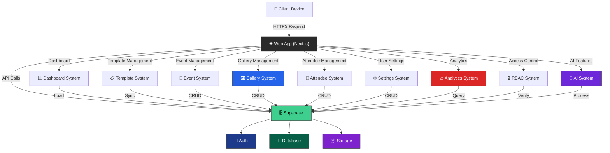

```mermaid
graph TD
    Client["📱 Client Device"] -->|"HTTPS Request"| WebApp["🌐 Web App (Next.js)"]
    WebApp -->|"API Calls"| Supabase["🗄️ Supabase"]
    WebApp -->|"Dashboard"| Dashboard["📊 Dashboard System"]
    WebApp -->|"Template Management"| Templates["📋 Template System"]
    WebApp -->|"Event Management"| Events["📅 Event System"]
    WebApp -->|"Gallery Management"| Gallery["🖼️ Gallery System"]
    WebApp -->|"Attendee Management"| Attendees["👥 Attendee System"]
    WebApp -->|"User Settings"| Settings["⚙️ Settings System"]
    WebApp -->|"Analytics"| Analytics["📈 Analytics System"]
    WebApp -->|"Access Control"| RBAC["🔒 RBAC System"]
    WebApp -->|"AI Features"| AI["🧠 AI System"]
    
    Dashboard -->|"Load"| Supabase
    Templates -->|"Sync"| Supabase
    Events -->|"CRUD"| Supabase
    Gallery -->|"CRUD"| Supabase
    Attendees -->|"CRUD"| Supabase
    Settings -->|"CRUD"| Supabase
    Analytics -->|"Query"| Supabase
    RBAC -->|"Verify"| Supabase
    AI -->|"Process"| Supabase
    
    Supabase --> Auth["🔑 Auth"]
    Supabase --> Database["💾 Database"]
    Supabase --> Storage["📦 Storage"]
    
    style WebApp fill:#2A2A2A,stroke:#333,color:#fff
    style Supabase fill:#3ECF8E,stroke:#333,color:#000
    style Auth fill:#1E3A8A,stroke:#333,color:#fff
    style Database fill:#065F46,stroke:#333,color:#fff
    style Storage fill:#7E22CE,stroke:#333,color:#fff
    style Analytics fill:#DC2626,stroke:#333,color:#fff
    style Gallery fill:#2563EB,stroke:#333,color:#fff
    style AI fill:#6D28D9,stroke:#333,color:#fff
``` 