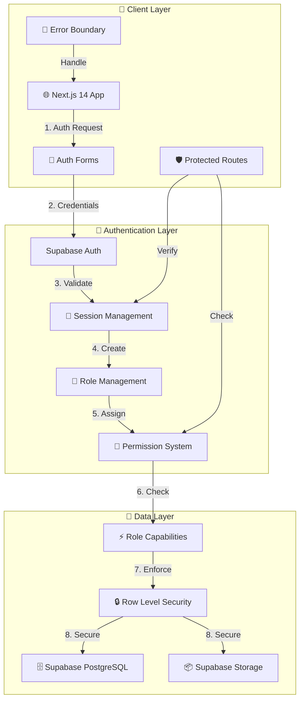

# 🏛️ **System Architecture Flowchart**  

## 📡 Cloud Capture  
📅 *Feb 16, 2024*  

---



---

## 🛠️ **System Components**  

### 📱 **Client Layer**
- Next.js 14 App Router
- TypeScript + React
- Shadcn/ui Components
- Protected Routes HOC
- Error Boundaries
- Loading States

### 🔑 **Authentication Layer**
- Supabase Auth
- JWT Sessions
- Role-Based Access
- Permission System
- Security Middleware
- Capability Checking

### 💾 **Data Layer**
- PostgreSQL Database
- Supabase Storage
- Row Level Security
- Real-time Subscriptions
- Role Capabilities
- User Profiles

---

## 📐 **Cloud Capture System Overview**  

This **System Architecture Diagram** illustrates the **interaction flow** between different components within Cloud Capture.  

---

```mermaid
flowchart TD

    Client[📱 Client Device] -->|🔗 HTTPS Request| WebApp[🌐 Web App (React/Next.js)]

    WebApp -->|🔌 API Calls| APIGateway[🖥️ API Gateway (Node.js/Express/GraphQL)]

    APIGateway --> Auth[🔑 Authentication Service (Supabase/OAuth)]
    APIGateway --> Database[🗄️ Supabase PostgreSQL Database]
    APIGateway --> CloudStorage[☁️ To be Determined]
    APIGateway --> AIService[🤖 AI Processing (OpenAI)]

    AIService --> CloudStorage
    CloudStorage --> CDN[🚀 Cloudflare CDN] (To Be Determined)
```

---

## 🔒 **Security & Performance Considerations**  
✔️ **JWT Authentication** – Secure login and API access.  
✔️ **End-to-End Encryption** – Protects all user data.  
✔️ **Global CDN Optimization** – Ensures low-latency content delivery.  

---

## 🎯 **Conclusion**  
This **System Architecture Flowchart** provides a **clear, structured overview** of Cloud Capture's backend, frontend, and AI-driven operations. Designed for **scalability, security, and real-time performance**, Cloud Capture **delivers a next-gen event photography experience**. 🚀  

---
