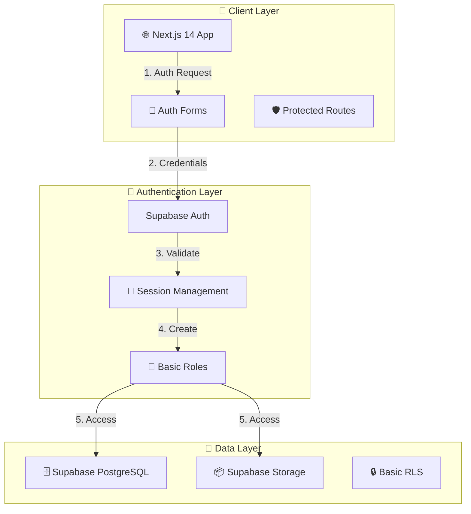

# 🏛️ **System Architecture Flowchart (Beta)**  

## Cloud Burst  
📅 *Feb 24, 2024*  

---



## 🛠️ **Beta Components**  

### 📱 **Client Layer**
- Next.js 14 App Router
- TypeScript + React
- Shadcn/ui Components
- Basic Protected Routes

### 🔑 **Authentication Layer**
- Supabase Auth
- Basic Session Management
- Simple User/Admin Roles

### 💾 **Data Layer**
- PostgreSQL Database
- Basic Storage
- Simple RLS Policies

---

## 📐 **Beta System Overview**  

```mermaid
flowchart TD
    Client[📱 Client Device] -->|🔗 HTTPS Request| WebApp[🌐 Web App (Next.js)]
    WebApp -->|🔌 API Calls| Supabase[🗄️ Supabase]
    Supabase --> Auth[🔑 Auth]
    Supabase --> Database[💾 Database]
    Supabase --> Storage[📦 Storage]
```

## 🔒 **Security (Beta)**  
✔️ **Basic Auth** – Email/password login  
✔️ **Simple RLS** – Basic data protection  
✔️ **Route Guards** – Protected routes  

## 🎯 **Next Steps**  
1. Complete core auth flow
2. Implement basic storage
3. Add essential routes
4. Basic testing
5. Update documentation
