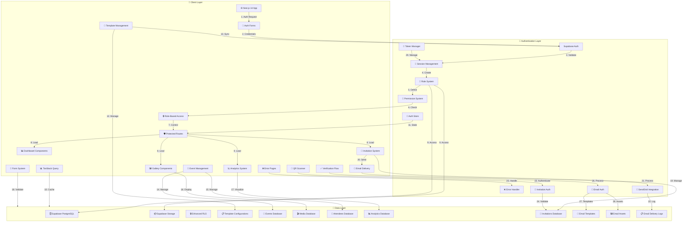
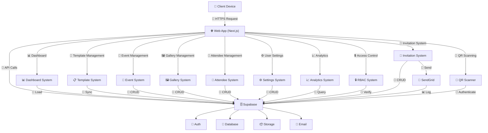

# 🏛️ **System Architecture Flowchart (Beta v0.8.0)**  

## Cloud Burst  
📅 *Updated: March 25, 2025*  
📊 *Version: 0.8.0*

---


```mermaid
flowchart TD
    subgraph Client[📱 Client Layer]
        WebApp[🌐 Next.js 14 App]
        AuthForms[🔐 Auth Forms]
        Protected[🛡️ Protected Routes]
        TanStack[📊 TanStack Query]
        Dashboard[📊 Dashboard Components]
        Templates[📧 Template Management]
        RBAC[🔒 Role-Based Access]
        Events[📅 Event Management]
        Gallery[🖼️ Gallery Components]
        Analytics[📈 Analytics System]
        Forms[📝 Form System]
        Invitations[📨 Invitation System]
        QRScanner[📱 QR Scanner]
        ErrorPages[❌ Error Pages]
        VerificationFlow[✅ Verification Flow]
        EmailDelivery[📧 Email Delivery]
    end

    subgraph Auth[🔑 Authentication Layer]
        SupaAuth[Supabase Auth]
        Session[📝 Session Management]
        Roles[👥 Role System]
        Zustand[🔄 Auth Store]
        Permissions[🔐 Permission System]
        InviteAuth[📨 Invitation Auth]
        EmailAuth[📧 Email Auth]
        ErrorHandler[❌ Error Handler]
        TokenManager[🔑 Token Manager]
        SendGrid[📨 SendGrid Integration]
    end

    subgraph Data[💾 Data Layer]
        Database[🗄️ Supabase PostgreSQL]
        Storage[📦 Supabase Storage]
        RLS[🔒 Enhanced RLS]
        TemplateDB[📋 Template Configurations]
        EventsDB[📅 Events Database]
        MediaDB[🎬 Media Database]
        AttendeeDB[👥 Attendees Database]
        AnalyticsDB[📊 Analytics Database]
        InvitationsDB[📨 Invitations Database]
        EmailTemplatesDB[📧 Email Templates]
        EmailAssetsDB[🖼️ Email Assets]
        EmailLogsDB[📋 Email Delivery Logs]
    end

    WebApp -->|1. Auth Request| AuthForms
    AuthForms -->|2. Credentials| SupaAuth
    SupaAuth -->|3. Validate| Session
    Session -->|4. Create| Roles
    Roles -->|5. Define| Permissions
    Permissions -->|6. Check| RBAC
    RBAC -->|7. Control| Protected
    Protected -->|8. Load| Dashboard
    Protected -->|8. Load| Gallery
    Protected -->|8. Load| Analytics
    Protected -->|8. Load| Invitations
    Roles -->|9. Access| Database
    Roles -->|9. Access| Storage
    TanStack -->|10. Cache| Data
    Zustand -->|11. State| Protected
    Templates -->|12. Manage| TemplateDB
    Templates -->|13. Sync| SupaAuth
    Events -->|14. Manage| EventsDB
    Events -->|15. Manage| AttendeeDB
    Gallery -->|16. Display| MediaDB
    Analytics -->|17. Visualize| AnalyticsDB
    Forms -->|18. Validate| Data
    Invitations -->|19. Manage| InvitationsDB
    Invitations -->|20. Send| EmailDelivery
    EmailDelivery -->|21. Process| SendGrid
    SendGrid -->|22. Log| EmailLogsDB
    QRScanner -->|23. Authenticate| InviteAuth
    InviteAuth -->|24. Validate| InvitationsDB
    ErrorPages -->|25. Handle| ErrorHandler
    VerificationFlow -->|26. Process| EmailAuth
    EmailAuth -->|27. Templates| EmailTemplatesDB
    EmailAuth -->|28. Assets| EmailAssetsDB
    TokenManager -->|29. Manage| Session
```

## 🛠️ **Beta Components (v0.8.0)**  

### 📱 **Client Layer**
- Next.js 14 App Router
- TypeScript + React
- Shadcn/ui Components
- TanStack Query Integration
- Protected Route System
- Dashboard Components
- Template Management UI
- Role-Based Access Control
- Event Management System
- Gallery Components (Photos & Videos)
- Analytics Components
- Invitation System UI (Complete)
- QR Code Scanner
- React Hook Form + Zod Validation
- Error Pages
- Verification Flow UI
- Email Template Preview
- SendGrid Email Integration

### 🔑 **Authentication Layer**
- Supabase Auth
- Enhanced Session Management
- Role-based Access Control
- Zustand Auth Store
- Template Synchronization
- Permission System
- Conditional UI Rendering
- Form Validation
- Invitation-based Authentication
- QR Code Authentication
- Error Handling System
- Email Authentication Flow
- Token Management
- Link Expiration Handling
- SendGrid Delivery System

### 💾 **Data Layer**
- PostgreSQL Database
- Storage Integration
- Enhanced RLS Policies
- Template Configurations Table
- Events Database
- Media Database (Photos & Videos)
- Attendees Database
- Analytics Database
- Invitations Database
- Role Capabilities Table
- Email Templates Database
- Email Assets Storage
- Email Delivery Logs

---

## 📐 **Beta System Overview (v0.8.0)**  


```mermaid
graph TD
    Client["📱 Client Device"] -->|"🔗 HTTPS Request"| WebApp["🌐 Web App (Next.js)"]
    WebApp -->|"🔌 API Calls"| Supabase["🗄️ Supabase"]
    WebApp -->|"📊 Dashboard"| Dashboard["📊 Dashboard System"]
    WebApp -->|"📧 Template Management"| Templates["📋 Template System"]
    WebApp -->|"📅 Event Management"| Events["📅 Event System"]
    WebApp -->|"🖼️ Gallery Management"| Gallery["🖼️ Gallery System"]
    WebApp -->|"👥 Attendee Management"| Attendees["👥 Attendee System"]
    WebApp -->|"⚙️ User Settings"| Settings["⚙️ Settings System"]
    WebApp -->|"📈 Analytics"| Analytics["📈 Analytics System"]
    WebApp -->|"🔒 Access Control"| RBAC["🔒 RBAC System"]
    WebApp -->|"📨 Invitation System"| Invitations["📨 Invitation System"]
    WebApp -->|"📱 QR Scanning"| QRScanner["📱 QR Scanner"]
    Dashboard -->|"🔄 Load"| Supabase
    Templates -->|"🔄 Sync"| Supabase
    Events -->|"🔄 CRUD"| Supabase
    Gallery -->|"🔄 CRUD"| Supabase
    Attendees -->|"🔄 CRUD"| Supabase
    Settings -->|"🔄 CRUD"| Supabase
    Analytics -->|"🔄 Query"| Supabase
    RBAC -->|"🔐 Verify"| Supabase
    Invitations -->|"🔄 CRUD"| Supabase
    Invitations -->|"📧 Send"| SendGrid["📧 SendGrid"]
    SendGrid -->|"📊 Log"| Supabase
    QRScanner -->|"🔐 Authenticate"| Supabase
    Supabase --> Auth["🔑 Auth"]
    Supabase --> Database["💾 Database"]
    Supabase --> Storage["📦 Storage"]
    Supabase --> Email["📧 Email"]
```

## 🔒 **Security (v0.8.0)**  
✅ **Complete Auth** – Email/password & social login  
✅ **Enhanced RLS** – Role-based data protection  
✅ **Route Guards** – Protected routes with role verification  
✅ **Template Security** – RLS policies for template access  
✅ **API Protection** – Secured API routes  
✅ **RBAC System** – Comprehensive role-based access control  
✅ **Permission Gates** – Conditional UI rendering based on permissions  
✅ **Event Security** – Owner-based access control for events  
✅ **Gallery Security** – Content moderation and access controls  
✅ **Analytics Security** – Role-based access to metrics  
✅ **Invitation Security** – Secure invitation token generation and validation  
✅ **QR Security** – Encrypted QR code data with validation  
✅ **Form Validation** – Zod schema validation for all inputs  
✅ **Error Handling** – Comprehensive error states and recovery  
✅ **Email Delivery** – Secure SendGrid integration with tracking

## 🎯 **Next Steps (v0.9.0)**  
1. 🖼️ Polish Gallery masonry layout and advanced filtering
2. 📊 Finalize Analytics dashboard with real-time metrics
3. 📤 Complete performance optimization for bulk uploads
4. 🚀 Conduct pre-launch security and performance audit
5. 📱 Finalize mobile experience and responsive design
6. 📚 Complete user documentation and guides

## 📨 **Invitation System Architecture**


```mermaid
flowchart TD
    subgraph UserInterface[📱 User Interface]
        InvitePage[📝 Invitation Management Page]
        EmailEditor[✉️ Email Template Editor]
        QRPreview[📱 QR Code Preview]
        BatchUploader[📁 Batch Upload Component]
        StatusDashboard[📊 Status Dashboard]
        InviteForm[📝 Invitation Form]
        QRScanner[📱 QR Code Scanner]
        GuestPortal[👤 Guest Portal]
        FormFeedback[✅ Form Feedback]
        ContextNav[🧭 Contextual Navigation]
    end

    subgraph API[🔌 API Layer]
        InviteAPI[📧 Invitation API]
        EmailAPI[✉️ Email API]
        QRCodeAPI[📱 QR Code API]
        TrackingAPI[📊 Tracking API]
        AuthAPI[🔑 Authentication API]
        ErrorHandling[❌ Error Handling]
    end

    subgraph Services[⚙️ Service Layer]
        TokenGenerator[🔑 Token Generator]
        EmailSender[📧 Email Sender]
        QRGenerator[📱 QR Generator]
        InviteProcessor[📋 Invitation Processor]
        AuthValidator[✅ Auth Validator]
        MetricsCalculator[📊 Metrics Calculator]
        SendGridService[📧 SendGrid Service]
    end

    subgraph Data[💾 Data Layer]
        InvitationsDB[📧 Invitations Table]
        EmailTemplatesDB[✉️ Email Templates]
        TokensDB[🔑 Security Tokens]
        EventsDB[📅 Events]
        AttendeesDB[👥 Attendees]
        TrackingDB[📊 Tracking Data]
        DeliveryLogsDB[📋 Delivery Logs]
    end

    InvitePage -->|Manage| InviteForm
    InvitePage -->|Display| StatusDashboard
    InviteForm -->|Create| InviteAPI
    InviteForm -->|Feedback| FormFeedback
    EmailEditor -->|Design| EmailAPI
    QRPreview -->|Display| QRCodeAPI
    BatchUploader -->|Upload CSV| InviteAPI
    StatusDashboard -->|Fetch| TrackingAPI
    QRScanner -->|Scan| QRCodeAPI
    QRScanner -->|Authenticate| AuthAPI
    GuestPortal -->|Access| AuthAPI
    ContextNav -->|Navigate| InvitePage
    
    InviteAPI -->|Process| InviteProcessor
    InviteAPI -->|Generate| TokenGenerator
    InviteAPI -->|Handle Errors| ErrorHandling
    EmailAPI -->|Send| EmailSender
    QRCodeAPI -->|Generate| QRGenerator
    QRCodeAPI -->|Validate| AuthValidator
    TrackingAPI -->|Calculate| MetricsCalculator
    AuthAPI -->|Validate| AuthValidator
    
    InviteProcessor -->|Store| InvitationsDB
    InviteProcessor -->|Associate| EventsDB
    TokenGenerator -->|Store| TokensDB
    EmailSender -->|Use| EmailTemplatesDB
    EmailSender -->|Send Via| SendGridService
    EmailSender -->|Update| InvitationsDB
    SendGridService -->|Log| DeliveryLogsDB
    EmailSender -->|Track| TrackingDB
    QRGenerator -->|Read| TokensDB
    AuthValidator -->|Verify| TokensDB
    AuthValidator -->|Create| AttendeesDB
    MetricsCalculator -->|Read| TrackingDB
    MetricsCalculator -->|Read| InvitationsDB
```

## 💻 **Session 28 Implementation Focus**


```mermaid
flowchart TD
    subgraph Invitations[📨 Invitation System Completion]
        APIEndpoints[🔌 API Endpoint Integration]
        SendGridIntegration[📧 SendGrid Integration]
        ErrorHandling[❌ Enhanced Error Handling]
        UserFeedback[✅ User Feedback Mechanisms]
        NavigationFlow[🧭 Context-Aware Navigation]
        SecurityEnhancements[🔒 Security Improvements]
    end

    subgraph User[👤 User Experience]
        SidebarNav[🧭 Sidebar Navigation Improvements]
        ContextGuidance[💬 Contextual Guidance]
        EventSpecific[📅 Event-Specific Invitations]
        InvitationForms[📝 Improved Forms]
        ErrorStates[⚠️ Error State Visualization]
        SuccessStates[✅ Success Confirmation]
    end

    subgraph Technical[⚙️ Technical Implementation]
        APIEndpointSecurity[🔐 API Security]
        FormValidation[✅ Enhanced Form Validation]
        TokenGeneration[🔑 Secure Token Generation]
        EmailDelivery[📧 Email Delivery]
        ErrorRecovery[🔄 Error Recovery]
        PerformanceOptimization[⚡ Performance]
    end

    subgraph Documentation[📚 Documentation & QA]
        ArchitectureUpdates[🏛️ Architecture Documentation]
        SecurityGuidelines[🔒 Security Documentation]
        EndToEndTesting[🧪 E2E Testing]
        ErrorTesting[❌ Error Case Testing]
        MobileValidation[📱 Mobile Testing]
    end

    Invitations -->|Implemented| APIEndpoints
    Invitations -->|Integrated| SendGridIntegration
    Invitations -->|Enhanced| ErrorHandling
    Invitations -->|Improved| UserFeedback
    Invitations -->|Optimized| NavigationFlow
    Invitations -->|Secured| SecurityEnhancements
    
    User -->|Redesigned| SidebarNav
    User -->|Added| ContextGuidance
    User -->|Implemented| EventSpecific
    User -->|Enhanced| InvitationForms
    User -->|Improved| ErrorStates
    User -->|Added| SuccessStates
    
    Technical -->|Secured| APIEndpointSecurity
    Technical -->|Enhanced| FormValidation
    Technical -->|Improved| TokenGeneration
    Technical -->|Integrated| EmailDelivery
    Technical -->|Implemented| ErrorRecovery
    Technical -->|Optimized| PerformanceOptimization
    
    Documentation -->|Updated| ArchitectureUpdates
    Documentation -->|Enhanced| SecurityGuidelines
    Documentation -->|Conducted| EndToEndTesting
    Documentation -->|Validated| ErrorTesting
    Documentation -->|Verified| MobileValidation
```

## 4. CHANGELOG Update

```markdown
# Changelog
All notable changes to Cloud Burst will be documented in this file.

## [0.8.0] - 2025-03-25
### Added
- Complete invitation system with SendGrid integration
- Enhanced form validation and error handling
- Contextual navigation between events and guest management
- Improved user guidance for invitation workflows
- Email delivery tracking and confirmation
- Security enhancements for invitation tokens

### Changed
- Streamlined sidebar navigation structure for better UX
- Improved invitation forms with clear feedback mechanisms
- Enhanced error handling for API endpoints
- Updated documentation for invitation system
- Clarified event-guest relationship in UI
- Optimized API endpoint integration

### Fixed
- API endpoint connection for sending invitations
- Email delivery integration with SendGrid
- Navigation context between events and attendees
- Error handling for form submissions
- Success confirmation and redirection flow
- Form validation and user feedback

### Technical
- Integration with SendGrid email service
- Enhanced token security for invitations
- Improved error recovery mechanisms
- Optimized invitation database schema
- Performance improvements for email processing
- API security enhancements