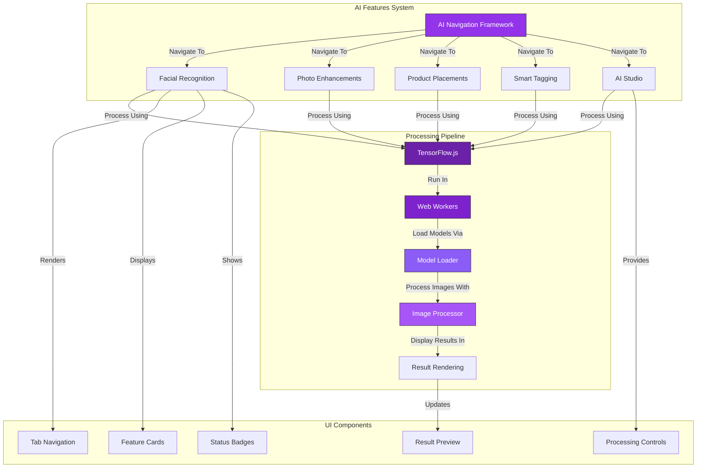
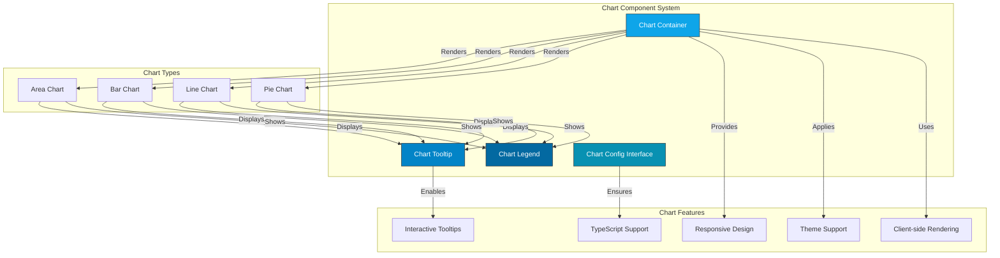
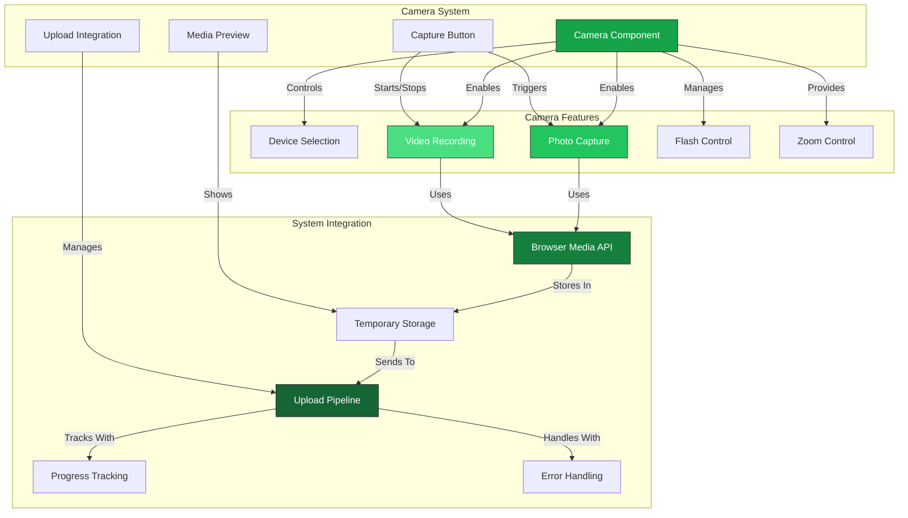
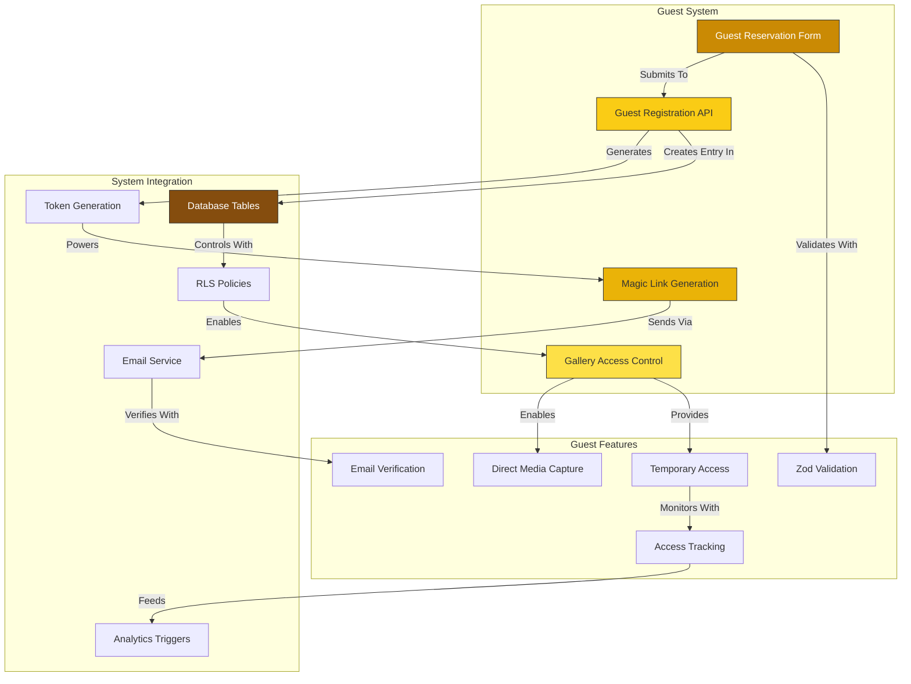
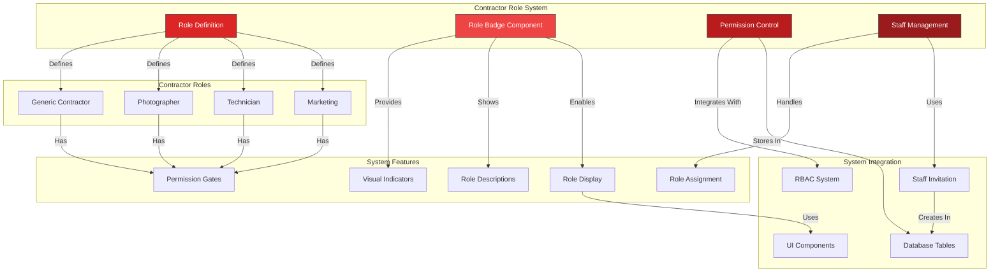

# 🏛️ **System Architecture Flowchart (Beta v0.8.9)**  

## Cloud Burst  
📅 *Updated: April 9, 2025*  
📊 *Version: 0.8.9*

---


```mermaid
flowchart TD
    subgraph Client[📱 Client Layer]
        WebApp[🌐 Next.js 14 App]
        AuthForms[🔐 Auth Forms]
        Protected[🛡️ Protected Routes]
        TanStack[📊 TanStack Query]
        Dashboard[📊 Dashboard Components]
        Templates[📧 Template Management]
        RBAC[🔒 Role-Based Access]
        Events[📅 Event Management]
        Gallery[🖼️ Gallery Components]
        Analytics[📈 Analytics System]
        Charts[📊 Chart Components]
        Forms[📝 Form System]
        Invitations[📨 Invitation System]
        RSVP[📝 RSVP System]
        AIFeatures[🤖 AI Features]
        QRScanner[📱 QR Scanner]
        ErrorPages[❌ Error Pages]
        VerificationFlow[✅ Verification Flow]
        EmailDelivery[📧 Email Delivery]
        ClientComponents[👤 Client Components]
        ServerComponents[🖥️ Server Components]
        CameraCapture[📸 Camera Capture]
        GuestRegistration[👥 Guest Registration]
        RoleBadges[🔖 Role Badges]
        ContractorSystem[👷 Contractor System]
    end

    subgraph Auth[🔑 Authentication Layer]
        SupaAuth[Supabase Auth]
        Session[📝 Session Management]
        Roles[👥 Role System]
        Zustand[🔄 Auth Store]
        Permissions[🔐 Permission System]
        InviteAuth[📨 Invitation Auth]
        EmailAuth[📧 Email Auth]
        ErrorHandler[❌ Error Handler]
        TokenManager[🔑 Token Manager]
        SendGrid[📨 SendGrid Integration]
        ClientSideAuth[👤 Client-side Auth]
        ServerSideAuth[🖥️ Server-side Auth]
        GuestAuth[🔑 Guest Auth]
        MagicLinkAuth[✨ Magic Link Auth]
    end

    subgraph Data[💾 Data Layer]
        Database[🗄️ Supabase PostgreSQL]
        Storage[📦 Supabase Storage]
        RLS[🔒 Enhanced RLS]
        TemplateDB[📋 Template Configurations]
        EventsDB[📅 Events Database]
        MediaDB[🎬 Media Database]
        AttendeeDB[👥 Attendees Database]
        AnalyticsDB[📊 Analytics Database]
        InvitationsDB[📨 Invitations Database]
        RSVPDB[📝 RSVP Database]
        AIProcessingDB[🤖 AI Processing]
        EmailTemplatesDB[📧 Email Templates]
        EmailAssetsDB[🖼️ Email Assets]
        EmailLogsDB[📋 Email Delivery Logs]
        GuestsDB[👥 Guests Database]
        GalleryPermissionsDB[🔒 Gallery Permissions]
        ContractorRolesDB[👷 Contractor Roles]
    end

    subgraph AILayer[🤖 AI Processing Layer]
        TensorFlow[TensorFlow.js]
        WebWorkers[🔄 Web Workers]
        ModelLoader[📦 Model Loader]
        FacialRecognition[👤 Facial Recognition]
        ImageEnhancement[✨ Image Enhancement]
        ObjectDetection[🔍 Object Detection]
        SmartTagging[🏷️ Smart Tagging]
        AIStudio[🎨 AI Studio]
    end

    WebApp -->|1. Renders| ServerComponents
    WebApp -->|2. Hydrates| ClientComponents
    ClientComponents -->|3. Auth Request| AuthForms
    AuthForms -->|4. Credentials| ClientSideAuth
    ClientSideAuth -->|5. Authenticate| SupaAuth
    ServerComponents -->|6. Auth Request| ServerSideAuth
    ServerSideAuth -->|7. Session| SupaAuth
    SupaAuth -->|8. Validate| Session
    Session -->|9. Create| Roles
    Roles -->|10. Define| Permissions
    Permissions -->|11. Check| RBAC
    RBAC -->|12. Control| Protected
    Protected -->|13. Load| Dashboard
    Protected -->|13. Load| Gallery
    Protected -->|13. Load| Analytics
    Protected -->|13. Load| Invitations
    Protected -->|13. Load| AIFeatures
    Protected -->|13. Load| RSVP
    Protected -->|13. Load| ContractorSystem
    AIFeatures -->|14. Process| AILayer
    TensorFlow -->|15. Load| ModelLoader
    FacialRecognition -->|16. Process| MediaDB
    ImageEnhancement -->|17. Process| MediaDB
    ObjectDetection -->|18. Process| MediaDB
    SmartTagging -->|19. Process| MediaDB
    Roles -->|20. Access| Database
    Roles -->|20. Access| Storage
    TanStack -->|21. Cache| Data
    Zustand -->|22. State| ClientComponents
    Analytics -->|23. Render| Charts
    Charts -->|24. Visualize| AnalyticsDB
    Templates -->|25. Manage| TemplateDB
    Templates -->|26. Sync| SupaAuth
    Events -->|27. Manage| EventsDB
    Events -->|28. Manage| AttendeeDB
    Gallery -->|29. Display| MediaDB
    Gallery -->|30. Capture| CameraCapture
    CameraCapture -->|31. Upload| MediaDB
    GuestRegistration -->|32. Create| GuestsDB
    GuestRegistration -->|33. Assign| GalleryPermissionsDB
    ContractorSystem -->|34. Manage| ContractorRolesDB
    RoleBadges -->|35. Display| Roles
    Analytics -->|36. Visualize| AnalyticsDB
    Forms -->|37. Validate| Data
    Invitations -->|38. Manage| InvitationsDB
    RSVP -->|39. Manage| RSVPDB
    Invitations -->|40. Send| EmailDelivery
    EmailDelivery -->|41. Process| SendGrid
    SendGrid -->|42. Log| EmailLogsDB
    QRScanner -->|43. Authenticate| InviteAuth
    InviteAuth -->|44. Validate| InvitationsDB
    ErrorPages -->|45. Handle| ErrorHandler
    VerificationFlow -->|46. Process| EmailAuth
    EmailAuth -->|47. Templates| EmailTemplatesDB
    EmailAuth -->|48. Assets| EmailAssetsDB
    TokenManager -->|49. Manage| Session
    GuestAuth -->|50. Access| MagicLinkAuth
    MagicLinkAuth -->|51. Validate| GuestsDB
    MagicLinkAuth -->|52. Grant| GalleryPermissionsDB
```

## 🛠️ **Beta Components (v0.8.9)**  

### 📱 **Client Layer**
- Next.js 14 App Router
- TypeScript + React
- Client/Server Component Architecture
- React Hooks in Client Components
- Server-Side Data Fetching
- Server Components for Static Content
- Client Components for Interactivity
- Shadcn/ui Components with Dark Mode
- TanStack Query Integration
- Protected Route System
- Dashboard Components
- Template Management UI
- Role-Based Access Control
- Event Management System
- Gallery Components (Photos & Videos)
- Analytics Components
- Chart Components for Data Visualization
- Interactive Map with Leaflet
- Dark Mode Enhancement
- Invitation System UI (Complete)
- RSVP System UI (Complete)
- Guest Reservation System (Complete)
- Camera Capture Components (Complete)
- Contractor Role Management (Complete)
- Role Badge Components (Complete)
- AI Features Framework (Complete)
- QR Code Scanner
- React Hook Form + Zod Validation
- Error Pages
- Verification Flow UI
- Email Template Preview
- SendGrid Email Integration

### 🔑 **Authentication Layer**
- Client-side Auth for Interactive Components
- Server-side Auth for Data Fetching
- Supabase Auth
- Enhanced Session Management
- Role-based Access Control
- Zustand Auth Store
- Template Synchronization
- Permission System
- Conditional UI Rendering
- Form Validation
- Invitation-based Authentication
- QR Code Authentication
- Error Handling System
- Email Authentication Flow
- Token Management
- Link Expiration Handling
- SendGrid Delivery System
- Guest Authentication with Magic Links
- Gallery Permission System
- Contractor Role Permissions

### 💾 **Data Layer**
- PostgreSQL Database
- Storage Integration
- Enhanced RLS Policies
- Template Configurations Table
- Events Database with Geolocation
- Media Database (Photos & Videos)
- Attendees Database
- Analytics Database
- Invitations Database
- RSVP Database
- Guests Database
- Gallery Permissions Database
- Contractor Roles Database
- AI Processing Database
- Role Capabilities Table
- Email Templates Database
- Email Assets Storage
- Email Delivery Logs

### 🤖 **AI Processing Layer**
- TensorFlow.js Integration (In Progress)
- Web Workers for Background Processing
- Model Loading and Caching System
- Facial Recognition Pipeline
- Image Enhancement System
- Object Detection for Product Placement
- Smart Tagging for Organization
- AI Studio for Custom Transformations

---

## 📐 **Beta System Overview (v0.8.9)**  


```mermaid
graph TD
    Client["📱 Client Device"] -->|"🔗 HTTPS Request"| WebApp["🌐 Web App (Next.js)"]
    WebApp -->|"📄 Server Components"| ServerComp["🖥️ Server Components"]
    WebApp -->|"📄 Client Components"| ClientComp["👤 Client Components"]
    WebApp -->|"🔌 API Calls"| Supabase["🗄️ Supabase"]
    WebApp -->|"📊 Dashboard"| Dashboard["📊 Dashboard System"]
    WebApp -->|"📧 Template Management"| Templates["📋 Template System"]
    WebApp -->|"📅 Event Management"| Events["📅 Event System"]
    WebApp -->|"🖼️ Gallery Management"| Gallery["🖼️ Gallery System"]
    WebApp -->|"👥 Attendee Management"| Attendees["👥 Attendee System"]
    WebApp -->|"⚙️ User Settings"| Settings["⚙️ Settings System"]
    WebApp -->|"📈 Analytics"| Analytics["📈 Analytics System"]
    WebApp -->|"🔒 Access Control"| RBAC["🔒 RBAC System"]
    WebApp -->|"📨 Invitation System"| Invitations["📨 Invitation System"]
    WebApp -->|"📝 RSVP System"| RSVP["📝 RSVP System"]
    WebApp -->|"🤖 AI Features"| AI["🤖 AI System"]
    WebApp -->|"📊 Data Visualization"| Charts["📊 Chart System"]
    WebApp -->|"📱 QR Scanning"| QRScanner["📱 QR Scanner"]
    WebApp -->|"📸 Camera Capture"| Camera["📸 Camera System"]
    WebApp -->|"👥 Guest Registration"| Guests["👥 Guest System"]
    WebApp -->|"👷 Contractor Management"| Contractors["👷 Contractor System"]
    ServerComp -->|"🔄 Data Fetch"| Supabase
    ClientComp -->|"🔄 State"| Supabase
    Dashboard -->|"🔄 Load"| Supabase
    Templates -->|"🔄 Sync"| Supabase
    Events -->|"🔄 CRUD"| Supabase
    Gallery -->|"🔄 CRUD"| Supabase
    Attendees -->|"🔄 CRUD"| Supabase
    Settings -->|"🔄 CRUD"| Supabase
    Analytics -->|"🔄 Query"| Supabase
    Analytics -->|"📊 Visualize"| Charts
    RBAC -->|"🔐 Verify"| Supabase
    Invitations -->|"🔄 CRUD"| Supabase
    RSVP -->|"🔄 CRUD"| Supabase
    AI -->|"🔄 Process"| Supabase
    AI -->|"🤖 Models"| TensorFlow["🤖 TensorFlow.js"]
    Invitations -->|"📧 Send"| SendGrid["📧 SendGrid"]
    SendGrid -->|"📊 Log"| Supabase
    QRScanner -->|"🔐 Authenticate"| Supabase
    Camera -->|"📸 Capture"| Gallery
    Guests -->|"🔑 Register"| Supabase
    Contractors -->|"👷 Manage"| RBAC
    Contractors -->|"🔖 Display"| ClientComp
    Supabase --> Auth["🔑 Auth"]
    Supabase --> Database["💾 Database"]
    Supabase --> Storage["📦 Storage"]
    Supabase --> Email["📧 Email"]
    
    style AI fill:#9333ea,stroke:#333,color:#fff
    style TensorFlow fill:#6b21a8,stroke:#333,color:#fff
    style Charts fill:#0ea5e9,stroke:#333,color:#fff
    style RSVP fill:#0284c7,stroke:#333,color:#fff
    style Camera fill:#16a34a,stroke:#333,color:#fff
    style Guests fill:#ca8a04,stroke:#333,color:#fff
    style Contractors fill:#dc2626,stroke:#333,color:#fff
```

## 🔒 **Security (v0.8.9)**  
✅ **Complete Auth** – Email/password & social login  
✅ **Enhanced RLS** – Role-based data protection  
✅ **Route Guards** – Protected routes with role verification  
✅ **Template Security** – RLS policies for template access  
✅ **API Protection** – Secured API routes  
✅ **RBAC System** – Comprehensive role-based access control  
✅ **Permission Gates** – Conditional UI rendering based on permissions  
✅ **Event Security** – Owner-based access control for events  
✅ **Gallery Security** – Content moderation and access controls  
✅ **Analytics Security** – Role-based access to metrics  
✅ **Invitation Security** – Secure invitation token generation and validation  
✅ **QR Security** – Encrypted QR code data with validation  
✅ **Form Validation** – Zod schema validation for all inputs  
✅ **Error Handling** – Comprehensive error states and recovery  
✅ **Email Delivery** – Secure SendGrid integration with tracking
✅ **Server/Client Auth** – Proper authentication for both contexts
✅ **AI Data Security** – Client-side processing for data privacy
✅ **Guest Auth** – Magic link authentication for non-user access
✅ **Gallery Permissions** – Fine-grained access control for media
✅ **Contractor Security** – Role-specific permissions for external partners

## 🎯 **Next Steps (v0.9.0)**  
1. 🤖 Complete TensorFlow.js integration for client-side AI processing
2. 📊 Finalize Analytics dashboard with RSVP metrics and photographer performance
3. 📧 Implement email notifications for gallery activities
4. 🎞 Add image optimization service for uploads
5. 🧪 Conduct comprehensive testing for Beta Release
6. 📚 Complete user documentation and guides

## 📨 **Client/Server Component Architecture**


```mermaid
flowchart TD
    subgraph NextApp[Next.js 14 App Router]
        ServerComp[Server Components]
        ClientComp[Client Components]
    end

    subgraph ServerFeatures[Server Component Features]
        DataFetching[Initial Data Fetching]
        SEO[SEO & Metadata]
        StaticContent[Static Content Rendering]
        AuthContext[Server-side Auth Context]
        ComponentStructure[Page Structure]
        GuestAccess[Guest Access Verification]
    end

    subgraph ClientFeatures[Client Component Features]
        ReactHooks[React Hooks]
        StateManagement[Client-side State]
        Interactivity[User Interactivity]
        ClientSideAuth[Client-side Auth]
        EventHandlers[Event Handlers]
        AIProcessing[AI Model Processing]
        DataVisualization[Chart Rendering]
        CameraAccess[Camera Access]
        RoleBadgeDisplay[Role Badge Display]
    end

    ServerComp -->|Renders| DataFetching
    ServerComp -->|Manages| SEO
    ServerComp -->|Provides| StaticContent
    ServerComp -->|Handles| AuthContext
    ServerComp -->|Defines| ComponentStructure
    ServerComp -->|Validates| GuestAccess
    
    ClientComp -->|Uses| ReactHooks
    ClientComp -->|Manages| StateManagement
    ClientComp -->|Enables| Interactivity
    ClientComp -->|Handles| ClientSideAuth
    ClientComp -->|Provides| EventHandlers
    ClientComp -->|Executes| AIProcessing
    ClientComp -->|Renders| DataVisualization
    ClientComp -->|Controls| CameraAccess
    ClientComp -->|Shows| RoleBadgeDisplay
    
    ServerComp -->|Passes Props To| ClientComp
    ClientComp -->|Hydrates From| ServerComp
    
    NextApp -->|Routes| ServerComp
    NextApp -->|Hydrates| ClientComp
```

## 🤖 **AI Features Framework Architecture**


```mermaid
flowchart TD
    subgraph AISystem[AI Features System]
        AINavigation[AI Navigation Framework]
        FacialRecognition[Facial Recognition]
        Enhancements[Photo Enhancements]
        ProductPlacements[Product Placements]
        SmartTagging[Smart Tagging]
        AIStudio[AI Studio]
    end

    subgraph ProcessingPipeline[Processing Pipeline]
        TensorFlowJS[TensorFlow.js]
        WebWorkers[Web Workers]
        ModelLoader[Model Loader]
        ImageProcessor[Image Processor]
        ResultRendering[Result Rendering]
    end

    subgraph Components[UI Components]
        Tabs[Tab Navigation]
        AICards[Feature Cards]
        StatusBadges[Status Badges]
        ProcessingControls[Processing Controls]
        ResultPreview[Result Preview]
    end

    AINavigation -->|Navigate To| FacialRecognition
    AINavigation -->|Navigate To| Enhancements
    AINavigation -->|Navigate To| ProductPlacements
    AINavigation -->|Navigate To| SmartTagging
    AINavigation -->|Navigate To| AIStudio
    
    FacialRecognition -->|Process Using| TensorFlowJS
    Enhancements -->|Process Using| TensorFlowJS
    ProductPlacements -->|Process Using| TensorFlowJS
    SmartTagging -->|Process Using| TensorFlowJS
    AIStudio -->|Process Using| TensorFlowJS
    
    TensorFlowJS -->|Run In| WebWorkers
    WebWorkers -->|Load Models Via| ModelLoader
    ModelLoader -->|Process Images With| ImageProcessor
    ImageProcessor -->|Display Results In| ResultRendering
    
    FacialRecognition -->|Renders| Tabs
    FacialRecognition -->|Displays| AICards
    FacialRecognition -->|Shows| StatusBadges
    AIStudio -->|Provides| ProcessingControls
    ResultRendering -->|Updates| ResultPreview
    
    style AINavigation fill:#9333ea,stroke:#333,color:#fff
    style TensorFlowJS fill:#6b21a8,stroke:#333,color:#fff
    style WebWorkers fill:#7e22ce,stroke:#333,color:#fff
    style ModelLoader fill:#8b5cf6,stroke:#333,color:#fff
    style ImageProcessor fill:#a855f7,stroke:#333,color:#fff
```

## 📊 **Chart Components Architecture**


```mermaid
flowchart TD
    subgraph ChartSystem[Chart Component System]
        ChartContainer[Chart Container]
        ChartTooltip[Chart Tooltip]
        ChartLegend[Chart Legend]
        ChartConfig[Chart Config Interface]
    end

    subgraph ChartTypes[Chart Types]
        AreaChart[Area Chart]
        BarChart[Bar Chart]
        LineChart[Line Chart]
        PieChart[Pie Chart]
    end

    subgraph Features[Chart Features]
        Responsiveness[Responsive Design]
        Theming[Theme Support]
        Tooltips[Interactive Tooltips]
        ClientSide[Client-side Rendering]
        TypeSafety[TypeScript Support]
    end

    ChartContainer -->|Renders| AreaChart
    ChartContainer -->|Renders| BarChart
    ChartContainer -->|Renders| LineChart
    ChartContainer -->|Renders| PieChart
    
    ChartContainer -->|Provides| Responsiveness
    ChartContainer -->|Applies| Theming
    ChartTooltip -->|Enables| Tooltips
    ChartConfig -->|Ensures| TypeSafety
    ChartContainer -->|Uses| ClientSide
    
    AreaChart -->|Displays| ChartTooltip
    BarChart -->|Displays| ChartTooltip
    LineChart -->|Displays| ChartTooltip
    PieChart -->|Displays| ChartTooltip
    
    AreaChart -->|Shows| ChartLegend
    BarChart -->|Shows| ChartLegend
    LineChart -->|Shows| ChartLegend
    PieChart -->|Shows| ChartLegend
    
    style ChartContainer fill:#0ea5e9,stroke:#333,color:#fff
    style ChartTooltip fill:#0284c7,stroke:#333,color:#fff
    style ChartLegend fill:#0369a1,stroke:#333,color:#fff
    style ChartConfig fill:#0891b2,stroke:#333,color:#fff
```

## 📷 **Camera Integration Architecture**


```mermaid
flowchart TD
    subgraph CameraSystem[Camera System]
        CameraComponent[Camera Component]
        CaptureButton[Capture Button]
        MediaPreview[Media Preview]
        UploadIntegration[Upload Integration]
    end

    subgraph Features[Camera Features]
        DeviceSelection[Device Selection]
        PhotoCapture[Photo Capture]
        VideoCapture[Video Recording]
        FlashControl[Flash Control]
        ZoomControl[Zoom Control]
    end

    subgraph Integration[System Integration]
        BrowserAPI[Browser Media API]
        LocalStorage[Temporary Storage]
        UploadPipeline[Upload Pipeline]
        ProgressTracking[Progress Tracking]
        ErrorHandling[Error Handling]
    end

    CameraComponent -->|Controls| DeviceSelection
    CameraComponent -->|Enables| PhotoCapture
    CameraComponent -->|Enables| VideoCapture
    CameraComponent -->|Manages| FlashControl
    CameraComponent -->|Provides| ZoomControl
    
    CaptureButton -->|Triggers| PhotoCapture
    CaptureButton -->|Starts/Stops| VideoCapture
    
    PhotoCapture -->|Uses| BrowserAPI
    VideoCapture -->|Uses| BrowserAPI
    
    BrowserAPI -->|Stores In| LocalStorage
    LocalStorage -->|Sends To| UploadPipeline
    
    MediaPreview -->|Shows| LocalStorage
    UploadIntegration -->|Manages| UploadPipeline
    UploadPipeline -->|Tracks With| ProgressTracking
    UploadPipeline -->|Handles With| ErrorHandling
    
    style CameraComponent fill:#16a34a,stroke:#333,color:#fff
    style BrowserAPI fill:#15803d,stroke:#333,color:#fff
    style UploadPipeline fill:#166534,stroke:#333,color:#fff
    style PhotoCapture fill:#22c55e,stroke:#333,color:#fff
    style VideoCapture fill:#4ade80,stroke:#333,color:#fff
```

## 👥 **Guest System Architecture**


```mermaid
flowchart TD
    subgraph GuestSystem[Guest System]
        GuestForm[Guest Reservation Form]
        MagicLinkGeneration[Magic Link Generation]
        GuestRegistration[Guest Registration API]
        GalleryAccess[Gallery Access Control]
    end

    subgraph Features[Guest Features]
        FormValidation[Zod Validation]
        EmailVerification[Email Verification]
        TemporaryAccess[Temporary Access]
        AccessTracking[Access Tracking]
        DirectCapture[Direct Media Capture]
    end

    subgraph Integration[System Integration]
        Database[Database Tables]
        EmailService[Email Service]
        TokenGeneration[Token Generation]
        RLSPolicies[RLS Policies]
        AnalyticsTriggers[Analytics Triggers]
    end

    GuestForm -->|Validates With| FormValidation
    GuestForm -->|Submits To| GuestRegistration
    GuestRegistration -->|Creates Entry In| Database
    GuestRegistration -->|Generates| TokenGeneration
    TokenGeneration -->|Powers| MagicLinkGeneration
    MagicLinkGeneration -->|Sends Via| EmailService
    EmailService -->|Verifies With| EmailVerification
    
    Database -->|Controls With| RLSPolicies
    RLSPolicies -->|Enables| GalleryAccess
    GalleryAccess -->|Provides| TemporaryAccess
    GalleryAccess -->|Enables| DirectCapture
    
    TemporaryAccess -->|Monitors With| AccessTracking
    AccessTracking -->|Feeds| AnalyticsTriggers
    
    style GuestForm fill:#ca8a04,stroke:#333,color:#fff
    style MagicLinkGeneration fill:#eab308,stroke:#333,color:#333
    style GuestRegistration fill:#facc15,stroke:#333,color:#333
    style GalleryAccess fill:#fde047,stroke:#333,color:#333
    style Database fill:#854d0e,stroke:#333,color:#fff
```

## 👷 **Contractor Role System Architecture**


```mermaid
flowchart TD
    subgraph ContractorSystem[Contractor Role System]
        RoleDefinition[Role Definition]
        RoleBadge[Role Badge Component]
        PermissionControl[Permission Control]
        StaffManagement[Staff Management]
    end

    subgraph Roles[Contractor Roles]
        Contractor[Generic Contractor]
        Photographer[Photographer]
        Technician[Technician]
        Marketing[Marketing]
    end

    subgraph Features[System Features]
        VisualIndicators[Visual Indicators]
        RoleDescriptions[Role Descriptions]
        PermissionGates[Permission Gates]
        RoleAssignment[Role Assignment]
        RoleDisplay[Role Display]
    end

    subgraph Integration[System Integration]
        Database[Database Tables]
        RBAC[RBAC System]
        UIComponents[UI Components]
        StaffInvitation[Staff Invitation]
    end

    RoleDefinition -->|Defines| Contractor
    RoleDefinition -->|Defines| Photographer
    RoleDefinition -->|Defines| Technician
    RoleDefinition -->|Defines| Marketing
    
    Contractor -->|Has| PermissionGates
    Photographer -->|Has| PermissionGates
    Technician -->|Has| PermissionGates
    Marketing -->|Has| PermissionGates
    
    RoleBadge -->|Provides| VisualIndicators
    RoleBadge -->|Shows| RoleDescriptions
    RoleBadge -->|Enables| RoleDisplay
    
    PermissionControl -->|Integrates With| RBAC
    PermissionControl -->|Stores In| Database
    
    StaffManagement -->|Handles| RoleAssignment
    StaffManagement -->|Uses| StaffInvitation
    StaffInvitation -->|Creates In| Database
    
    RoleDisplay -->|Uses| UIComponents
    
    style RoleDefinition fill:#dc2626,stroke:#333,color:#fff
    style RoleBadge fill:#ef4444,stroke:#333,color:#fff
    style PermissionControl fill:#b91c1c,stroke:#333,color:#fff
    style StaffManagement fill:#991b1b,stroke:#333,color:#fff
```

## 4. CHANGELOG Update

```markdown
# Changelog

## [0.8.9] - 2025-04-09
### Added in Session 39
- **Guest Reservation System**:
  - Implemented guest reservation form with Zod validation
  - Created guest API endpoint for registration
  - Integrated magic link authentication for guests
  - Built public gallery view with access controls
  - Implemented guest authentication check component
- **Camera Integration**:
  - Developed camera capture functionality for direct photos
  - Created media uploader component with progress tracking
  - Built combined upload button with tabs for different methods
- **Database Enhancements**:
  - Added database schema for guests and gallery permissions
  - Implemented proper RLS policies for security
- **Contractor Roles System**:
  - Added specialized roles (contractor, photographer, technician, marketing)
  - Created visual role badges with appropriate styling and icons
  - Enhanced staff invitation form with role-specific descriptions
  - Implemented StaffRoleBadge component for consistent role display
  - Created reusable StaffListItem component for improved UX

### Fixed in Session 39
- **Mobile Responsiveness**:
  - Further optimized camera UI for mobile devices
  - Enhanced gallery access flow for smaller screens
  - Fixed form layout issues on mobile screens
  - Improved responsive behavior of role badges

## [0.8.8] - 2025-04-08
### Fixed in Session 38
- **Mobile Responsiveness Fixes**:
  - Fixed mobile overflow issues in Gallery and Event Galleries components
  - Improved responsive design for all gallery components
  - Enhanced component spacing and layout for better mobile experience
  - Optimized gallery tabs for better mobile display
  - Refined card components for consistent appearance across devices
  - Fixed responsive layout in Facial Recognition AI page
  - Implemented proper inline styling for mobile stacking on key pages
  - Added viewport awareness to layout-critical components
  - Successfully tested event invitation sending with database logging
  - Confirmed stable deployment with invitation functionality

## [0.8.7] - 2025-04-04
### Added in Session 37
- **RSVP System Integration**:
  - Created RSVP dashboard within event details
  - Implemented RSVP status tracking
  - Added RSVP analytics visualization
  - Built RSVP response management system

### Fixed in Session 37
- **Type Safety Improvements**:
  - Fixed TypeScript errors in RSVP components
  - Resolved type issues in invitation management
  - Enhanced typing for event data structures
  - Improved error handling with proper types

## [0.8.6] - 2025-03-31
### Added in Session 36
- **Public Gallery Enhancement**:
  - Implemented modern responsive design with auto-filling grid
  - Added hover effects and animations for event cards
  - Improved image display with hover zoom effects
  - Optimized for mobile with responsive text sizing
  - Ensured accessibility with proper contrast and text clipping
  - Implemented consistent styling across event cards
  - Added status-colored backgrounds for thumbnails

## [0.8.5] - 2025-03-28
### Added in Session 35
- **QR Scanner Improvements**:
  - Enhanced QR code scanning with better error handling
  - Improved camera access with permission management
  - Added visual indicators for successful scans
  - Implemented proper validation flow for scanned codes
  - Created user feedback for successful/failed scans

## [0.8.4] - 2025-03-27
### Added in Session 34
- **Dark Mode Enhancement**:
  - Improved contrast in dark mode for all components
  - Fixed inconsistent color schemes in UI elements
  - Enhanced readability of text in dark mode
  - Improved component borders and shadows
  - Fixed transitions between light and dark modes

## [0.8.3] - 2025-03-24
### Added in Session 33
- **AI Features Framework**:
  - Added AI Features section to sidebar navigation with appropriate icons
  - Created layout structure for AI features section with tab navigation
  - Implemented placeholder pages for five key AI features:
    - Facial Recognition with feature overview and privacy information
    - Enhancements with feature overview and enhancement options
    - Product Placements with feature overview and placement options
    - Smart Tagging with feature overview and tag categories
    - AI Studio with feature overview and available models
  - Added "Coming Soon" and "Beta" badges to indicate feature status
  - Created consistent UI structure across all AI feature pages

### Fixed in Session 33
- **Chart Component Implementation**:
  - Created chart components for data visualization
  - Implemented chart container, tooltip, and legend components
  - Fixed TypeScript errors in chart implementation
  - Added string type annotation for labelFormatter parameter
  - Enhanced area chart interactive component with proper typing
  - Ensured compatibility with client components using 'use client' directive
  - Created reusable chart config interface for consistent styling

## [0.8.2] - 2025-03-20
### Fixed in Session 30
- **Next.js App Router Architecture Fixes**:
  - Added `'use client'` directives to interactive components using React hooks
  - Fixed components: `GalleryHeader.tsx`, `MasonryGrid.tsx`, and `MediaViewer.tsx`
  - Ensured proper client-side hydration for components with state management
  - Fixed gallery page authentication by switching from client-side to server-side data fetching
  - Replaced `getUserGalleries()` with `getUserGalleriesServer()` in gallery event pages
  - Ensured proper access to user authentication context in server components
- **Gallery Page Implementation**:
  - Fixed media item mapping to properly display photos in MasonryGrid
  - Added event data to media items for better context
  - Improved error handling in gallery pages
  - Enhanced type safety throughout gallery implementation
  - Created proper mapping between database types and component types

### Added in Session 30
- **Development Documentation**:
  - Created SESSION_30_CLOSING.md with detailed documentation of fixes
  - Documented key architectural patterns for Next.js App Router
  - Added lessons learned about client/server component separation
  - Documented authentication handling in Next.js server components