# 🏛️ **System Architecture Flowchart (Beta v0.7.7)**  

## Cloud Burst  
📅 *Mar 19, 2025, 10:15 AM*  

---

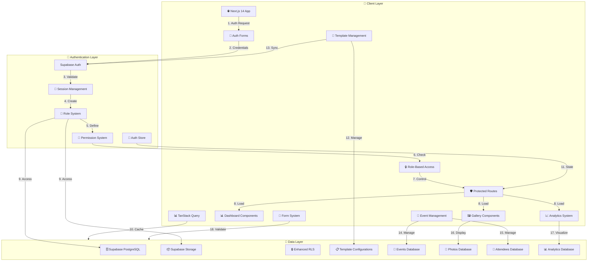
```mermaid
flowchart TD
    subgraph Client[📱 Client Layer]
        WebApp[🌐 Next.js 14 App]
        AuthForms[🔐 Auth Forms]
        Protected[🛡️ Protected Routes]
        TanStack[📊 TanStack Query]
        Dashboard[📊 Dashboard Components]
        Templates[📧 Template Management]
        RBAC[🔒 Role-Based Access]
        Events[📅 Event Management]
        Gallery[🖼️ Gallery Components]
        Analytics[📈 Analytics System]
        Forms[📝 Form System]
    end

    subgraph Auth[🔑 Authentication Layer]
        SupaAuth[Supabase Auth]
        Session[📝 Session Management]
        Roles[👥 Role System]
        Zustand[🔄 Auth Store]
        Permissions[🔐 Permission System]
    end

    subgraph Data[💾 Data Layer]
        Database[🗄️ Supabase PostgreSQL]
        Storage[📦 Supabase Storage]
        RLS[🔒 Enhanced RLS]
        TemplateDB[📋 Template Configurations]
        EventsDB[📅 Events Database]
        PhotosDB[📸 Photos Database]
        AttendeeDB[👥 Attendees Database]
        AnalyticsDB[📊 Analytics Database]
    end

    WebApp -->|1. Auth Request| AuthForms
    AuthForms -->|2. Credentials| SupaAuth
    SupaAuth -->|3. Validate| Session
    Session -->|4. Create| Roles
    Roles -->|5. Define| Permissions
    Permissions -->|6. Check| RBAC
    RBAC -->|7. Control| Protected
    Protected -->|8. Load| Dashboard
    Protected -->|8. Load| Gallery
    Protected -->|8. Load| Analytics
    Roles -->|9. Access| Database
    Roles -->|9. Access| Storage
    TanStack -->|10. Cache| Data
    Zustand -->|11. State| Protected
    Templates -->|12. Manage| TemplateDB
    Templates -->|13. Sync| SupaAuth
    Events -->|14. Manage| EventsDB
    Events -->|15. Manage| AttendeeDB
    Gallery -->|16. Display| PhotosDB
    Analytics -->|17. Visualize| AnalyticsDB
    Forms -->|18. Validate| Data
```

## 🛠️ **Beta Components (v0.7.7)**  

### 📱 **Client Layer**
- Next.js 14 App Router
- TypeScript + React
- Shadcn/ui Components
- TanStack Query Integration
- Protected Route System
- Dashboard Components
- Template Management UI
- Role-Based Access Control
- Event Management System
- Gallery Components
- Analytics Components
- React Hook Form + Zod Validation

### 🔑 **Authentication Layer**
- Supabase Auth
- Enhanced Session Management
- Role-based Access Control
- Zustand Auth Store
- Template Synchronization
- Permission System
- Conditional UI Rendering
- Form Validation

### 💾 **Data Layer**
- PostgreSQL Database
- Storage Integration
- Enhanced RLS Policies
- Template Configurations Table
- Events Database
- Photos Database
- Attendees Database
- Analytics Database
- Role Capabilities Table

---

## 📐 **Beta System Overview (v0.7.7)**  

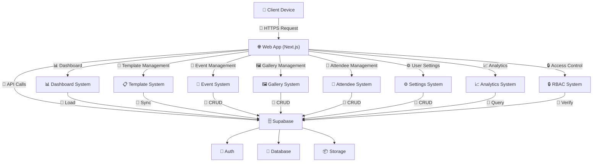
```mermaid
graph TD
    Client["📱 Client Device"] -->|"🔗 HTTPS Request"| WebApp["🌐 Web App (Next.js)"]
    WebApp -->|"🔌 API Calls"| Supabase["🗄️ Supabase"]
    WebApp -->|"📊 Dashboard"| Dashboard["📊 Dashboard System"]
    WebApp -->|"📧 Template Management"| Templates["📋 Template System"]
    WebApp -->|"📅 Event Management"| Events["📅 Event System"]
    WebApp -->|"🖼️ Gallery Management"| Gallery["🖼️ Gallery System"]
    WebApp -->|"👥 Attendee Management"| Attendees["👥 Attendee System"]
    WebApp -->|"⚙️ User Settings"| Settings["⚙️ Settings System"]
    WebApp -->|"📈 Analytics"| Analytics["📈 Analytics System"]
    WebApp -->|"🔒 Access Control"| RBAC["🔒 RBAC System"]
    Dashboard -->|"🔄 Load"| Supabase
    Templates -->|"🔄 Sync"| Supabase
    Events -->|"🔄 CRUD"| Supabase
    Gallery -->|"🔄 CRUD"| Supabase
    Attendees -->|"🔄 CRUD"| Supabase
    Settings -->|"🔄 CRUD"| Supabase
    Analytics -->|"🔄 Query"| Supabase
    RBAC -->|"🔐 Verify"| Supabase
    Supabase --> Auth["🔑 Auth"]
    Supabase --> Database["💾 Database"]
    Supabase --> Storage["📦 Storage"]
```

## 🔒 **Security (v0.7.7)**  
✔️ **Complete Auth** – Email/password & social login  
✔️ **Enhanced RLS** – Role-based data protection  
✔️ **Route Guards** – Protected routes with role verification  
✔️ **Template Security** – RLS policies for template access  
✔️ **API Protection** – Secured API routes  
✔️ **RBAC System** – Comprehensive role-based access control  
✔️ **Permission Gates** – Conditional UI rendering based on permissions  
✔️ **Event Security** – Owner-based access control for events  
✔️ **Gallery Security** – Content moderation and access controls  
✔️ **Analytics Security** – Role-based access to metrics  
✔️ **Form Validation** – Zod schema validation for all inputs  
✔️ **Error Handling** – Comprehensive error states and recovery  

## 🎯 **Next Steps (v0.7.8)**  
1. 🖼️ Implement comprehensive Gallery system
2. 📊 Complete Analytics data integration
3. 📱 Optimize responsive design for all devices
4. 🔍 Implement robust search functionality
5. 🧪 Conduct thorough performance testing
6. 📏 Finalize layout and design refinements

## 📊 **Analytics Architecture**

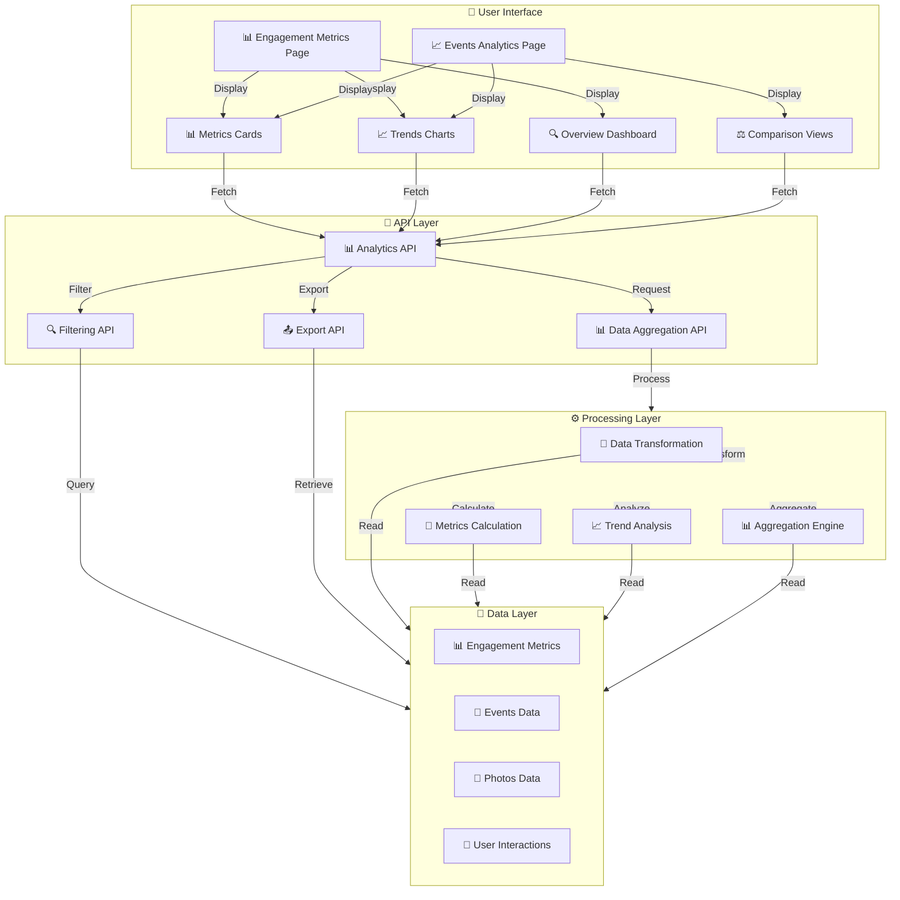
```mermaid
flowchart TD
    subgraph UI[📱 User Interface]
        EngagementPage[📊 Engagement Metrics Page]
        EventsAnalyticsPage[📈 Events Analytics Page]
        MetricsCards[📊 Metrics Cards]
        TrendsCharts[📈 Trends Charts]
        OverviewDashboard[🔍 Overview Dashboard]
        ComparisonViews[⚖️ Comparison Views]
    end

    subgraph API[🔌 API Layer]
        AnalyticsAPI[📊 Analytics API]
        DataAggregationAPI[📊 Data Aggregation API]
        FilteringAPI[🔍 Filtering API]
        ExportAPI[📤 Export API]
    end

    subgraph Data[💾 Data Layer]
        EngagementDB[📊 Engagement Metrics]
        EventsDB[📅 Events Data]
        PhotosDB[📸 Photos Data]
        UserInteractionsDB[👤 User Interactions]
    end

    subgraph Processing[⚙️ Processing Layer]
        DataTransformation[🔄 Data Transformation]
        MetricsCalculation[🧮 Metrics Calculation]
        TrendAnalysis[📈 Trend Analysis]
        AggregationEngine[📊 Aggregation Engine]
    end

    EngagementPage -->|Display| MetricsCards
    EngagementPage -->|Display| TrendsCharts
    EngagementPage -->|Display| OverviewDashboard
    EventsAnalyticsPage -->|Display| MetricsCards
    EventsAnalyticsPage -->|Display| TrendsCharts
    EventsAnalyticsPage -->|Display| ComparisonViews
    
    MetricsCards -->|Fetch| AnalyticsAPI
    TrendsCharts -->|Fetch| AnalyticsAPI
    OverviewDashboard -->|Fetch| AnalyticsAPI
    ComparisonViews -->|Fetch| AnalyticsAPI
    
    AnalyticsAPI -->|Request| DataAggregationAPI
    AnalyticsAPI -->|Filter| FilteringAPI
    AnalyticsAPI -->|Export| ExportAPI
    
    DataAggregationAPI -->|Process| Processing
    FilteringAPI -->|Query| Data
    ExportAPI -->|Retrieve| Data
    
    Processing -->|Transform| DataTransformation
    Processing -->|Calculate| MetricsCalculation
    Processing -->|Analyze| TrendAnalysis
    Processing -->|Aggregate| AggregationEngine
    
    DataTransformation -->|Read| Data
    MetricsCalculation -->|Read| Data
    TrendAnalysis -->|Read| Data
    AggregationEngine -->|Read| Data
```

## 🖼️ **Gallery System Architecture**

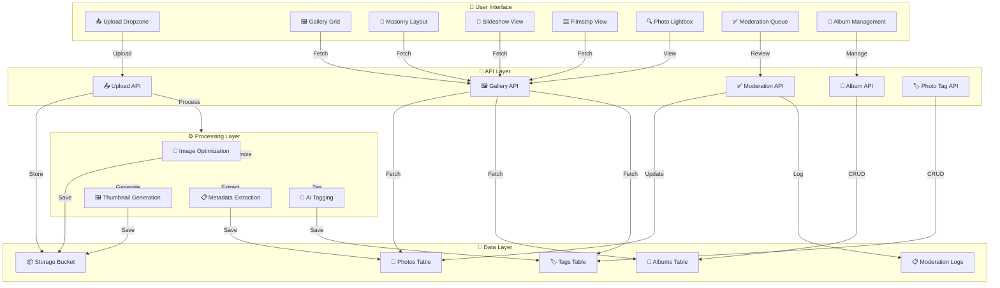
```mermaid
flowchart TD
    subgraph UI[📱 User Interface]
        UploadDropzone[📤 Upload Dropzone]
        GalleryGrid[🖼️ Gallery Grid]
        MasonryLayout[🧱 Masonry Layout]
        SlideshowView[🔄 Slideshow View]
        FilmstripView[🎞️ Filmstrip View]
        PhotoLightbox[🔍 Photo Lightbox]
        ModerationQueue[✅ Moderation Queue]
        AlbumManagement[📁 Album Management]
    end

    subgraph API[🔌 API Layer]
        UploadAPI[📤 Upload API]
        GalleryAPI[🖼️ Gallery API]
        ModerationAPI[✅ Moderation API]
        AlbumAPI[📁 Album API]
        PhotoTagAPI[🏷️ Photo Tag API]
    end

    subgraph Data[💾 Data Layer]
        PhotosDB[📸 Photos Table]
        AlbumsDB[📁 Albums Table]
        TagsDB[🏷️ Tags Table]
        ModerationLogsDB[📋 Moderation Logs]
        StorageBucket[📦 Storage Bucket]
    end

    subgraph Processing[⚙️ Processing Layer]
        ImageOptimization[🔧 Image Optimization]
        Thumbnails[🖼️ Thumbnail Generation]
        MetadataExtraction[📋 Metadata Extraction]
        AITagging[🤖 AI Tagging]
    end

    UploadDropzone -->|Upload| UploadAPI
    GalleryGrid -->|Fetch| GalleryAPI
    MasonryLayout -->|Fetch| GalleryAPI
    SlideshowView -->|Fetch| GalleryAPI
    FilmstripView -->|Fetch| GalleryAPI
    PhotoLightbox -->|View| GalleryAPI
    ModerationQueue -->|Review| ModerationAPI
    AlbumManagement -->|Manage| AlbumAPI
    
    UploadAPI -->|Process| Processing
    UploadAPI -->|Store| StorageBucket
    GalleryAPI -->|Fetch| PhotosDB
    GalleryAPI -->|Fetch| AlbumsDB
    GalleryAPI -->|Fetch| TagsDB
    ModerationAPI -->|Update| PhotosDB
    ModerationAPI -->|Log| ModerationLogsDB
    AlbumAPI -->|CRUD| AlbumsDB
    PhotoTagAPI -->|CRUD| TagsDB
    
    Processing -->|Optimize| ImageOptimization
    Processing -->|Generate| Thumbnails
    Processing -->|Extract| MetadataExtraction
    Processing -->|Tag| AITagging
    
    ImageOptimization -->|Save| StorageBucket
    Thumbnails -->|Save| StorageBucket
    MetadataExtraction -->|Save| PhotosDB
    AITagging -->|Save| TagsDB
```

## 📊 **Dashboard Architecture**

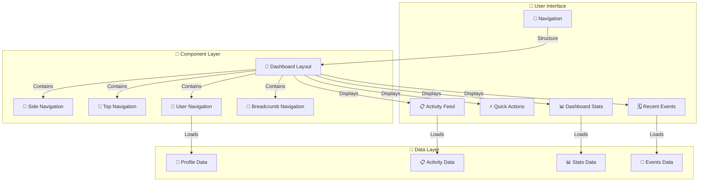
```mermaid
flowchart TD
    subgraph UI[📱 User Interface]
        ActivityFeed[📋 Activity Feed]
        QuickActions[⚡ Quick Actions]
        DashboardStats[📊 Dashboard Stats]
        RecentEvents[🗓️ Recent Events]
        Navigation[🧭 Navigation]
    end

    subgraph Components[🧩 Component Layer]
        DashboardLayout[📐 Dashboard Layout]
        SideNav[📑 Side Navigation]
        TopNav[📌 Top Navigation]
        UserNav[👤 User Navigation]
        BreadcrumbNav[🧵 Breadcrumb Navigation]
    end

    subgraph Data[💾 Data Layer]
        EventsData[📅 Events Data]
        ProfileData[👤 Profile Data]
        ActivityData[📋 Activity Data]
        StatsData[📊 Stats Data]
    end

    Navigation -->|Structure| DashboardLayout
    DashboardLayout -->|Contains| SideNav
    DashboardLayout -->|Contains| TopNav
    DashboardLayout -->|Contains| UserNav
    DashboardLayout -->|Contains| BreadcrumbNav
    
    DashboardLayout -->|Displays| ActivityFeed
    DashboardLayout -->|Displays| QuickActions
    DashboardLayout -->|Displays| DashboardStats
    DashboardLayout -->|Displays| RecentEvents
    
    ActivityFeed -->|Loads| ActivityData
    DashboardStats -->|Loads| StatsData
    RecentEvents -->|Loads| EventsData
    UserNav -->|Loads| ProfileData
```

## 📧 **Template System Architecture**

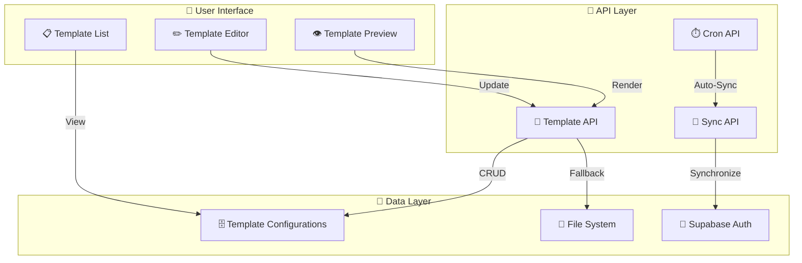
```mermaid
flowchart TD
    subgraph UI[📱 User Interface]
        TemplateList[📋 Template List]
        Editor[✏️ Template Editor]
        Preview[👁️ Template Preview]
    end

    subgraph API[🔌 API Layer]
        TemplateAPI[📡 Template API]
        SyncAPI[🔄 Sync API]
        CronAPI[⏱️ Cron API]
    end

    subgraph Data[💾 Data Layer]
        TemplateDB[🗄️ Template Configurations]
        SupaAuth[🔑 Supabase Auth]
        FileSystem[📁 File System]
    end

    TemplateList -->|View| TemplateDB
    Editor -->|Update| TemplateAPI
    Preview -->|Render| TemplateAPI
    TemplateAPI -->|CRUD| TemplateDB
    SyncAPI -->|Synchronize| SupaAuth
    CronAPI -->|Auto-Sync| SyncAPI
    TemplateAPI -->|Fallback| FileSystem
```

## 📅 **Event Management Architecture**

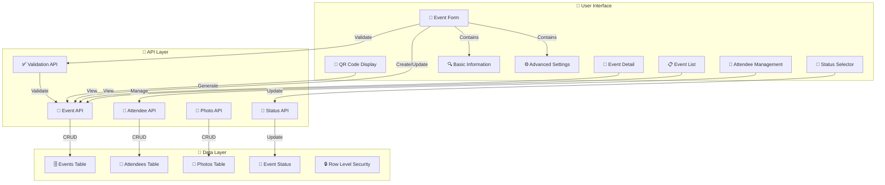
```mermaid
flowchart TD
    subgraph UI[📱 User Interface]
        EventList[📋 Event List]
        EventDetail[📄 Event Detail]
        EventForm[📝 Event Form]
        BasicTab[🔍 Basic Information]
        AdvancedTab[⚙️ Advanced Settings]
        AttendeeManagement[👥 Attendee Management]
        QRCode[📱 QR Code Display]
        StatusSelector[🚦 Status Selector]
    end

    subgraph API[🔌 API Layer]
        EventAPI[📡 Event API]
        AttendeeAPI[👥 Attendee API]
        PhotoAPI[📸 Photo API]
        ValidationAPI[✅ Validation API]
        StatusAPI[🚦 Status API]
    end

    subgraph Data[💾 Data Layer]
        EventsDB[🗄️ Events Table]
        AttendeesDB[👥 Attendees Table]
        PhotosDB[📸 Photos Table]
        EventStatusDB[🚦 Event Status]
        RLS[🔒 Row Level Security]
    end

    EventList -->|View| EventAPI
    EventDetail -->|View| EventAPI
    EventForm -->|Contains| BasicTab
    EventForm -->|Contains| AdvancedTab
    EventForm -->|Validate| ValidationAPI
    EventForm -->|Create/Update| EventAPI
    AttendeeManagement -->|Manage| AttendeeAPI
    QRCode -->|Generate| EventAPI
    StatusSelector -->|Update| StatusAPI
    
    EventAPI -->|CRUD| EventsDB
    AttendeeAPI -->|CRUD| AttendeesDB
    PhotoAPI -->|CRUD| PhotosDB
    StatusAPI -->|Update| EventStatusDB
    ValidationAPI -->|Validate| EventAPI
```

## 👥 **Attendee Management Architecture**

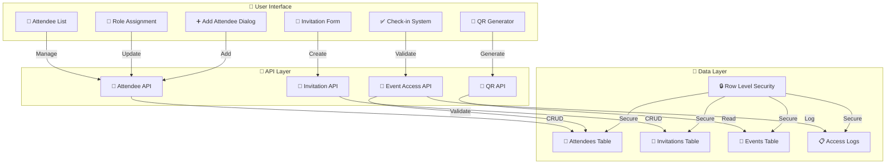
```mermaid
flowchart TD
    subgraph UI[📱 User Interface]
        InvitationForm[📝 Invitation Form]
        AttendeeList[👥 Attendee List]
        RoleAssignment[👑 Role Assignment]
        QRGenerator[📱 QR Generator]
        CheckIn[✅ Check-in System]
        AddAttendeeDialog[➕ Add Attendee Dialog]
    end

    subgraph API[🔌 API Layer]
        AttendeeAPI[📡 Attendee API]
        InvitationAPI[📧 Invitation API]
        QrAPI[📱 QR API]
        EventAccessAPI[🔑 Event Access API]
    end

    subgraph Data[💾 Data Layer]
        AttendeesDB[👥 Attendees Table]
        InvitationsDB[📧 Invitations Table]
        EventsDB[📅 Events Table]
        AccessLogsDB[📋 Access Logs]
        RLS[🔒 Row Level Security]
    end

    InvitationForm -->|Create| InvitationAPI
    AttendeeList -->|Manage| AttendeeAPI
    RoleAssignment -->|Update| AttendeeAPI
    QRGenerator -->|Generate| QrAPI
    CheckIn -->|Validate| EventAccessAPI
    AddAttendeeDialog -->|Add| AttendeeAPI
    
    InvitationAPI -->|CRUD| InvitationsDB
    AttendeeAPI -->|CRUD| AttendeesDB
    QrAPI -->|Read| EventsDB
    EventAccessAPI -->|Validate| AttendeesDB
    EventAccessAPI -->|Log| AccessLogsDB
    
    RLS -->|Secure| AttendeesDB
    RLS -->|Secure| InvitationsDB
    RLS -->|Secure| EventsDB
    RLS -->|Secure| AccessLogsDB
```

## ⚙️ **Settings System Architecture**

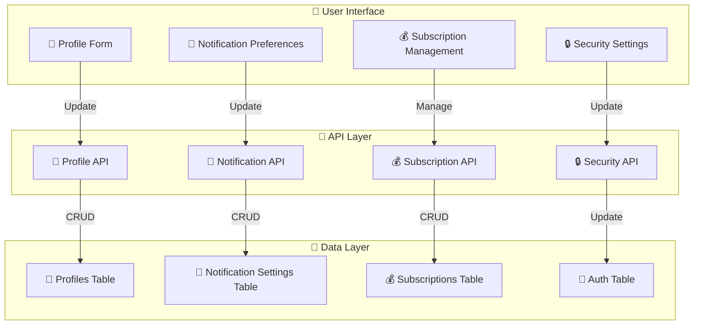
```mermaid
flowchart TD
    subgraph UI[📱 User Interface]
        ProfileForm[👤 Profile Form]
        NotificationPrefs[🔔 Notification Preferences]
        SubscriptionManagement[💰 Subscription Management]
        SecuritySettings[🔒 Security Settings]
    end

    subgraph API[🔌 API Layer]
        ProfileAPI[👤 Profile API]
        NotificationAPI[🔔 Notification API]
        SubscriptionAPI[💰 Subscription API]
        SecurityAPI[🔒 Security API]
    end

    subgraph Data[💾 Data Layer]
        ProfilesDB[👤 Profiles Table]
        NotificationSettingsDB[🔔 Notification Settings Table]
        SubscriptionsDB[💰 Subscriptions Table]
        AuthTable[🔑 Auth Table]
    end

    ProfileForm -->|Update| ProfileAPI
    NotificationPrefs -->|Update| NotificationAPI
    SubscriptionManagement -->|Manage| SubscriptionAPI
    SecuritySettings -->|Update| SecurityAPI
    
    ProfileAPI -->|CRUD| ProfilesDB
    NotificationAPI -->|CRUD| NotificationSettingsDB
    SubscriptionAPI -->|CRUD| SubscriptionsDB
    SecurityAPI -->|Update| AuthTable
```

## 📱 **Responsive Application Structure**

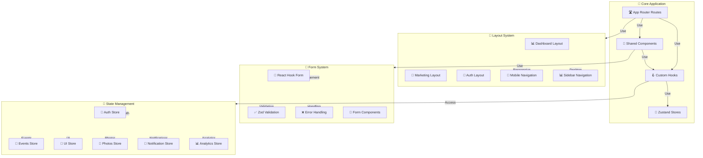
```mermaid
flowchart TD
    subgraph Core[🧠 Core Application]
        Routes[🛣️ App Router Routes]
        Components[🧩 Shared Components]
        Hooks[🪝 Custom Hooks]
        Stores[🏪 Zustand Stores]
    end

    subgraph Layout[📐 Layout System]
        DashboardLayout[📊 Dashboard Layout]
        MarketingLayout[🏪 Marketing Layout]
        AuthLayout[🔐 Auth Layout]
        MobileNav[📱 Mobile Navigation]
        SideNav[📊 Sidebar Navigation]
    end

    subgraph Form[📝 Form System]
        ReactHookForm[📝 React Hook Form]
        ZodValidation[✅ Zod Validation]
        ErrorHandling[❌ Error Handling]
        FormComponents[🧩 Form Components]
    end

    subgraph State[🔄 State Management]
        AuthStore[🔐 Auth Store]
        EventsStore[📅 Events Store]
        UIStore[🎨 UI Store]
        PhotosStore[📸 Photos Store]
        NotificationStore[🔔 Notification Store]
        AnalyticsStore[📊 Analytics Store]
    end

    Routes -->|Use| Components
    Routes -->|Use| Hooks
    Components -->|Use| Hooks
    Hooks -->|Use| Stores
    
    Routes -->|Use| Layout
    Layout -->|Responsive| MobileNav
    Layout -->|Desktop| SideNav
    
    Components -->|Use| Form
    Form -->|Validation| ZodValidation
    Form -->|Management| ReactHookForm
    Form -->|Handling| ErrorHandling
    
    Hooks -->|Access| State
    State -->|Auth| AuthStore
    State -->|Events| EventsStore
    State -->|UI| UIStore
    State -->|Photos| PhotosStore
    State -->|Notifications| NotificationStore
    State -->|Analytics| AnalyticsStore
```

## 💻 **Session 24 Implementation Focus**

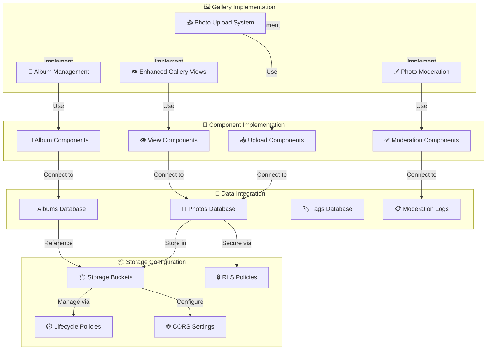
```mermaid
flowchart TD
    subgraph Gallery[🖼️ Gallery Implementation]
        UploadSystem[📤 Photo Upload System]
        AlbumManagement[📁 Album Management]
        PhotoModeration[✅ Photo Moderation]
        EnhancedViews[👁️ Enhanced Gallery Views]
    end

    subgraph Components[🧩 Component Implementation]
        UploadComponents[📤 Upload Components]
        AlbumComponents[📁 Album Components]
        ModerationComponents[✅ Moderation Components]
        ViewComponents[👁️ View Components]
    end

    subgraph Data[💾 Data Integration]
        PhotosDB[📸 Photos Database]
        AlbumsDB[📁 Albums Database]
        TagsDB[🏷️ Tags Database]
        ModerationLogsDB[📋 Moderation Logs]
    end

    subgraph Storage[📦 Storage Configuration]
        StorageBuckets[📦 Storage Buckets]
        RLSPolicies[🔒 RLS Policies]
        LifecyclePolicies[⏱️ Lifecycle Policies]
        CORSSettings[🌐 CORS Settings]
    end

    Gallery -->|Implement| UploadSystem
    Gallery -->|Implement| AlbumManagement
    Gallery -->|Implement| PhotoModeration
    Gallery -->|Implement| EnhancedViews
    
    UploadSystem -->|Use| UploadComponents
    AlbumManagement -->|Use| AlbumComponents
    PhotoModeration -->|Use| ModerationComponents
    EnhancedViews -->|Use| ViewComponents
    
    UploadComponents -->|Connect to| PhotosDB
    AlbumComponents -->|Connect to| AlbumsDB
    ModerationComponents -->|Connect to| ModerationLogsDB
    ViewComponents -->|Connect to| PhotosDB
    
    PhotosDB -->|Store in| StorageBuckets
    AlbumsDB -->|Reference| StorageBuckets
    PhotosDB -->|Secure via| RLSPolicies
    StorageBuckets -->|Manage via| LifecyclePolicies
    StorageBuckets -->|Configure| CORSSettings
```

## 4. CHANGELOG Update

```markdown
# Changelog
All notable changes to Cloud Burst will be documented in this file.

## [0.7.7] - 2025-03-19
### Added
- New Analytics section with Engagement Metrics page
- Events Analytics page (currently disabled with "Coming Soon" badge)
- Gallery management system with tabs for All Media, Events, Moderation, and Albums
- Enhanced organizer dashboard navigation structure
- Top-level section headers in sidebar for better organization
- Improved tooltip support for collapsed sidebar items

### Changed
- Increased sidebar width to properly accommodate badges and longer text
- Reordered Analytics menu items with Engagement Metrics at the top
- Enhanced responsive design for all new pages
- Improved layout consistency across protected routes
- Standardized page header padding for better visual hierarchy
- Updated navigation patterns with improved disabled state handling

### Fixed
- Added proper top padding to Gallery layout pages
- Fixed horizontal scrollbar in sidebar when using badges
- Improved accessibility for disabled navigation items
- Enhanced responsive behavior for analytics cards
- Optimized loading states for analytics pages
- Resolved padding inconsistencies across dashboard pages

### Technical Debt
- Event Analytics page requires completion in future sessions
- Chart components need implementation for proper data visualization
- Data fetching for analytics needs integration with actual database
- Additional testing required for responsive behavior across devices