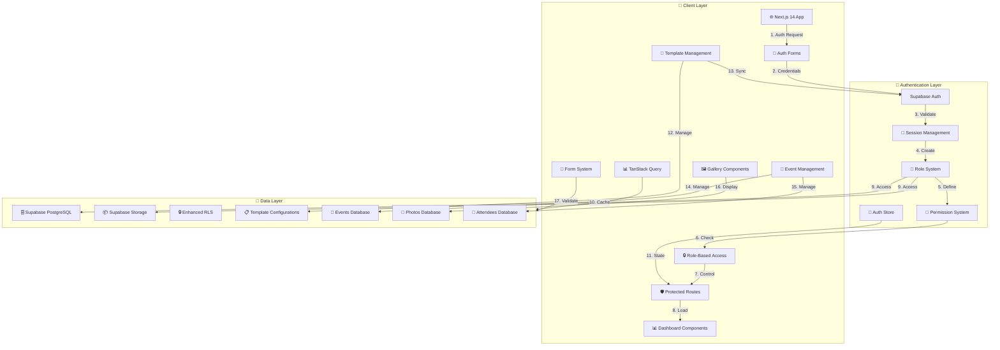
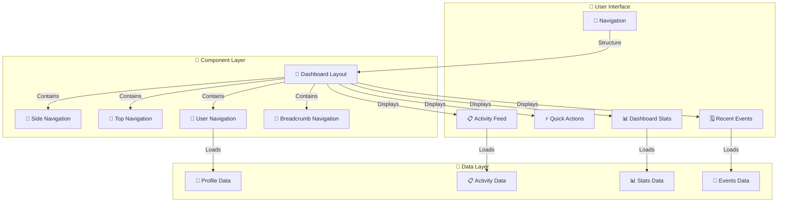
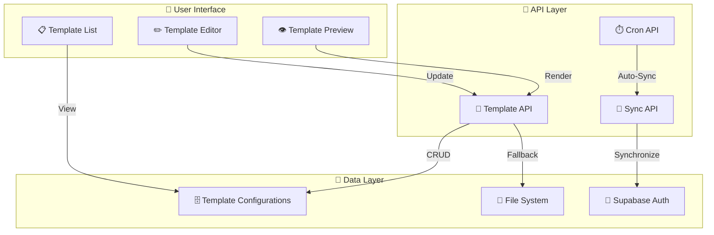
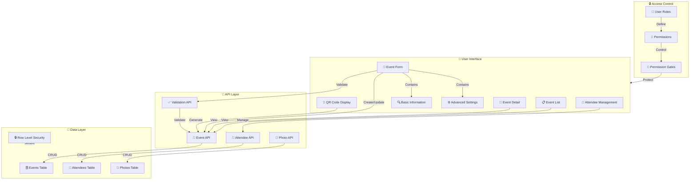
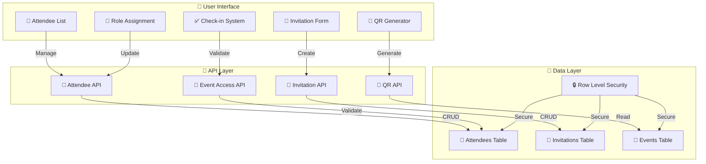
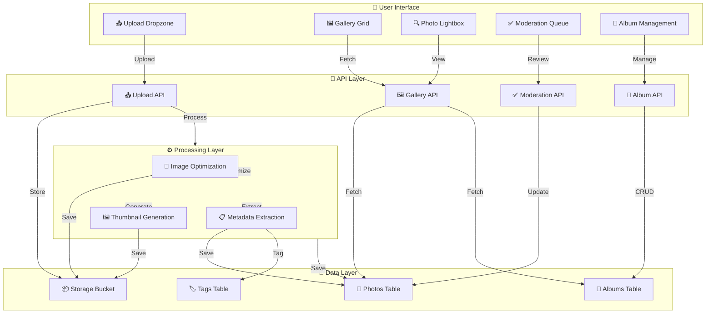
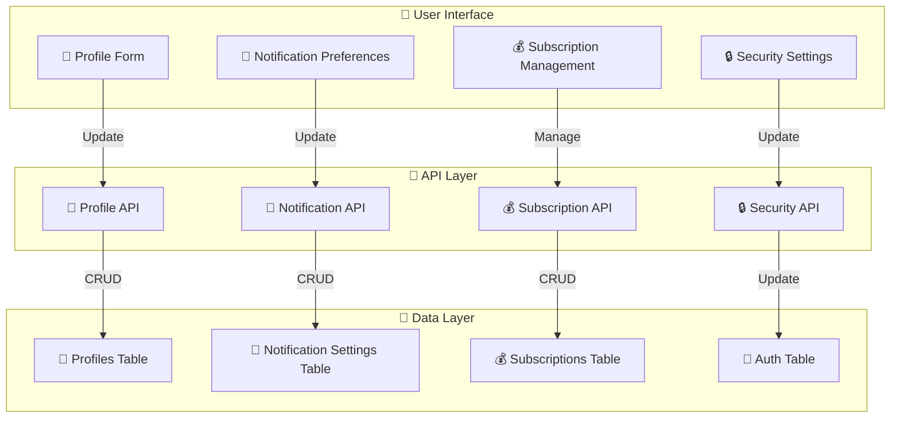
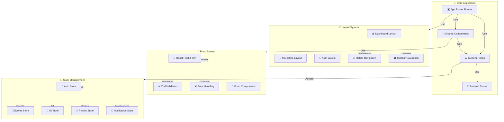
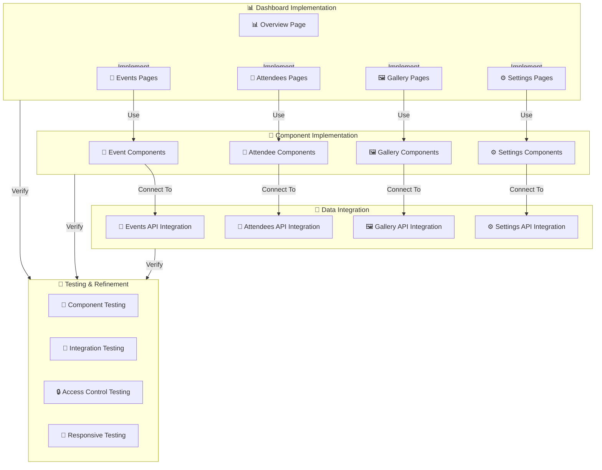

# 🏛️ **System Architecture Flowchart (Beta v0.7.4)**  

## Cloud Burst  
📅 *Mar 10, 2025, 09:30 AM*  

---


```mermaid
flowchart TD
    subgraph Client[📱 Client Layer]
        WebApp[🌐 Next.js 14 App]
        AuthForms[🔐 Auth Forms]
        Protected[🛡️ Protected Routes]
        TanStack[📊 TanStack Query]
        Dashboard[📊 Dashboard Components]
        Templates[📧 Template Management]
        RBAC[🔒 Role-Based Access]
        Events[📅 Event Management]
        Gallery[🖼️ Gallery Components]
        Forms[📝 Form System]
    end

    subgraph Auth[🔑 Authentication Layer]
        SupaAuth[Supabase Auth]
        Session[📝 Session Management]
        Roles[👥 Role System]
        Zustand[🔄 Auth Store]
        Permissions[🔐 Permission System]
    end

    subgraph Data[💾 Data Layer]
        Database[🗄️ Supabase PostgreSQL]
        Storage[📦 Supabase Storage]
        RLS[🔒 Enhanced RLS]
        TemplateDB[📋 Template Configurations]
        EventsDB[📅 Events Database]
        PhotosDB[📸 Photos Database]
        AttendeeDB[👥 Attendees Database]
    end

    WebApp -->|1. Auth Request| AuthForms
    AuthForms -->|2. Credentials| SupaAuth
    SupaAuth -->|3. Validate| Session
    Session -->|4. Create| Roles
    Roles -->|5. Define| Permissions
    Permissions -->|6. Check| RBAC
    RBAC -->|7. Control| Protected
    Protected -->|8. Load| Dashboard
    Roles -->|9. Access| Database
    Roles -->|9. Access| Storage
    TanStack -->|10. Cache| Data
    Zustand -->|11. State| Protected
    Templates -->|12. Manage| TemplateDB
    Templates -->|13. Sync| SupaAuth
    Events -->|14. Manage| EventsDB
    Events -->|15. Manage| AttendeeDB
    Gallery -->|16. Display| PhotosDB
    Forms -->|17. Validate| Data
```

## 🛠️ **Beta Components (v0.7.4)**  

### 📱 **Client Layer**
- Next.js 14 App Router
- TypeScript + React
- Shadcn/ui Components
- TanStack Query Integration
- Protected Route System
- Dashboard Components
- Template Management UI
- Role-Based Access Control
- Event Management System
- Gallery Components
- React Hook Form + Zod Validation

### 🔑 **Authentication Layer**
- Supabase Auth
- Enhanced Session Management
- Role-based Access Control
- Zustand Auth Store
- Template Synchronization
- Permission System
- Conditional UI Rendering
- Form Validation

### 💾 **Data Layer**
- PostgreSQL Database
- Storage Integration
- Enhanced RLS Policies
- Template Configurations Table
- Events Database
- Photos Database
- Attendees Database
- Role Capabilities Table

---

## 📐 **Beta System Overview (v0.7.4)**  

```mermaid
flowchart TD
    Client[📱 Client Device] -->|🔗 HTTPS Request| WebApp[🌐 Web App (Next.js)]
    WebApp -->|🔌 API Calls| Supabase[🗄️ Supabase]
    WebApp -->|📊 Dashboard| Dashboard[📊 Dashboard System]
    WebApp -->|📧 Template Management| Templates[📋 Template System]
    WebApp -->|📅 Event Management| Events[📅 Event System]
    WebApp -->|🖼️ Gallery Management| Gallery[🖼️ Gallery System]
    WebApp -->|👥 Attendee Management| Attendees[👥 Attendee System]
    WebApp -->|⚙️ User Settings| Settings[⚙️ Settings System]
    WebApp -->|🔒 Access Control| RBAC[🔒 RBAC System]
    Dashboard -->|🔄 Load| Supabase
    Templates -->|🔄 Sync| Supabase
    Events -->|🔄 CRUD| Supabase
    Gallery -->|🔄 CRUD| Supabase
    Attendees -->|🔄 CRUD| Supabase
    Settings -->|🔄 CRUD| Supabase
    RBAC -->|🔐 Verify| Supabase
    Supabase --> Auth[🔑 Auth]
    Supabase --> Database[💾 Database]
    Supabase --> Storage[📦 Storage]
```

## 🔒 **Security (v0.7.4)**  
✔️ **Complete Auth** – Email/password & social login  
✔️ **Enhanced RLS** – Role-based data protection  
✔️ **Route Guards** – Protected routes with role verification  
✔️ **Template Security** – RLS policies for template access  
✔️ **API Protection** – Secured API routes  
✔️ **RBAC System** – Comprehensive role-based access control  
✔️ **Permission Gates** – Conditional UI rendering based on permissions  
✔️ **Event Security** – Owner-based access control for events  
✔️ **Form Validation** – Zod schema validation for all inputs  
✔️ **Error Handling** – Comprehensive error states and recovery  

## 🎯 **Next Steps (v0.7.5)**  
1. 📊 Complete dashboard section implementations
2. 📅 Build all event management pages
3. 👥 Implement attendee management features
4. 🖼️ Develop gallery section with photo organization
5. ⚙️ Create settings pages for profile and preferences
6. 🧪 Test role-based access under real scenarios

## 📊 **Dashboard Architecture**


```mermaid
flowchart TD
    subgraph UI[📱 User Interface]
        ActivityFeed[📋 Activity Feed]
        QuickActions[⚡ Quick Actions]
        DashboardStats[📊 Dashboard Stats]
        RecentEvents[🗓️ Recent Events]
        Navigation[🧭 Navigation]
    end

    subgraph Components[🧩 Component Layer]
        DashboardLayout[📐 Dashboard Layout]
        SideNav[📑 Side Navigation]
        TopNav[📌 Top Navigation]
        UserNav[👤 User Navigation]
        BreadcrumbNav[🧵 Breadcrumb Navigation]
    end

    subgraph Data[💾 Data Layer]
        EventsData[📅 Events Data]
        ProfileData[👤 Profile Data]
        ActivityData[📋 Activity Data]
        StatsData[📊 Stats Data]
    end

    Navigation -->|Structure| DashboardLayout
    DashboardLayout -->|Contains| SideNav
    DashboardLayout -->|Contains| TopNav
    DashboardLayout -->|Contains| UserNav
    DashboardLayout -->|Contains| BreadcrumbNav
    
    DashboardLayout -->|Displays| ActivityFeed
    DashboardLayout -->|Displays| QuickActions
    DashboardLayout -->|Displays| DashboardStats
    DashboardLayout -->|Displays| RecentEvents
    
    ActivityFeed -->|Loads| ActivityData
    DashboardStats -->|Loads| StatsData
    RecentEvents -->|Loads| EventsData
    UserNav -->|Loads| ProfileData
```

## 📧 **Template System Architecture**


```mermaid
flowchart TD
    subgraph UI[📱 User Interface]
        TemplateList[📋 Template List]
        Editor[✏️ Template Editor]
        Preview[👁️ Template Preview]
    end

    subgraph API[🔌 API Layer]
        TemplateAPI[📡 Template API]
        SyncAPI[🔄 Sync API]
        CronAPI[⏱️ Cron API]
    end

    subgraph Data[💾 Data Layer]
        TemplateDB[🗄️ Template Configurations]
        SupaAuth[🔑 Supabase Auth]
        FileSystem[📁 File System]
    end

    TemplateList -->|View| TemplateDB
    Editor -->|Update| TemplateAPI
    Preview -->|Render| TemplateAPI
    TemplateAPI -->|CRUD| TemplateDB
    SyncAPI -->|Synchronize| SupaAuth
    CronAPI -->|Auto-Sync| SyncAPI
    TemplateAPI -->|Fallback| FileSystem
```

## 📅 **Event Management Architecture**


```mermaid
flowchart TD
    subgraph UI[📱 User Interface]
        EventList[📋 Event List]
        EventDetail[📄 Event Detail]
        EventForm[📝 Event Form]
        BasicTab[🔍 Basic Information]
        AdvancedTab[⚙️ Advanced Settings]
        AttendeeManagement[👥 Attendee Management]
        QRCode[📱 QR Code Display]
    end

    subgraph API[🔌 API Layer]
        EventAPI[📡 Event API]
        AttendeeAPI[👥 Attendee API]
        PhotoAPI[📸 Photo API]
        ValidationAPI[✅ Validation API]
    end

    subgraph Data[💾 Data Layer]
        EventsDB[🗄️ Events Table]
        AttendeesDB[👥 Attendees Table]
        PhotosDB[📸 Photos Table]
        RLS[🔒 Row Level Security]
    end

    subgraph RBAC[🔒 Access Control]
        Roles[👥 User Roles]
        Permissions[🔐 Permissions]
        Gates[🚪 Permission Gates]
    end

    EventList -->|View| EventAPI
    EventDetail -->|View| EventAPI
    EventForm -->|Contains| BasicTab
    EventForm -->|Contains| AdvancedTab
    EventForm -->|Validate| ValidationAPI
    EventForm -->|Create/Update| EventAPI
    AttendeeManagement -->|Manage| AttendeeAPI
    QRCode -->|Generate| EventAPI
    
    EventAPI -->|CRUD| EventsDB
    AttendeeAPI -->|CRUD| AttendeesDB
    PhotoAPI -->|CRUD| PhotosDB
    
    Roles -->|Define| Permissions
    Permissions -->|Control| Gates
    Gates -->|Protect| UI
    RLS -->|Secure| Data
    ValidationAPI -->|Validate| EventAPI
```

## 👥 **Attendee Management Architecture**


```mermaid
flowchart TD
    subgraph UI[📱 User Interface]
        InvitationForm[📝 Invitation Form]
        AttendeeList[👥 Attendee List]
        RoleAssignment[👑 Role Assignment]
        QRGenerator[📱 QR Generator]
        CheckIn[✅ Check-in System]
    end

    subgraph API[🔌 API Layer]
        AttendeeAPI[📡 Attendee API]
        InvitationAPI[📧 Invitation API]
        QrAPI[📱 QR API]
        EventAccessAPI[🔑 Event Access API]
    end

    subgraph Data[💾 Data Layer]
        AttendeesDB[👥 Attendees Table]
        InvitationsDB[📧 Invitations Table]
        EventsDB[📅 Events Table]
        RLS[🔒 Row Level Security]
    end

    InvitationForm -->|Create| InvitationAPI
    AttendeeList -->|Manage| AttendeeAPI
    RoleAssignment -->|Update| AttendeeAPI
    QRGenerator -->|Generate| QrAPI
    CheckIn -->|Validate| EventAccessAPI
    
    InvitationAPI -->|CRUD| InvitationsDB
    AttendeeAPI -->|CRUD| AttendeesDB
    QrAPI -->|Read| EventsDB
    EventAccessAPI -->|Validate| AttendeesDB
    
    RLS -->|Secure| AttendeesDB
    RLS -->|Secure| InvitationsDB
    RLS -->|Secure| EventsDB
```

## 🖼️ **Gallery System Architecture**


```mermaid
flowchart TD
    subgraph UI[📱 User Interface]
        UploadDropzone[📤 Upload Dropzone]
        GalleryGrid[🖼️ Gallery Grid]
        PhotoLightbox[🔍 Photo Lightbox]
        ModerationQueue[✅ Moderation Queue]
        AlbumManagement[📁 Album Management]
    end

    subgraph API[🔌 API Layer]
        UploadAPI[📤 Upload API]
        GalleryAPI[🖼️ Gallery API]
        ModerationAPI[✅ Moderation API]
        AlbumAPI[📁 Album API]
    end

    subgraph Data[💾 Data Layer]
        PhotosDB[📸 Photos Table]
        AlbumsDB[📁 Albums Table]
        TagsDB[🏷️ Tags Table]
        StorageBucket[📦 Storage Bucket]
    end

    subgraph Processing[⚙️ Processing Layer]
        ImageOptimization[🔧 Image Optimization]
        Thumbnails[🖼️ Thumbnail Generation]
        MetadataExtraction[📋 Metadata Extraction]
    end

    UploadDropzone -->|Upload| UploadAPI
    GalleryGrid -->|Fetch| GalleryAPI
    PhotoLightbox -->|View| GalleryAPI
    ModerationQueue -->|Review| ModerationAPI
    AlbumManagement -->|Manage| AlbumAPI
    
    UploadAPI -->|Process| Processing
    UploadAPI -->|Store| StorageBucket
    GalleryAPI -->|Fetch| PhotosDB
    GalleryAPI -->|Fetch| AlbumsDB
    ModerationAPI -->|Update| PhotosDB
    AlbumAPI -->|CRUD| AlbumsDB
    
    Processing -->|Optimize| ImageOptimization
    Processing -->|Generate| Thumbnails
    Processing -->|Extract| MetadataExtraction
    Processing -->|Save| PhotosDB
    
    ImageOptimization -->|Save| StorageBucket
    Thumbnails -->|Save| StorageBucket
    MetadataExtraction -->|Save| PhotosDB
    MetadataExtraction -->|Tag| TagsDB
```

## ⚙️ **Settings System Architecture**


```mermaid
flowchart TD
    subgraph UI[📱 User Interface]
        ProfileForm[👤 Profile Form]
        NotificationPrefs[🔔 Notification Preferences]
        SubscriptionManagement[💰 Subscription Management]
        SecuritySettings[🔒 Security Settings]
    end

    subgraph API[🔌 API Layer]
        ProfileAPI[👤 Profile API]
        NotificationAPI[🔔 Notification API]
        SubscriptionAPI[💰 Subscription API]
        SecurityAPI[🔒 Security API]
    end

    subgraph Data[💾 Data Layer]
        ProfilesDB[👤 Profiles Table]
        NotificationSettingsDB[🔔 Notification Settings Table]
        SubscriptionsDB[💰 Subscriptions Table]
        AuthTable[🔑 Auth Table]
    end

    ProfileForm -->|Update| ProfileAPI
    NotificationPrefs -->|Update| NotificationAPI
    SubscriptionManagement -->|Manage| SubscriptionAPI
    SecuritySettings -->|Update| SecurityAPI
    
    ProfileAPI -->|CRUD| ProfilesDB
    NotificationAPI -->|CRUD| NotificationSettingsDB
    SubscriptionAPI -->|CRUD| SubscriptionsDB
    SecurityAPI -->|Update| AuthTable
```

## 📱 **Responsive Application Structure**


```mermaid
flowchart TD
    subgraph Core[🧠 Core Application]
        Routes[🛣️ App Router Routes]
        Components[🧩 Shared Components]
        Hooks[🪝 Custom Hooks]
        Stores[🏪 Zustand Stores]
    end

    subgraph Layout[📐 Layout System]
        DashboardLayout[📊 Dashboard Layout]
        MarketingLayout[🏪 Marketing Layout]
        AuthLayout[🔐 Auth Layout]
        MobileNav[📱 Mobile Navigation]
        SideNav[📊 Sidebar Navigation]
    end

    subgraph Form[📝 Form System]
        ReactHookForm[📝 React Hook Form]
        ZodValidation[✅ Zod Validation]
        ErrorHandling[❌ Error Handling]
        FormComponents[🧩 Form Components]
    end

    subgraph State[🔄 State Management]
        AuthStore[🔐 Auth Store]
        EventsStore[📅 Events Store]
        UIStore[🎨 UI Store]
        PhotosStore[📸 Photos Store]
        NotificationStore[🔔 Notification Store]
    end

    Routes -->|Use| Components
    Routes -->|Use| Hooks
    Components -->|Use| Hooks
    Hooks -->|Use| Stores
    
    Routes -->|Use| Layout
    Layout -->|Responsive| MobileNav
    Layout -->|Desktop| SideNav
    
    Components -->|Use| Form
    Form -->|Validation| ZodValidation
    Form -->|Management| ReactHookForm
    Form -->|Handling| ErrorHandling
    
    Hooks -->|Access| State
    State -->|Auth| AuthStore
    State -->|Events| EventsStore
    State -->|UI| UIStore
    State -->|Photos| PhotosStore
    State -->|Notifications| NotificationStore
```

## 💻 **Session 22 Implementation Focus**


```mermaid
flowchart TD
    subgraph Dashboard[📊 Dashboard Implementation]
        DashboardPage[📊 Overview Page]
        EventsPages[📅 Events Pages]
        AttendeesPages[👥 Attendees Pages]
        GalleryPages[🖼️ Gallery Pages]
        SettingsPages[⚙️ Settings Pages]
    end

    subgraph Components[🧩 Component Implementation]
        EventComponents[📅 Event Components]
        AttendeeComponents[👥 Attendee Components]
        GalleryComponents[🖼️ Gallery Components]
        SettingsComponents[⚙️ Settings Components]
    end

    subgraph Data[💾 Data Integration]
        EventsData[📅 Events API Integration]
        AttendeesData[👥 Attendees API Integration]
        GalleryData[🖼️ Gallery API Integration]
        SettingsData[⚙️ Settings API Integration]
    end

    subgraph Testing[🧪 Testing & Refinement]
        ComponentTesting[🧩 Component Testing]
        IntegrationTesting[🔄 Integration Testing]
        AccessTesting[🔒 Access Control Testing]
        ResponsiveTesting[📱 Responsive Testing]
    end

    Dashboard -->|Implement| EventsPages
    Dashboard -->|Implement| AttendeesPages
    Dashboard -->|Implement| GalleryPages
    Dashboard -->|Implement| SettingsPages
    
    EventsPages -->|Use| EventComponents
    AttendeesPages -->|Use| AttendeeComponents
    GalleryPages -->|Use| GalleryComponents
    SettingsPages -->|Use| SettingsComponents
    
    EventComponents -->|Connect To| EventsData
    AttendeeComponents -->|Connect To| AttendeesData
    GalleryComponents -->|Connect To| GalleryData
    SettingsComponents -->|Connect To| SettingsData
    
    Dashboard -->|Verify| Testing
    Components -->|Verify| Testing
    Data -->|Verify| Testing
```

## 4. CHANGELOG Update

```markdown
# Changelog
All notable changes to Cloud Burst will be documented in this file.

The format is based on [Keep a Changelog](https://keepachangelog.com/en/1.1.0/),
and this project adheres to [Semantic Versioning](https://semver.org/spec/v2.0.0.html).

## Version Strategy
- 0.x.y: Development Phase
  - 0.1.x: Foundation Setup
  - 0.2.x: Authentication System
  - 0.3.x: User Dashboard & Profiles
  - 0.4.x: Core Photo Features
  - 0.5.x: Foundation Complete
  - 0.6.x-0.8.x: Feature Implementation
  - 0.9.x: Pre-release & Testing
- 1.0.0: Production Launch

## [0.1.18] - 2024-03-03
### Added
- Comprehensive role-based access control (
