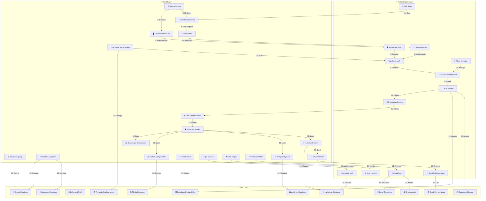
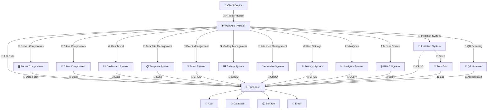
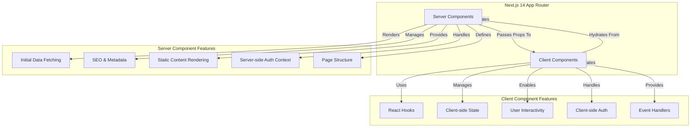
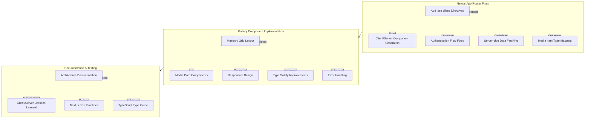

# 🏛️ **System Architecture Flowchart (Beta v0.8.2)**  

## Cloud Burst  
📅 *Updated: March 27, 2025*  
📊 *Version: 0.8.2*

---


```mermaid
flowchart TD
    subgraph Client[📱 Client Layer]
        WebApp[🌐 Next.js 14 App]
        AuthForms[🔐 Auth Forms]
        Protected[🛡️ Protected Routes]
        TanStack[📊 TanStack Query]
        Dashboard[📊 Dashboard Components]
        Templates[📧 Template Management]
        RBAC[🔒 Role-Based Access]
        Events[📅 Event Management]
        Gallery[🖼️ Gallery Components]
        Analytics[📈 Analytics System]
        Forms[📝 Form System]
        Invitations[📨 Invitation System]
        QRScanner[📱 QR Scanner]
        ErrorPages[❌ Error Pages]
        VerificationFlow[✅ Verification Flow]
        EmailDelivery[📧 Email Delivery]
        ClientComponents[👤 Client Components]
        ServerComponents[🖥️ Server Components]
    end

    subgraph Auth[🔑 Authentication Layer]
        SupaAuth[Supabase Auth]
        Session[📝 Session Management]
        Roles[👥 Role System]
        Zustand[🔄 Auth Store]
        Permissions[🔐 Permission System]
        InviteAuth[📨 Invitation Auth]
        EmailAuth[📧 Email Auth]
        ErrorHandler[❌ Error Handler]
        TokenManager[🔑 Token Manager]
        SendGrid[📨 SendGrid Integration]
        ClientSideAuth[👤 Client-side Auth]
        ServerSideAuth[🖥️ Server-side Auth]
    end

    subgraph Data[💾 Data Layer]
        Database[🗄️ Supabase PostgreSQL]
        Storage[📦 Supabase Storage]
        RLS[🔒 Enhanced RLS]
        TemplateDB[📋 Template Configurations]
        EventsDB[📅 Events Database]
        MediaDB[🎬 Media Database]
        AttendeeDB[👥 Attendees Database]
        AnalyticsDB[📊 Analytics Database]
        InvitationsDB[📨 Invitations Database]
        EmailTemplatesDB[📧 Email Templates]
        EmailAssetsDB[🖼️ Email Assets]
        EmailLogsDB[📋 Email Delivery Logs]
    end

    WebApp -->|1. Renders| ServerComponents
    WebApp -->|2. Hydrates| ClientComponents
    ClientComponents -->|3. Auth Request| AuthForms
    AuthForms -->|4. Credentials| ClientSideAuth
    ClientSideAuth -->|5. Authenticate| SupaAuth
    ServerComponents -->|6. Auth Request| ServerSideAuth
    ServerSideAuth -->|7. Session| SupaAuth
    SupaAuth -->|8. Validate| Session
    Session -->|9. Create| Roles
    Roles -->|10. Define| Permissions
    Permissions -->|11. Check| RBAC
    RBAC -->|12. Control| Protected
    Protected -->|13. Load| Dashboard
    Protected -->|13. Load| Gallery
    Protected -->|13. Load| Analytics
    Protected -->|13. Load| Invitations
    Roles -->|14. Access| Database
    Roles -->|14. Access| Storage
    TanStack -->|15. Cache| Data
    Zustand -->|16. State| ClientComponents
    Templates -->|17. Manage| TemplateDB
    Templates -->|18. Sync| SupaAuth
    Events -->|19. Manage| EventsDB
    Events -->|20. Manage| AttendeeDB
    Gallery -->|21. Display| MediaDB
    Analytics -->|22. Visualize| AnalyticsDB
    Forms -->|23. Validate| Data
    Invitations -->|24. Manage| InvitationsDB
    Invitations -->|25. Send| EmailDelivery
    EmailDelivery -->|26. Process| SendGrid
    SendGrid -->|27. Log| EmailLogsDB
    QRScanner -->|28. Authenticate| InviteAuth
    InviteAuth -->|29. Validate| InvitationsDB
    ErrorPages -->|30. Handle| ErrorHandler
    VerificationFlow -->|31. Process| EmailAuth
    EmailAuth -->|32. Templates| EmailTemplatesDB
    EmailAuth -->|33. Assets| EmailAssetsDB
    TokenManager -->|34. Manage| Session
```

## 🛠️ **Beta Components (v0.8.2)**  

### 📱 **Client Layer**
- Next.js 14 App Router
- TypeScript + React
- Client/Server Component Architecture
- React Hooks in Client Components
- Server-Side Data Fetching
- Server Components for Static Content
- Client Components for Interactivity
- Shadcn/ui Components
- TanStack Query Integration
- Protected Route System
- Dashboard Components
- Template Management UI
- Role-Based Access Control
- Event Management System
- Gallery Components (Photos & Videos)
- Analytics Components
- Invitation System UI (Complete)
- QR Code Scanner
- React Hook Form + Zod Validation
- Error Pages
- Verification Flow UI
- Email Template Preview
- SendGrid Email Integration

### 🔑 **Authentication Layer**
- Client-side Auth for Interactive Components
- Server-side Auth for Data Fetching
- Supabase Auth
- Enhanced Session Management
- Role-based Access Control
- Zustand Auth Store
- Template Synchronization
- Permission System
- Conditional UI Rendering
- Form Validation
- Invitation-based Authentication
- QR Code Authentication
- Error Handling System
- Email Authentication Flow
- Token Management
- Link Expiration Handling
- SendGrid Delivery System

### 💾 **Data Layer**
- PostgreSQL Database
- Storage Integration
- Enhanced RLS Policies
- Template Configurations Table
- Events Database
- Media Database (Photos & Videos)
- Attendees Database
- Analytics Database
- Invitations Database
- Role Capabilities Table
- Email Templates Database
- Email Assets Storage
- Email Delivery Logs

---

## 📐 **Beta System Overview (v0.8.2)**  


```mermaid
graph TD
    Client["📱 Client Device"] -->|"🔗 HTTPS Request"| WebApp["🌐 Web App (Next.js)"]
    WebApp -->|"📄 Server Components"| ServerComp["🖥️ Server Components"]
    WebApp -->|"📄 Client Components"| ClientComp["👤 Client Components"]
    WebApp -->|"🔌 API Calls"| Supabase["🗄️ Supabase"]
    WebApp -->|"📊 Dashboard"| Dashboard["📊 Dashboard System"]
    WebApp -->|"📧 Template Management"| Templates["📋 Template System"]
    WebApp -->|"📅 Event Management"| Events["📅 Event System"]
    WebApp -->|"🖼️ Gallery Management"| Gallery["🖼️ Gallery System"]
    WebApp -->|"👥 Attendee Management"| Attendees["👥 Attendee System"]
    WebApp -->|"⚙️ User Settings"| Settings["⚙️ Settings System"]
    WebApp -->|"📈 Analytics"| Analytics["📈 Analytics System"]
    WebApp -->|"🔒 Access Control"| RBAC["🔒 RBAC System"]
    WebApp -->|"📨 Invitation System"| Invitations["📨 Invitation System"]
    WebApp -->|"📱 QR Scanning"| QRScanner["📱 QR Scanner"]
    ServerComp -->|"🔄 Data Fetch"| Supabase
    ClientComp -->|"🔄 State"| Supabase
    Dashboard -->|"🔄 Load"| Supabase
    Templates -->|"🔄 Sync"| Supabase
    Events -->|"🔄 CRUD"| Supabase
    Gallery -->|"🔄 CRUD"| Supabase
    Attendees -->|"🔄 CRUD"| Supabase
    Settings -->|"🔄 CRUD"| Supabase
    Analytics -->|"🔄 Query"| Supabase
    RBAC -->|"🔐 Verify"| Supabase
    Invitations -->|"🔄 CRUD"| Supabase
    Invitations -->|"📧 Send"| SendGrid["📧 SendGrid"]
    SendGrid -->|"📊 Log"| Supabase
    QRScanner -->|"🔐 Authenticate"| Supabase
    Supabase --> Auth["🔑 Auth"]
    Supabase --> Database["💾 Database"]
    Supabase --> Storage["📦 Storage"]
    Supabase --> Email["📧 Email"]
```

## 🔒 **Security (v0.8.2)**  
✅ **Complete Auth** – Email/password & social login  
✅ **Enhanced RLS** – Role-based data protection  
✅ **Route Guards** – Protected routes with role verification  
✅ **Template Security** – RLS policies for template access  
✅ **API Protection** – Secured API routes  
✅ **RBAC System** – Comprehensive role-based access control  
✅ **Permission Gates** – Conditional UI rendering based on permissions  
✅ **Event Security** – Owner-based access control for events  
✅ **Gallery Security** – Content moderation and access controls  
✅ **Analytics Security** – Role-based access to metrics  
✅ **Invitation Security** – Secure invitation token generation and validation  
✅ **QR Security** – Encrypted QR code data with validation  
✅ **Form Validation** – Zod schema validation for all inputs  
✅ **Error Handling** – Comprehensive error states and recovery  
✅ **Email Delivery** – Secure SendGrid integration with tracking
✅ **Server/Client Auth** – Proper authentication for both contexts

## 🎯 **Next Steps (v0.9.0)**  
1. 🖼️ Complete Gallery system with masonry layout and advanced filtering
2. 📊 Finalize Analytics dashboard with real-time metrics
3. 📤 Implement performance optimization for bulk uploads
4. 🚀 Conduct pre-launch security and performance audit
5. 📱 Finalize mobile experience and responsive design
6. 📚 Complete user documentation and guides

## 📨 **Client/Server Component Architecture**


```mermaid
flowchart TD
    subgraph NextApp[Next.js 14 App Router]
        ServerComp[Server Components]
        ClientComp[Client Components]
    end

    subgraph ServerFeatures[Server Component Features]
        DataFetching[Initial Data Fetching]
        SEO[SEO & Metadata]
        StaticContent[Static Content Rendering]
        AuthContext[Server-side Auth Context]
        ComponentStructure[Page Structure]
    end

    subgraph ClientFeatures[Client Component Features]
        ReactHooks[React Hooks]
        StateManagement[Client-side State]
        Interactivity[User Interactivity]
        ClientSideAuth[Client-side Auth]
        EventHandlers[Event Handlers]
    end

    ServerComp -->|Renders| DataFetching
    ServerComp -->|Manages| SEO
    ServerComp -->|Provides| StaticContent
    ServerComp -->|Handles| AuthContext
    ServerComp -->|Defines| ComponentStructure
    
    ClientComp -->|Uses| ReactHooks
    ClientComp -->|Manages| StateManagement
    ClientComp -->|Enables| Interactivity
    ClientComp -->|Handles| ClientSideAuth
    ClientComp -->|Provides| EventHandlers
    
    ServerComp -->|Passes Props To| ClientComp
    ClientComp -->|Hydrates From| ServerComp
    
    NextApp -->|Routes| ServerComp
    NextApp -->|Hydrates| ClientComp
```

## 💻 **Session 30 Implementation Focus**


```mermaid
flowchart TD
    subgraph NextJSFixes[Next.js App Router Fixes]
        ClientDirectives[Add 'use client' Directives]
        ComponentSeparation[Client/Server Component Separation]
        AuthFixes[Authentication Flow Fixes]
        DataFetchingFixes[Server-side Data Fetching]
        MediaMapping[Media Item Type Mapping]
    end

    subgraph GalleryComponents[Gallery Component Implementation]
        MasonryLayout[Masonry Grid Layout]
        MediaCards[Media Card Components]
        Responsive[Responsive Design]
        TypeSafety[Type Safety Improvements]
        ErrorHandling[Error Handling]
    end

    subgraph Documentation[Documentation & Testing]
        ArchitectureDocs[Architecture Documentation]
        LessonsLearned[Client/Server Lessons Learned]
        BestPractices[Next.js Best Practices]
        TypeGuide[TypeScript Type Guide]
    end

    NextJSFixes -->|Implemented| ClientDirectives
    NextJSFixes -->|Fixed| ComponentSeparation
    NextJSFixes -->|Corrected| AuthFixes
    NextJSFixes -->|Optimized| DataFetchingFixes
    NextJSFixes -->|Enhanced| MediaMapping
    
    GalleryComponents -->|Completed| MasonryLayout
    GalleryComponents -->|Built| MediaCards
    GalleryComponents -->|Optimized| Responsive
    GalleryComponents -->|Improved| TypeSafety
    GalleryComponents -->|Enhanced| ErrorHandling
    
    Documentation -->|Created| ArchitectureDocs
    Documentation -->|Documented| LessonsLearned
    Documentation -->|Defined| BestPractices
    Documentation -->|Enhanced| TypeGuide
    
    NextJSFixes --> GalleryComponents
    GalleryComponents --> Documentation
```

## 4. CHANGELOG Update

```markdown
# Changelog

## [0.8.2] - 2025-03-27
### Fixed in Session 30
- **Next.js App Router Architecture Fixes**:
  - Added `'use client'` directives to interactive components using React hooks
  - Fixed components: `GalleryHeader.tsx`, `MasonryGrid.tsx`, and `MediaViewer.tsx`
  - Ensured proper client-side hydration for components with state management
  - Fixed gallery page authentication by switching from client-side to server-side data fetching
  - Replaced `getUserGalleries()` with `getUserGalleriesServer()` in gallery event pages
  - Ensured proper access to user authentication context in server components
- **Gallery Page Implementation**:
  - Fixed media item mapping to properly display photos in MasonryGrid
  - Added event data to media items for better context
  - Improved error handling in gallery pages
  - Enhanced type safety throughout gallery implementation
  - Created proper mapping between database types and component types

### Added in Session 30
- **Development Documentation**:
  - Created SESSION_30_CLOSING.md with detailed documentation of fixes
  - Documented key architectural patterns for Next.js App Router
  - Added lessons learned about client/server component separation
  - Documented authentication handling in Next.js server components