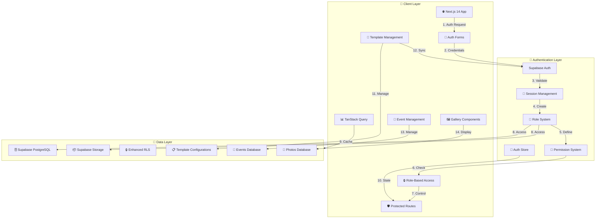
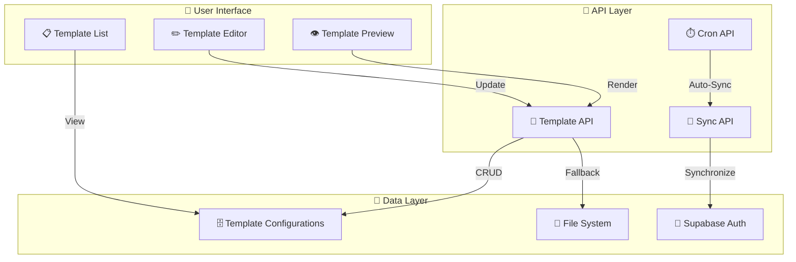
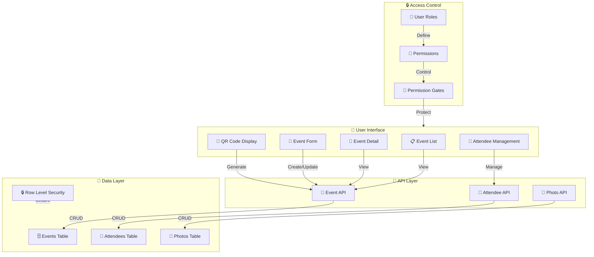

# 🏛️ **System Architecture Flowchart (Beta v0.1.18)**  

## Cloud Burst  
📅 *Mar 3, 2025, 12:40 PM*  

---


```mermaid
flowchart TD
    subgraph Client[📱 Client Layer]
        WebApp[🌐 Next.js 14 App]
        AuthForms[🔐 Auth Forms]
        Protected[🛡️ Protected Routes]
        TanStack[📊 TanStack Query]
        Templates[📧 Template Management]
        RBAC[🔒 Role-Based Access]
        Events[📅 Event Management]
        Gallery[🖼️ Gallery Components]
    end

    subgraph Auth[🔑 Authentication Layer]
        SupaAuth[Supabase Auth]
        Session[📝 Session Management]
        Roles[👥 Role System]
        Zustand[🔄 Auth Store]
        Permissions[🔐 Permission System]
    end

    subgraph Data[💾 Data Layer]
        Database[🗄️ Supabase PostgreSQL]
        Storage[📦 Supabase Storage]
        RLS[🔒 Enhanced RLS]
        TemplateDB[📋 Template Configurations]
        EventsDB[📅 Events Database]
        PhotosDB[📸 Photos Database]
    end

    WebApp -->|1. Auth Request| AuthForms
    AuthForms -->|2. Credentials| SupaAuth
    SupaAuth -->|3. Validate| Session
    Session -->|4. Create| Roles
    Roles -->|5. Define| Permissions
    Permissions -->|6. Check| RBAC
    RBAC -->|7. Control| Protected
    Roles -->|8. Access| Database
    Roles -->|8. Access| Storage
    TanStack -->|9. Cache| Data
    Zustand -->|10. State| Protected
    Templates -->|11. Manage| TemplateDB
    Templates -->|12. Sync| SupaAuth
    Events -->|13. Manage| EventsDB
    Gallery -->|14. Display| PhotosDB
```

## 🛠️ **Beta Components (v0.1.18)**  

### 📱 **Client Layer**
- Next.js 14 App Router
- TypeScript + React
- Shadcn/ui Components
- TanStack Query Integration
- Protected Route System
- Template Management UI
- Role-Based Access Control
- Event Management System
- Gallery Components

### 🔑 **Authentication Layer**
- Supabase Auth
- Enhanced Session Management
- Role-based Access Control
- Zustand Auth Store
- Template Synchronization
- Permission System
- Conditional UI Rendering

### 💾 **Data Layer**
- PostgreSQL Database
- Storage Integration
- Enhanced RLS Policies
- Template Configurations Table
- Events Database
- Photos Database
- Role Capabilities Table

---

## 📐 **Beta System Overview (v0.1.18)**  

```mermaid
flowchart TD
    Client[📱 Client Device] -->|🔗 HTTPS Request| WebApp[🌐 Web App (Next.js)]
    WebApp -->|🔌 API Calls| Supabase[🗄️ Supabase]
    WebApp -->|📧 Template Management| Templates[📋 Template System]
    WebApp -->|📅 Event Management| Events[📅 Event System]
    WebApp -->|🖼️ Gallery Management| Gallery[🖼️ Gallery System]
    WebApp -->|🔒 Access Control| RBAC[🔒 RBAC System]
    Templates -->|🔄 Sync| Supabase
    Events -->|🔄 CRUD| Supabase
    Gallery -->|🔄 CRUD| Supabase
    RBAC -->|🔐 Verify| Supabase
    Supabase --> Auth[🔑 Auth]
    Supabase --> Database[💾 Database]
    Supabase --> Storage[📦 Storage]
```

## 🔒 **Security (v0.1.18)**  
✔️ **Complete Auth** – Email/password & social login  
✔️ **Enhanced RLS** – Role-based data protection  
✔️ **Route Guards** – Protected routes with role verification  
✔️ **Template Security** – RLS policies for template access  
✔️ **API Protection** – Secured API routes  
✔️ **RBAC System** – Comprehensive role-based access control  
✔️ **Permission Gates** – Conditional UI rendering based on permissions  
✔️ **Event Security** – Owner-based access control for events  

## 🎯 **Next Steps**  
1. Complete gallery components and lightbox
2. Enhance event management system
3. Implement profile management
4. Add analytics for templates
5. Enhance QR code system
6. Implement invited user role

## 📧 **Template System Architecture**


```mermaid
flowchart TD
    subgraph UI[📱 User Interface]
        TemplateList[📋 Template List]
        Editor[✏️ Template Editor]
        Preview[👁️ Template Preview]
    end

    subgraph API[🔌 API Layer]
        TemplateAPI[📡 Template API]
        SyncAPI[🔄 Sync API]
        CronAPI[⏱️ Cron API]
    end

    subgraph Data[💾 Data Layer]
        TemplateDB[🗄️ Template Configurations]
        SupaAuth[🔑 Supabase Auth]
        FileSystem[📁 File System]
    end

    TemplateList -->|View| TemplateDB
    Editor -->|Update| TemplateAPI
    Preview -->|Render| TemplateAPI
    TemplateAPI -->|CRUD| TemplateDB
    SyncAPI -->|Synchronize| SupaAuth
    CronAPI -->|Auto-Sync| SyncAPI
    TemplateAPI -->|Fallback| FileSystem
```

## 📅 **Event Management Architecture**


```mermaid
flowchart TD
    subgraph UI[📱 User Interface]
        EventList[📋 Event List]
        EventDetail[📄 Event Detail]
        EventForm[📝 Event Form]
        AttendeeManagement[👥 Attendee Management]
        QRCode[📱 QR Code Display]
    end

    subgraph API[🔌 API Layer]
        EventAPI[📡 Event API]
        AttendeeAPI[👥 Attendee API]
        PhotoAPI[📸 Photo API]
    end

    subgraph Data[💾 Data Layer]
        EventsDB[🗄️ Events Table]
        AttendeesDB[👥 Attendees Table]
        PhotosDB[📸 Photos Table]
        RLS[🔒 Row Level Security]
    end

    subgraph RBAC[🔒 Access Control]
        Roles[👥 User Roles]
        Permissions[🔐 Permissions]
        Gates[🚪 Permission Gates]
    end

    EventList -->|View| EventAPI
    EventDetail -->|View| EventAPI
    EventForm -->|Create/Update| EventAPI
    AttendeeManagement -->|Manage| AttendeeAPI
    QRCode -->|Generate| EventAPI
    
    EventAPI -->|CRUD| EventsDB
    AttendeeAPI -->|CRUD| AttendeesDB
    PhotoAPI -->|CRUD| PhotosDB
    
    Roles -->|Define| Permissions
    Permissions -->|Control| Gates
    Gates -->|Protect| UI
    RLS -->|Secure| Data
```

## 4. CHANGELOG Update

```markdown
# Changelog
All notable changes to Cloud Burst will be documented in this file.

The format is based on [Keep a Changelog](https://keepachangelog.com/en/1.1.0/),
and this project adheres to [Semantic Versioning](https://semver.org/spec/v2.0.0.html).

## Version Strategy
- 0.x.y: Development Phase
  - 0.1.x: Foundation Setup
  - 0.2.x: Authentication System
  - 0.3.x: User Dashboard & Profiles
  - 0.4.x: Core Photo Features
  - 0.5.x: Foundation Complete
  - 0.6.x-0.8.x: Feature Implementation
  - 0.9.x: Pre-release & Testing
- 1.0.0: Production Launch

## [0.1.18] - 2024-03-03
### Added
- Comprehensive role-based access control (
