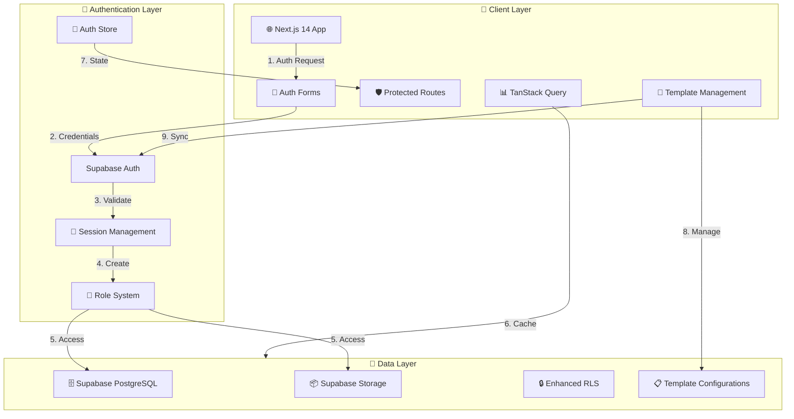
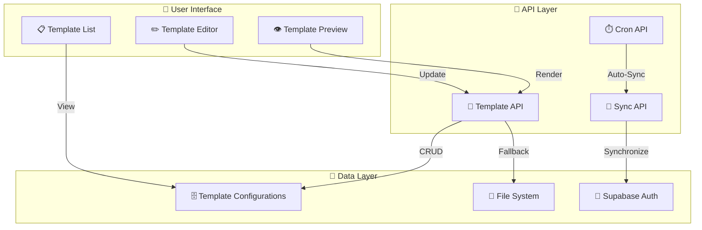

# 🏛️ **System Architecture Flowchart (Beta)**  

## Cloud Burst  
📅 *Mar 1, 2025*  

---

```mermaid
flowchart TD
    subgraph Client[📱 Client Layer]
        WebApp[🌐 Next.js 14 App]
        AuthForms[🔐 Auth Forms]
        Protected[🛡️ Protected Routes]
        TanStack[📊 TanStack Query]
        Templates[📧 Template Management]
    end

    subgraph Auth[🔑 Authentication Layer]
        SupaAuth[Supabase Auth]
        Session[📝 Session Management]
        Roles[👥 Role System]
        Zustand[🔄 Auth Store]
    end

    subgraph Data[💾 Data Layer]
        Database[🗄️ Supabase PostgreSQL]
        Storage[📦 Supabase Storage]
        RLS[🔒 Enhanced RLS]
        TemplateDB[📋 Template Configurations]
    end

    WebApp -->|1. Auth Request| AuthForms
    AuthForms -->|2. Credentials| SupaAuth
    SupaAuth -->|3. Validate| Session
    Session -->|4. Create| Roles
    Roles -->|5. Access| Database
    Roles -->|5. Access| Storage
    TanStack -->|6. Cache| Data
    Zustand -->|7. State| Protected
    Templates -->|8. Manage| TemplateDB
    Templates -->|9. Sync| SupaAuth
```

## 🛠️ **Beta Components**  

### 📱 **Client Layer**
- Next.js 14 App Router
- TypeScript + React
- Shadcn/ui Components
- TanStack Query Integration
- Protected Route System
- Template Management UI

### 🔑 **Authentication Layer**
- Supabase Auth
- Enhanced Session Management
- Role-based Access Control
- Zustand Auth Store
- Template Synchronization

### 💾 **Data Layer**
- PostgreSQL Database
- Storage Integration
- Enhanced RLS Policies
- Template Configurations Table

---

## 📐 **Beta System Overview**  

```mermaid
flowchart TD
    Client[📱 Client Device] -->|🔗 HTTPS Request| WebApp[🌐 Web App (Next.js)]
    WebApp -->|🔌 API Calls| Supabase[🗄️ Supabase]
    WebApp -->|📧 Template Management| Templates[📋 Template System]
    Templates -->|🔄 Sync| Supabase
    Supabase --> Auth[🔑 Auth]
    Supabase --> Database[💾 Database]
    Supabase --> Storage[📦 Storage]
```

## 🔒 **Security (v0.1.17)**  
✔️ **Complete Auth** – Email/password & social login  
✔️ **Enhanced RLS** – Role-based data protection  
✔️ **Route Guards** – Protected routes with role verification  
✔️ **Template Security** – RLS policies for template access  
✔️ **API Protection** – Secured API routes  

## 🎯 **Next Steps**  
1. Enhance gallery components
2. Complete event management system
3. Implement profile management
4. Add analytics for templates
5. Design QR code system

## 📧 **Template System Architecture**

```mermaid
flowchart TD
    subgraph UI[📱 User Interface]
        TemplateList[📋 Template List]
        Editor[✏️ Template Editor]
        Preview[👁️ Template Preview]
    end

    subgraph API[🔌 API Layer]
        TemplateAPI[📡 Template API]
        SyncAPI[🔄 Sync API]
        CronAPI[⏱️ Cron API]
    end

    subgraph Data[💾 Data Layer]
        TemplateDB[🗄️ Template Configurations]
        SupaAuth[🔑 Supabase Auth]
        FileSystem[📁 File System]
    end

    TemplateList -->|View| TemplateDB
    Editor -->|Update| TemplateAPI
    Preview -->|Render| TemplateAPI
    TemplateAPI -->|CRUD| TemplateDB
    SyncAPI -->|Synchronize| SupaAuth
    CronAPI -->|Auto-Sync| SyncAPI
    TemplateAPI -->|Fallback| FileSystem
```
