# User Journeys

> **Version:** 0.8.5  
> **Last Updated:** April 20, 2025  
> **Status:** Active

## Overview

This document outlines the primary user journeys within Cloud Burst for each user type. These journeys represent the core paths users take to accomplish their goals and provide a foundation for user experience design and feature development.

## User Types

Cloud Burst supports the following user types:

1. **Event Organizer**: Creates and manages events, invites participants, organizes photos
2. **Event Staff**: Assists organizers with event management, uploads, and moderation
3. **Guest**: Invited participants who view galleries and contribute media
4. **Administrator**: Platform administrators who manage users, monitor system, and oversee content

## Event Organizer Journey

### 1. Onboarding Journey

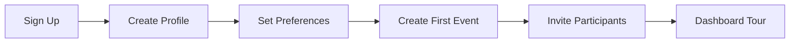

**Touchpoints and Interactions**:

1. **Sign Up**
   - Marketing site sign-up form
   - Social login options
   - Email verification

2. **Create Profile**
   - Name, organization, and contact details
   - Profile photo upload
   - Timezone selection

3. **Set Preferences**
   - Notification preferences
   - Privacy settings
   - Branding preferences

4. **Create First Event**
   - Guided event creation
   - Template selection
   - Basic information entry

5. **Invite Participants**
   - Import contacts
   - Send invitations
   - Track invitation status

6. **Dashboard Tour**
   - Guided tour of key features
   - Quick action suggestions
   - Setup checklist

### 2. Event Creation and Management Journey

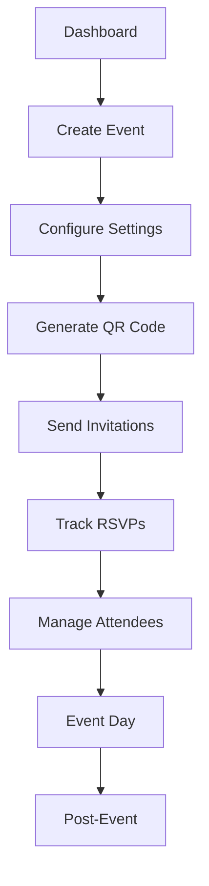

**Touchpoints and Interactions**:

1. **Dashboard**
   - Overview of events
   - Quick action buttons
   - Notification center

2. **Create Event**
   - Event details form
   - Date and time selection
   - Location input
   - Event type selection

3. **Configure Settings**
   - Privacy settings
   - Upload permissions
   - Moderation settings
   - Display preferences

4. **Generate QR Code**
   - QR code for check-ins
   - QR code for gallery access
   - Printing options

5. **Send Invitations**
   - Template selection
   - Recipient management
   - Personalization options
   - Sending confirmation

6. **Track RSVPs**
   - RSVP dashboard
   - Response statistics
   - Reminder sending
   - Guest list management

7. **Manage Attendees**
   - Check-in system
   - Attendee communication
   - Group management
   - Special needs tracking

8. **Event Day**
   - Live dashboard
   - Real-time uploads
   - Status monitoring
   - Quick actions

9. **Post-Event**
   - Gallery curation
   - Engagement statistics
   - Thank you messages
   - Feedback collection

### 3. Media Management Journey

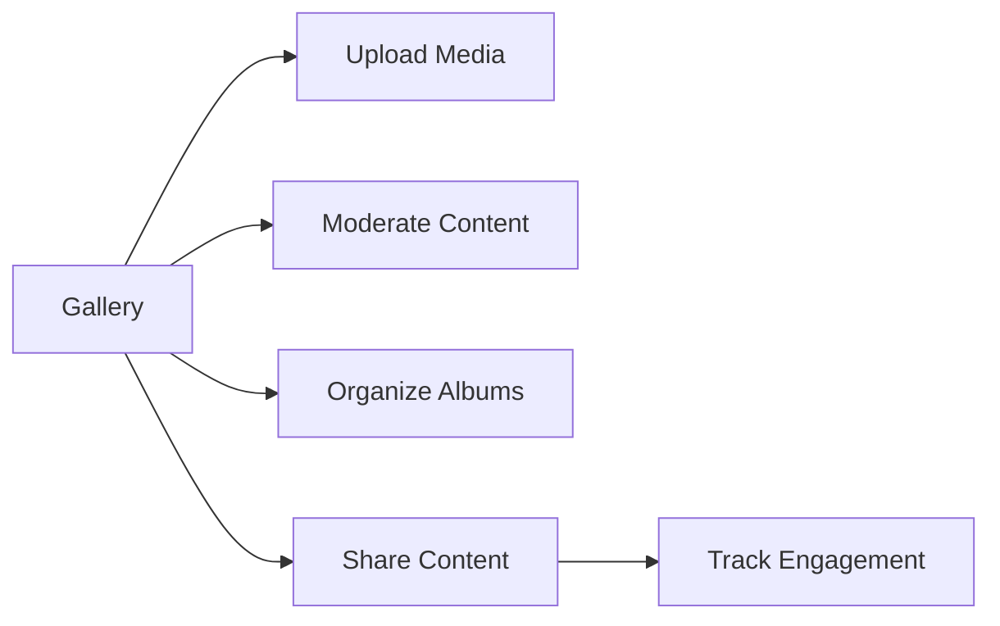

**Touchpoints and Interactions**:

1. **Gallery**
   - Event galleries listing
   - Media grid view
   - Filtering options
   - Sorting controls

2. **Upload Media**
   - Drag and drop interface
   - Batch uploading
   - Progress tracking
   - Metadata editing

3. **Moderate Content**
   - Approval queue
   - Rejection with reasons
   - Batch actions
   - Filter options

4. **Organize Albums**
   - Album creation
   - Media organization
   - Cover selection
   - Order customization

5. **Share Content**
   - Link generation
   - Permission settings
   - Expiration options
   - Social sharing

6. **Track Engagement**
   - View statistics
   - Download tracking
   - Comment moderation
   - Interaction analytics

## Guest Journey

### 1. RSVP and Registration Journey

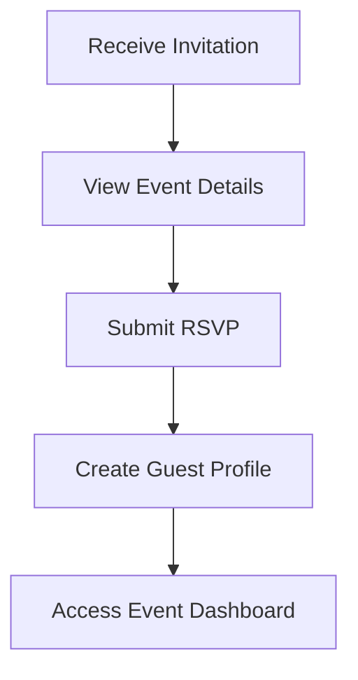

**Touchpoints and Interactions**:

1. **Receive Invitation**
   - Email invitation
   - SMS notification
   - Digital invitation view
   - QR code access

2. **View Event Details**
   - Event information display
   - Location and time details
   - Host information
   - Preview gallery

3. **Submit RSVP**
   - Response options
   - Plus-one management
   - Special requests input
   - Dietary preferences

4. **Create Guest Profile**
   - Basic information entry
   - Profile photo upload
   - Communication preferences
   - Password setup (optional)

5. **Access Event Dashboard**
   - Event countdown
   - Gallery preview
   - Upload access
   - Host communications

### 2. Media Contribution Journey

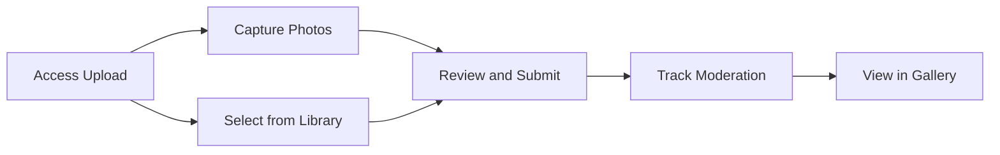

**Touchpoints and Interactions**:

1. **Access Upload**
   - Direct camera access
   - File picker interface
   - Upload instructions
   - Permission confirmation

2. **Capture Photos**
   - In-app camera
   - Flash controls
   - Multiple shot mode
   - Live filters

3. **Select from Library**
   - Gallery picker
   - Multi-select interface
   - Preview thumbnails
   - Selection counter

4. **Review and Submit**
   - Preview selected media
   - Add captions
   - Tag people
   - Submit confirmation

5. **Track Moderation**
   - Status indicators
   - Notification of approval
   - Rejection feedback
   - Resubmission option

6. **View in Gallery**
   - See contributions in context
   - Like and comment
   - Share own media
   - Download options

### 3. Gallery Browsing Journey

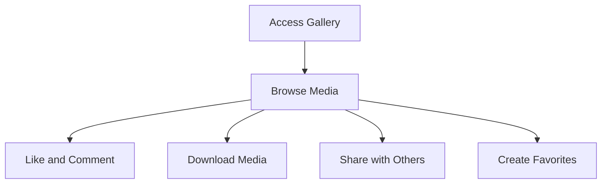

**Touchpoints and Interactions**:

1. **Access Gallery**
   - Token-based access
   - Magic link login
   - QR code scanning
   - Password protection

2. **Browse Media**
   - Grid view
   - Slideshow mode
   - Filtering options
   - Search functionality

3. **Like and Comment**
   - Reaction system
   - Comment entry
   - Notification of interactions
   - Tagging in comments

4. **Download Media**
   - Single download
   - Batch download
   - Resolution options
   - Download limit notification

5. **Share with Others**
   - Direct link sharing
   - Social media integration
   - Email sharing
   - Permission-aware links

6. **Create Favorites**
   - Save to favorites
   - Create collections
   - Organization tools
   - Favorites management

## Administrator Journey

### 1. User Management Journey

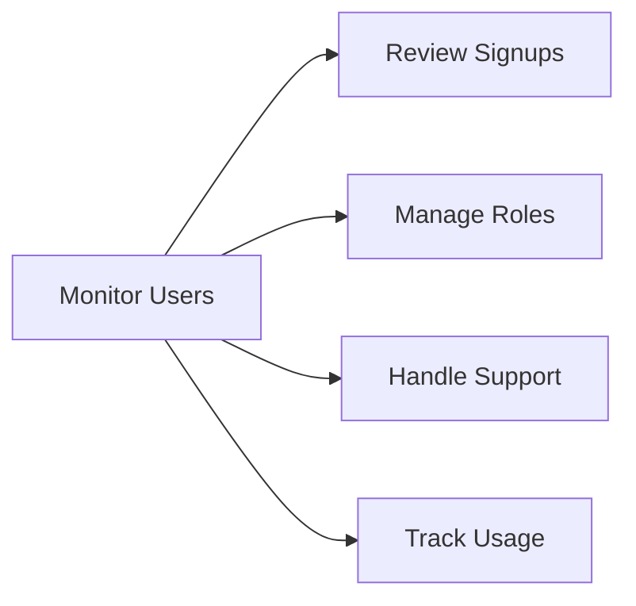

**Touchpoints and Interactions**:

1. **Monitor Users**
   - User dashboard
   - Activity feed
   - Status indicators
   - Search and filtering

2. **Review Signups**
   - New user approval
   - Verification status
   - Account activation
   - Welcome messaging

3. **Manage Roles**
   - Role assignment
   - Permission configuration
   - Access control
   - Team management

4. **Handle Support**
   - Support ticket review
   - Direct user communication
   - Issue resolution tracking
   - Account adjustment

5. **Track Usage**
   - Usage metrics
   - Storage allocation
   - Bandwidth monitoring
   - Quota management

### 2. System Oversight Journey

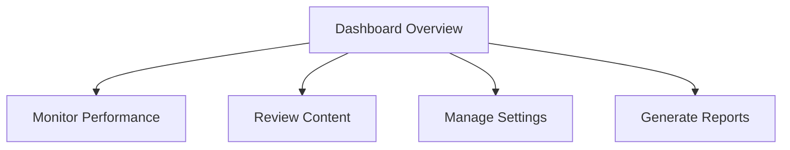

**Touchpoints and Interactions**:

1. **Dashboard Overview**
   - System health indicators
   - Key metrics display
   - Alert notifications
   - Quick action tools

2. **Monitor Performance**
   - Server status
   - Response time metrics
   - Error rate tracking
   - Resource utilization

3. **Review Content**
   - Flagged content queue
   - Moderation actions
   - Policy enforcement
   - Content reports handling

4. **Manage Settings**
   - Global configuration
   - Feature toggles
   - Security settings
   - Integration management

5. **Generate Reports**
   - Usage reports
   - User statistics
   - Content metrics
   - Compliance documentation

## Event Staff Journey

### 1. Event Assistance Journey

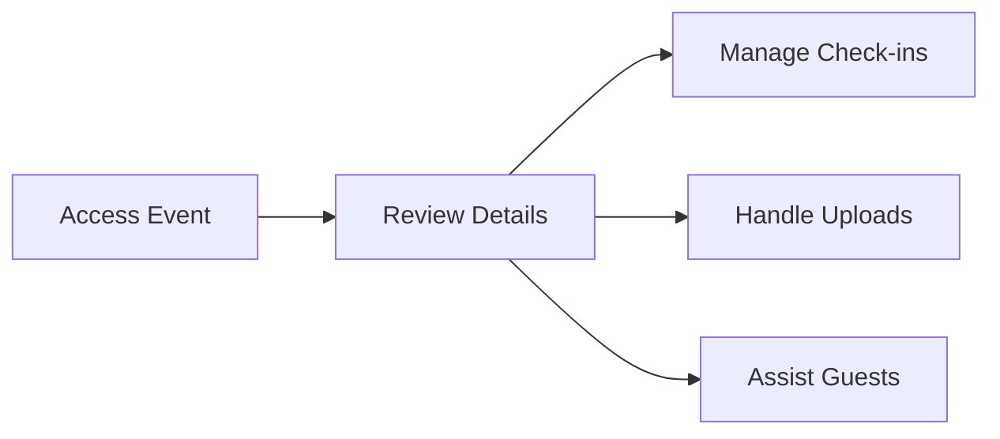

**Touchpoints and Interactions**:

1. **Access Event**
   - Staff login
   - Event selection
   - Role confirmation
   - Briefing materials

2. **Review Details**
   - Event information
   - Schedule overview
   - Team assignments
   - Contact list

3. **Manage Check-ins**
   - Check-in interface
   - QR code scanning
   - Manual entry
   - Status updates

4. **Handle Uploads**
   - Batch upload interface
   - Media organization
   - Metadata entry
   - Processing monitoring

5. **Assist Guests**
   - Guest list access
   - Communication tools
   - Issue tracking
   - Support requests

### 2. Content Management Journey

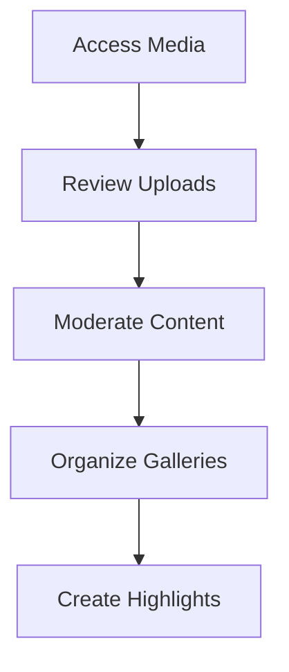

**Touchpoints and Interactions**:

1. **Access Media**
   - Gallery dashboard
   - Upload queue
   - Filter controls
   - Batch selection

2. **Review Uploads**
   - Quality assessment
   - Appropriate content check
   - Tag verification
   - Metadata review

3. **Moderate Content**
   - Approval actions
   - Rejection with feedback
   - Content editing
   - Privacy assessment

4. **Organize Galleries**
   - Album creation
   - Media categorization
   - Featured content selection
   - Order customization

5. **Create Highlights**
   - Highlight reel creation
   - Cover photos selection
   - Featured media designation
   - Slideshow configuration

## Cross-Cutting Journeys

### 1. Account Management Journey

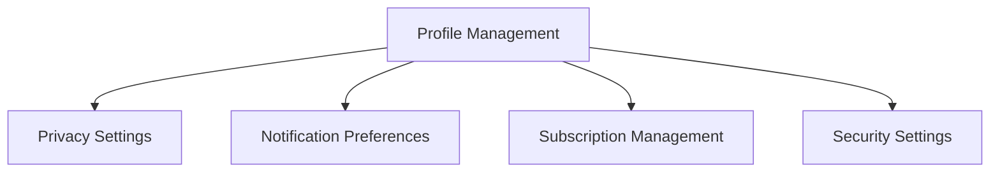

**Common to all user types with appropriate permissions**

### 2. Support and Help Journey

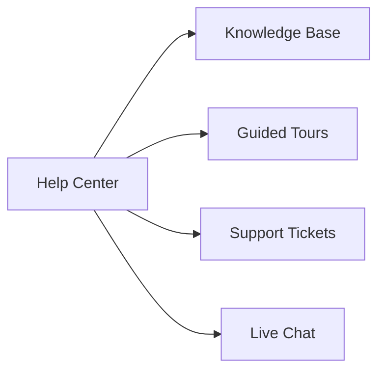

**Common to all user types**

## Journey Metrics and KPIs

Each journey has associated metrics to measure success:

| Journey | Key Metrics | Target |
|---------|-------------|--------|
| Organizer Onboarding | Completion Rate | >85% |
| Organizer Onboarding | Time to First Event | <48 hours |
| Event Creation | Creation Completion | >90% |
| Event Creation | Invitation Send Rate | >75% |
| Guest RSVP | RSVP Response Rate | >65% |
| Guest Upload | Media Contribution Rate | >30% of guests |
| Guest Upload | Photos Per Contributing Guest | >5 |
| Gallery Browsing | Browse Duration | >3 minutes |
| Gallery Browsing | Return Visits | >2 per guest |
| Admin User Management | Response Time to Issues | <24 hours |

## Journey Improvement Plan

Based on user feedback and analytics, the following improvements are planned for Session 43:

1. **Simplify Organizer Navigation**
   - Reduce steps in event creation flow
   - Streamline gallery management interface
   - Improve discoverability of key features

2. **Enhance Guest Experience**
   - Create clear visual guidance for first-time guests
   - Improve upload success rate with better feedback
   - Add offline capabilities for intermittent connections

3. **Optimize Mobile Flows**
   - Redesign critical mobile interactions for one-handed use
   - Improve camera access and capture experience
   - Enhance touch targets for improved accessibility

## References

- [User Personas](../ux/user-personas.md)
- [Navigation Structure](./navigation-structure.md)
- [Progressive Web App Implementation](../development/progressive-web-app.md) 