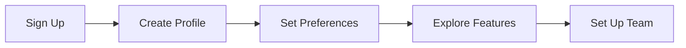
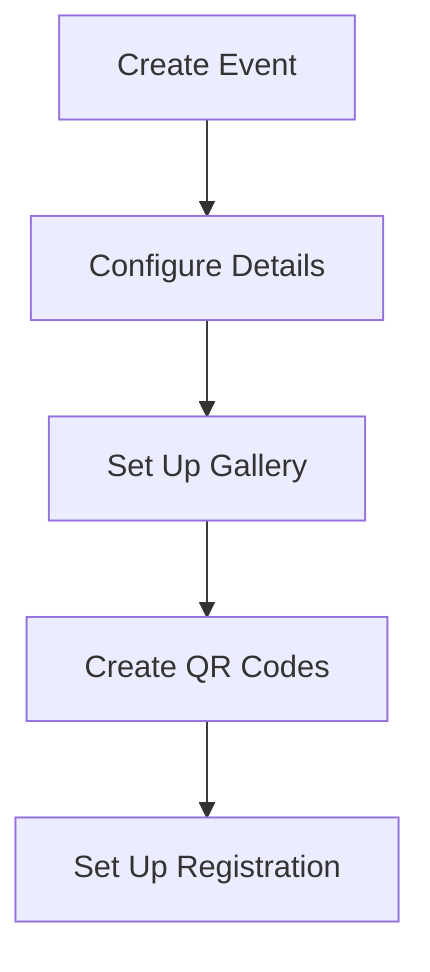
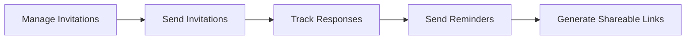
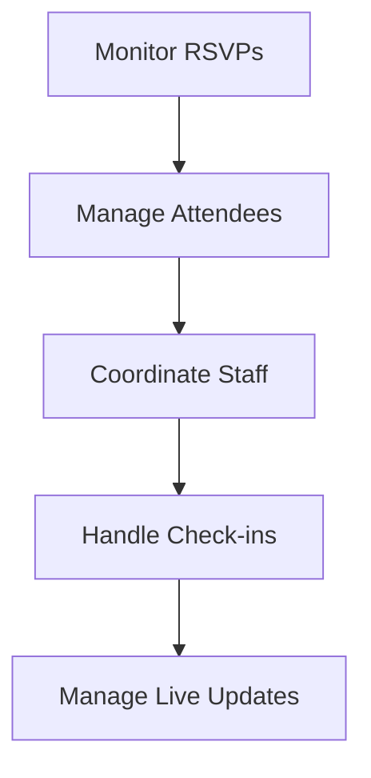
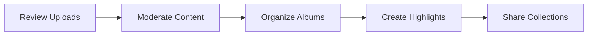
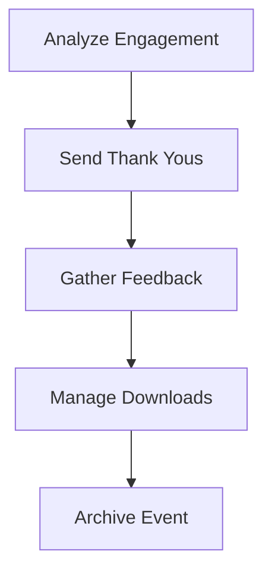

# Event Organizer Journey

> **Version:** 0.8.0  
> **Last Updated:** April 20, 2025  
> **Status:** Active

## Overview

This document provides a detailed exploration of the event organizer user journey in Cloud Burst. Event organizers are the primary users who create and manage events, invite participants, organize photos, and oversee the entire event lifecycle. The organizer experience is designed to be powerful yet intuitive, with a focus on efficiency and control.

## Organizer Persona

### Primary Organizer Persona: Professional Event Manager

**Name:** Jordan Taylor  
**Age:** 30-50  
**Technical Proficiency:** Moderate to High  
**Devices:** Desktop/laptop (primary), tablet and smartphone (secondary)  
**Goals:**
- Efficiently manage multiple events
- Collect and organize high-quality event media
- Provide seamless experience for event attendees
- Control content visibility and access
- Generate engagement and interaction with media

**Pain Points:**
- Time pressure managing multiple events
- Need for quick media sorting and organization
- Security and privacy concerns
- Complex collaboration with staff and photographers
- Technical friction when working across devices

## Journey Map

### 1. Onboarding & Setup Phase



#### Key Touchpoints

1. **Sign Up**
   - Professional account creation
   - Subscription plan selection
   - Domain verification (optional)
   - Industry selection

2. **Create Profile**
   - Business information entry
   - Logo upload
   - Contact details
   - Business description

3. **Set Preferences**
   - Notification settings
   - Default media settings
   - Privacy preferences
   - Branding options

4. **Explore Features**
   - Guided tutorial
   - Feature highlights tour
   - Sample gallery exploration
   - Template gallery browsing

5. **Set Up Team**
   - Team member invitations
   - Role assignments
   - Permission configuration
   - Collaboration settings

#### Success Metrics
- **Profile Completion Rate:** >90%
- **Feature Exploration Coverage:** >70% of core features
- **Team Setup Completion:** >50% add at least one team member
- **Time to First Event Creation:** <48 hours

### 2. Event Creation & Setup Phase



#### Key Touchpoints

1. **Create Event**
   - Event template selection
   - Basic information entry
   - Date and time configuration
   - Location selection with mapping

2. **Configure Details**
   - Advanced settings configuration
   - Customization options
   - Privacy and sharing settings
   - Custom fields setup

3. **Set Up Gallery**
   - Gallery layout selection
   - Upload initial media (optional)
   - Album structure creation
   - Featured content selection

4. **Create QR Codes**
   - Gallery access QR generation
   - Check-in QR code setup
   - Upload access QR creation
   - QR code customization

5. **Set Up Registration**
   - Attendee registration form
   - Capacity and limitations
   - Ticket/RSVP options
   - Custom questions

#### Success Metrics
- **Event Creation Completion Rate:** >95%
- **Advanced Settings Configuration:** >60% of events
- **QR Code Generation:** >80% of events
- **Gallery Customization:** >70% of events

### 3. Invitation & Promotion Phase



#### Key Touchpoints

1. **Manage Invitations**
   - Contact list import
   - Guest list management
   - Group creation
   - Template selection

2. **Send Invitations**
   - Email delivery
   - SMS notifications
   - Scheduling options
   - Personalization

3. **Track Responses**
   - RSVP dashboard
   - Response analytics
   - Guest list updates
   - Status visualization

4. **Send Reminders**
   - Automated reminders
   - Custom messaging
   - Targeted segments
   - Schedule configuration

5. **Generate Shareable Links**
   - Public/private link creation
   - Access control settings
   - Expiration configuration
   - Tracking capabilities

#### Success Metrics
- **Invitation Sending Rate:** >85% of created events
- **Delivery Success Rate:** >98% of sent invitations
- **Open Rate:** >60% of delivered invitations
- **Response Rate:** >50% of opened invitations
- **Reminder Effectiveness:** >30% conversion of non-responders

### 4. Event Management Phase



#### Key Touchpoints

1. **Monitor RSVPs**
   - Real-time dashboard
   - Response analytics
   - Capacity management
   - Waitlist handling

2. **Manage Attendees**
   - Attendee communications
   - Special requests handling
   - Group management
   - Profile viewing

3. **Coordinate Staff**
   - Staff assignments
   - Task management
   - Communication tools
   - Permission management

4. **Handle Check-ins**
   - Mobile check-in tools
   - QR code scanning
   - Attendance tracking
   - Issue resolution

5. **Manage Live Updates**
   - Event timeline updates
   - Announcements
   - Schedule changes
   - Real-time notifications

#### Success Metrics
- **Dashboard Usage Frequency:** >3 sessions per event
- **Staff Coordination:** >90% of multi-staff events use coordination tools
- **Check-in Completion:** >80% of expected attendees
- **Communication Tool Usage:** >70% of events send at least one update

### 5. Media Management Phase



#### Key Touchpoints

1. **Review Uploads**
   - Batch review interface
   - Quality assessment
   - Metadata review
   - Staff uploads review

2. **Moderate Content**
   - Approval workflows
   - Rejection with feedback
   - Content filtering
   - AI-assisted moderation

3. **Organize Albums**
   - Drag-and-drop organization
   - Batch categorization
   - Smart album suggestions
   - Automatic sorting options

4. **Create Highlights**
   - Featured collection curation
   - Slideshow creation
   - Cover photo selection
   - Ordering customization

5. **Share Collections**
   - Access control configuration
   - Sharing options
   - Notification sending
   - Analytics tracking

#### Success Metrics
- **Moderation Completion Time:** <24 hours for 90% of uploads
- **Album Organization Rate:** >70% of events have organized albums
- **Highlight Creation:** >50% of events have curated highlights
- **Sharing Activity:** >80% of events have shared collections

### 6. Post-Event Management Phase



#### Key Touchpoints

1. **Analyze Engagement**
   - Engagement dashboard
   - Interaction metrics
   - Popular content identification
   - User activity tracking

2. **Send Thank Yous**
   - Thank you message templates
   - Personalization options
   - Delivery scheduling
   - Inclusion of highlights

3. **Gather Feedback**
   - Feedback form creation
   - Survey distribution
   - Response collection
   - Analytics review

4. **Manage Downloads**
   - Batch download preparation
   - Access control for downloads
   - Download metrics
   - Archive creation

5. **Archive Event**
   - Long-term storage options
   - Access preservation
   - Metadata maintenance
   - Cleanup procedures

#### Success Metrics
- **Analytics Review Rate:** >60% of organizers review metrics
- **Thank You Sending Rate:** >50% of events
- **Feedback Collection Rate:** >40% of events
- **Download Activity:** >70% of events have downloads
- **Proper Archiving:** >80% of completed events

## Dashboard Experience

The organizer dashboard is the command center for event management and includes these key sections:

### 1. Overview Dashboard

```tsx
// Dashboard component structure
<div className="p-6 w-full space-y-6">
  <div className="flex items-center justify-between">
    <h1 className="text-3xl font-bold">Dashboard</h1>
    <Button>Create Event</Button>
  </div>
  
  <div className="grid grid-cols-1 gap-6 md:grid-cols-2 lg:grid-cols-4">
    <StatCard title="Active Events" value="8" change="+2" />
    <StatCard title="Total Attendees" value="1,248" change="+156" />
    <StatCard title="Media Items" value="3,842" change="+423" />
    <StatCard title="Storage Used" value="9.4 GB" change="+1.2 GB" />
  </div>
  
  <div className="grid grid-cols-1 gap-6 lg:grid-cols-3">
    <UpcomingEvents events={upcomingEvents} />
    <RecentActivity activities={recentActivities} />
    <QuickActions actions={quickActions} />
  </div>
</div>
```

### 2. Event Management Interface

```tsx
// Event management component structure
<div className="p-6 w-full space-y-6">
  <div className="flex items-center justify-between">
    <div>
      <h1 className="text-3xl font-bold">My Events</h1>
      <p className="text-muted-foreground">Manage your events and galleries</p>
    </div>
    <div className="flex gap-3">
      <EventFilter />
      <Button>Create Event</Button>
    </div>
  </div>
  
  <Tabs defaultValue="active">
    <TabsList>
      <TabsTrigger value="active">Active</TabsTrigger>
      <TabsTrigger value="upcoming">Upcoming</TabsTrigger>
      <TabsTrigger value="past">Past</TabsTrigger>
      <TabsTrigger value="drafts">Drafts</TabsTrigger>
    </TabsList>
    <TabsContent value="active">
      <EventGrid events={activeEvents} />
    </TabsContent>
    {/* Other tab content */}
  </Tabs>
</div>
```

### 3. Gallery Management Interface

```tsx
// Gallery management component structure
<div className="p-6 w-full space-y-6">
  <div className="flex items-center justify-between">
    <div>
      <h1 className="text-3xl font-bold">Gallery</h1>
      <p className="text-muted-foreground">Manage media across your events</p>
    </div>
    <div className="flex gap-3">
      <MediaFilter />
      <Button>Upload Media</Button>
    </div>
  </div>
  
  <Tabs defaultValue="all">
    <TabsList>
      <TabsTrigger value="all">All Media</TabsTrigger>
      <TabsTrigger value="events">Event Galleries</TabsTrigger>
      <TabsTrigger value="moderate">
        Moderation Queue
        <Badge variant="danger">12</Badge>
      </TabsTrigger>
      <TabsTrigger value="albums">Albums</TabsTrigger>
    </TabsList>
    <TabsContent value="all">
      <MasonryGrid media={allMedia} />
    </TabsContent>
    {/* Other tab content */}
  </Tabs>
</div>
```

## Mobile Experience Optimization

While organizers primarily use desktop, the mobile experience is optimized for on-the-go management:

### Mobile Dashboard

```tsx
// Mobile dashboard layout
<div className="p-4 space-y-4">
  <h1 className="text-2xl font-bold">Dashboard</h1>
  
  <div className="grid grid-cols-2 gap-3">
    <StatCard title="Events" value="8" compact />
    <StatCard title="Attendees" value="1,248" compact />
  </div>
  
  <div className="rounded-lg border p-4">
    <h2 className="font-medium mb-3">Next Event</h2>
    <NextEventCard event={nextEvent} />
    <Button className="w-full mt-3">Manage Event</Button>
  </div>
  
  <div className="space-y-3">
    <h2 className="font-medium">Quick Actions</h2>
    <div className="grid grid-cols-2 gap-3">
      <ActionButton icon={Plus} label="New Event" />
      <ActionButton icon={Upload} label="Upload" />
      <ActionButton icon={Users} label="Invitations" />
      <ActionButton icon={Image} label="Gallery" />
    </div>
  </div>
</div>
```

### Mobile Event Management

The mobile experience includes:

1. **Event Creation Wizards**
   - Step-by-step mobile-friendly forms
   - Progress saving
   - Limited options for quicker completion

2. **Quick Moderation Tools**
   - Swipe interfaces for approval/rejection
   - Batch actions optimized for touch
   - Simplified filtering

3. **On-site Management**
   - Check-in kiosk mode
   - Real-time attendee tracking
   - Quick announcement sending
   - Camera access for immediate uploads

## Session 43 Improvements

Based on user feedback and usage data, the following improvements are planned for the organizer experience in Session 43:

### 1. Dashboard Reorganization

- Simplify navigation structure with more intuitive categories
- Group related functions together for better discoverability
- Create task-based navigation rather than feature-based
- Implement consistent section headers with clear visual cues
- Add contextual help tooltips for complex features

### 2. Workflow Optimization

- Reduce steps in event creation process (from 7 to 5 steps)
- Streamline invitation sending workflow
- Simplify gallery management interface
- Improve media moderation with batch actions
- Add quick access to most-used features on dashboard

### 3. Visual Improvements

- Enhance card components with better information hierarchy
- Improve status visualization across events and media
- Create consistent toolbar pattern across sections
- Standardize action button placement and styling
- Improve empty states with helpful guidance

### 4. Mobile Enhancements

- Add offline capabilities for event management
- Improve touch targets for critical actions
- Enhance photo viewing experience on mobile
- Create mobile-optimized event timeline
- Improve mobile access to analytics data

## References

- [Navigation Structure](../architecture/navigation-structure.md)
- [Dashboard Component Standards](../development/dashboard-components.md)
- [User Journeys Overview](../architecture/user-journeys.md)
- [Organizer Persona Definition](./user-personas.md) 