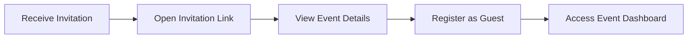
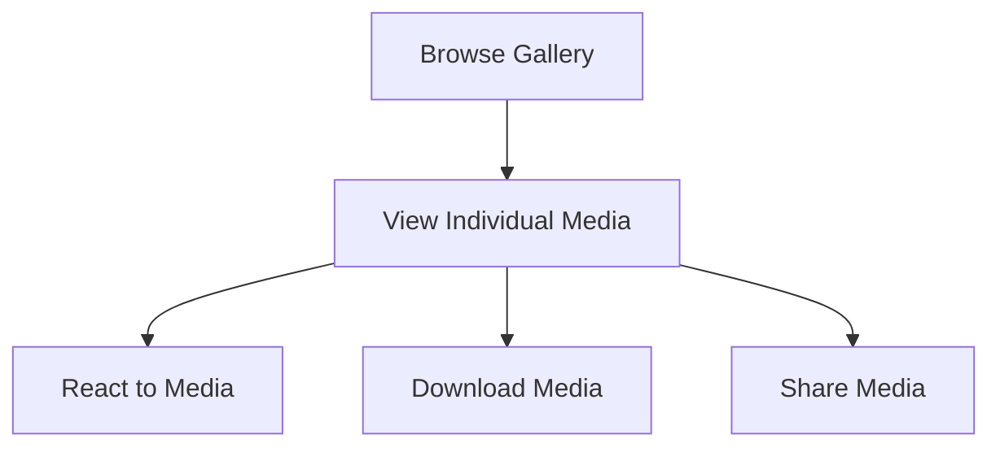
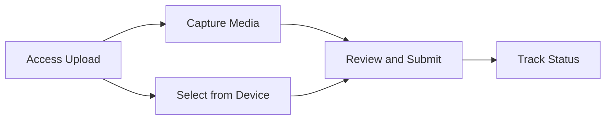
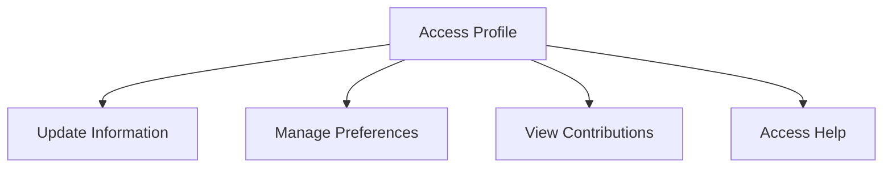
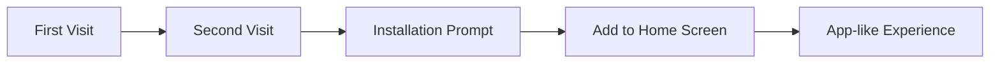

# Guest User Journey

> **Version:** 0.8.0  
> **Last Updated:** April 20, 2025  
> **Status:** Active

## Overview

This document provides a detailed exploration of the guest user journey in Cloud Burst. Guests are invited participants who view galleries and contribute media without requiring a full account registration. The guest experience is designed to be intuitive, frictionless, and accessible across devices, with particular emphasis on mobile optimization and the new PWA capabilities.

## Guest Persona

### Primary Guest Persona: Social Contributor

**Name:** Alex Johnson  
**Age:** 28-45  
**Technical Proficiency:** Moderate  
**Devices:** Primarily smartphone (iOS/Android), occasionally tablet  
**Goals:**
- View and download event photos
- Contribute their own photos easily
- Share event memories with friends and family
- Access content without complicated signups

**Pain Points:**
- Limited time to learn new interfaces
- Concerns about privacy and data sharing
- Potentially unstable network connections at events
- Limited storage space on mobile devices

## Journey Map

### 1. Discovery & Invitation Phase

#### Key Touchpoints

1. **Receive Invitation**
   - Email with personalized invitation
   - SMS with secure link
   - QR code at event venue
   - Direct link from organizer

2. **Open Invitation Link**
   - Magic link authentication (no password needed)
   - Token-based security
   - Cross-device persistence

3. **View Event Details**
   - Event name, date, location info
   - Host details and contact options
   - Preview of event gallery
   - RSVP options if available

4. **Register as Guest**
   - Minimal required information (name, email)
   - Optional profile photo
   - Privacy settings explanation
   - Terms acceptance

5. **Access Event Dashboard**
   - Personalized welcome
   - Event countdown/timeline
   - Quick access buttons for key features
   - Offline availability notice (PWA)

#### Success Metrics
- **Invitation Open Rate:** >70%
- **Registration Completion Rate:** >80% of opened invitations
- **Time to Complete Registration:** <2 minutes
- **Dashboard Bounce Rate:** <25%

### 2. Gallery Experience Phase

#### Key Touchpoints

1. **Browse Gallery**
   - Responsive masonry grid layout
   - Filter/sort options (date, uploader, featured)
   - Album organization if applicable
   - Offline browsing capability (cached content)
   - Lazy loading with placeholders

2. **View Individual Media**
   - Full-screen viewing option
   - Swipe navigation
   - Metadata display (photographer, date)
   - Pinch-to-zoom on mobile
   - Automatic orientation correction

3. **React to Media**
   - Like/heart interaction
   - Comment capability (if enabled by organizer)
   - Emoji reactions
   - Flag inappropriate content option

4. **Download Media**
   - Quality selection options
   - Device-aware size recommendations
   - Download progress indicator
   - Success confirmation
   - Storage permission handling

5. **Share Media**
   - Direct sharing to social platforms
   - Copy link option
   - QR code generation for physical sharing
   - Email sharing option
   - Share counts tracking

#### Success Metrics
- **Average Session Duration:** >4 minutes
- **Media View Rate:** >15 items per session
- **Interaction Rate:** >25% of viewed media receives interaction
- **Download Rate:** >10% of viewed media
- **Share Rate:** >5% of viewed media

### 3. Media Contribution Phase

#### Key Touchpoints

1. **Access Upload**
   - Prominent upload button
   - Clear instructions
   - Permission explanations
   - Storage status indicator

2. **Capture Media**
   - In-app camera access
   - Camera permission handling
   - Flash/focus controls
   - Shot preview
   - Multiple shot mode

3. **Select from Device**
   - Device gallery access
   - Multi-select capability
   - Thumbnail previews
   - File size indicators
   - Format compatibility check

4. **Review and Submit**
   - Preview selection
   - Basic editing options (rotate, crop)
   - Optional captions
   - People tagging (if enabled)
   - Batch submission

5. **Track Status**
   - Upload progress indicators
   - Background upload capability (PWA)
   - Moderation status tracking
   - Retry options for failed uploads
   - Notification of approval/rejection

#### Success Metrics
- **Upload Attempt Rate:** >30% of guests
- **Upload Completion Rate:** >90% of attempts
- **Media per Contributing Guest:** >5 items
- **Caption Addition Rate:** >25% of uploads
- **Successful Moderation Rate:** >85% of uploads

### 4. Guest Profile Management

#### Key Touchpoints

1. **Access Profile**
   - Easily accessible profile section
   - Current status display
   - Quick edit options
   - Cross-device synchronization

2. **Update Information**
   - Name and contact details
   - Profile photo management
   - Password creation (optional)
   - Account linking options (social)

3. **Manage Preferences**
   - Notification settings
   - Privacy controls
   - Theme preferences (light/dark)
   - Language selection

4. **View Contributions**
   - Personal gallery of contributions
   - Status indicators
   - Engagement metrics
   - Edit/delete options

5. **Access Help**
   - Contextual help system
   - FAQ access
   - Contact organizer option
   - Troubleshooting guides

#### Success Metrics
- **Profile Completion Rate:** >70%
- **Preference Customization Rate:** >40%
- **Help Resource Access:** <15% of guests (lower is better)
- **Profile Return Rate:** >25% after initial setup

## PWA-Enhanced Guest Experience

The guest journey is significantly enhanced with Progressive Web App capabilities:

### Installation Flow

### Key PWA Benefits for Guests

1. **Offline Access**
   - Gallery browsing during network interruptions
   - Cached event details and instructions
   - Offline fallback page with reconnection logic
   - Automatic sync when connection returns

2. **App-like Experience**
   - Home screen icon for quick access
   - Full-screen immersive interface
   - Faster loading with cached resources
   - Native-feeling transitions and animations

3. **Background Capabilities**
   - Upload continuation during interruptions
   - Background synchronization of content
   - Push notifications for important updates
   - Status tracking even when app is closed

4. **Device Integration**
   - Camera access for direct photo capture
   - Share integration with device capabilities
   - Contact picking for sharing
   - Storage management awareness

### PWA Success Metrics
- **Installation Rate:** >25% of returning guests
- **Offline Usage Sessions:** Track number of offline sessions
- **Background Sync Success:** >90% of queued uploads complete
- **Re-engagement Rate:** >40% return via home screen icon

## Mobile Optimization

The guest journey is primarily mobile-focused with these optimizations:

### Mobile-First Interfaces

1. **Touch-Optimized Controls**
   - Large, well-spaced touch targets (min 44x44px)
   - Swipe gestures for common actions
   - Bottom navigation for one-handed use
   - Pull-to-refresh for content updates

2. **Responsive Media Handling**
   - Adaptive image sizing based on device
   - Progressive loading for faster perception
   - Video optimization for mobile bandwidth
   - Device-appropriate quality selection

3. **Keyboard & Input Optimization**
   - Smart form field types
   - Minimal required typing
   - Appropriate keyboard types per field
   - Auto-advance through forms

4. **Performance Considerations**
   - Reduced animation on low-end devices
   - Bandwidth-aware content loading
   - Battery usage optimization
   - Memory efficient gallery browsing

### Mobile Success Metrics
- **Mobile Session Duration:** Comparable to desktop (±10%)
- **Mobile Task Completion Rate:** >90% of desktop rate
- **Mobile Load Time:** <3 seconds for initial page
- **Input Error Rate:** <5% of form submissions

## Critical Path Use Cases

### Use Case 1: First-time Gallery Access

1. Guest receives invitation email
2. Clicks personalized link
3. Views event information
4. Enters name and email
5. Gets immediate access to gallery
6. Browses photos without interruption
7. Receives prompt to install as PWA
8. Can return directly via home screen icon

### Use Case 2: Media Contribution

1. Guest accesses upload section
2. Chooses camera or gallery source
3. Captures or selects multiple photos
4. Reviews selections with preview
5. Adds optional information
6. Submits batch for approval
7. Receives confirmation and status
8. Gets notified when approved
9. Can view own contributions in gallery

### Use Case 3: Offline Scenario

1. Guest opens PWA while offline
2. Sees offline indicator with cached content
3. Can browse previously loaded gallery
4. Attempts to upload photos
5. System queues uploads for later
6. When connection returns, uploads process automatically
7. Guest receives notification of successful uploads

## Journey Improvement Plan (Session 43)

Based on user feedback and analytics, the following improvements are planned:

### 1. Enhance First-time Experience
- Add clearer visual cues for first-time guest navigation
- Implement progressive onboarding tooltips
- Create simplified first upload experience
- Add feedback celebrations for first contributions

### 2. Improve Offline Capabilities
- Enhance offline fallback page with clearer instructions
- Implement better visual indicators for offline mode
- Add upload recovery for interrupted contributions
- Create offline browsing mode with deeper caching

### 3. Optimize Mobile Photo Capture
- Improve camera interface with stabilization guidance
- Add optional basic filters for guest photos
- Implement smart cropping suggestions
- Create multi-shot mode with burst capabilities

### 4. Enhance Installation Experience
- Create custom PWA installation prompting
- Add home screen usage guidance
- Implement first-launch tutorial after installation
- Create shareable PWA installation instructions

## References

- [User Journeys Overview](../architecture/user-journeys.md)
- [Guest Persona Definition](./user-personas.md)
- [Progressive Web App Implementation](../development/progressive-web-app.md)
- [Mobile Design Guidelines](../development/mobile-optimization.md) 