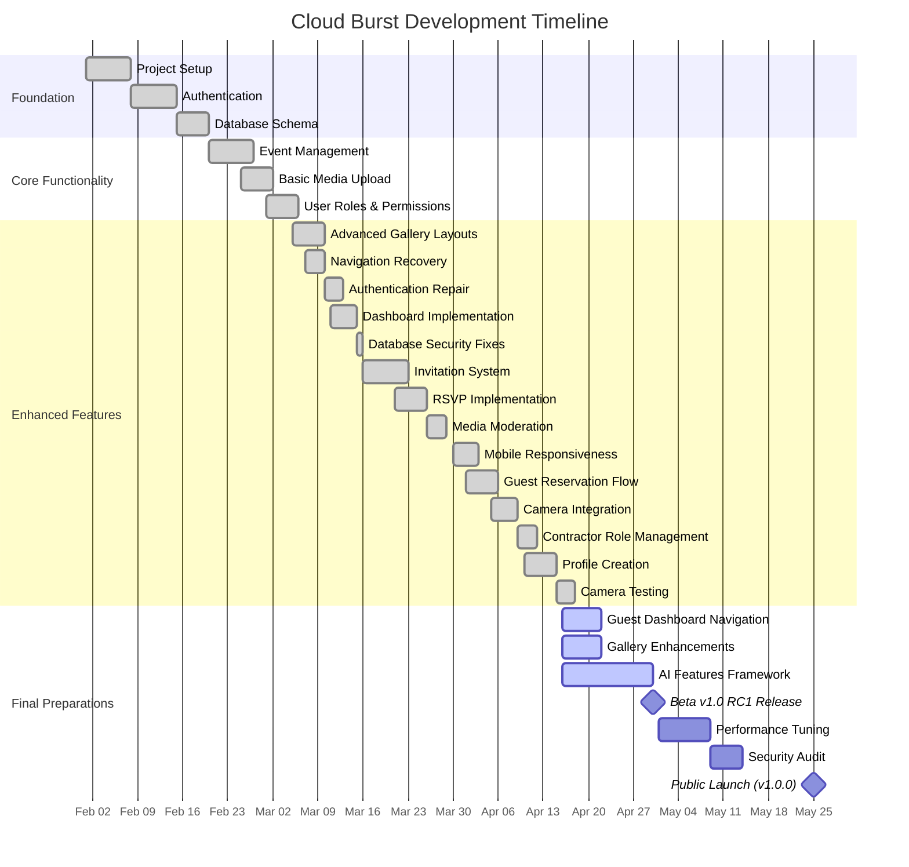

```mermaid
gantt
    title Cloud Burst Development Timeline
    dateFormat  YYYY-MM-DD
    axisFormat %b %d
    
    section Foundation
    Project Setup           :done, f1, 2025-02-01, 7d
    Authentication          :done, f2, 2025-02-08, 7d
    Database Schema         :done, f3, 2025-02-15, 5d
    
    section Core Functionality
    Event Management        :done, c1, 2025-02-20, 7d
    Basic Media Upload      :done, c2, 2025-02-25, 5d
    User Roles & Permissions:done, c3, 2025-03-01, 5d
    
    section Enhanced Features
    Advanced Gallery Layouts:done, e1, 2025-03-05, 5d
    Navigation Recovery     :done, e2, 2025-03-07, 3d
    Authentication Repair   :done, e3, 2025-03-10, 3d
    Dashboard Implementation:done, e4, 2025-03-11, 4d
    Database Security Fixes :done, e5, 2025-03-15, 1d
    Invitation System       :done, e6, 2025-03-16, 7d
    RSVP Implementation     :done, e7, 2025-03-21, 5d
    Media Moderation        :done, e8, 2025-03-26, 3d
    Mobile Responsiveness   :done, e9, 2025-03-30, 4d
    Guest Reservation Flow  :done, e10, 2025-04-01, 5d
    Camera Integration      :done, e11, 2025-04-05, 4d
    Contractor Role Management :done, e12, 2025-04-09, 3d
    Profile Creation        :done, e13, 2025-04-10, 5d
    Camera Testing          :done, e14, 2025-04-15, 3d
    
    section Final Preparations
    Guest Dashboard Navigation :active, g1, 2025-04-16, 6d
    Gallery Enhancements    :active, g2, 2025-04-16, 6d
    AI Features Framework   :active, g3, 2025-04-16, 14d
    Beta v1.0 RC1 Release   :milestone, b1, 2025-04-30, 0d
    Performance Tuning      :o1, 2025-05-01, 8d
    Security Audit          :o2, 2025-05-09, 5d
    Public Launch (v1.0.0)  :milestone, l3, 2025-05-25, 0d
``` 