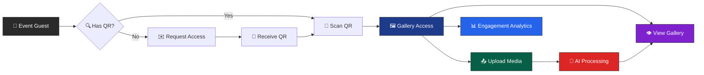

```mermaid
graph LR
    A["👤 Event Guest"] --> B{"🔍 Has QR?"}
    B -->|"Yes"| C["📱 Scan QR"]
    B -->|"No"| D["✉️ Request Access"]
    C --> E["🖼️ Gallery Access"]
    D --> F["📲 Receive QR"]
    F --> C
    E --> G["📤 Upload Media"]
    E --> H["👁️ View Gallery"]
    G --> I["🤖 AI Processing"]
    I --> H
    E --> J["📊 Engagement Analytics"]
    
    style A fill:#2A2A2A,stroke:#333,color:#fff
    style E fill:#1E3A8A,stroke:#333,color:#fff
    style G fill:#065F46,stroke:#333,color:#fff
    style H fill:#7E22CE,stroke:#333,color:#fff
    style I fill:#DC2626,stroke:#333,color:#fff
    style J fill:#2563EB,stroke:#333,color:#fff
``` 