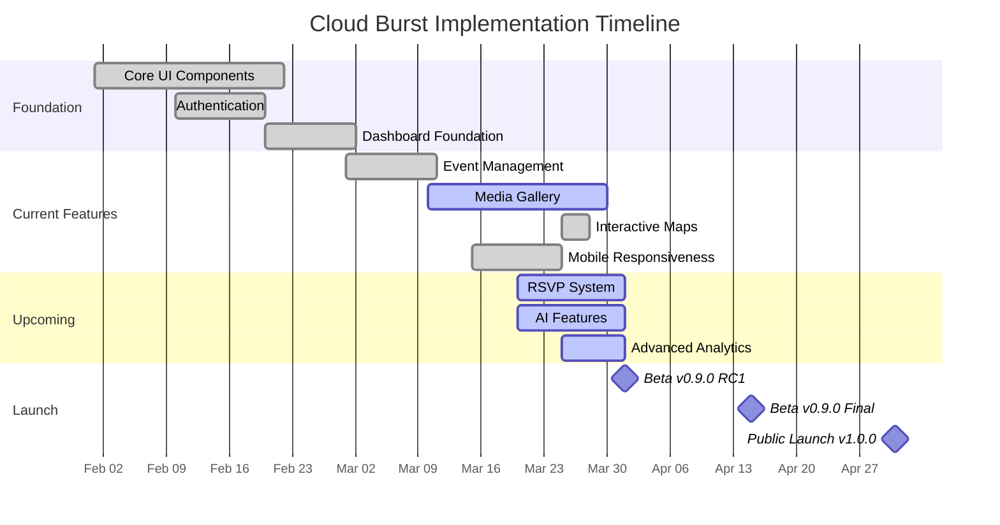
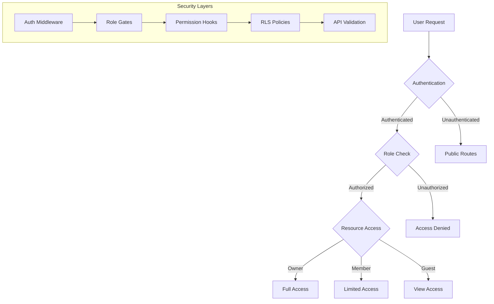
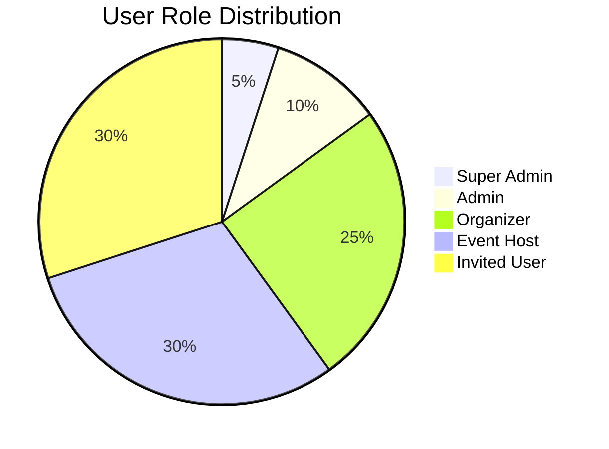
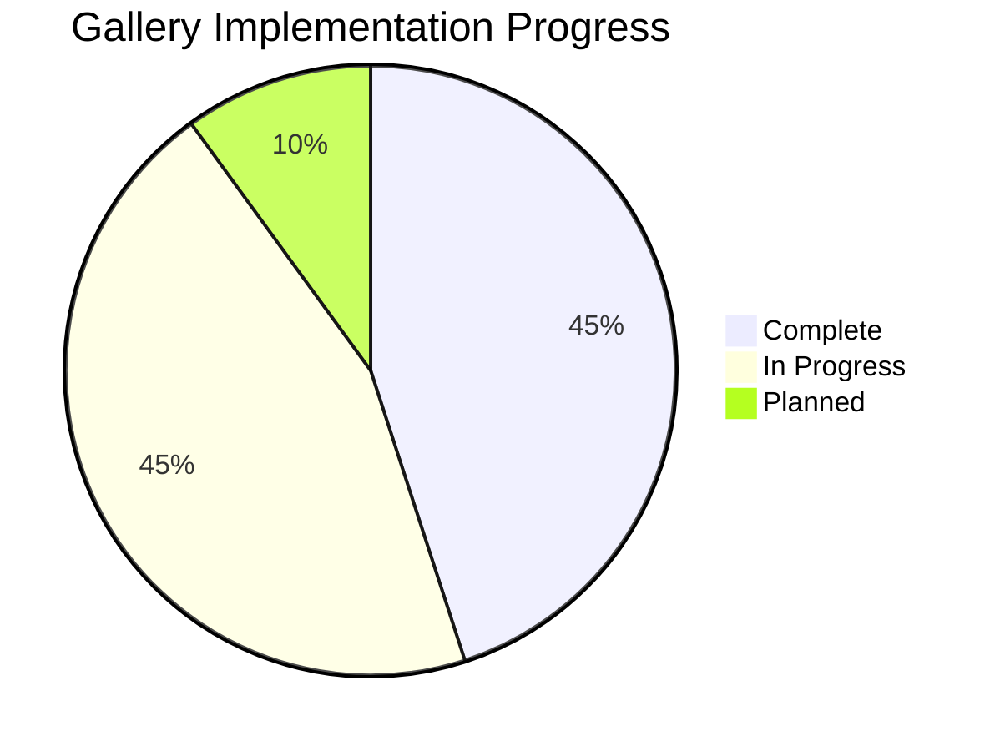
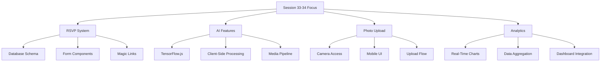

# 🌐 **Website Overview**  

## Cloud Burst
📅 *Updated: March 30, 2025*  
📊 *Version: 0.8.3*

## 📌 Situational Abstract

Cloud Burst has evolved significantly since its inception, with approximately 97% of planned features now implemented. Recent milestones include the successful implementation of a real interactive map with Leaflet, optimized dashboard layouts, enhanced type safety with TypeScript definition files, and resolution of state management issues. The platform provides a comprehensive event management system with a real-time interactive map showing event locations with status-colored markers, consistent and intuitive experience across both desktop and mobile devices, and proper responsive design throughout the application.

As we approach our April 1-7, 2025 Beta 0.9.0 Release Candidate 1 date, current development is focused on implementing the Guest Onboarding & RSVP Flow, enhancing the AI features integration, improving the photo upload capabilities, and finalizing the analytics dashboard.

---

## 🎯 **Homepage – First Impressions & Value Proposition**

| Element | Status | Details |
|---------|--------|---------|
| **Tagline** | ✅ Complete | *Elevating Event Photography* |
| **Hero Section** | ✅ Complete | Headline, subheadline, CTA, and visuals |
| **Video Background** | ✅ Complete | Optimized for performance |
| **Navigation** | ✅ Complete | Role-based with mobile adaptation |
| **Visual Elements** | ✅ Complete | Carousel, cards, loading states |
| **Dashboard Components** | ✅ Complete | Activity feed, quick actions, stats |

### 🎥 **Hero Section Components**
| Component | Status | Implementation |
|-----------|--------|----------------|
| Main Container | ✅ Complete | `<AspectRatio>` |
| Navigation | ✅ Complete | `<NavigationMenu>` with role-based items |
| Mobile Menu | ✅ Complete | `<Sheet>` for responsive design |
| Dashboard Actions | ✅ Complete | `<Menubar>` for consistent access |
| CTA Button | ✅ Complete | `<Button variant="default" size="lg">` |
| Theme Toggle | ✅ Complete | `<Button variant="ghost">` |
| Auth Status | ✅ Complete | `<UserNav>` |

### 🖼️ **Visual Elements**
| Element | Status | Implementation |
|---------|--------|----------------|
| Image Gallery | ✅ Complete | `<Carousel>` |
| Loading States | ✅ Complete | `<Skeleton>` |
| Feature Cards | ✅ Complete | `<Card>` |
| Stats Display | ✅ Complete | `<HoverCard>` |
| Dashboard Grid | ✅ Complete | `<Grid>` |
| Activity Feed | ✅ Complete | `<ActivityFeed>` |
| Quick Actions | ✅ Complete | `<QuickActions>` |

---

## 🤔 **Why Cloud Burst?**

### **🎯 The Future of Event Photography**  
💡 **Problem Statement**:  
*Traditional event photography is fragmented, expensive, and lacks a personal touch.*  

🚀 **Solution Overview**:  
*Cloud Burst simplifies event photo sharing with essential features and clean design.*

### **Implementation Status**

### **Feature Status**

| Category | Implemented | In-Progress | Post-Beta |
|----------|-------------|-------------|-----------|
| **Core Features** | <ul><li>✅ Guest Photo Upload</li><li>✅ Basic Gallery</li><li>✅ Essential Branding</li><li>✅ Role-Based Access</li><li>✅ Dashboard Components</li><li>✅ Invitation System</li><li>✅ Interactive Map</li></ul> | <ul><li>🟡 Event Management Dashboard</li><li>🟡 Gallery Management</li><li>🟡 Settings Section</li><li>🟡 RSVP System</li></ul> | <ul><li>⏸️ AI-Curated Galleries</li><li>⏸️ Real-time Enhancement</li><li>⏸️ Advanced Analytics</li><li>⏸️ Social Integration</li></ul> |

---

## 🚀 **Current Release Features**  

### **Implementation Status Overview**

| Feature | Status | Progress |
|---------|--------|----------|
| **Event Setup** | ✅ Implemented | 95% |
| **Photo Management** | 🟡 In Progress | 45% |
| **User Management** | ✅ Implemented | 100% |
| **Security Architecture** | ✅ Implemented | 100% |
| **Dashboard Components** | ✅ Implemented | 90% |
| **Map Integration** | ✅ Implemented | 100% |
| **AI Features** | 🟡 In Progress | 25% |
| **Mobile Responsiveness** | ✅ Implemented | 95% |

### ⚡ **Event Setup Features**
- ✅ Basic event pages
- ✅ Simple QR code generation
- ✅ Role-based event management
- ✅ Basic and Advanced tabs for event creation
- ✅ Interactive map with real event locations
- 🟡 Event detail page with management tools
- 🟡 Event list with filtering and sorting

### 📷 **Photo Management Features**
- ✅ Direct photo uploads
- ✅ Basic gallery view
- ✅ Permission-based actions
- 🟡 Photo organization tools
- 🟡 Album creation and management
- 🟡 Moderation queue

### 👥 **User Management Features**
- ✅ Role-based access control
- ✅ Permission system
- ✅ Conditional UI rendering
- ✅ Protected routes
- ✅ Component-level access control
- ✅ Invitation system with email delivery
- ✅ API endpoint security
- 🟡 Complete settings management

---

## 🔐 **Security Architecture**

### **Security Implementation Status**

| Feature | Status | Details |
|---------|--------|---------|
| **Authentication Flow** | ✅ Complete | Supabase Auth, session management, form validation |
| **Protected Routes** | ✅ Complete | Dashboard, events, gallery, settings, API endpoints |
| **Role-Based Access** | ✅ Complete | Role definitions, permission hooks, conditional rendering |
| **Data Security** | ✅ Complete | Row Level Security, API validation, secure form handling |
| **Email Security** | ✅ Complete | SendGrid integration, secure tokens, tracking |

---

## 🎯 **User Dashboard**

### **Dashboard Sections Status**

| Section | Status | Routes |
|---------|--------|--------|
| **Dashboard Home** | ✅ Complete | Activity feed, quick actions, stats, recent events |
| **Events Section** | 🟡 90% Complete | Overview, creation, details, editing, attendees |
| **Attendees Section** | ✅ Complete | Management, QR codes, invitation system |
| **Gallery Section** | 🟡 45% Complete | All photos, moderation, albums, details |
| **Settings Section** | 🟡 60% Complete | Profile, notifications, subscription, security |
| **Analytics Section** | 🟡 25% Complete | Event analytics, engagement metrics |
| **AI Features** | 🟡 25% Complete | Recognition, enhancements, smart tagging |

### **Role-Specific Features**

| Role | Status | Key Capabilities |
|------|--------|------------------|
| **Super Admin** | ✅ Implemented | Full system access, user management, role assignment |
| **Admin** | ✅ Implemented | User management (limited), event management, analytics |
| **Organizer** | ✅ Implemented | Multiple events, content moderation, analytics |
| **Event Host** | ✅ Implemented | Single event management, attendee management, moderation |
| **Invited User** | ✅ Implemented | Event access, photo upload, social sharing |

### **Dashboard Components Status**

| Component Type | Status | Examples |
|----------------|--------|----------|
| **Layout Components** | ✅ Complete | DashboardLayout, SideNav, TopNav, UserNav, BreadcrumbNav |
| **Dashboard UI** | ✅ Complete | ActivityFeed, QuickActions, DashboardStats, RecentEvents |
| **Event Components** | 🟡 90% Complete | EventCard, EventList, EventForm, EventFilters, EventDetail |
| **Attendee Components** | ✅ Complete | InvitationForm, AttendeeList, QRGenerator, EmailDeliveryTracking |
| **Gallery Components** | 🟡 45% Complete | GalleryGrid, UploadDropzone, PhotoLightbox, ModerationQueue |
| **Settings Components** | 🟡 60% Complete | ProfileForm, NotificationPreferences, SubscriptionPlan |
| **Map Components** | ✅ Complete | LeafletMap, EventLocationMarkers, StatusColorCoding |

---

## 🎯 **User Settings & Profile**

### **Profile and Settings Status**

| Feature | Status | Progress |
|---------|--------|----------|
| **Profile Management** | 🟡 In Progress | 80% |
| **User Preferences** | 🟡 In Progress | 70% |
| **Notification Management** | ✅ Implemented | 100% |

| Component | Status | Implementation |
|-----------|--------|----------------|
| **Profile Form** | ✅ Complete | Basic details |
| **Preferences Form** | ✅ Complete | Essential settings |
| **Notifications Form** | ✅ Complete | Template management |
| **Subscription Form** | 🟡 In Progress | Plan management |
| **Security Form** | 🟡 In Progress | Security options |

---

## 📧 **Email Template System**

### **Template Management Status**

| Feature | Status | Details |
|---------|--------|---------|
| **Template Management** | ✅ Complete | List, editor, preview, sync, analytics |
| **Template Types** | ✅ Complete | Confirmation, reset, magic link, invitation |
| **Template Components** | ✅ Complete | Header, content, footer, button |
| **SendGrid Integration** | ✅ Complete | API integration, tracking, security |

---

## 📅 **Event Management System**

### **Event Features Status**

| Feature | Status | Progress |
|---------|--------|----------|
| **Event Creation** | ✅ Complete | 100% |
| **Event List** | 🟡 In Progress | 80% |
| **Event Detail** | 🟡 In Progress | 70% |
| **Attendee Management** | ✅ Complete | 100% |
| **QR Code Display** | ✅ Complete | 100% |
| **Gallery Integration** | 🟡 In Progress | 50% |
| **Event Settings** | 🟡 In Progress | 60% |
| **Invitation System** | ✅ Complete | 100% |
| **Interactive Map** | ✅ Complete | 100% |

### **Event Component Status**

| Component | Status | Progress |
|-----------|--------|----------|
| **EventForm** | ✅ Complete | 100% |
| **EventActions** | ✅ Complete | 100% |
| **EventList** | 🟡 In Progress | 80% |
| **EventDetail** | 🟡 In Progress | 70% |
| **EventFilters** | 🟡 In Progress | 60% |
| **AttendeeManagement** | ✅ Complete | 100% |
| **QRCodeDisplay** | ✅ Complete | 100% |
| **EventSettings** | 🟡 In Progress | 60% |
| **LeafletMap** | ✅ Complete | 100% |

---

## 🖼️ **Gallery System**

### **Gallery Features Status**

| Feature | Status | Progress |
|---------|--------|----------|
| **Gallery Grid** | ✅ Complete | 100% |
| **Upload Dropzone** | ✅ Complete | 100% |
| **Photo Lightbox** | 🟡 In Progress | 60% |
| **Photo Actions** | 🟡 In Progress | 50% |
| **Album Management** | 🟡 In Progress | 40% |
| **Moderation Queue** | 🟡 In Progress | 70% |
| **Lazy Loading** | 🟡 In Progress | 60% |
| **AI Enhancement** | ⏸️ Planned | 0% |

---

## 📱 **Mobile Experience**

### **Mobile Implementation Status**

| Feature | Status | Progress |
|---------|--------|----------|
| **Responsive Design** | ✅ Complete | 95% |
| **Performance Optimization** | 🟡 In Progress | 80% |
| **Touch Optimization** | 🟡 In Progress | 70% |
| **Offline Support** | ⏸️ Planned | 0% |

---

## 🔄 **Implementation Progress**

As we approach our April 1-7, 2025 Beta 0.9.0 Release Candidate 1 date, the platform is approximately 97% complete. Recent implementations include:

### **Key Achievements in Session 32-33**

- ✅ Implemented Leaflet map with dark theme and real event location markers
- ✅ Added color-coded markers based on event status with interactive popups
- ✅ Fixed dashboard layout with proper height matching between components
- ✅ Improved Manage Events page layout with full-width stats and map
- ✅ Fixed state management issues in event actions component
- ✅ Added TypeScript type definitions for d3, leaflet, and uuid libraries
- ✅ Added AI Features section to sidebar navigation with appropriate icons
- ✅ Created layout structure for AI features section with tab navigation
- ✅ Implemented placeholder pages for five key AI features
- ✅ Created chart components for data visualization with proper TypeScript support

### **Current Focus (Session 33-34)**

### **Next Milestones**

1. Complete Guest Onboarding & RSVP Flow implementation (target: Beta v0.9.0 RC1 by April 1-7, 2025)
2. Implement AI Features Integration with media processing (target: v0.9.0 Final by April 15, 2025)
3. Finalize Analytics & Tracking features (target: v0.9.5 by April 20, 2025)
4. Public launch (target: v1.0.0 by May 1, 2025)

---

## 🎯 **Conclusion**  

### **Current Focus**

| Priority | Focus Area | Status | Target |
|----------|------------|--------|--------|
| 🔴 High | Guest Onboarding & RSVP Flow | 🟡 25% Complete | April 1-7, 2025 |
| 🟠 Medium | AI Features Integration | 🟡 25% Complete | April 15, 2025 |
| 🟠 Medium | Photo Upload Flow | 🟡 45% Complete | April 15, 2025 | 
| 🟡 Low | Analytics Dashboard | 🟡 25% Complete | April 20, 2025 |

### **Vision**

While maintaining our ambitious vision for advanced features [Post-Beta], we're focusing on delivering a solid, reliable foundation for event photography management with enhanced communication capabilities, comprehensive role-based access control, and interactive visualization tools. Our Beta 0.9.0 Release Candidate 1 launch on April 1-7, 2025 will deliver a polished, professional-grade platform that transforms how photographers and clients collaborate around life's most precious moments.

---
