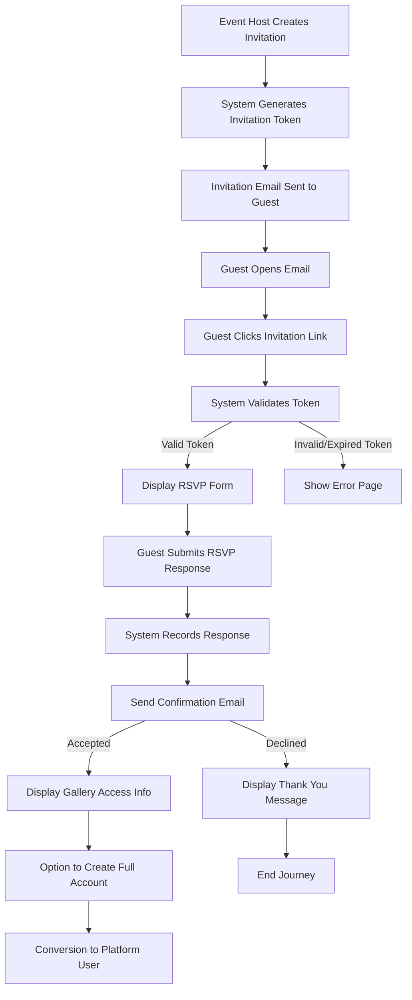
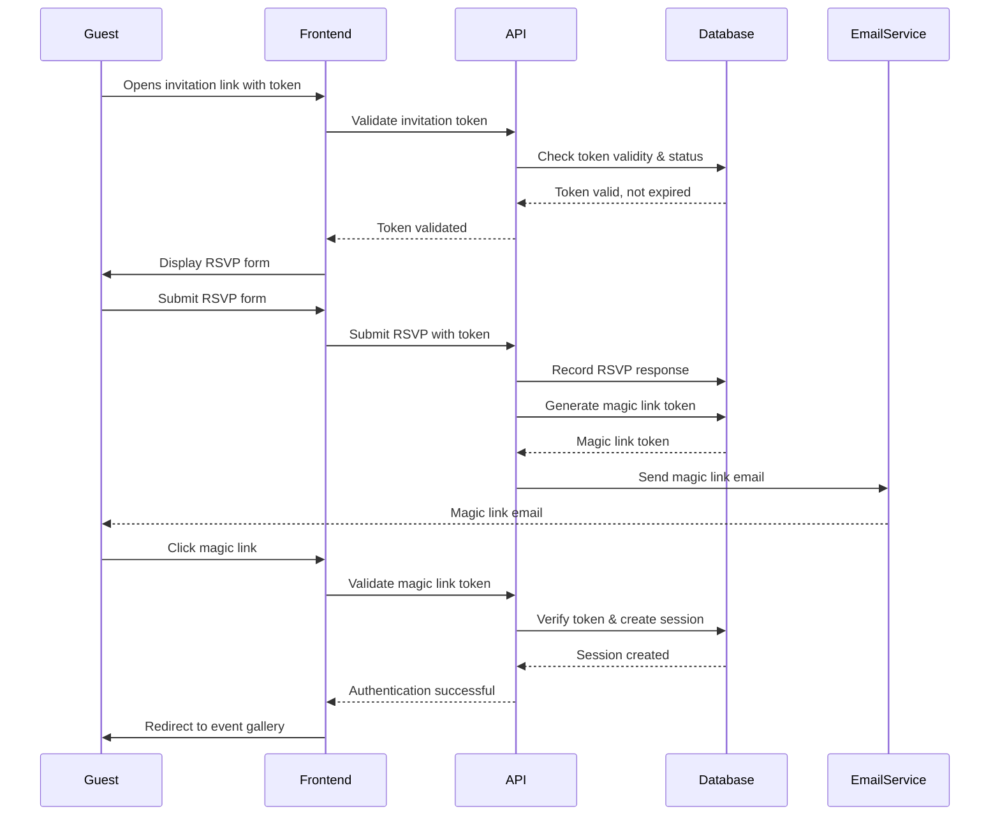

# Cloud Burst - Session 33 Resources
📅 *March 30, 2025*  
📊 *Version: 0.8.3 → 0.9.0*

This document provides key resources and reference materials for implementing the Guest Onboarding & RSVP Flow during Session 33.

## Project Structure

```
src/
├── app/
│   ├── api/                              # API routes
│   │   ├── invitations/                  # Invitation API endpoints
│   │   │   ├── [token]/                  # Token-specific endpoints
│   │   │   │   ├── route.ts              # GET, PUT handlers for invitations
│   │   │   │   └── validate/             # Validation endpoints
│   │   │   │       └── route.ts          # POST handler for token validation
│   │   │   ├── create/
│   │   │   │   └── route.ts              # POST handler for creating invitations
│   │   │   ├── send/
│   │   │   │   └── route.ts              # POST handler for sending invitations
│   │   │   └── status/
│   │   │       └── route.ts              # GET handler for invitation status
│   │   └── rsvp/                         # RSVP API endpoints
│   │       ├── [id]/                     # RSVP-specific endpoints
│   │       │   ├── route.ts              # GET, PUT handlers for RSVPs
│   │       │   └── preferences/          # RSVP preference endpoints
│   │       │       └── route.ts          # PUT handler for preferences
│   │       └── submit/
│   │           └── route.ts              # POST handler for RSVP submission
│   ├── invitation/                       # Public invitation pages
│   │   ├── [token]/                      # Token-specific pages
│   │   │   ├── page.tsx                  # Main invitation page
│   │   │   ├── layout.tsx                # Invitation layout
│   │   │   ├── loading.tsx               # Loading state
│   │   │   └── error.tsx                 # Error handling
│   │   └── expired/
│   │       └── page.tsx                  # Expired invitation page
│   └── rsvp/                             # RSVP pages
│       ├── [token]/                      # Token-specific pages
│       │   ├── page.tsx                  # Main RSVP form page
│       │   ├── layout.tsx                # RSVP layout
│       │   ├── loading.tsx               # Loading state
│       │   └── confirmation/             # Confirmation pages
│       │       ├── accepted/
│       │       │   └── page.tsx          # Accepted confirmation
│       │       └── declined/
│       │           └── page.tsx          # Declined confirmation
│       └── expired/
│           └── page.tsx                  # Expired RSVP page
├── components/
│   ├── invitations/                      # Invitation components
│   │   ├── CreateInvitation.tsx          # Invitation creation form
│   │   ├── InvitationCard.tsx            # Invitation card display
│   │   ├── InvitationList.tsx            # List of invitations
│   │   ├── InvitationStatus.tsx          # Status indicator
│   │   ├── InvitationDetailView.tsx      # Detailed view 
│   │   └── SendInvitationButton.tsx      # Send button with status
│   └── rsvp/                             # RSVP components
│       ├── RsvpForm.tsx                  # Main RSVP form
│       ├── RsvpOptionSelector.tsx        # Accept/Decline selector
│       ├── RsvpPreferencesForm.tsx       # Preferences collection
│       ├── RsvpConfirmation.tsx          # Confirmation component
│       ├── PlusOneForm.tsx               # +1 guest form
│       └── DietaryRestrictionsInput.tsx  # Dietary input component
├── lib/
│   ├── validation/                       # Zod validation schemas
│   │   ├── invitation.schema.ts          # Invitation schemas
│   │   └── rsvp.schema.ts                # RSVP schemas
│   ├── email-templates/                  # Email templates
│   │   ├── invitation.html               # Invitation email
│   │   ├── rsvp-confirmation.html        # RSVP confirmation email
│   │   └── magic-link.html               # Magic link email
│   └── auth/
│       └── magic-link.ts                 # Magic link utilities
├── hooks/
│   ├── useInvitation.ts                  # Invitation hook
│   ├── useRsvp.ts                        # RSVP hook
│   └── useMagicLink.ts                   # Magic link hook
└── types/
    ├── invitation.ts                     # Invitation types
    └── rsvp.ts                           # RSVP types
```

## Database Schema

### Invitation Table

```sql
CREATE TABLE invitations (
  id UUID PRIMARY KEY DEFAULT uuid_generate_v4(),
  event_id UUID NOT NULL REFERENCES events(id) ON DELETE CASCADE,
  email VARCHAR NOT NULL,
  name VARCHAR NOT NULL,
  token VARCHAR NOT NULL UNIQUE,
  status VARCHAR NOT NULL DEFAULT 'pending' CHECK (status IN ('pending', 'sent', 'delivered', 'opened', 'expired')),
  created_at TIMESTAMP WITH TIME ZONE DEFAULT NOW(),
  sent_at TIMESTAMP WITH TIME ZONE,
  opened_at TIMESTAMP WITH TIME ZONE,
  expires_at TIMESTAMP WITH TIME ZONE,
  metadata JSONB DEFAULT '{}'::JSONB,
  created_by UUID REFERENCES auth.users(id),
  
  CONSTRAINT fk_event FOREIGN KEY (event_id) REFERENCES events(id) ON DELETE CASCADE
);

-- Add index for token lookups
CREATE INDEX idx_invitations_token ON invitations(token);

-- Add index for event lookups
CREATE INDEX idx_invitations_event_id ON invitations(event_id);

-- Add RLS policies
ALTER TABLE invitations ENABLE ROW LEVEL SECURITY;

-- Only allow event owners and admins to see all invitations
CREATE POLICY invitations_select_policy ON invitations
  FOR SELECT USING (
    auth.uid() IN (
      SELECT created_by FROM events WHERE id = event_id
    ) OR 
    auth.uid() IN (
      SELECT user_id FROM user_roles WHERE role = 'admin'
    )
  );

-- Allow access via token for public routes
CREATE POLICY invitations_token_policy ON invitations
  FOR SELECT USING (
    token = current_setting('app.current_invitation_token', true)::text
  );
```

### RSVP Table

```sql
CREATE TABLE rsvps (
  id UUID PRIMARY KEY DEFAULT uuid_generate_v4(),
  invitation_id UUID NOT NULL REFERENCES invitations(id) ON DELETE CASCADE,
  status VARCHAR NOT NULL CHECK (status IN ('pending', 'accepted', 'declined')),
  guest_count INTEGER NOT NULL DEFAULT 1,
  dietary_restrictions TEXT,
  notes TEXT,
  created_at TIMESTAMP WITH TIME ZONE DEFAULT NOW(),
  updated_at TIMESTAMP WITH TIME ZONE DEFAULT NOW(),
  
  CONSTRAINT fk_invitation FOREIGN KEY (invitation_id) REFERENCES invitations(id) ON DELETE CASCADE
);

-- Add index for invitation lookups
CREATE INDEX idx_rsvps_invitation_id ON rsvps(invitation_id);

-- Add RLS policies
ALTER TABLE rsvps ENABLE ROW LEVEL SECURITY;

-- Only allow event owners and admins to see all RSVPs
CREATE POLICY rsvps_select_policy ON rsvps
  FOR SELECT USING (
    invitation_id IN (
      SELECT id FROM invitations WHERE event_id IN (
        SELECT id FROM events WHERE created_by = auth.uid()
      )
    ) OR 
    auth.uid() IN (
      SELECT user_id FROM user_roles WHERE role = 'admin'
    )
  );

-- Allow insert/update via token for public routes
CREATE POLICY rsvps_token_policy ON rsvps
  FOR ALL USING (
    invitation_id IN (
      SELECT id FROM invitations 
      WHERE token = current_setting('app.current_invitation_token', true)::text
    )
  );
```

## User Flow: Guest RSVP Journey



## Magic Link Authentication Flow



## Form Validation Schema (Zod)

```typescript
import { z } from 'zod';

export const rsvpFormSchema = z.object({
  // Basic RSVP fields
  status: z.enum(['accepted', 'declined'], {
    required_error: 'Please select whether you can attend',
  }),
  
  // Conditional fields based on acceptance
  dietaryRestrictions: z.string().optional(),
  notes: z.string().max(500, 'Notes cannot exceed 500 characters').optional(),
  
  // Plus-one information (conditional)
  plusOne: z.boolean().default(false),
  plusOneName: z.string().optional()
    .refine(name => !plusOne || (plusOne && name && name.length > 0), {
      message: 'Please provide your guest\'s name',
    }),
});

export const invitationSchema = z.object({
  email: z.string().email('Please provide a valid email address'),
  name: z.string().min(1, 'Name is required'),
  eventId: z.string().uuid('Invalid event ID'),
  message: z.string().optional(),
});

export type RsvpFormValues = z.infer<typeof rsvpFormSchema>;
export type InvitationValues = z.infer<typeof invitationSchema>;
```

## Email Templates

### Invitation Email Template

```html
<!DOCTYPE html>
<html>
<head>
  <meta charset="utf-8">
  <meta name="viewport" content="width=device-width, initial-scale=1.0">
  <title>You're Invited!</title>
  <style>
    /* Email styles */
    body {
      font-family: 'Helvetica Neue', Helvetica, Arial, sans-serif;
      line-height: 1.6;
      color: #333;
      background-color: #f9f9f9;
      margin: 0;
      padding: 0;
    }
    .container {
      max-width: 600px;
      margin: 0 auto;
      padding: 20px;
      background-color: #ffffff;
    }
    .header {
      text-align: center;
      padding: 20px 0;
    }
    .logo {
      max-width: 150px;
    }
    .event-details {
      background-color: #f5f5f5;
      border-radius: 4px;
      padding: 15px;
      margin: 20px 0;
    }
    .button {
      display: inline-block;
      padding: 12px 24px;
      background-color: #0070f3;
      color: white;
      text-decoration: none;
      border-radius: 4px;
      font-weight: bold;
      margin: 20px 0;
    }
    .footer {
      text-align: center;
      font-size: 12px;
      color: #666;
      margin-top: 30px;
    }
  </style>
</head>
<body>
  <div class="container">
    <div class="header">
      
      <h1>You're Invited!</h1>
    </div>
    
    <p>Hello {{guestName}},</p>
    
    <p>{{hostName}} has invited you to {{eventName}}!</p>
    
    <div class="event-details">
      <p><strong>Event:</strong> {{eventName}}</p>
      <p><strong>Date:</strong> {{eventDate}}</p>
      <p><strong>Location:</strong> {{eventLocation}}</p>
    </div>
    
    <p>{{customMessage}}</p>
    
    <p style="text-align: center;">
      <a href="{{rsvpUrl}}" class="button">Respond to Invitation</a>
    </p>
    
    <p>This invitation link will expire on {{expirationDate}}.</p>
    
    <div class="footer">
      <p>Powered by Cloud Burst - Modern Event Photography</p>
      <p>If you have any questions, please contact the event host.</p>
    </div>
  </div>
</body>
</html>
```

### Magic Link Email Template

```html
<!DOCTYPE html>
<html>
<head>
  <meta charset="utf-8">
  <meta name="viewport" content="width=device-width, initial-scale=1.0">
  <title>Your Magic Link to {{eventName}}</title>
  <style>
    /* Email styles */
    body {
      font-family: 'Helvetica Neue', Helvetica, Arial, sans-serif;
      line-height: 1.6;
      color: #333;
      background-color: #f9f9f9;
      margin: 0;
      padding: 0;
    }
    .container {
      max-width: 600px;
      margin: 0 auto;
      padding: 20px;
      background-color: #ffffff;
    }
    .header {
      text-align: center;
      padding: 20px 0;
    }
    .logo {
      max-width: 150px;
    }
    .button {
      display: inline-block;
      padding: 12px 24px;
      background-color: #0070f3;
      color: white;
      text-decoration: none;
      border-radius: 4px;
      font-weight: bold;
      margin: 20px 0;
    }
    .note {
      font-size: 12px;
      color: #666;
      margin-top: 20px;
    }
    .footer {
      text-align: center;
      font-size: 12px;
      color: #666;
      margin-top: 30px;
    }
  </style>
</head>
<body>
  <div class="container">
    <div class="header">
      
      <h1>Your Magic Link</h1>
    </div>
    
    <p>Hello {{guestName}},</p>
    
    <p>Here's your secure access link to view and download photos from {{eventName}}.</p>
    
    <p style="text-align: center;">
      <a href="{{magicLinkUrl}}" class="button">Access Event Gallery</a>
    </p>
    
    <p class="note">This link is unique to you and will expire in 24 hours for security purposes.</p>
    <p class="note">If you did not request this link, you can safely ignore this email.</p>
    
    <div class="footer">
      <p>Powered by Cloud Burst - Modern Event Photography</p>
      <p>If you have any questions, please contact the event host.</p>
    </div>
  </div>
</body>
</html>
```

## Example Components

### RsvpForm.tsx

```tsx
'use client';

import { useState } from 'react';
import { useForm } from 'react-hook-form';
import { zodResolver } from '@hookform/resolvers/zod';
import { RsvpFormValues, rsvpFormSchema } from '@/lib/validation/rsvp.schema';
import { Button } from '@/components/ui/button';
import { Form, FormControl, FormField, FormItem, FormLabel, FormMessage } from '@/components/ui/form';
import { RadioGroup, RadioItem } from '@/components/ui/radio-group';
import { Textarea } from '@/components/ui/textarea';
import { Checkbox } from '@/components/ui/checkbox';
import { Input } from '@/components/ui/input';
import { useToast } from '@/components/ui/use-toast';
import { submitRsvp } from '@/lib/api/rsvp';

interface RsvpFormProps {
  invitationToken: string;
  eventName: string;
  guestName: string;
}

export function RsvpForm({ invitationToken, eventName, guestName }: RsvpFormProps) {
  const [isSubmitting, setIsSubmitting] = useState(false);
  const { toast } = useToast();
  
  const form = useForm<RsvpFormValues>({
    resolver: zodResolver(rsvpFormSchema),
    defaultValues: {
      status: undefined,
      dietaryRestrictions: '',
      notes: '',
      plusOne: false,
      plusOneName: '',
    },
  });
  
  const watchStatus = form.watch('status');
  const watchPlusOne = form.watch('plusOne');
  
  const onSubmit = async (data: RsvpFormValues) => {
    setIsSubmitting(true);
    try {
      await submitRsvp(invitationToken, data);
      toast({
        title: "RSVP Submitted",
        description: `Thank you for your response${data.status === 'accepted' ? '. We look forward to seeing you!' : '.'}`,
        variant: "default",
      });
      
      // Redirect based on status
      window.location.href = data.status === 'accepted' 
        ? `/rsvp/${invitationToken}/confirmation/accepted` 
        : `/rsvp/${invitationToken}/confirmation/declined`;
    } catch (error) {
      console.error('RSVP submission error:', error);
      toast({
        title: "Submission Failed",
        description: "There was a problem submitting your RSVP. Please try again.",
        variant: "destructive",
      });
    } finally {
      setIsSubmitting(false);
    }
  };

  return (
    <div className="w-full max-w-md mx-auto p-6 bg-card rounded-lg border border-border shadow-sm">
      <h2 className="text-2xl font-bold mb-6 text-center">RSVP to {eventName}</h2>
      <p className="text-center mb-6">Hello {guestName}, please confirm your attendance.</p>
      
      <Form {...form}>
        <form onSubmit={form.handleSubmit(onSubmit)} className="space-y-6">
          <FormField
            control={form.control}
            name="status"
            render={({ field }) => (
              <FormItem className="space-y-3">
                <FormLabel>Will you attend?</FormLabel>
                <FormControl>
                  <RadioGroup
                    onValueChange={field.onChange}
                    defaultValue={field.value}
                    className="flex flex-col space-y-2"
                  >
                    <RadioItem 
                      value="accepted" 
                      label="Yes, I'll be there!" 
                      description="I'm looking forward to it"
                    />
                    <RadioItem 
                      value="declined" 
                      label="No, I can't make it" 
                      description="Maybe next time"
                    />
                  </RadioGroup>
                </FormControl>
                <FormMessage />
              </FormItem>
            )}
          />
          
          {watchStatus === 'accepted' && (
            <>
              <FormField
                control={form.control}
                name="dietaryRestrictions"
                render={({ field }) => (
                  <FormItem>
                    <FormLabel>Dietary Restrictions</FormLabel>
                    <FormControl>
                      <Textarea
                        placeholder="Please let us know about any dietary restrictions or allergies"
                        {...field}
                      />
                    </FormControl>
                    <FormMessage />
                  </FormItem>
                )}
              />
              
              <FormField
                control={form.control}
                name="plusOne"
                render={({ field }) => (
                  <FormItem className="flex flex-row items-start space-x-3 space-y-0">
                    <FormControl>
                      <Checkbox
                        checked={field.value}
                        onCheckedChange={field.onChange}
                      />
                    </FormControl>
                    <div className="space-y-1 leading-none">
                      <FormLabel>I'm bringing a guest</FormLabel>
                    </div>
                  </FormItem>
                )}
              />
              
              {watchPlusOne && (
                <FormField
                  control={form.control}
                  name="plusOneName"
                  render={({ field }) => (
                    <FormItem>
                      <FormLabel>Guest's Name</FormLabel>
                      <FormControl>
                        <Input placeholder="Enter your guest's name" {...field} />
                      </FormControl>
                      <FormMessage />
                    </FormItem>
                  )}
                />
              )}
            </>
          )}
          
          <FormField
            control={form.control}
            name="notes"
            render={({ field }) => (
              <FormItem>
                <FormLabel>Additional Notes</FormLabel>
                <FormControl>
                  <Textarea
                    placeholder="Any additional information you'd like to share"
                    {...field}
                  />
                </FormControl>
                <FormMessage />
              </FormItem>
            )}
          />
          
          <Button 
            type="submit" 
            className="w-full" 
            disabled={isSubmitting}
          >
            {isSubmitting ? "Submitting..." : "Submit RSVP"}
          </Button>
        </form>
      </Form>
    </div>
  );
}
```

## API Implementation

### Token Validation Route

```typescript
// src/app/api/invitations/[token]/validate/route.ts
import { NextRequest, NextResponse } from 'next/server';
import { createRouteHandlerClient } from '@supabase/auth-helpers-nextjs';
import { cookies } from 'next/headers';
import { Database } from '@/types/supabase';

export async function POST(
  request: NextRequest,
  { params }: { params: { token: string } }
) {
  try {
    const token = params.token;
    
    if (!token) {
      return NextResponse.json(
        { error: 'Missing invitation token' },
        { status: 400 }
      );
    }
    
    // Set token in app.settings for RLS policies
    const cookieStore = cookies();
    const supabase = createRouteHandlerClient<Database>({ cookies: () => cookieStore });
    
    await supabase.rpc('set_app_setting', {
      setting_name: 'app.current_invitation_token',
      setting_value: token
    });
    
    // Query the invitation
    const { data: invitation, error } = await supabase
      .from('invitations')
      .select('*')
      .eq('token', token)
      .single();
    
    if (error || !invitation) {
      return NextResponse.json(
        { error: 'Invalid invitation token' },
        { status: 404 }
      );
    }
    
    // Check if expired
    if (invitation.expires_at && new Date(invitation.expires_at) < new Date()) {
      return NextResponse.json(
        { error: 'Invitation has expired', expired: true },
        { status: 410 }
      );
    }
    
    // Update opened_at if not already set
    if (!invitation.opened_at) {
      await supabase
        .from('invitations')
        .update({ opened_at: new Date().toISOString() })
        .eq('id', invitation.id);
    }
    
    // Get event details
    const { data: event, error: eventError } = await supabase
      .from('events')
      .select('name, date, location')
      .eq('id', invitation.event_id)
      .single();
    
    if (eventError || !event) {
      return NextResponse.json(
        { error: 'Event not found' },
        { status: 404 }
      );
    }
    
    // Get RSVP status if exists
    const { data: rsvp } = await supabase
      .from('rsvps')
      .select('*')
      .eq('invitation_id', invitation.id)
      .single();
    
    return NextResponse.json({
      valid: true,
      invitation: {
        id: invitation.id,
        name: invitation.name,
        email: invitation.email,
        status: invitation.status,
        created_at: invitation.created_at,
        sent_at: invitation.sent_at,
        opened_at: invitation.opened_at,
        expires_at: invitation.expires_at,
      },
      event: {
        id: invitation.event_id,
        name: event.name,
        date: event.date,
        location: event.location,
      },
      rsvp: rsvp || null,
    });
  } catch (error) {
    console.error('Error validating invitation token:', error);
    return NextResponse.json(
      { error: 'Failed to validate invitation' },
      { status: 500 }
    );
  }
}
```

## Implementation Notes

1. **Security Considerations**:
   - Always use server-side validation for tokens
   - Set short expiration for magic links (24 hours max)
   - Use HTTP-only cookies for authentication
   - Implement rate limiting for API endpoints

2. **Performance Optimization**:
   - Use server components for initial page load
   - Implement client components for interactive elements
   - Optimize API calls with proper caching
   - Use dynamic imports for form components

3. **Mobile Considerations**:
   - Ensure all forms are responsive
   - Optimize tap targets for mobile users
   - Test on various screen sizes
   - Implement proper form validation feedback

4. **Testing Strategy**:
   - Create test cases for token validation
   - Test RSVP submission with various scenarios
   - Verify email delivery
   - Test session handling and authentication
   - Verify mobile responsiveness

## References

- [Next.js App Router Documentation](https://nextjs.org/docs/app)
- [Supabase Auth Helpers for Next.js](https://supabase.com/docs/guides/auth/auth-helpers/nextjs)
- [Zod Schema Validation](https://zod.dev/)
- [React Hook Form](https://react-hook-form.com/get-started)
- [Securing Magic Links](https://supabase.com/blog/security-hardening-for-production) 