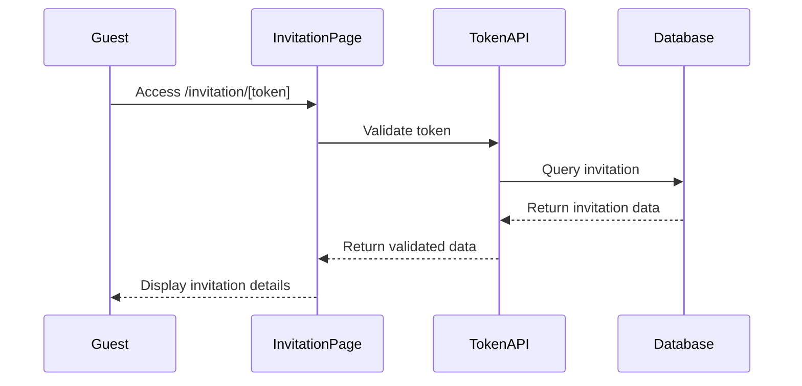
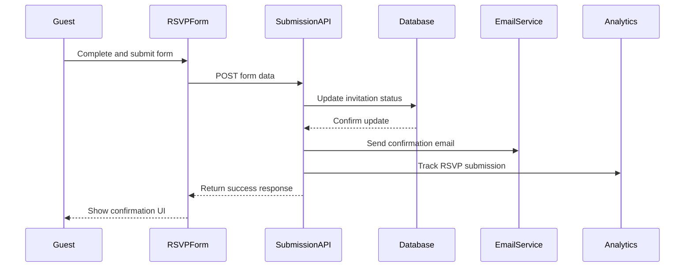
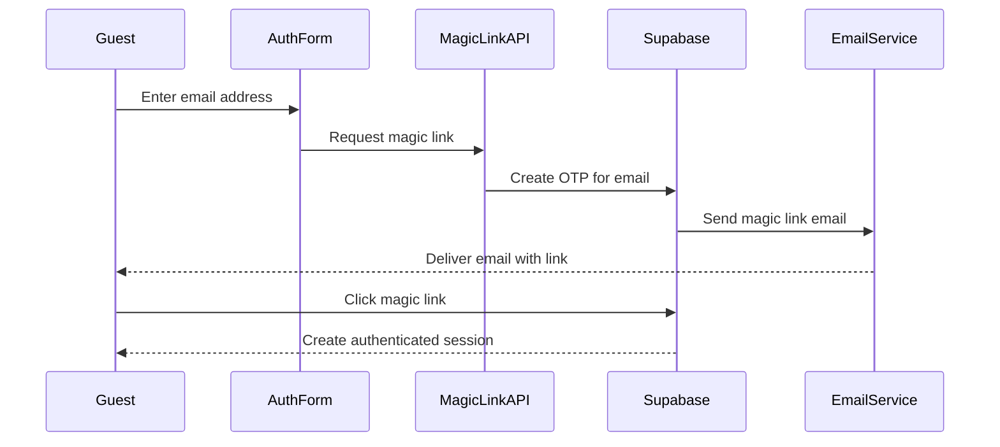

# RSVP System Implementation Guide

This technical guide provides developers with detailed information on the architecture, data flow, and implementation approaches for the public-facing RSVP system in Session 37.

## System Architecture Overview

The RSVP system follows a server-first architecture with client-side enhancements:

```
┌────────────────┐     ┌────────────────┐     ┌────────────────┐
│                │     │                │     │                │
│  Public-facing │     │  Next.js API   │     │   Supabase     │
│     Pages      │────►│   Endpoints    │────►│   Database     │
│                │     │                │     │                │
└────────────────┘     └────────────────┘     └────────────────┘
        │                      │                      │
        │                      │                      │
        ▼                      ▼                      ▼
┌────────────────┐     ┌────────────────┐     ┌────────────────┐
│                │     │                │     │                │
│   React        │     │   Email        │     │   Analytics    │
│   Components   │     │   Service      │     │   System       │
│                │     │                │     │                │
└────────────────┘     └────────────────┘     └────────────────┘
```

## Data Flow

### 1. Invitation Access Flow



### 2. RSVP Submission Flow



### 3. Magic Link Authentication Flow



## Implementation Approaches

### Server Components vs. Client Components

Use this decision matrix to determine which components should be server-side or client-side:

| Component Type | Implementation | Rationale |
|----------------|----------------|-----------|
| Page components | Server Components | Load faster, SEO benefits, reduced JS bundle |
| Data fetching | Server Actions | Secure token validation, database security |
| Interactive forms | Client Components | Responsive UI, form validation, state management |
| Auth components | Client Components | Needs interactivity and browser APIs |
| Layout components | Server Components | Static structure, no interactivity needed |
| Confirmation UI | Client Components | Dynamic content based on submission response |

### Token Security Guidelines

1. **Token Generation**:
   - Use UUIDv4 or similar for unique tokens
   - Store in database with proper indexing
   - Never expose token generation logic on client

2. **Token Validation**:
   - Always validate on server side
   - Check token expiration if applicable
   - Validate token only exists once
   - Restrict number of validation attempts

3. **Token Transmission**:
   - Use HTTPS for all communication
   - Never log tokens in client console
   - Do not store tokens in browser localStorage

## Database Schema Implementation

The RSVP system relies on the following schema components:

### Invitations Table

```typescript
// Database table structure - Typescript representation
interface Invitation {
  id: string; // UUID
  event_id: string; // References events table
  email: string; // Invited guest email
  name: string; // Invited guest name
  token: string; // Unique invitation token
  status: 'pending' | 'accepted' | 'declined'; // RSVP status
  plus_one_allowed: boolean; // Whether guest can bring +1
  plus_one_name?: string; // Name of plus one
  plus_one_email?: string; // Email of plus one
  dietary_restrictions?: string; // Dietary requirements
  notes?: string; // Additional notes
  created_at: Date; // Creation timestamp
  updated_at: Date; // Last update timestamp
  sent_at?: Date; // When invitation was sent
  responded_at?: Date; // When RSVP was received
}
```

### Row-Level Security Policies

Implement these security policies for the invitations table:

```sql
-- Guest can view their own invitation
CREATE POLICY "Guests can view their own invitations"
ON invitations FOR SELECT USING (
  auth.jwt() ->> 'email' = email OR
  auth.jwt() ->> 'email' = plus_one_email
);

-- Guest can update their own invitation
CREATE POLICY "Guests can update their own invitations"
ON invitations FOR UPDATE USING (
  auth.jwt() ->> 'email' = email OR
  auth.jwt() ->> 'email' = plus_one_email
);

-- Event organizers can view all invitations for their events
CREATE POLICY "Organizers can view invitations for their events"
ON invitations FOR SELECT USING (
  event_id IN (
    SELECT id FROM events 
    WHERE organizer_id = auth.uid()
  )
);
```

## Form Validation

Use Zod for robust form validation:

```typescript
import { z } from 'zod';

// RSVP form validation schema
const rsvpSchema = z.object({
  // Required status field
  status: z.enum(['accepted', 'declined']),
  
  // Optional fields
  hasPlusOne: z.boolean().optional(),
  
  // Conditional validation based on hasPlusOne
  plusOneName: z.string().optional()
    .refine(val => {
      // Required if hasPlusOne is true
      const hasValue = !val || val.trim().length > 0;
      return hasValue;
    }, {
      message: 'Guest name is required when bringing a plus one'
    }),
    
  plusOneEmail: z.string().email().optional()
    .refine(val => {
      // Required if hasPlusOne is true
      const hasValue = !val || val.includes('@');
      return hasValue;
    }, {
      message: 'Valid guest email is required when bringing a plus one'
    }),
    
  dietaryRestrictions: z.string().optional(),
  notes: z.string().optional(),
});

type RsvpFormData = z.infer<typeof rsvpSchema>;
```

## API Implementation Guidelines

### Token Validation Endpoint

```typescript
// src/app/api/invitations/[token]/route.ts
import { createRouteHandlerClient } from '@supabase/auth-helpers-nextjs';
import { cookies } from 'next/headers';
import { NextResponse } from 'next/server';

export async function GET(
  request: Request,
  { params }: { params: { token: string } }
) {
  const token = params.token;
  
  // Validate token format to prevent injection
  if (!/^[a-f0-9-]{36}$/.test(token)) {
    return NextResponse.json(
      { error: 'Invalid token format' },
      { status: 400 }
    );
  }
  
  const cookieStore = cookies();
  const supabase = createRouteHandlerClient({ cookies: () => cookieStore });
  
  try {
    const { data, error } = await supabase
      .from('invitations')
      .select(`
        id, event_id, email, name, token, status, 
        plus_one_allowed, plus_one_name, plus_one_email,
        dietary_restrictions, notes, responded_at,
        events (
          id, name, description, date, location, 
          cover_image_url, organizer_id,
          profiles (id, full_name, avatar_url)
        )
      `)
      .eq('token', token)
      .single();
    
    if (error || !data) {
      return NextResponse.json(
        { error: 'Invitation not found' },
        { status: 404 }
      );
    }
    
    return NextResponse.json({ invitation: data });
  } catch (error) {
    console.error('Error validating invitation token:', error);
    return NextResponse.json(
      { error: 'Server error' },
      { status: 500 }
    );
  }
}
```

### RSVP Submission Endpoint

```typescript
// src/app/api/invitations/respond/route.ts
import { createRouteHandlerClient } from '@supabase/auth-helpers-nextjs';
import { cookies } from 'next/headers';
import { NextResponse } from 'next/server';
import { z } from 'zod';
import { sendRsvpConfirmationEmail } from '@/lib/email/send';

const rsvpSubmissionSchema = z.object({
  token: z.string(),
  status: z.enum(['accepted', 'declined']),
  hasPlusOne: z.boolean().optional(),
  plusOneName: z.string().optional(),
  plusOneEmail: z.string().email().optional(),
  dietaryRestrictions: z.string().optional(),
  notes: z.string().optional(),
});

export async function POST(request: Request) {
  const cookieStore = cookies();
  const supabase = createRouteHandlerClient({ cookies: () => cookieStore });
  
  try {
    const body = await request.json();
    const validatedData = rsvpSubmissionSchema.parse(body);
    
    // Update invitation in database
    const { data, error } = await supabase
      .from('invitations')
      .update({
        status: validatedData.status,
        plus_one_name: validatedData.plusOneName || null,
        plus_one_email: validatedData.plusOneEmail || null,
        dietary_restrictions: validatedData.dietaryRestrictions || null,
        notes: validatedData.notes || null,
        responded_at: new Date().toISOString(),
      })
      .eq('token', validatedData.token)
      .select()
      .single();
    
    if (error || !data) {
      return NextResponse.json(
        { error: error?.message || 'Failed to update invitation' },
        { status: 500 }
      );
    }
    
    // Fetch event data for email
    const { data: eventData } = await supabase
      .from('events')
      .select(`
        id, name, description, date, location, 
        profiles (id, full_name, email)
      `)
      .eq('id', data.event_id)
      .single();
    
    if (eventData) {
      // Send confirmation email
      await sendRsvpConfirmationEmail({
        invitation: data,
        event: eventData,
      });
      
      // Track analytics
      await fetch('/api/analytics/rsvp', {
        method: 'POST',
        headers: { 'Content-Type': 'application/json' },
        body: JSON.stringify({
          invitationId: data.id,
          status: data.status,
          timestamp: data.responded_at,
        }),
      });
    }
    
    return NextResponse.json({
      success: true,
      invitation: data,
    });
  } catch (error) {
    console.error('Error processing RSVP:', error);
    if (error instanceof z.ZodError) {
      return NextResponse.json(
        { error: 'Invalid submission data', details: error.errors },
        { status: 400 }
      );
    }
    
    return NextResponse.json(
      { error: 'Server error' },
      { status: 500 }
    );
  }
}
```

## Server vs. Client Component Usage

### Server Component Example

```tsx
// src/app/invitation/[token]/page.tsx
import { Metadata } from 'next';
import { notFound } from 'next/navigation';
import { validateInvitationToken } from '@/lib/invitations/token';
import { InvitationDetails } from '@/components/invitations/invitation-details';
import { RSVPFormWrapper } from '@/components/invitations/rsvp-form-wrapper';

interface InvitationPageProps {
  params: {
    token: string;
  };
}

// Generate metadata for SEO
export async function generateMetadata(
  { params }: InvitationPageProps
): Promise<Metadata> {
  const { invitation } = await validateInvitationToken(params.token);
  
  if (!invitation) {
    return {
      title: 'Invitation Not Found',
    };
  }
  
  return {
    title: `RSVP for ${invitation.events.name}`,
    description: `You're invited to ${invitation.events.name}. Please RSVP.`,
  };
}

export default async function InvitationPage({ params }: InvitationPageProps) {
  const { invitation, error } = await validateInvitationToken(params.token);
  
  if (!invitation || error) {
    notFound();
  }
  
  return (
    <div className="container max-w-4xl mx-auto py-8 px-4">
      <InvitationDetails invitation={invitation} />
      <RSVPFormWrapper invitation={invitation} />
    </div>
  );
}
```

### Client Component Example

```tsx
// src/components/invitations/rsvp-form-wrapper.tsx
'use client';

import { useState } from 'react';
import { RSVPForm } from './rsvp-form';
import { ConfirmationMessage } from './confirmation-message';
import { Invitation } from '@/lib/invitations/types';

interface RSVPFormWrapperProps {
  invitation: Invitation;
}

export function RSVPFormWrapper({ invitation }: RSVPFormWrapperProps) {
  const [isSubmitted, setIsSubmitted] = useState(false);
  const [submissionStatus, setSubmissionStatus] = useState<'accepted' | 'declined' | null>(null);
  
  const handleSubmit = async (formData: any) => {
    try {
      const response = await fetch('/api/invitations/respond', {
        method: 'POST',
        headers: {
          'Content-Type': 'application/json',
        },
        body: JSON.stringify({
          token: invitation.token,
          ...formData,
        }),
      });
      
      if (!response.ok) {
        throw new Error('Failed to submit RSVP');
      }
      
      setSubmissionStatus(formData.status);
      setIsSubmitted(true);
    } catch (error) {
      console.error('Error submitting RSVP:', error);
    }
  };
  
  if (isSubmitted && submissionStatus) {
    return <ConfirmationMessage status={submissionStatus} eventName={invitation.events.name} />;
  }
  
  return <RSVPForm invitation={invitation} onSubmit={handleSubmit} />;
}
```

## Email Integration

### Sending Confirmation Emails

```typescript
// src/lib/email/send.ts
import { createClient } from '@supabase/supabase-js';
import { Invitation } from '@/lib/invitations/types';

// Initialize email service
const EMAIL_SERVICE_KEY = process.env.EMAIL_SERVICE_KEY;
const EMAIL_SERVICE_URL = process.env.EMAIL_SERVICE_URL;

interface EmailParams {
  invitation: Invitation;
  event: any;
}

export async function sendRsvpConfirmationEmail({ invitation, event }: EmailParams) {
  try {
    const eventDate = new Date(event.date).toLocaleDateString('en-US', {
      weekday: 'long',
      year: 'numeric',
      month: 'long',
      day: 'numeric',
    });
    
    const emailTemplate = invitation.status === 'accepted'
      ? 'rsvp-accepted'
      : 'rsvp-declined';
    
    const emailData = {
      template: emailTemplate,
      recipient: invitation.email,
      subject: `Your RSVP for ${event.name}`,
      data: {
        guestName: invitation.name,
        eventName: event.name,
        eventDate,
        eventLocation: event.location,
        organizerName: event.profiles.full_name,
        status: invitation.status,
        hasPlusOne: invitation.plus_one_name ? true : false,
        plusOneName: invitation.plus_one_name,
      },
    };
    
    // Send email using your preferred email service
    const response = await fetch(`${EMAIL_SERVICE_URL}/send`, {
      method: 'POST',
      headers: {
        'Content-Type': 'application/json',
        'Authorization': `Bearer ${EMAIL_SERVICE_KEY}`,
      },
      body: JSON.stringify(emailData),
    });
    
    if (!response.ok) {
      throw new Error('Failed to send confirmation email');
    }
    
    return { success: true };
  } catch (error) {
    console.error('Error sending RSVP confirmation email:', error);
    return { success: false, error };
  }
}
```

## Performance Optimization

1. **Image Optimization**:
   - Use Next.js Image component for event images
   - Optimize and resize images before display
   - Implement lazy loading for images

2. **Component Load Time**:
   - Implement code splitting for form components
   - Use skeleton loaders during data fetching
   - Prefetch data where possible using Next.js features

3. **API Response Time**:
   - Add caching for token validation responses
   - Optimize database queries with proper indexing
   - Implement error boundary components for API failures

## Accessibility Guidelines

1. **Form Accessibility**:
   - Use proper semantic HTML elements
   - Ensure all form controls have labels
   - Add aria attributes for custom components
   - Implement keyboard navigation
   - Test with screen readers

2. **Color and Contrast**:
   - Maintain 4.5:1 contrast ratio for text
   - Don't rely solely on color for information
   - Add visible focus states for interactive elements
   - Test for color blindness compatibility

3. **Error Handling**:
   - Provide clear error messages
   - Ensure errors are announced to screen readers
   - Add appropriate aria-live regions for dynamic content

## Testing Approach

1. **Unit Testing**:
   - Test form validation logic
   - Test API endpoint handlers
   - Test email template generation

2. **Integration Testing**:
   - Test complete RSVP submission flow
   - Test authentication integration
   - Test database update operations

3. **End-to-End Testing**:
   - Simulate complete user journeys
   - Test responsive design across devices
   - Test email delivery and formatting

## Deployment Checklist

1. **Pre-deployment Validation**:
   - Verify all environment variables
   - Check API endpoint security
   - Validate database access policies
   - Test form submission in staging

2. **Post-deployment Verification**:
   - Validate email delivery
   - Check analytics integration
   - Test magic link authentication
   - Verify database updates 