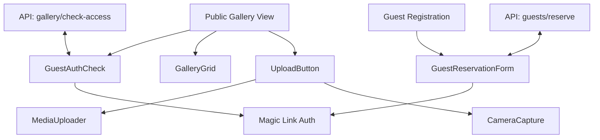

# Session 39 Completion Report
# April 9, 2025
# V 0.8.8

## Completed Components

### Guest Reservation Onboarding
- ✅ Implemented `GuestReservationForm` component with full Zod validation
- ✅ Created guest reservation API endpoint with validation and error handling
- ✅ Integrated magic link authentication for seamless user experience
- ✅ Added guest registration page route with responsive design
- ✅ Implemented proper analytics tracking for guest registrations

### Gallery Setup
- ✅ Implemented public gallery view with conditional authentication
- ✅ Created `GuestAuthCheck` component for unauthorized gallery access
- ✅ Built `MediaUploader` component for gallery uploads
- ✅ Implemented access control system with permissions table
- ✅ Created gallery access check API endpoint

### Camera Activation
- ✅ Implemented `CameraCapture` component for direct photo taking
- ✅ Added front/back camera switching functionality
- ✅ Integrated seamless photo upload from camera
- ✅ Built `UploadButton` component with tabs for media upload and camera capture
- ✅ Implemented proper error handling and user feedback for camera access

### Database Schema
- ✅ Created migration script for `guests` and `gallery_permissions` tables
- ✅ Implemented Row Level Security policies for proper data protection
- ✅ Added database indexes for optimal performance
- ✅ Created analytics tracking function for guest registrations
- ✅ Added proper foreign key constraints and validation

## Component Relationships

## Technical Implementation

### API Routes
1. `/api/gallery/check-access` - Verifies if a guest has access to a gallery
2. `/api/guests/reserve` - Creates a guest reservation and assigns gallery permissions

### Database Tables
1. `guests` - Stores guest information with validation and uniqueness constraints
2. `gallery_permissions` - Maps permissions between guests/users and events

### Frontend Components
1. `GuestAuthCheck` - Authentication form for gallery access
2. `CameraCapture` - Camera access and photo capture functionality
3. `MediaUploader` - File upload component with progress and preview
4. `UploadButton` - Combined media upload experience with tabbed interface
5. `GuestReservationForm` - Guest registration form with validation

## Next Steps

1. **Testing & Validation**
   - Conduct end-to-end testing of all new components
   - Verify camera functionality across browsers and devices
   - Test guest registration flow with various scenarios
   - Validate gallery access controls

2. **Documentation**
   - Update API documentation with new endpoints
   - Create user guides for gallery access and media upload
   - Document component interfaces and props

3. **Further Enhancements**
   - Add image optimization for uploaded photos
   - Implement thumbnail generation service
   - Enhance analytics for guest behavior tracking
   - Improve camera quality options and configurations 