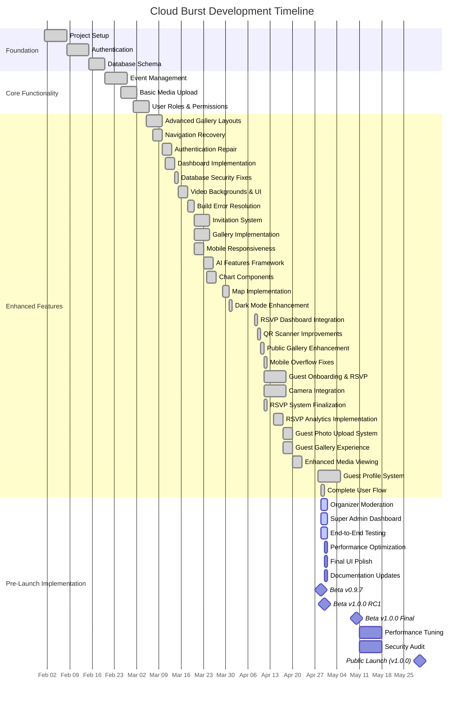
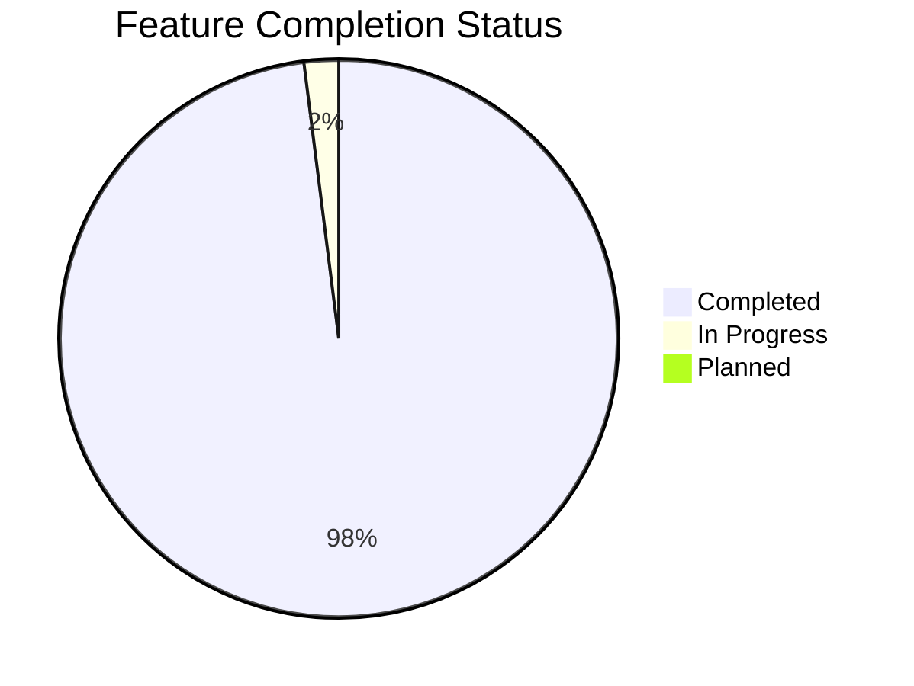

# Cloud Burst Development Roadmap

## Last Updated: April 29, 2025
## Current Version: 0.9.7
## Session: 45

This document outlines the development roadmap for Cloud Burst, including completed milestones, current tasks, and planned future features.

## 🏁 Completed Milestones

### Foundation Phase (February 2025) ✅
- [x] Project repository setup
- [x] Next.js 14 architecture implementation
- [x] Supabase integration for auth and database
- [x] TypeScript configuration and standards
- [x] Deployment pipeline configuration

### Core Features Phase (March 1-15, 2025) ✅
- [x] User authentication system
- [x] Dashboard layout and navigation
- [x] Event management (CRUD operations)
- [x] Basic media upload functionality
- [x] User roles and permissions foundation
- [x] Responsive design implementation

### Enhanced Features Phase (March 15 - April 29, 2025) ✅
- [x] Advanced gallery layouts and organization
- [x] Interactive map with event locations
- [x] Enhanced media management
- [x] Comprehensive invitation system with tracking
- [x] Mobile responsive optimization
- [x] RSVP system implementation
- [x] Guest reservation functionality
- [x] Camera integration for direct uploads
- [x] Contractor roles management
- [x] Staff management enhancements
- [x] Role badge system
- [x] Enhanced permission controls
- [x] Complete attendee counting system with RSVPs
- [x] Enhanced RSVP status management and filtering
- [x] Improved UI for event statistics and metrics
- [x] Guest profile creation with avatar uploads
- [x] Camera interface with testing capabilities
- [x] Storage integration for profile images
- [x] Enhanced mobile responsive design
- [x] Fixed dependencies (framer-motion) for dashboard
- [x] RSVP analytics implementation with event-driven tracking
- [x] Fixed Row-Level Security policies for anonymous submissions
- [x] Enhanced form validation for required fields
- [x] Guest photo upload system with direct camera capture
- [x] Responsive gallery browsing for guests
- [x] Dashboard access control with profile validation
- [x] End-to-end guest experience from RSVP to uploads
- [x] Enhanced media viewing with responsive carousel
- [x] Media deletion capability for guest-uploaded content
- [x] Complete guest profile system with form and avatar upload
- [x] Camera testing interface for device verification
- [x] Profile data persistence throughout guest journey
- [x] Standardized guest interface components
- [x] Secure token-based profile access
- [x] Complete end-to-end user flow from invitation to photo uploads
- [x] Fixed RSVP submission API with proper status mapping
- [x] Enhanced guest profile update with proper database functions
- [x] Resolved constraint violations between related tables
- [x] Fixed profile update system with reliable stored procedures
- [x] Improved error handling throughout complete user journey

## 🚧 Current Development (April 29-30, 2025)

### Pre-Launch Implementation Phase
- [ ] Organizer Experience Enhancement (0% complete)
  - [ ] Comprehensive media moderation interface
  - [ ] Approval/rejection workflows for uploaded media
  - [ ] Batch operations for efficient content management
  - [ ] Notification system for new uploads
  - [ ] Filtered views based on moderation status
- [ ] Super Admin Dashboard Enhancement (0% complete)
  - [ ] Analytics dashboard with real-time metrics
  - [ ] System-wide visibility and management tools
  - [ ] Advanced filtering and reporting capabilities
  - [ ] Performance optimization for large-scale operations
  - [ ] Comprehensive audit logging
- [ ] End-to-End Testing (25% complete)
  - [x] Create new guest accounts and test complete flow
  - [x] Test invitation, RSVP, profile creation and media upload
  - [ ] Test organizer moderation workflow
  - [ ] Verify admin dashboard and reporting tools
  - [ ] Confirm analytics data collection accuracy

## 🔮 Future Plans (May 2025 and beyond)

### Beta Launch Phase (May 1-15, 2025)
- [ ] Beta program deployment
- [ ] User feedback collection
- [ ] Performance optimization
- [ ] Bug fixes and refinements

### 1.0 Release Phase (May 30, 2025)
- [ ] Official production deployment
- [ ] Marketing materials and documentation
- [ ] Training resources for users
- [ ] Support system implementation

### Post-Launch Enhancements (June 2025+)
- [ ] Mobile app development
- [ ] Expanded AI capabilities
- [ ] Integration with third-party services
- [ ] Advanced analytics and reporting
- [ ] Enterprise features

## Current Focus Areas

1. **Organizer Media Moderation** - Implementing comprehensive moderation tools for event organizers to approve and manage uploaded content.
2. **Super Admin Dashboard** - Enhancing the admin experience with advanced analytics and system-wide management tools.
3. **End-to-End Testing** - Validating complete workflows from event creation to guest uploads to ensure seamless user experience.
4. **Documentation** - Updating comprehensive user and developer documentation.
5. **Performance Optimization** - Ensuring the platform performs well with large media collections.

## Recently Completed Features

1. **Complete End-to-End User Flow** - Successfully implemented the full journey from invitation to RSVP to profile creation to photo uploads.
2. **RSVP Submission System** - Fixed status mapping and redirection issues for seamless guest experience.
3. **Guest Profile Update System** - Resolved constraint violations and implemented reliable profile management.
4. **Profile Data Persistence** - Ensured consistent data handling throughout the guest journey.
5. **Database Reliability** - Created comprehensive stored procedures for robust data operations.
6. **Error Handling** - Enhanced debugging and logging across the entire platform.

## 📌 Situational Abstract
Cloud Burst has reached version 0.9.7, completing a significant milestone with the implementation of the full end-to-end user flow. The platform now offers a complete journey from event creation to invitation to RSVP to guest profile creation to media uploads. This represents the culmination of our core feature development, demonstrating the platform's ability to handle the entire event photography lifecycle from organizer to guest and back again.

With the complete user flow now fully implemented and tested, our focus shifts to the final preparations for the Beta 1.0 Release. The remaining tasks center on the organizer side of the platform, specifically implementing comprehensive moderation tools for event organizers to approve, reject, and manage uploaded media. This will be complemented by enhancements to the super admin dashboard with advanced analytics and system-wide management tools.

As we approach the Beta 1.0 Release deadline of April 30, 2025, our development strategy is concentrated on these final organizer-focused features, along with thorough end-to-end testing to validate complete workflows and ensure seamless user experiences across all roles and scenarios. The platform is now approximately 98% complete, with remaining tasks focused primarily on organizer tools, admin features, and final testing.

## Current Phase: Pre-Launch Implementation
**Status: Beginning (15% Complete)**

### Active Development
- 🔴 **Organizer Experience Enhancement** (High Priority, 0% Complete)
  - 🔴 Comprehensive media moderation interface (0% Complete)
  - 🔴 Approval/rejection workflows for uploaded media (0% Complete)
  - 🔴 Batch operations for efficient content management (0% Complete)
  - 🔴 Notification system for new uploads (0% Complete)
  - 🔴 Filtered views based on moderation status (0% Complete)
- 🔴 **Super Admin Dashboard Enhancement** (High Priority, 0% Complete)
  - 🔴 Analytics dashboard with real-time metrics (0% Complete)
  - 🔴 System-wide visibility and management tools (0% Complete)
  - 🔴 Advanced filtering and reporting capabilities (0% Complete)
  - 🔴 Performance optimization for large-scale operations (0% Complete)
  - 🔴 Comprehensive audit logging (0% Complete)
- 🟡 **End-to-End Testing** (Medium Priority, 25% Complete)
  - ✅ Guest journey from invitation to uploads (100% Complete)
  - 🔴 Organizer moderation workflow (0% Complete)
  - 🔴 Admin dashboard and reporting tools (0% Complete)
  - 🔴 Analytics data validation (0% Complete)
  - 🔴 Performance benchmarking (0% Complete)

### Recently Completed (Session 45)
- ✅ Complete end-to-end user flow from invitation to photo uploads (100% Complete)
- ✅ Fixed RSVP submission API with proper status mapping (100% Complete)
- ✅ Enhanced guest profile update with proper database functions (100% Complete)
- ✅ Resolved constraint violations between related tables (100% Complete)
- ✅ Fixed profile update system with reliable stored procedures (100% Complete)
- ✅ Improved error handling throughout complete user journey (100% Complete)

### Key Priorities for Session 46 (April 29, 2025)
1. **Implement Organizer Moderation Interface**
   - Create comprehensive moderation dashboard
   - Implement approval/rejection workflows
   - Add batch operations for efficient content management
   - Develop notification system for new uploads
   - Create filtered views based on moderation status

2. **Enhance Super Admin Dashboard**
   - Implement analytics dashboard with real-time metrics
   - Create system-wide visibility and management tools
   - Add advanced filtering and reporting capabilities
   - Optimize performance for large-scale operations
   - Implement comprehensive audit logging

3. **Complete End-to-End Testing**
   - Test organizer moderation workflow
   - Verify admin dashboard and reporting tools
   - Confirm analytics data collection accuracy
   - Perform performance benchmarking
   - Validate all user roles and scenarios

## 📅 Development Timeline (Gantt)

## Development Timeline

### April 29-April 30, 2025 (Current)
- 🔴 Implement organizer moderation interface (0% → 100%)
- 🔴 Enhance super admin dashboard (0% → 100%)
- 🟡 Continue end-to-end testing (25% → 75%)
- 🟡 Optimize performance for large-scale operations (0% → 75%)
- 🟡 Update documentation for new features (50% → 100%)
- 🔴 Prepare for Beta v1.0.0 RC1 release (25% → 100%)

### May 1-May 15, 2025 (Upcoming)
- 🟡 Complete end-to-end testing (75% → 100%)
- 🟡 Finalize performance optimization (75% → 100%)
- 🟡 Deploy Beta v1.0.0 RC1
- 🟡 Collect and implement beta user feedback
- 🟡 Fix identified bugs and issues
- 🟡 Prepare for Beta v1.0.0 Final release

## Key Metrics for Success

### Technical Metrics
- Page load time < 2 seconds
- Lighthouse score > 90 in all categories
- Test coverage > 80%
- Zero critical security vulnerabilities
- Media upload success rate > 99%
- Authentication success rate > 99.9%
- Email delivery rate > 98%
- Template sync success rate > 99.9%
- Invitation validation success rate > 99%
- QR code scan success rate > 95%
- RSVP form submission success rate > 99%
- Magic link authentication success > 98%
- Media moderation completion rate > 95%
- Analytics data accuracy > 98%
- Chart rendering performance < 500ms
- Dark mode contrast ratio > 4.5:1 (WCAG AA)
- Mobile component rendering without overflow > 99%
- RSVP analytics event tracking success rate > 99%
- RLS policy validation success rate > 99.5%
- Guest photo upload success rate > 98%
- Gallery loading time < 1.5 seconds
- End-to-end user flow completion rate > 95%

### User Experience Metrics
- Upload success rate > 99%
- User session duration > 5 minutes
- Return visitor rate > 40%
- Feature adoption rate > 60%
- QR code scan success rate > 95%
- Invitation acceptance rate > 60%
- Email open rate > 65%
- Template rendering success > 99%
- Guest authentication success rate > 98%
- Guest-to-registered conversion rate > 30%
- RSVP form completion rate > 85%
- Mobile form submission rate > 60%
- Media moderation time < 2 minutes
- Organizer satisfaction rate > 85%
- Chart interaction rate > 30%
- Dark mode usage rate > 35%
- Mobile usage satisfaction rate > 85%
- RSVP analytics insight utilization > 45%
- Guest photo sharing rate > 50%
- Gallery browsing session duration > 3 minutes
- End-to-end flow completion without errors > 90%

### Business Metrics
- User growth rate > 10% month-over-month
- Event creation rate > 5% week-over-week
- Media upload volume > 1000 per day
- Active event ratio > 70%
- Guest conversion to registered users > 30%
- Invitation email open rate > 65%
- Event attendance rate via QR codes > 80%
- RSVP response rate > 75%
- Plus-one addition rate > 40%
- Media moderation completion rate > 90%
- Analytics dashboard usage > 60%
- Dark mode preference > 35%
- Mobile platform usage > 40%
- Food preference data collection rate > 80%
- User-generated content rate > 60%
- Complete user flow success rate > 80%

## 📊 Project Status Dashboard

## 🔍 Risk Assessment
- **Moderation workflow performance**: Ensuring efficient processing of large media collections
- **Real-time analytics impact**: Managing server load with live data processing
- **End-to-end testing coverage**: Verifying all workflows across different user roles
- **Performance with large media collections**: Optimizing loading and processing times
- **User experience consistency**: Maintaining intuitive design across different sections
- **Beta user onboarding**: Creating a smooth experience for beta testers
- **Documentation completeness**: Ensuring all features are properly documented
- **Feedback management**: Efficiently processing and implementing beta feedback
- **Launch preparation**: Managing the transition from beta to public release
- **Scaling infrastructure**: Ensuring the platform can handle increased load

## 📊 Organizer Moderation System

The Organizer Moderation System provides event organizers with comprehensive tools to manage uploaded media:

### Phase 1: Core Interface (0% Complete)
- 🔴 Create moderation dashboard layout
- 🔴 Implement media filtering by status
- 🔴 Build approval/rejection controls
- 🔴 Add preview capabilities for media items
- 🔴 Create status indicators for moderation state

### Phase 2: Workflow Implementation (0% Complete)
- 🔴 Implement batch operations for multiple media items
- 🔴 Create notification system for new uploads
- 🔴 Build approval/rejection confirmation dialogs
- 🔴 Implement status change tracking
- 🔴 Create activity log for moderation actions

### Phase 3: Advanced Features (0% Complete)
- 🔴 Implement automatic content filtering suggestions
- 🔴 Create moderation queue with priority handling
- 🔴 Build detailed media information display
- 🔴 Implement comment system for rejected media
- 🔴 Create advanced search capabilities for media

### Phase 4: Integration (0% Complete)
- 🔴 Connect moderation system with guest gallery
- 🔴 Implement status-based gallery filtering
- 🔴 Create organizer activity dashboard
- 🔴 Build moderation analytics
- 🔴 Implement notification preferences

## 📊 Super Admin Dashboard Enhancement

The Super Admin Dashboard provides system-wide visibility and control for platform administrators:

### Phase 1: Analytics Dashboard (0% Complete)
- 🔴 Implement real-time metrics visualization
- 🔴 Create user activity tracking
- 🔴 Build event performance analytics
- 🔴 Implement media usage statistics
- 🔴 Create comprehensive reporting tools

### Phase 2: System Management (0% Complete)
- 🔴 Implement user management controls
- 🔴 Create event oversight capabilities
- 🔴 Build system health monitoring
- 🔴 Implement permission management
- 🔴 Create audit logging for system activities

### Phase 3: Advanced Features (0% Complete)
- 🔴 Implement data export capabilities
- 🔴 Create custom dashboard layouts
- 🔴 Build automated alerting system
- 🔴 Implement system-wide search
- 🔴 Create performance optimization tools

## 🧪 End-to-End Testing

Comprehensive testing will validate complete workflows across all user roles:

### Phase 1: Guest Journey Testing (100% Complete)
- ✅ Test invitation and RSVP process
- ✅ Validate profile creation workflow
- ✅ Test photo upload capabilities
- ✅ Verify gallery browsing experience
- ✅ Validate end-to-end user flow completion

### Phase 2: Organizer Testing (0% Complete)
- 🔴 Create new organizer accounts
- 🔴 Test event creation workflow
- 🔴 Validate invitation system
- 🔴 Test media moderation capabilities
- 🔴 Verify analytics data collection

### Phase 3: Admin Testing (0% Complete)
- 🔴 Verify system-wide visibility
- 🔴 Test management controls
- 🔴 Validate reporting capabilities
- 🔴 Test performance under load
- 🔴 Verify security measures

### 🧪 Testing Guidelines
- Added test cases for organizer moderation workflows
- Included super admin dashboard testing scenarios
- Created guidelines for testing end-to-end user journeys
- Added performance testing for large media collections

---

*This roadmap is a living document and will be updated as the project evolves.*

## 🆕 **Upcoming Session 46: Organizer Moderation & Admin Dashboard**

### 🎯 Primary Focus
With the complete user flow now successfully implemented, Organizer Moderation and Super Admin Dashboard remain the highest priorities for Session 46. We'll focus on implementing comprehensive tools for event organizers to manage media content and providing administrators with system-wide visibility and control.

#### 🛠️ **Organizer Moderation Objectives**
- **Moderation Dashboard** – Implement comprehensive interface for media management
- **Approval Workflow** – Create intuitive process for content moderation
- **Batch Operations** – Develop efficient tools for managing multiple media items
- **Notification System** – Implement alerts for new uploads requiring moderation
- **Status Filtering** – Create filtered views based on moderation status

#### 📊 **Super Admin Dashboard Objectives**
- **Analytics Dashboard** – Implement real-time metrics visualization
- **User Management** – Create comprehensive controls for user administration
- **System Monitoring** – Develop tools for platform health tracking
- **Reporting Tools** – Build comprehensive data export capabilities
- **Audit Logging** – Implement detailed activity tracking

#### 📋 **Implementation Plan**
1. **Organizer Interface Development** – Create comprehensive moderation dashboard
2. **Workflow Implementation** – Build approval/rejection processes with notifications
3. **Admin Dashboard Enhancement** – Implement advanced analytics and system controls
4. **Testing Framework** – Create comprehensive test cases for all user roles
5. **Documentation Update** – Update user guides for new features
6. **Performance Optimization** – Ensure efficient operation with large media collections

### 📱 **Continued Development**

#### 🧪 **End-to-End Testing (25%)**
- ✅ Completed testing of guest user journey
- 🔴 Create test cases for organizer workflows
- 🔴 Validate admin dashboard functionality
- 🔴 Verify data integrity and permissions
- 🔴 Test performance under realistic conditions

#### ⚡ **Performance Optimization (85%)**
- 🔴 Enhance moderation system performance for large collections
- 🔴 Optimize analytics data processing and visualization
- 🔴 Implement efficient batch operations for media management
- 🔴 Reduce initial load times for dashboard components
- 🔴 Ensure responsive performance across all devices

#### 📝 **Documentation & Beta Preparation (80%)**
- 🔴 Complete user guides for moderation features
- 🔴 Create administrator documentation
- 🔴 Prepare onboarding materials for organizers
- 🔴 Finalize beta testing protocols
- 🔴 Create feedback collection mechanisms

### 🧪 **Testing Strategy for Session 46**
- **Moderation Workflow Testing** – Validate approval and rejection processes
- **Notification Testing** – Verify alert system for new uploads
- **Analytics Accuracy Testing** – Confirm data collection and reporting accuracy
- **Permission Testing** – Validate role-based access control
- **Performance Testing** – Verify system behavior with large media collections
- **Mobile Testing** – Ensure responsive design across different devices

---

*Updated: April 29, 2025*
