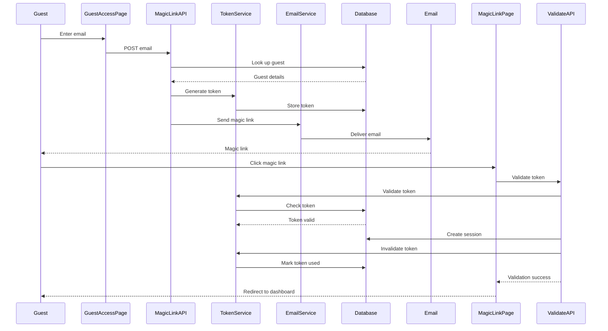

# Guest Magic Link Authentication Feature

> **Version:** 1.0
> **Last Updated:** April 15, 2025

This document outlines the implementation of the guest magic link authentication feature, which allows event guests to access their dashboard without needing to create a full account.

## Overview

The magic link authentication flow allows guests to:

1. Request access using their email address
2. Receive a secure, time-limited magic link via email
3. Click the link to be automatically authenticated and redirected to their dashboard
4. Maintain their session across visits for a limited time

## Technical Implementation

### Components

1. **Guest Access Page** (`/guest-access`):
   - Email input form
   - Success/error states
   - Development mode link display

2. **Magic Link API** (`/api/auth/magic-link`):
   - Email validation
   - Guest lookup
   - Token generation and storage
   - Email sending

3. **Magic Link Validation** (`/api/auth/magic-link/validate`):
   - Token validation
   - Session creation
   - Redirect to dashboard

4. **Token Service** (`/lib/tokens/token-service.ts`):
   - Token generation
   - Token hashing
   - Token storage
   - Token validation
   - Token invalidation

5. **Email Service** (`/lib/email/email-service.ts` and `/lib/email/guest-emails.ts`):
   - Email template rendering
   - SendGrid integration
   - Development mode mocking

6. **Database Schema** (`/supabase/migrations/20250415000000_auth_tokens.sql`):
   - Token storage table
   - Security policies
   - Cleanup automation

### Flow Sequence

## Security Considerations

1. **Token Security**:
   - Tokens are cryptographically secure (32 bytes of entropy)
   - Tokens are hashed using SHA-256 before storage
   - Tokens expire after 24 hours
   - Tokens are single-use only
   - Automatic cleanup of expired tokens

2. **Email Security**:
   - No sensitive information in emails
   - Email sending is rate-limited
   - Success messages don't reveal if an email exists

3. **Session Security**:
   - Sessions expire after 7 days
   - Sessions include guest metadata for validation
   - Protected routes check for authenticated sessions

## Testing

### Unit Tests

- Test token generation and validation
- Test email sending
- Test API endpoints with various inputs

### Integration Tests

- Test the full flow from request to authentication
- Test expired/invalid tokens
- Test multiple requests from same email

### Production Safeguards

- Rate limiting on API endpoints
- Monitoring of token usage
- Alerts for unusual activity

## Deployment

To deploy this feature:

1. Apply the database migration
2. Configure SendGrid API keys
3. Deploy the updated code
4. Verify email templates
5. Test the flow end-to-end

## Future Enhancements

1. Add device fingerprinting for additional security
2. Implement push notifications as an alternative to email
3. Add SMS delivery option for magic links
4. Create admin dashboard for monitoring magic link usage
5. Add guest session management UI 