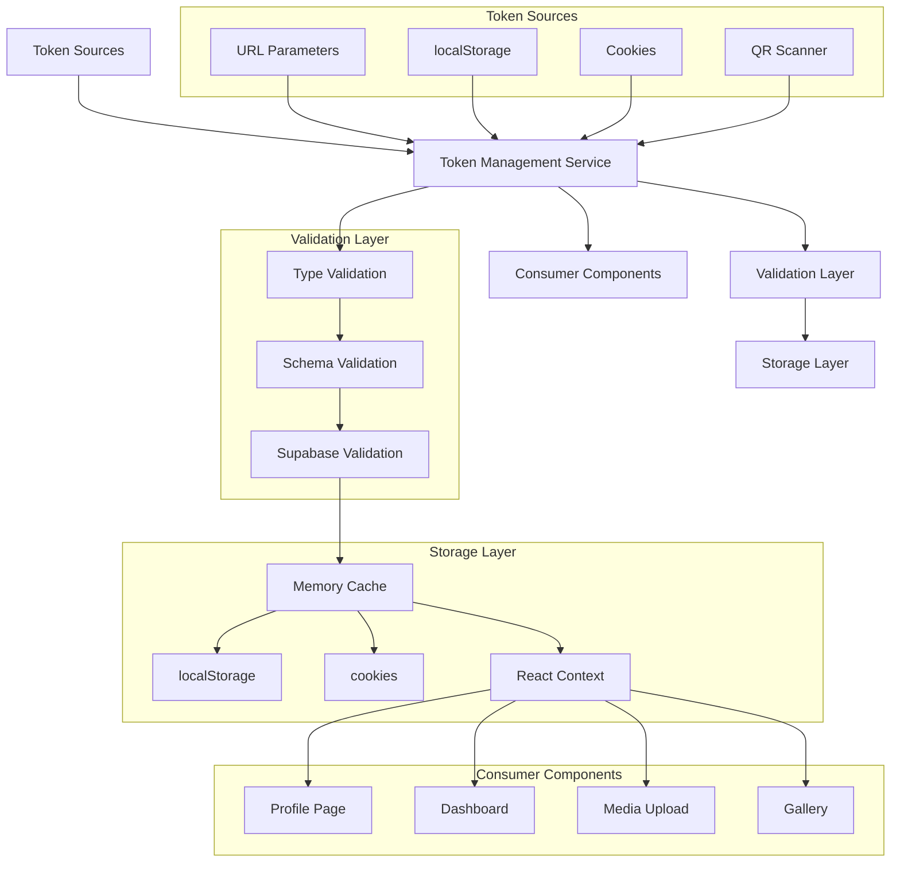

# Token Management System Specification

## System Overview
📅 *Last Updated: April 15, 2025*
📊 *Version: 0.2.0*

The Token Management System (TMS) is a core service for Cloud Burst that provides consistent handling of authentication tokens throughout the guest journey. It addresses critical challenges in maintaining authentication context across page navigation and browser sessions, particularly for invited guests who need to access their profiles, upload media, and view galleries.

## Problem Statement

Current challenges in our token handling include:

1. **Token Persistence**: Authentication context is lost during page navigation
2. **Multiple Sources**: Tokens can come from URL parameters, localStorage, or cookies
3. **Browser Inconsistencies**: Storage mechanisms behave differently across browsers
4. **Missing Error Handling**: Users aren't guided when tokens are missing or invalid
5. **Navigation Flow**: Profile to dashboard navigation drops authentication context
6. **Server-Side Access**: Server components need access to token information
7. **Security Concerns**: Tokens need to be stored and transmitted securely

## System Architecture



## Core Features

### 1. Multi-Source Token Retrieval

The system will attempt to retrieve valid tokens from multiple sources in this priority order:

1. URL parameters (highest priority, most immediate)
2. React Context / Memory (for within-session context)
3. localStorage (for persistent client-side storage)
4. Cookies (for server component access and cross-tab sharing)

Implementation:

```typescript
// src/lib/tokens/invitation-token.ts
export const invitationTokenService = {
  // Get token from multiple sources
  getToken: () => {
    // Check URL params first
    const urlToken = new URLSearchParams(window.location.search).get('token');
    if (urlToken) return urlToken;
    
    // Then localStorage
    const storedToken = localStorage.getItem('invitation_token');
    if (storedToken) return storedToken;
    
    // Then cookies
    const cookies = document.cookie.split(';');
    const tokenCookie = cookies.find(c => c.trim().startsWith('invitation_token='));
    if (tokenCookie) {
      return tokenCookie.split('=')[1];
    }
    
    return null;
  },
}
```

### 2. Redundant Storage Strategy

To maintain session persistence across page navigations, the system will store tokens in multiple locations:

```typescript
// src/lib/tokens/invitation-token.ts
storeToken: (token: string) => {
  // Store in memory/context
  currentToken = token;
  
  // Store in localStorage for persistent client-side access
  try {
    localStorage.setItem('invitation_token', token);
  } catch (error) {
    console.error('Failed to store token in localStorage:', error);
  }
  
  // Store in cookie for server component access
  try {
    document.cookie = `invitation_token=${token}; path=/; max-age=604800; SameSite=Lax`;
  } catch (error) {
    console.error('Failed to store token in cookie:', error);
  }
},
```

### 3. Token Validation

All tokens will be validated before use to ensure they are properly formatted and valid:

```typescript
// src/lib/tokens/invitation-token.ts
validateToken: async (token: string): Promise<ValidationResult> => {
  // Step 1: Basic format validation
  if (!token || typeof token !== 'string' || token.length < 10) {
    return { 
      valid: false, 
      error: 'Invalid token format' 
    };
  }
  
  try {
    // Step 2: Validate with Supabase
    const { data, error } = await supabaseClient
      .from('invitations')
      .select('id, status, event_id, guest_email')
      .eq('token', token)
      .single();
    
    if (error || !data) {
      return { 
        valid: false, 
        error: 'Token not found in database'
      };
    }
    
    // Step 3: Check token status
    if (data.status === 'revoked' || data.status === 'expired') {
      return { 
        valid: false, 
        error: `Token is ${data.status}`
      };
    }
    
    // Valid token with data
    return {
      valid: true,
      data: {
        invitationId: data.id,
        eventId: data.event_id,
        guestEmail: data.guest_email,
        status: data.status
      }
    };
  } catch (error) {
    console.error('Token validation error:', error);
    return { 
      valid: false, 
      error: 'Error validating token'
    };
  }
},
```

### 4. Error Handling

Comprehensive error handling with user-friendly messages:

```typescript
// src/lib/tokens/invitation-token.ts
getTokenWithErrorHandling: async (): Promise<TokenResult> => {
  // Try to get token from available sources
  const token = invitationTokenService.getToken();
  
  if (!token) {
    return { 
      success: false, 
      error: {
        type: 'missing_token',
        message: 'No invitation token found',
        userMessage: 'Your invitation link appears to be incomplete. Please use the complete link from your invitation email.'
      }
    };
  }
  
  // Validate token
  const validation = await invitationTokenService.validateToken(token);
  
  if (!validation.valid) {
    return { 
      success: false, 
      error: {
        type: 'invalid_token',
        message: validation.error,
        userMessage: 'Your invitation link is not valid. Please check your email for the correct link or contact the event organizer.'
      }
    };
  }
  
  // Store valid token for future use
  invitationTokenService.storeToken(token);
  
  return {
    success: true,
    token,
    data: validation.data
  };
},
```

### 5. Token Context Provider

A React Context Provider to make token data available throughout the app:

```typescript
// src/contexts/token-context.tsx
import React, { createContext, useContext, useState, useEffect } from 'react';
import { invitationTokenService } from '@/lib/tokens/invitation-token';

interface TokenContextType {
  token: string | null;
  tokenData: TokenData | null;
  isLoading: boolean;
  error: TokenError | null;
  refreshToken: () => Promise<void>;
}

const TokenContext = createContext<TokenContextType | undefined>(undefined);

export function TokenProvider({ children }: { children: React.ReactNode }) {
  const [token, setToken] = useState<string | null>(null);
  const [tokenData, setTokenData] = useState<TokenData | null>(null);
  const [isLoading, setIsLoading] = useState(true);
  const [error, setError] = useState<TokenError | null>(null);
  
  const loadToken = async () => {
    setIsLoading(true);
    
    const result = await invitationTokenService.getTokenWithErrorHandling();
    
    if (result.success) {
      setToken(result.token);
      setTokenData(result.data);
      setError(null);
    } else {
      setToken(null);
      setTokenData(null);
      setError(result.error);
    }
    
    setIsLoading(false);
  };
  
  // Load token on component mount
  useEffect(() => {
    loadToken();
  }, []);
  
  return (
    <TokenContext.Provider 
      value={{ 
        token, 
        tokenData, 
        isLoading, 
        error, 
        refreshToken: loadToken 
      }}
    >
      {children}
    </TokenContext.Provider>
  );
}

export const useToken = () => {
  const context = useContext(TokenContext);
  
  if (context === undefined) {
    throw new Error('useToken must be used within a TokenProvider');
  }
  
  return context;
};
```

### 6. Integration with QR Scanner

Tokens from QR codes will be immediately stored and validated:

```typescript
// src/components/scanner/SimpleScan.tsx
const handleScan = async (data: string) => {
  if (data) {
    setScanning(false);
    
    // Extract token from QR data
    const token = extractTokenFromQR(data);
    
    if (!token) {
      setError('Invalid QR code format');
      return;
    }
    
    // Store token immediately
    invitationTokenService.storeToken(token);
    
    // Validate token
    const validation = await invitationTokenService.validateToken(token);
    
    if (!validation.valid) {
      setError(`Invalid invitation: ${validation.error}`);
      return;
    }
    
    // Success - navigate to appropriate page with token
    router.push(`/guest/profile?token=${token}`);
  }
};
```

### 7. Profile to Dashboard Navigation

Ensuring token context is maintained during critical navigation paths:

```typescript
// src/components/guest/GuestProfileForm.tsx
const onSubmit = async (values: GuestProfileFormValues) => {
  try {
    setIsSubmitting(true);
    
    // Get token from context
    const { token } = useToken();
    
    if (!token) {
      toast({
        title: 'Missing invitation',
        description: 'Your invitation information is missing. Please return to the invitation page.',
        variant: 'destructive',
      });
      return;
    }
    
    // Save profile data with token
    const result = await saveGuestProfile(values, token);
    
    if (!result.success) {
      toast({
        title: 'Error',
        description: result.error || 'Failed to save profile',
        variant: 'destructive',
      });
      return;
    }
    
    // Navigate to dashboard with token preserved
    router.push(`/guest/dashboard?token=${token}`);
  } catch (error) {
    console.error('Profile submission error:', error);
    toast({
      title: 'Error',
      description: 'An unexpected error occurred',
      variant: 'destructive',
    });
  } finally {
    setIsSubmitting(false);
  }
};
```

### 8. Token Integration with Media Upload

Ensuring media uploads are properly attributed:

```typescript
// src/components/media/UploadManager.tsx
const initializeUpload = async (file: File) => {
  try {
    // Get token from context
    const { token, tokenData } = useToken();
    
    if (!token) {
      setError('Missing authentication. Please return to the event page.');
      return null;
    }
    
    // Create upload request with token context
    const request: InitializeUploadRequest = {
      eventId: tokenData?.eventId || '',
      mediaType: file.type.startsWith('image/') ? 'image' : 'video',
      fileName: file.name,
      fileSize: file.size,
      mimeType: file.type,
      tokenContext: {
        invitationToken: token
      }
    };
    
    const response = await fetch('/api/media/init', {
      method: 'POST',
      headers: {
        'Content-Type': 'application/json',
        'Authorization': `Bearer ${token}`
      },
      body: JSON.stringify(request)
    });
    
    if (!response.ok) {
      throw new Error('Failed to initialize upload');
    }
    
    return await response.json();
  } catch (error) {
    console.error('Upload initialization error:', error);
    setError('Failed to prepare upload. Please try again.');
    return null;
  }
};
```

## Error States & User Feedback

The system will provide clear guidance to users when token-related issues occur:

| Error Type | Technical Reason | User Message | Recovery Action |
|------------|------------------|--------------|-----------------|
| `missing_token` | No token found in any source | "Your invitation link appears to be incomplete" | Provide link to request new invitation |
| `invalid_token` | Token doesn't exist in database | "Your invitation link is not valid" | Contact event organizer |
| `expired_token` | Token has passed expiration date | "Your invitation has expired" | Contact event organizer |
| `revoked_token` | Token was manually revoked | "This invitation has been revoked" | Contact event organizer |
| `validation_error` | Error during validation process | "We couldn't verify your invitation" | Try again or contact support |

## Implementation Plan

### Phase 1: Core Service (April 16, 2025)
- Create `invitation-token.ts` with core functions
- Implement token retrieval from multiple sources
- Implement token storage strategy
- Add validation against Supabase

### Phase 2: React Integration (April 16, 2025)
- Create TokenContext provider
- Build useToken hook
- Implement error handling and user feedback

### Phase 3: Component Integration (April 17, 2025)
- Update profile page to use token service
- Update dashboard to use token service
- Integrate with QR scanner
- Implement proper navigation with token context

### Phase 4: Testing & Refinement (April 17-18, 2025)
- Test token persistence across page refreshes
- Validate token storage in various browsers
- Test error handling and recovery
- Document browser-specific behaviors

## Success Criteria

1. Tokens persist throughout the entire guest journey
2. Authentication context is maintained during navigation
3. Users receive clear guidance when token issues occur
4. Media uploads are properly attributed to guests
5. The system works consistently across Chrome, Safari, and Firefox
6. Server components can access token information when needed

## API Reference

### Types

```typescript
interface TokenData {
  invitationId: string;
  eventId: string;
  guestEmail: string;
  status: string;
}

interface ValidationResult {
  valid: boolean;
  error?: string;
  data?: TokenData;
}

interface TokenError {
  type: 'missing_token' | 'invalid_token' | 'expired_token' | 'revoked_token' | 'validation_error';
  message: string;
  userMessage: string;
}

interface TokenResult {
  success: boolean;
  token?: string;
  data?: TokenData;
  error?: TokenError;
}
```

### Public Methods

| Method | Description | Parameters | Return Type |
|--------|-------------|------------|-------------|
| `getToken()` | Retrieves token from all sources | None | `string \| null` |
| `storeToken(token)` | Stores token in all locations | `token: string` | `void` |
| `validateToken(token)` | Validates token against database | `token: string` | `Promise<ValidationResult>` |
| `clearToken()` | Removes token from all storage | None | `void` |
| `getTokenWithErrorHandling()` | Complete token retrieval with errors | None | `Promise<TokenResult>` |

## Browser Compatibility Notes

### Chrome/Edge
- localStorage and cookies work reliably
- Access can be restricted in Incognito Mode

### Safari
- localStorage has limits in Private Browsing
- Cookies require proper SameSite and Secure flags
- ITP may restrict cookie access

### Firefox
- Similar to Chrome but with stricter privacy controls
- Container tabs may isolate storage contexts

### Mobile Browsers
- iOS WebKit has stricter storage limitations
- Android Chrome generally follows desktop Chrome behavior 