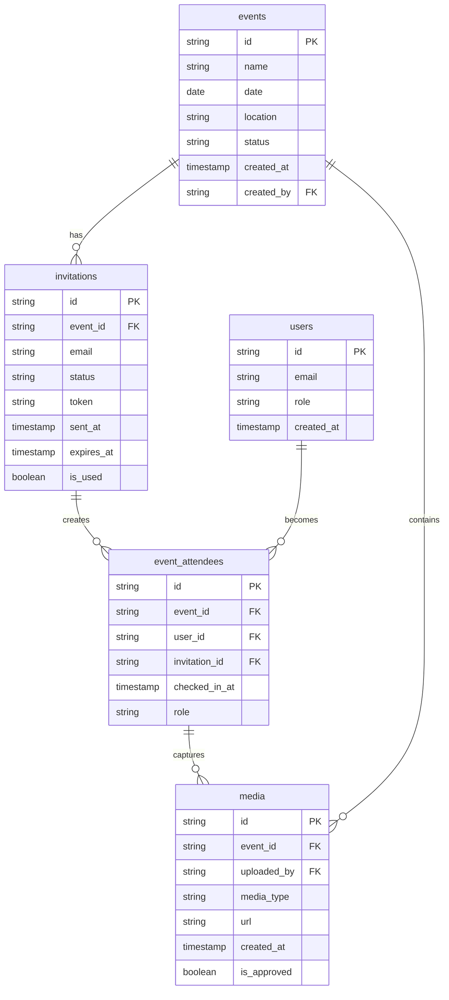

# 📨 **Invitation System Development Plan**

## 📊 Document Information
📅 *April 15, 2025*  
Version: 0.1.0  
Status: Active Development

## 📌 Situational Abstract
The Cloud Burst platform requires a comprehensive invitation system to enhance the event management experience, connecting the pre-event planning phase with seamless event-day experiences. This system will enable event organizers to efficiently manage attendee lists, automate invitation delivery, and provide secure, personalized access to event galleries through QR codes and direct links. The invitation system sits at the intersection of event management, authentication, and media capture workflows, serving as a critical component for platform adoption and user engagement.

## 🎯 Core Objectives
1. Enable event organizers to create, manage, and track guest lists
2. Automate invitation delivery through email integration with Supabase
3. Generate secure, personalized QR codes for event access
4. Track invitation status, RSVPs, and attendee engagement
5. Provide seamless authentication for invited guests
6. Connect invited guests to media they capture during events
7. Support post-event engagement and user conversion

## 🧩 Technical Components

### 1. Invitation Management Interface
- Invite creation form with batch upload capabilities
- Email template selection and customization
- QR code generation and preview
- Invitation status tracking dashboard

### 2. Email Delivery System
- Integration with Supabase Email service
- Customizable email templates with dynamic content
- Tracking for delivery, opens, and clicks

### 3. QR Code System
- Unique QR code generation for each invitation
- Event-level QR code for venue display
- QR code scanning interface in the mobile app
- Security token generation and validation

### 4. Database Schema
- `invitations` table with relationships to events and users
- `event_attendees` table tracking attendance and contributions
- `rsvp_status` enumeration type

### 5. Authentication Flow
- Temporary access tokens for non-registered users
- Account creation flow for invited guests
- Session management and permissions

### 6. User Interface Components
- Invitation management page in the dashboard
- QR code scanning page in the mobile app
- Attendee tracking and metrics visualization
- Guest profile and contribution tracking

## 📝 Implementation Methodology

### Phase 1: Foundation (Week 1-2)
- Update database schema to support invitations
- Create invitation model and database relationships
- Develop API endpoints for invitation CRUD operations
- Implement basic invitation management UI

### Phase 2: Core Functionality (Week 3-4)
- Integrate with Supabase Email service
- Implement email template system
- Develop QR code generation and security token system
- Create QR code scanning interface

### Phase 3: Authentication & Security (Week 5-6)
- Implement invited guest authentication flow
- Create security policies for invitation-based access
- Develop permission scopes for guest users
- Add rate limiting and security measures

### Phase 4: User Experience & Integration (Week 7-8)
- Enhance UI for invitation management
- Add metrics and tracking features
- Implement post-event engagement flows
- Connect invited users to their media contributions

### Phase 5: Testing & Optimization (Week 9-10)
- Comprehensive testing across different user scenarios
- Performance optimization
- Security auditing
- Final UX refinements

## 📊 Database Relationships

## ⏱️ Implementation Timeline

| Phase | Focus | Duration | Dependencies | Deliverables |
|-------|-------|----------|--------------|--------------|
| 1 | Foundation | 2 weeks | Database access | Schema updates, API endpoints, Basic UI |
| 2 | Core Functionality | 2 weeks | Supabase Email access | Email integration, QR system, Scanning interface |
| 3 | Authentication & Security | 2 weeks | Auth middleware | Guest auth flow, Security policies |
| 4 | UX & Integration | 2 weeks | UI components | Enhanced UI, Metrics, Media connections |
| 5 | Testing & Optimization | 2 weeks | All prior phases | Final product, Documentation |

## 🔒 Security Considerations

### Authentication
- Secure token generation for invitations with appropriate expiration
- JWT validation for authenticated sessions
- Rate limiting on invitation creation and usage
- Validation checks for email addresses

### Permission Enforcement
- Row Level Security policies for invitation data
- Role-based access control for invitation management
- Scope-limited permissions for guest users
- Ownership verification for invitation modification

### Data Protection
- Email encryption for stored invitation data
- Secure handling of personal information
- GDPR-compliant data retention policies
- Audit logging for invitation usage

## 🧪 Testing Approach

### Unit Testing
- Token generation and validation
- Email template rendering
- QR code generation and parsing
- Database schema validation

### Integration Testing
- Email delivery workflow
- QR code scanning process
- Authentication flow for guests
- Invitation status updates

### User Acceptance Testing
- End-to-end invitation creation and delivery
- Guest experience from email to event gallery
- Organizer experience for invitation management
- Post-event engagement flow

## 👤 User Experience Considerations

### Event Organizers
- Batch uploading guest lists from CSV
- Customizable email templates with preview
- Real-time tracking of invitation status
- Metrics dashboard for engagement

### Invited Guests
- Clear, branded email invitations
- Simple QR code scanning process
- Seamless authentication flow
- Easy access to captured media

### Walk-in Guests
- Venue-displayed QR code scanning
- Simple registration process
- Immediate access to media capture
- Post-event account creation incentives

## 🔗 Integration Points

### Supabase Auth
- Security token validation
- Guest account creation
- Session management
- Permission enforcement

### Email System
- Template management
- Scheduled delivery
- Tracking and analytics
- Personalized content

### QR Code System
- Token embedding
- Security features
- Scanning interface
- Error handling

### Event Management
- Guest list synchronization
- Attendee tracking
- Status updates
- Metrics integration

## 📈 Success Metrics

### Organizer Efficiency
- Reduction in manual invitation time
- Increased attendee tracking accuracy
- Higher RSVP response rate
- Better attendee management

### Guest Engagement
- Invitation open rate
- QR code usage percentage
- Media contributions per guest
- Account conversion rate

### System Performance
- Email delivery success rate
- QR code scan success rate
- Authentication success rate
- System response times

## 🎯 Conclusion
The Invitation System will serve as a critical component of the Cloud Burst platform, connecting the pre-event planning experience with the event-day media capture flow. By implementing this comprehensive system, we will enhance the value proposition for event organizers while streamlining the experience for guests, ultimately driving platform adoption and user engagement. The phased implementation approach ensures steady progress with clear deliverables, allowing for continuous testing and refinement throughout the development process.

---

## 📝 Change Log
- April 15, 2025: Initial document creation (v0.1.0) 