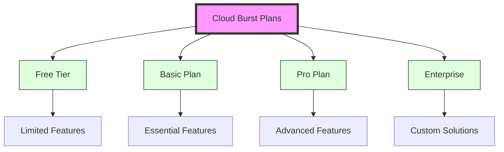

# 💳 **Payment & Subscription Design Document**  

## 📸 Cloud Burst
📅 *Feb 9, 2025*  

---

## 🏦 Introduction  
The **Cloud Burst** subscription and payment system enables event planners, wedding coordinators, and organizers to **seamlessly subscribe and purchase** services.  

💡 *This document outlines the business model, payment rails, and technical architecture required for managing payments.*  

---

## 💰 Subscription Plans  



### 🎟️ **Free Tier**
- **Price**: $0/month
- **Features**:
  - 1 event/month
  - Up to 100 photos/event
  - Basic AI enhancement
  - 7-day gallery access
  - Standard support
- **Ideal for**: Personal events, small gatherings

### 🌟 **Basic Plan**
- **Price**: $29/month
- **Features**:
  - 5 events/month
  - Up to 500 photos/event
  - Advanced AI enhancement
  - 30-day gallery access
  - Email support
  - Basic analytics
- **Ideal for**: Small businesses, wedding photographers

### 🚀 **Pro Plan**
- **Price**: $99/month
- **Features**:
  - Unlimited events
  - Up to 2000 photos/event
  - Premium AI features
  - 90-day gallery access
  - Priority support
  - Advanced analytics
  - Custom branding
- **Ideal for**: Professional photographers, medium events

### 🏢 **Enterprise Plan**
- **Price**: Custom pricing
- **Features**:
  - Unlimited everything
  - Custom retention
  - White-label solution
  - Dedicated support
  - API access
  - Custom integrations
- **Ideal for**: Large organizations, venues

---

## 🛒 Customer Journey & Payment Flow  

### 🏠 **Step 1: Landing & Pricing Page**  
✔️ **Clear subscription pricing & benefits**.  
✔️ Call-to-action: *Subscribe Now* or *Get Started*.  

### 🔑 **Step 2: Account Creation & Plan Selection**  
✔️ New users **sign up or log in**.  
✔️ Select a **subscription plan or pay-per-event option**.  

### 💳 **Step 3: Payment & Checkout**  
✔️ Secure payment form (**Credit/Debit, Apple Pay, Google Pay**).  
✔️ Transaction confirmation & invoice generation.  

### 📊 **Step 4: Subscription Management**  
✔️ Dashboard **integrates billing details & renewal options**.  
✔️ **Notifications for renewals, failed payments, or upgrades**.  

### 📈 **Step 5: Post-Purchase Engagement**  
✔️ Users receive **event performance analytics**.  
✔️ **Support & upgrade options** readily available.  

---

## 🔗 Payment Integration & Security  

### **Preferred Payment Processors**  
✔️ **Stripe** – Robust API & PCI compliance.  
✔️ **PayPal/Braintree** – Alternative payment options.  

### **Payment Methods**  
✔️ **Credit/Debit Cards** – Visa, MasterCard, AMEX.  
✔️ **Digital Wallets** – Apple Pay, Google Pay.  
✔️ **Bank Transfers** – For enterprise clients.  

### **Security Measures**  
✔️ **PCI DSS Compliance** – Secure transactions.  
✔️ **Data Encryption** – Protects sensitive payment info.  
✔️ **Fraud Detection** – Prevents fraudulent transactions.  

---

## 📊 Subscription Management Features  

✔️ **Subscription Dashboard** – View & manage plans.  
✔️ **Upgrade/Downgrade Options** – Flexible plan switching.  
✔️ **Invoice & Billing History** – Downloadable records.  
✔️ **Cancellation & Pause** – Simple account management.  

---

## 🛠️ Architecture & API Endpoints  

```
graph LR
    A[User Interface] --> B[Authentication Module]
    A --> C[Subscription & Payment Form]
    C --> D[Payment Processor (Stripe/PayPal)]
    D --> E[Webhook Listener]
    E --> F[Backend API]
    F --> G[Database (PostgreSQL)]
    F --> H[User Dashboard Integration]
```

---

## 🔮 Future Roadmap  

✔️ **Multi-Currency Support** – Expansion for global payments.  
✔️ **New Payment Methods** – Crypto & regional options.  
✔️ **Metered Billing** – Usage-based pricing for events.  
✔️ **Advanced Analytics** – Deeper insights into user spending.  

---

## 🚀 Conclusion  

Cloud Burst **secure, flexible, and AI-powered** subscription model ensures a **seamless experience for event organizers**. With robust **payment security, flexible pricing, and future-ready features**, Cloud Burst is built for **scalability and innovation**.  

---
