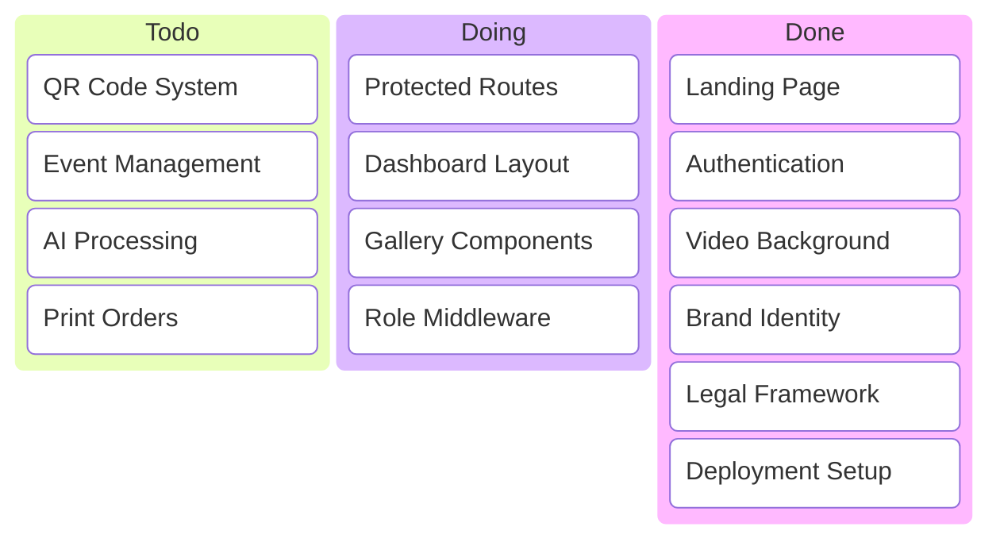
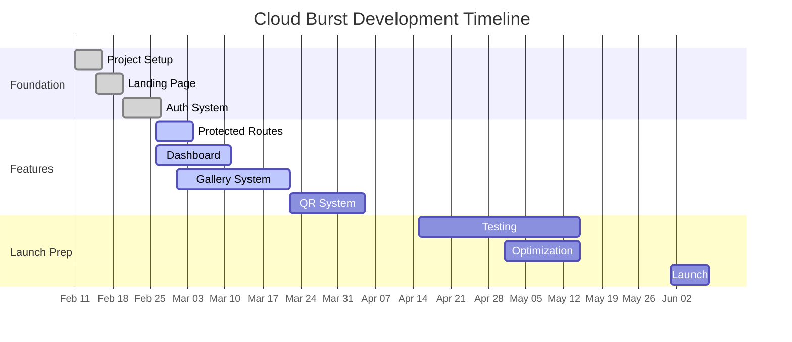

# 🛠️ **Cloud Burst - Development Roadmap**
📊 Overall Project Completion: ~55% [Beta Focus]
📅 February 27, 2024
Version: 0.1.13

## 📌 Situational Abstract
Following successful restoration and deployment optimization, Cloud Burst has pivoted to a streamlined beta approach. The project has achieved stable authentication, optimized Replit deployment, and simplified architecture within memory constraints. This strategic reset positions us to focus on essential beta features while maintaining platform reliability.

With the system now stable and deployed at cb-beta.replit.app, Cloud Burst is positioned to accelerate feature development. The simplified architecture has proven reliable, and our deployment pipeline is working efficiently. Focus is now on implementing core features while maintaining current stability.

## 📊 Project Timeline Overview

| Phase | Timeline | Status | Progress |
|-------|----------|---------|-----------|
| 🏗️ Act I: Foundation | Feb-Mar 2024 | ✅ Complete | 100% |
| ⚙️ Act II: Features | Mar-Apr 2024 | 🟡 Active | 25% |
| 🚀 Act III: Launch | May-Jun 2024 | ⚪ Planned | 0% |

### 📈 Current Sprint Status
## [0.1.13] - 2024-02-24 [FEATURE IMPLEMENTATION]

| Component | Status | Owner | Due Date | Progress |
|-----------|--------|-------|----------|-----------|
| 🔧 Dev Environment | ✅ Done | @mrj0nesmtl | Feb 10, 2024 | 100% |
| 📦 Repository | ✅ Done | @mrj0nesmtl | Feb 10, 2024 | 100% |
| 🎨 UI Framework | ✅ Done | @mrj0nesmtl | Feb 15, 2024 | 100% |
| 🎨 Brand Identity | ✅ Done | @mrj0nesmtl | Feb 15, 2024 | 100% |
| 📜 Legal Framework | ✅ Done | @mrj0nesmtl | Feb 15, 2024 | 100% |
| 💰 Pricing System | ✅ Done | @mrj0nesmtl | Feb 15, 2024 | 100% |
| 🔐 Auth System | ✅ Stable | @mrj0nesmtl | Feb 24, 2024 | 100% |
| 🔐 Protected Routes | 🟡 Active | Mar 5 | 15% |
| 📊 Dashboard | 🟡 Active | @mrj0nesmtl | Mar 15, 2024 | 25% |
| 👥 Role Middleware | ⚪ Planned | Mar 15 | 0% |
| ⚙️ Settings System | 🟡 Active | @mrj0nesmtl | Mar 5, 2024 | 90% |
| 📸 Photo Gallery | 🟡 Starting | @mrj0nesmtl | Mar 30, 2024 | 10% |
| 🎫 QR System | ⚪ Planned | @mrj0nesmtl | Apr 15, 2024 | 0% |

### ⚡ Core Feature Progress
- ✅ Landing page with video background
- ✅ Basic navigation and UI
- ✅ Theme system
- 🟡 Protected routes
- 🟡 Gallery components
- 🟡 Dashboard layout
- ⚪ QR code generation
- ⚪ Event management

## 🎯 Primary Objectives

1. Protected Routes & Auth Flow
   - [ ] Dashboard layout implementation
   - [ ] Role-based middleware
   - [ ] Auth state management
   - [ ] Profile settings

2. Gallery System
   - [ ] Basic upload component
   - [ ] Image optimization pipeline
   - [ ] Gallery grid component
   - [ ] Lightbox viewer

3. QR Code System
   - [ ] QR code generation
   - [ ] Event linking
   - [ ] Access validation
   - [ ] Sharing flow

4. Event Management
   - [ ] Event creation
   - [ ] Guest management
   - [ ] Access controls
   - [ ] Analytics basics

## 🔍 Risk Assessment
- Image handling within memory constraints
- QR code generation performance
- Role-based access complexity
- State management scalability

## 📈 Success Metrics
| Feature | Priority | Complexity | Status |
|---------|----------|------------|---------|
| Auth Flows | High | Medium | In Progress |
| Gallery | High | High | Starting |
| QR System | High | Medium | Planned |
| User Roles | High | Medium | Planned |

## 📝 Notes
- System stable at cb-beta.replit.app
- Memory optimization successful
- Video background implemented
- Feature development accelerating

## 📋 **Kanban Board**

## 📅 **Project Timeline (Gantt)**

--- 