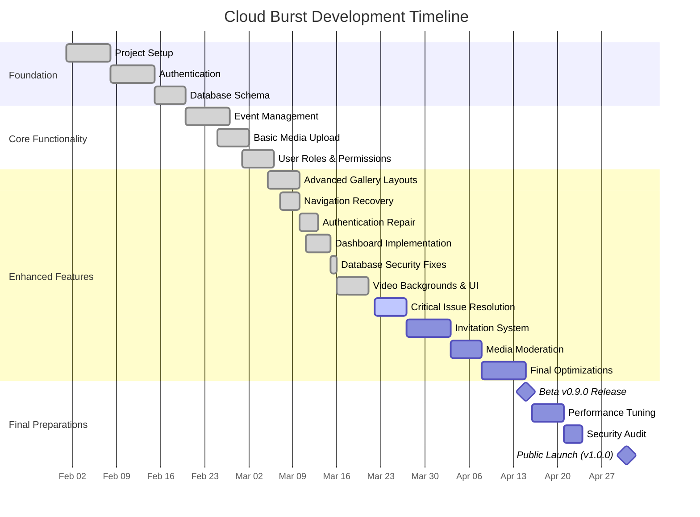
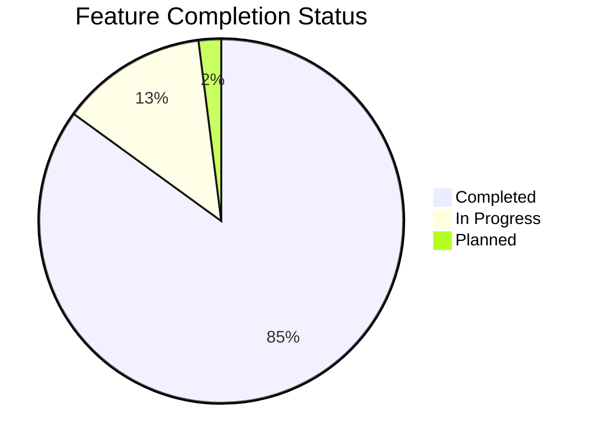

# Cloud Burst Development Roadmap

## Current Version: 0.7.8

## 📌 Situational Abstract
Cloud Burst continues to evolve from concept to a robust beta platform. With the recent addition of video backgrounds, enhanced modal designs, and improved About page content flow, we've made significant visual improvements to the platform. However, we've identified several critical issues that need to be addressed before proceeding with the invitation system implementation.

The platform now offers enhanced visual appeal with video backgrounds for the home and about pages, creating a more engaging user experience. However, authentication state management issues, mobile menu design limitations, visually corrupted information card modals, and access problems with the "Upload Media" feature currently impact usability and functionality.

Through Session 25, we will first focus on resolving these critical issues before proceeding with implementing the invitation system, which will create a direct connection between event planning and media capture capabilities. Once these issues are resolved, we can proceed with the implementation of the invitation management dashboard, email templates, and QR code integration.

As we approach the 85% completion mark of our Enhanced Features phase, our immediate focus is on stabilizing the platform and resolving these identified issues, which is essential for providing a solid foundation for the invitation system and subsequent features.

## Current Phase: Enhanced Features Implementation
**Status: In Progress (85% Complete)**

### Active Development
- 🟡 **Critical Issue Resolution** (New Priority)
  - 🟡 Authentication State Management (70% Complete)
  - 🟡 Mobile Menu Design for Authenticated Users (60% Complete)
  - 🟡 Information Card Modal Redesign (60% Complete)
  - 🟡 Upload Media Feature Access Fix (40% Complete)
- 🟡 Invitation System Implementation (75% Complete)
- 🟡 Media Management & Moderation (65% Complete)
- 🟡 Analytics Data Integration (60% Complete)
- 🟡 User Experience Refinement (80% Complete)
- 🟡 QR Code Security Enhancement (85% Complete)

### Recently Completed
- ✅ Video backgrounds for home and about pages
- ✅ Enhanced Call to Action section on home page
- ✅ Streamlined About page content
- ✅ QR code scanning interface with camera integration
- ✅ Basic invitation management interface
- ✅ Email template integration for invitations
- ✅ Database schema updates for invitation system
- ✅ Authentication flows for invited users
- ✅ Personalized QR code generation

### Next Priorities (v0.7.9)
1. **Fix authentication state management issues**
2. **Redesign modal dialog system for information cards**
3. **Improve mobile menu for authenticated users**
4. **Fix "Upload Media" access issue**
5. Complete invitation tracking and metrics dashboard
6. Enhance media moderation workflow for photos and videos
7. Finalize email delivery system with tracking
8. Implement data integration for Analytics pages
9. Comprehensive security testing for invitation flows
10. Optimize mobile experience for invited guests

## 📅 Development Timeline (Gantt)

```mermaid
gantt
    title Cloud Burst Development Timeline
    dateFormat  YYYY-MM-DD
    axisFormat %b %d
    
    section Foundation
    Project Setup           :done, f1, 2025-02-01, 7d
    Authentication          :done, f2, 2025-02-08, 7d
    Database Schema         :done, f3, 2025-02-15, 5d
    
    section Core Functionality
    Event Management        :done, c1, 2025-02-20, 7d
    Basic Media Upload      :done, c2, 2025-02-25, 5d
    User Roles & Permissions:done, c3, 2025-03-01, 5d
    
    section Enhanced Features
    Advanced Gallery Layouts:done, e1, 2025-03-05, 5d
    Navigation Recovery     :done, e2, 2025-03-07, 3d
    Authentication Repair   :done, e3, 2025-03-10, 3d
    Dashboard Implementation:done, e4, 2025-03-11, 4d
    Database Security Fixes :done, e5, 2025-03-15, 1d
    Video Backgrounds & UI  :done, e6, 2025-03-16, 5d
    Critical Issue Resolution:active, e7, 2025-03-22, 5d
    Invitation System       :e8, 2025-03-27, 7d
    Media Moderation        :e9, 2025-04-03, 5d
    Final Optimizations     :e10, 2025-04-08, 7d
    
    section Final Preparations
    Beta v0.9.0 Release     :milestone, b1, 2025-04-15, 0d
    Performance Tuning      :o1, 2025-04-16, 5d
    Security Audit          :o2, 2025-04-21, 3d
    Public Launch (v1.0.0)  :milestone, l3, 2025-05-01, 0d
```

## Development Timeline

### March 1-14, 2025 (Completed)
- ✅ Implemented event status management
- ✅ Added QR code generation during event creation
- ✅ Enhanced QR code page layout
- ✅ Created Add Attendee dialog
- ✅ Fixed QR codes not appearing in listing page
- ✅ Fixed database functions with mutable search paths
- ✅ Implemented RLS policies for role_capabilities table
- ✅ Enhanced permissions caching to reduce API calls

### March 15-21, 2025 (Completed)
- ✅ Added video backgrounds to home and about pages
- ✅ Improved Call to Action sections with consistent styling
- ✅ Enhanced modal dialog design (requires further improvement)
- ✅ Streamlined About page by removing redundant Vision section
- ✅ Updated CHANGELOG and documentation

### March 22-26, 2025 (Current)
- 🟡 Fixing authentication state management issues
- 🟡 Redesigning modal dialog system for information cards
- 🟡 Improving mobile menu for authenticated users
- 🟡 Fixing "Upload Media" feature access issue

### March 27 - April 7, 2025 (Upcoming)
- Implementing invitation management dashboard
- Creating invitation database schema
- Developing email template integration
- Implementing invitation metrics tracking
- Enhancing QR code security and validation
- Developing API endpoints for invitation management

### April 8-14, 2025
- Finalize invitation tracking dashboard
- Complete media moderation system
- Email tracking and metrics implementation
- Security audit for invitation flows
- Final UI/UX refinements
- Performance optimization
- Final testing for Beta 0.9.0

### April 15, 2025
- Beta 0.9.0 release
- Comprehensive user acceptance testing
- Bug fixes and refinements
- Final documentation updates

### May 1, 2025
- Public launch (v1.0.0)
- Marketing and growth initiatives
- Community building

## Detailed Phase Breakdown

### Phase 1: Foundation (Completed Feb 1-15, 2025)
- ✅ Project initialization with Next.js 14
- ✅ Basic UI components and layout
- ✅ Authentication system integration
- ✅ Database schema design
- ✅ Storage configuration

### Phase 2: Core Functionality (Completed Feb 15-Mar 1, 2025)
- ✅ Event creation and management
- ✅ Basic media upload
- ✅ Simple gallery view
- ✅ User roles and permissions
- ✅ Public/private event settings

### Phase 3: Enhanced Features (Current - 85% Complete)
- ✅ Advanced gallery layouts (grid, masonry, slideshow)
- ✅ Navigation system recovery and enhancement
- ✅ Authentication system repair
- ✅ Dashboard foundation with key components
- ✅ Create Event interface with advanced options
- ✅ Event status management with selector component
- ✅ QR code generation during event creation
- ✅ Add Attendee dialog functionality
- ✅ Database security fixes and optimizations
- ✅ Video upload and playback support
- ✅ QR scanning interface with camera integration
- ✅ Video backgrounds for enhanced visual experience
- 🟡 Authentication state management (70% Complete - Critical)
- 🟡 Mobile menu design for authenticated users (60% Complete - Critical)
- 🟡 Information card modal redesign (60% Complete - Critical)
- 🟡 Upload media feature access fix (40% Complete - Critical)
- 🟡 Invitation system (75% Complete)
- 🟡 Email template integration (90% Complete)
- 🟡 Media moderation system (65% Complete)
- 🟡 Invitation tracking dashboard (55% Complete)
- 🟡 Analytics data integration (60% Complete)

### Phase 4: Final Preparations (Apr 8-30, 2025)
- 🟡 Performance optimization (In Progress)
- 🟡 Security audit (Planned)
- 🟡 Documentation completion (In Progress)
- 🟡 Final testing (Planned)
- 🟡 Deployment preparation (Planned)

## Key Metrics for Success

### Technical Metrics
- Page load time < 2 seconds
- Lighthouse score > 90 in all categories
- Test coverage > 80%
- Zero critical security vulnerabilities
- Media upload success rate > 99%
- Authentication state persistence success rate > 99.9%

### User Experience Metrics
- Upload success rate > 99%
- User session duration > 5 minutes
- Return visitor rate > 40%
- Feature adoption rate > 60%
- QR code scan success rate > 95%
- Invitation acceptance rate > 60%
- Authenticated navigation success rate > 99%

### Business Metrics
- User growth rate > 10% month-over-month
- Event creation rate > 5% week-over-week
- Media upload volume > 1000 per day
- Active event ratio > 70%
- Guest conversion to registered users > 30%
- Invitation email open rate > 65%

## 📊 Project Status Dashboard

```mermaid
pie title Feature Completion Status
    "Completed" : 85
    "In Progress" : 13
    "Planned" : 2
```

## 🔍 Risk Assessment
- **Authentication state management**: Ensuring consistent user state across navigation
- **Modal dialog design**: Creating visually appealing and properly formatted information cards
- **Mobile menu functionality**: Providing consistent experience for authenticated mobile users
- **Upload feature access**: Resolving permission issues with media uploads
- **Media moderation**: Ensuring appropriate content filtering for photos and videos
- **Storage management**: Implementing efficient storage and retrieval mechanisms
- **Upload reliability**: Creating a robust upload system with error handling
- **Mobile experience**: Optimizing the QR scanning and gallery experience for mobile devices
- **Invitation security**: Ensuring secure token generation and validation
- **Email deliverability**: Maintaining high delivery rates for invitations
- **Analytics accuracy**: Ensuring data reliability and meaningful insights
- **User conversion**: Converting invited guests to registered users

## 📨 Invitation System Implementation

The invitation system is a critical component connecting the pre-event planning phase with the event-day experience. Before implementation, we must first resolve the identified critical issues. Our implementation will then follow a phased approach:

### Phase 0: Critical Issue Resolution (New - 0% Complete)
- 🟡 Fix authentication state management
- 🟡 Redesign information card modals
- 🟡 Improve mobile menu for authenticated users
- 🟡 Restore "Upload Media" functionality

### Phase 1: Foundation (75% Complete)
- ✅ Database schema with invitations table
- ✅ Event-attendee relationships
- ✅ API endpoints for invitation management
- ✅ Basic invitation management UI
- ✅ QR code scanning interface
- 🟡 Security token generation and validation

### Phase 2: Core Functionality (70% Complete)
- ✅ Email template integration
- ✅ QR code generation system
- 🟡 Email delivery system
- 🟡 Tracking mechanisms for opens and clicks

### Phase 3: Authentication & Security (80% Complete)
- ✅ Guest authentication flow
- ✅ Temporary access tokens
- ✅ Role-based security policies
- 🟡 Rate limiting for invitation system

### Phase 4: User Experience (55% Complete)
- 🟡 Enhanced invitation management UI
- 🟡 Metrics dashboard for organizers
- 🟡 User profile for invited guests
- 🟡 Post-event engagement features

This comprehensive system will enhance the value proposition for event organizers while streamlining the experience for guests, ultimately driving platform adoption and user engagement.
