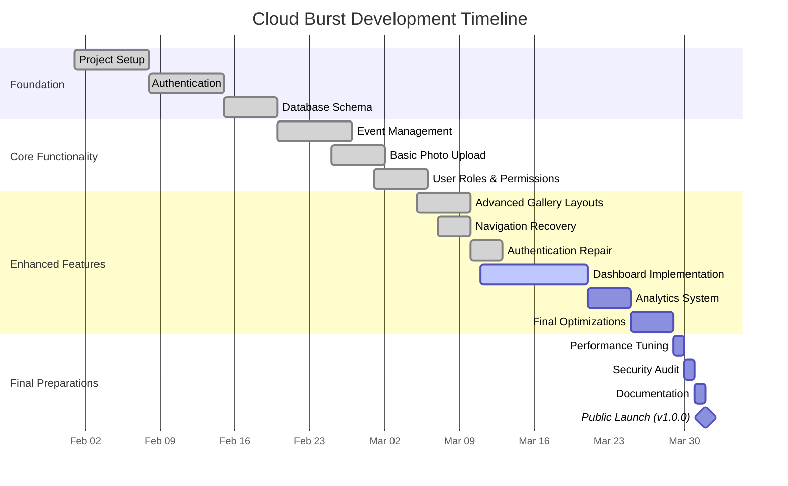
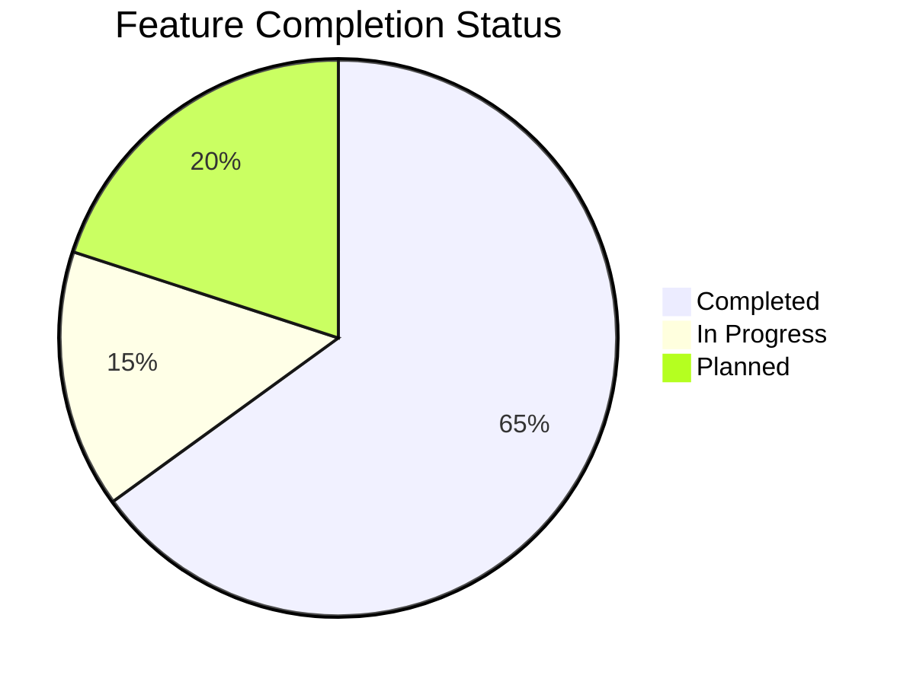

# Cloud Burst Development Roadmap

## Current Version: 0.7.4

## 📌 Situational Abstract
Cloud Burst has evolved from concept to a robust beta platform in a remarkably short timeframe since its inception in February 2025. With the successful implementation of custom event URLs, advanced gallery layouts, and tag-based organization, we've established a solid foundation for our event photography platform. The recent focus on TypeScript strict mode compliance has improved code quality and reliability, setting the stage for more advanced features.

Our platform now offers photographers and event organizers powerful tools to create, manage, and share event galleries with intuitive interfaces. The role-based access control system ensures appropriate permissions across different user types, while our gallery components provide flexible viewing options that adapt to various devices and preferences.

Through Session 21, we successfully resolved significant authentication system issues and improved the dashboard foundation with Activity Feed and Quick Actions components. Our comprehensive sidebar navigation structure now provides clear pathways to all planned functionality, though most sidebar items still require implementation.

As we approach the 65% completion mark of our Enhanced Features phase, we're preparing for Session 22 which will focus on implementing the complete dashboard functionality for event organizers, bringing each sidebar navigation item to life. This ambitious implementation phase will take us to approximately 85% completion, with only Analytics and final optimizations remaining before our April 1, 2025 launch date.

The platform maintains excellent performance within our memory constraints, demonstrating the effectiveness of our optimization strategies. Our systematic approach to dashboard completion will deliver a seamless, professional-grade event photography platform that transforms how photographers and clients collaborate around life's most precious moments.

## Current Phase: Enhanced Features Implementation
**Status: In Progress (65% Complete)**

### Active Development
- ⚠️ Event Organizer Dashboard Implementation (In Progress)
- ⚠️ All Events, Templates, and Overview pages (Planned)
- ⚠️ Attendee Management and QR Code systems (Planned)
- ⚠️ Gallery Management and Photo Moderation (Planned)

### Recently Completed
- ✅ Authentication system repair with improved styling
- ✅ Create Event functionality with basic and advanced settings
- ✅ Dashboard foundation with Activity Feed and Quick Actions
- ✅ Navigation system and comprehensive sidebar
- ✅ Form validation and error handling improvements

### Next Priorities (v0.8.0)
1. Complete dashboard features for event organizers
2. Implement complete event management workflow
3. Create attendee invitation and tracking system
4. Build photo gallery organization and moderation
5. Develop settings and user preference management

## 📅 Development Timeline (Gantt)

```mermaid
gantt
    title Cloud Burst Development Timeline
    dateFormat  YYYY-MM-DD
    axisFormat %b %d
    
    section Foundation
    Project Setup           :done, f1, 2025-02-01, 7d
    Authentication          :done, f2, 2025-02-08, 7d
    Database Schema         :done, f3, 2025-02-15, 5d
    
    section Core Functionality
    Event Management        :done, c1, 2025-02-20, 7d
    Basic Photo Upload      :done, c2, 2025-02-25, 5d
    User Roles & Permissions:done, c3, 2025-03-01, 5d
    
    section Enhanced Features
    Advanced Gallery Layouts:done, e1, 2025-03-05, 5d
    Navigation Recovery     :done, e2, 2025-03-07, 3d
    Authentication Repair   :done, e3, 2025-03-10, 3d
    Dashboard Implementation:active, e4, 2025-03-11, 10d
    Analytics System        :e5, 2025-03-21, 4d
    Final Optimizations     :e6, 2025-03-25, 4d
    
    section Final Preparations
    Performance Tuning      :o1, 2025-03-29, 1d
    Security Audit          :o2, 2025-03-30, 1d
    Documentation           :l2, 2025-03-31, 1d
    Public Launch (v1.0.0)  :milestone, l3, 2025-04-01, 0d
```

## Development Timeline

### March 1-10, 2025 (Previous)
- ✅ Resolved navigation system issues
- ✅ Repaired authentication system
- ✅ Enhanced dashboard foundation
- ✅ Improved Create Event interface
- ✅ Fixed styling and layout issues

### March 11-20, 2025 (Current)
- Dashboard implementation for event organizers
- Complete event management workflows
- Attendee management and QR code systems
- Gallery management and photo moderation
- Settings and user preference management

### March 21-31, 2025 (Upcoming)
- Analytics system implementation
- Performance optimization
- Security audit and hardening
- Final documentation
- Pre-launch preparations

### April 1, 2025
- Public launch (v1.0.0)
- Marketing and growth initiatives
- Community building

## Detailed Phase Breakdown

### Phase 1: Foundation (Completed Feb 1-15, 2025)
- ✅ Project initialization with Next.js 14
- ✅ Basic UI components and layout
- ✅ Authentication system integration
- ✅ Database schema design
- ✅ Storage configuration

### Phase 2: Core Functionality (Completed Feb 15-Mar 1, 2025)
- ✅ Event creation and management
- ✅ Basic photo upload
- ✅ Simple gallery view
- ✅ User roles and permissions
- ✅ Public/private event settings

### Phase 3: Enhanced Features (Current - 65% Complete)
- ✅ Advanced gallery layouts (grid, masonry, slideshow)
- ✅ Navigation system recovery and enhancement
- ✅ Authentication system repair
- ✅ Dashboard foundation with key components
- ✅ Create Event interface with advanced options
- ⚠️ Complete event management dashboard (In Progress)
- ⚠️ Attendee management system (Planned)
- ⚠️ Photo organization and moderation (Planned)
- ⚠️ Analytics and reporting (Planned)

### Phase 4: Final Preparations (Mar 25-Apr 1, 2025)
- ⚠️ Performance optimization
- ⚠️ Security audit
- ⚠️ Documentation completion
- ⚠️ Final testing
- ⚠️ Deployment preparation

## Key Metrics for Success

### Technical Metrics
- Page load time < 2 seconds
- Lighthouse score > 90 in all categories
- Test coverage > 80%
- Zero critical security vulnerabilities

### User Experience Metrics
- Upload success rate > 99%
- User session duration > 5 minutes
- Return visitor rate > 40%
- Feature adoption rate > 60%

### Business Metrics
- User growth rate > 10% month-over-month
- Event creation rate > 5% week-over-week
- Photo upload volume > 1000 per day
- Active event ratio > 70%

## 📊 Project Status Dashboard

```mermaid
pie title Feature Completion Status
    "Completed" : 65
    "In Progress" : 15
    "Planned" : 20
```

## 🔍 Risk Assessment
- **Implementation timeline**: Dashboard functionality requires significant development effort
- **Feature consistency**: Ensuring uniform experience across all dashboard sections
- **Technical integration**: Connecting all features to Supabase backend seamlessly
- **Mobile responsiveness**: Maintaining consistent experience across diverse device types
- **Performance with large datasets**: Ensuring fast performance with numerous events and photos
- **User onboarding**: Creating intuitive first-time experiences for each dashboard section
