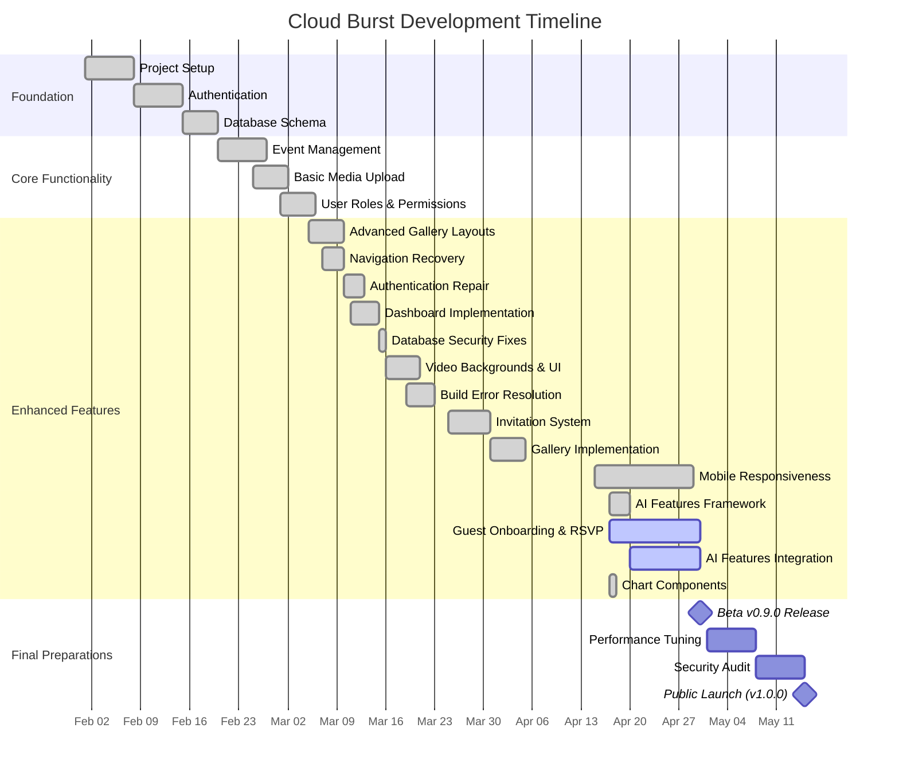
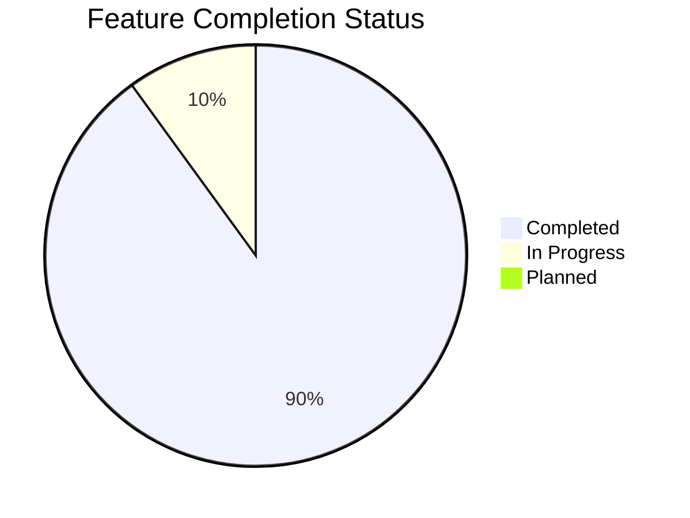

# Cloud Burst Development Roadmap

## Current Version: 0.8.3

## 📌 Situational Abstract
Cloud Burst has entered a critical phase with the implementation of the AI Features framework in version 0.8.3, establishing the foundation for intelligent media processing capabilities. With the successful completion of mobile responsiveness optimization in Session 31 and chart component implementation in Session 33, we've significantly improved the platform's usability, data visualization capabilities, and expanded its feature set with AI-powered components.

The platform now offers a robust event management system with proper role-based access control, enhanced navigation patterns, secure authentication flows, fully responsive layouts across all pages, a complete invitation system with SendGrid integration, and a comprehensive framework for AI features. Recent achievements include the successful implementation of the AI Features section in the sidebar, creation of placeholder pages for five key AI capabilities (Facial Recognition, Enhancements, Product Placements, Smart Tagging, and AI Studio), and development of chart components for data visualization.

As we continue Session 33 and prepare for Session 34, our focus shifts to completing the Guest Onboarding & RSVP Flow implementation while beginning the integration of AI capabilities with the media processing pipeline. These features are critical for our upcoming Beta 0.9.0 release scheduled for April 30, 2025. Our immediate priority is delivering these key features while maintaining the platform's stability, performance, and mobile responsiveness.

## Current Phase: Guest Onboarding & RSVP Flow Implementation with AI Features Integration
**Status: In Progress (20% Complete)**

### Active Development
- 🟡 **Guest Onboarding & RSVP Flow** (High Priority)
  - 🟡 Design RSVP user flow with state diagram (20% Complete)
  - 🟡 Enhance invitation database schema for RSVP tracking (20% Complete)
  - 🟡 Create RSVP form component with Zod validation (10% Complete)
  - 🟡 Implement magic link authentication for invitees (0% Complete)
  - 🟡 Build API endpoints for RSVP management (0% Complete)
  - 🟡 Create middleware for magic link validation (0% Complete)
  - 🟡 Design and implement RSVP status dashboard (0% Complete)
- 🟡 **AI Features Integration** (Medium Priority)
  - ✅ Create AI Features section in sidebar navigation (100% Complete)
  - ✅ Implement layout structure for AI features (100% Complete) 
  - ✅ Build placeholder pages for AI capabilities (100% Complete)
  - 🟡 Set up backend architecture for AI processing (0% Complete)
  - 🟡 Integrate TensorFlow.js for client-side processing (0% Complete)
  - 🟡 Create basic facial detection component (0% Complete)
  - 🟡 Implement media enhancement pipeline (0% Complete)
- 🟡 **QR Code & Camera Implementation** (Medium Priority)
  - ✅ Create QR code generation service (100% Complete)
  - ✅ Implement QR code scanner component (100% Complete)
  - ✅ Add camera permission handling (100% Complete)
  - 🟡 Build token validation for scanned QR codes (0% Complete)
  - 🟡 Create camera access hook for media capture (0% Complete)
  - 🟡 Implement photo capture UI for mobile (0% Complete)
- 🟡 **Analytics & Tracking** (Medium Priority)
  - ✅ Implement chart components for data visualization (100% Complete)
  - 🟡 Implement invitation open tracking (0% Complete)
  - 🟡 Add QR code scan analytics (0% Complete)
  - 🟡 Create RSVP conversion metrics (0% Complete)
  - 🟡 Build dashboard for invitation effectiveness (0% Complete)
- 🟡 **Mobile Responsiveness** (Low Priority)
  - ✅ Overview Dashboard mobile (100% Complete)
  - ✅ Manage Events mobile (100% Complete)
  - ✅ Create Event mobile (100% Complete)
  - ✅ All Guests Invitations mobile (100% Complete)
  - ✅ QR Codes mobile (100% Complete)
  - ✅ Gallery (All Media) mobile (100% Complete)
  - ✅ Gallery (Event Galleries) mobile (100% Complete)
  - ✅ Gallery (Albums) mobile (100% Complete)
  - ✅ Moderation mobile (100% Complete)
  - 🟡 Engagement (Analytics) mobile (50% Complete)
  - 🟡 Performance optimization for mobile network conditions (0% Complete)

### Recently Completed (Session 33)
- ✅ Added AI Features section to sidebar navigation with appropriate icons
- ✅ Created layout structure for AI features section with tab navigation
- ✅ Implemented placeholder pages for five key AI features (Facial Recognition, Enhancements, Product Placements, Smart Tagging, AI Studio)
- ✅ Created chart components for data visualization with proper TypeScript support
- ✅ Fixed linter errors in chart implementation
- ✅ Added proper typing for chart components and functions
- ✅ Created reusable chart config interface for consistent styling
- ✅ Enhanced error handling in gallery components
- ✅ Standardized UI patterns across AI feature pages
- ✅ Implemented "Coming Soon" and "Beta" badges for feature status indication

### Recently Completed (Session 31)
- ✅ Implemented mobile-first responsive design across dashboard pages
- ✅ Fixed layout issues in Gallery (All Media) page and enhanced overflow handling
- ✅ Created responsive stacking for Gallery Event Cards
- ✅ Enhanced responsive design of event details pages
- ✅ Fixed runtime errors in gallery components
- ✅ Improved mobile navigation and interaction targets
- ✅ Enhanced QR code display for mobile devices
- ✅ Implemented responsive masonry grid that adapts to screen size
- ✅ Created API route for gallery events data
- ✅ Resolved TypeScript linting errors across the codebase
- ✅ Improved touch targets and accessibility for mobile users
- ✅ Enhanced mobile-specific menu components and navigation patterns

### Next Priorities (Session 34)
1. **Complete RSVP System Implementation**
   - Finalize RSVP user flow with state diagram
   - Complete invitation database schema enhancements for RSVP tracking
   - Build responsive RSVP form component with Zod validation
   - Implement magic link authentication for invitees
   - Create API endpoints for RSVP management

2. **Begin AI Features Integration**
   - Set up the backend architecture for AI processing
   - Integrate TensorFlow.js for client-side AI processing
   - Create image analysis utilities
   - Implement basic facial detection component
   - Develop media enhancement pipeline

3. **Enhance Analytics Dashboard**
   - Integrate chart components with real data
   - Implement event engagement metrics
   - Create media analytics visualization
   - Build invitation response tracking
   - Develop conversion metrics dashboard

4. **Camera Integration**
   - Build token validation for scanned QR codes
   - Create camera access hook for media capture
   - Implement photo capture UI for mobile
   - Add camera control components
   - Create media upload pipeline

5. **Finalize Mobile Responsiveness**
   - Complete Analytics page mobile optimization
   - Implement responsive charts for mobile
   - Optimize image loading for mobile networks
   - Enhance touch interactions for media components
   - Add offline capability for essential features

## 📅 Development Timeline (Gantt)

```mermaid
gantt
    title Cloud Burst Development Timeline
    dateFormat  YYYY-MM-DD
    axisFormat %b %d
    
    section Foundation
    Project Setup           :done, f1, 2025-02-01, 7d
    Authentication          :done, f2, 2025-02-08, 7d
    Database Schema         :done, f3, 2025-02-15, 5d
    
    section Core Functionality
    Event Management        :done, c1, 2025-02-20, 7d
    Basic Media Upload      :done, c2, 2025-02-25, 5d
    User Roles & Permissions:done, c3, 2025-03-01, 5d
    
    section Enhanced Features
    Advanced Gallery Layouts:done, e1, 2025-03-05, 5d
    Navigation Recovery     :done, e2, 2025-03-07, 3d
    Authentication Repair   :done, e3, 2025-03-10, 3d
    Dashboard Implementation:done, e4, 2025-03-11, 4d
    Database Security Fixes :done, e5, 2025-03-15, 1d
    Video Backgrounds & UI  :done, e6, 2025-03-16, 5d
    Build Error Resolution  :done, e7, 2025-03-19, 4d
    Invitation System       :done, e8, 2025-03-25, 6d
    Gallery Implementation  :done, e9, 2025-03-31, 5d
    Mobile Responsiveness   :done, e10, 2025-04-15, 14d
    AI Features Framework   :done, e11, 2025-04-17, 3d
    Guest Onboarding & RSVP :active, e12, 2025-04-17, 13d
    AI Features Integration :active, e13, 2025-04-20, 10d
    Chart Components        :done, e14, 2025-04-17, 1d
    
    section Final Preparations
    Beta v0.9.0 Release     :milestone, b1, 2025-04-30, 0d
    Performance Tuning      :o1, 2025-05-01, 7d
    Security Audit          :o2, 2025-05-08, 7d
    Public Launch (v1.0.0)  :milestone, l3, 2025-05-15, 0d
```

## Development Timeline

### April 17-April 20, 2025 (Current)
- 🟡 Design RSVP user flow with state diagram
- 🟡 Enhance invitation database schema for RSVP tracking
- 🟡 Create RSVP form component with Zod validation
- 🟡 Set up backend architecture for AI processing
- 🟡 Integrate TensorFlow.js for client-side processing
- 🟡 Build token validation for scanned QR codes
- 🟡 Complete Engagement (Analytics) mobile responsiveness

### April 21-April 30, 2025 (Upcoming)
- 🟡 Implement magic link authentication for invitees
- 🟡 Build API endpoints for RSVP management
- 🟡 Create middleware for magic link validation
- 🟡 Design and implement RSVP status dashboard
- 🟡 Create camera access hook for media capture
- 🟡 Implement photo capture UI for mobile
- 🟡 Create basic facial detection component
- 🟡 Implement media enhancement pipeline

### May 1-15, 2025 (Upcoming)
- Performance optimizations for all components
- Comprehensive security audit
- Final polish and user experience refinements
- Complete documentation and user guides
- Public launch preparation
- Marketing materials and promotional content

## Detailed Phase Breakdown

### Phase 1: Foundation (Completed Feb 1-15, 2025)
- ✅ Project initialization with Next.js 14
- ✅ Basic UI components and layout
- ✅ Authentication system integration
- ✅ Database schema design
- ✅ Storage configuration

### Phase 2: Core Functionality (Completed Feb 15-Mar 1, 2025)
- ✅ Event creation and management
- ✅ Basic media upload
- ✅ Simple gallery view
- ✅ User roles and permissions
- ✅ Public/private event settings

### Phase 3: Enhanced Features (Mar 1-Apr 30, 2025)
- ✅ Advanced gallery layouts foundation
- ✅ Navigation system enhancement
- ✅ Authentication system improvements
- ✅ Dashboard foundation with key components
- ✅ Create Event interface with advanced options
- ✅ Event status management with selector component
- ✅ QR code generation during event creation
- ✅ Add Attendee dialog functionality
- ✅ Database security fixes and optimizations
- ✅ Video upload and playback support
- ✅ QR scanning interface with camera integration
- ✅ Video backgrounds for enhanced visual experience
- ✅ Email template system foundation
- ✅ Authentication error handling
- ✅ Event visibility improvements
- ✅ Permission fixes and debugging
- ✅ UI enhancements for light mode
- ✅ Build error resolution
- ✅ Comprehensive invitation system implementation
- ✅ SendGrid integration for email delivery
- ✅ Enhanced form validation and error handling
- ✅ API endpoint security for invitations
- ✅ Gallery implementation with masonry layout
- ✅ Mobile responsiveness optimization across all pages
- ✅ AI features framework implementation
- ✅ Chart components for data visualization
- 🟡 RSVP system implementation
- 🟡 Magic link authentication for guests
- 🟡 AI features integration with media processing

### Phase 4: Guest Onboarding & RSVP Flow with AI Integration (Current - Apr 17-30, 2025)
- 🟡 Design RSVP user flow with state diagram (20% Complete)
- 🟡 Enhance invitation database schema for RSVP tracking (20% Complete)
- 🟡 Create RSVP form component with Zod validation (10% Complete)
- 🟡 Implement magic link authentication for invitees (0% Complete)
- 🟡 Build API endpoints for RSVP management (0% Complete)
- 🟡 Create middleware for magic link validation (0% Complete)
- 🟡 Design and implement RSVP status dashboard (0% Complete)
- 🟡 Set up backend architecture for AI processing (0% Complete)
- 🟡 Integrate TensorFlow.js for client-side processing (0% Complete)
- 🟡 Create basic facial detection component (0% Complete)
- 🟡 Implement media enhancement pipeline (0% Complete)
- 🟡 Build token validation for scanned QR codes (0% Complete)
- 🟡 Create camera access hook for media capture (0% Complete)
- 🟡 Implement photo capture UI for mobile (0% Complete)
- 🟡 Complete Engagement (Analytics) mobile responsiveness (50% Complete)

### Phase 5: Final Preparations (May 1-15, 2025)
- 🟡 Performance optimization (Planned)
- 🟡 Security audit (Planned)
- 🟡 Documentation completion (Planned)
- 🟡 Final testing (Planned)
- 🟡 Deployment preparation (Planned)

## Key Metrics for Success

### Technical Metrics
- Page load time < 2 seconds
- Lighthouse score > 90 in all categories
- Test coverage > 80%
- Zero critical security vulnerabilities
- Media upload success rate > 99%
- Authentication success rate > 99.9%
- Email delivery rate > 98%
- Template sync success rate > 99.9%
- Invitation validation success rate > 99%
- QR code scan success rate > 95%
- RSVP form submission success rate > 99%
- Magic link authentication success > 98%
- AI processing completion rate > 95%
- Chart rendering performance < 500ms

### User Experience Metrics
- Upload success rate > 99%
- User session duration > 5 minutes
- Return visitor rate > 40%
- Feature adoption rate > 60%
- QR code scan success rate > 95%
- Invitation acceptance rate > 60%
- Email open rate > 65%
- Template rendering success > 99%
- Guest authentication success rate > 98%
- Guest-to-registered conversion rate > 30%
- RSVP form completion rate > 85%
- Mobile form submission rate > 60%
- AI feature usage rate > 40%
- Chart interaction rate > 30%

### Business Metrics
- User growth rate > 10% month-over-month
- Event creation rate > 5% week-over-week
- Media upload volume > 1000 per day
- Active event ratio > 70%
- Guest conversion to registered users > 30%
- Invitation email open rate > 65%
- Event attendance rate via QR codes > 80%
- RSVP response rate > 75%
- Plus-one addition rate > 40%
- AI feature adoption rate > 25%
- Analytics dashboard usage > 50%

## 📊 Project Status Dashboard

```mermaid
pie title Feature Completion Status
    "Completed" : 90
    "In Progress" : 10
    "Planned" : 0
```

## 🔍 Risk Assessment
- **RSVP system complexity**: Ensuring seamless experience across different user types
- **Magic link email deliverability**: Ensuring high delivery rates and avoiding spam filters
- **RSVP form usability**: Creating an intuitive form that works well on all devices
- **Guest authentication security**: Balancing security with ease of use
- **Database schema flexibility**: Ensuring schema supports all RSVP use cases
- **API performance**: Handling potentially high volume of RSVP submissions
- **Email template rendering**: Ensuring consistent display across email clients
- **Plus-one management**: Handling complex plus-one scenarios
- **Integration with existing invitation system**: Ensuring smooth transition
- **Analytics accuracy**: Capturing meaningful metrics about RSVP conversions
- **AI processing performance**: Ensuring client-side AI operations don't degrade experience
- **TensorFlow.js integration**: Successfully embedding AI capabilities in the browser
- **Browser compatibility**: Ensuring AI features work across supported browsers
- **Data privacy**: Maintaining user privacy with on-device AI processing

## 📨 Guest Onboarding & RSVP Flow Implementation

The Guest Onboarding & RSVP Flow is a critical component that bridges the gap between event organizers and their guests. Our implementation will follow a layered approach:

### Phase 1: Data Layer (20% Complete)
- 🟡 Enhance invitation database schema for RSVP tracking
- 🟡 Add fields for dietary preferences
- 🟡 Implement plus-one tracking
- 🟡 Create performance indexes
- 🟡 Set up RLS policies

### Phase 2: API Layer (0% Complete)
- 🟡 Create server-side functions for RSVP management
- 🟡 Build API routes for submission and updates
- 🟡 Implement validation middleware
- 🟡 Add analytics tracking
- 🟡 Create error handling

### Phase 3: Authentication Layer (0% Complete)
- 🟡 Implement magic link flow for guests
- 🟡 Create token generation system
- 🟡 Build middleware for validation
- 🟡 Implement session management
- 🟡 Add security measures

### Phase 4: UI Layer (10% Complete)
- 🟡 Design and implement public RSVP form
- 🟡 Create mobile-responsive layouts
- 🟡 Build form validation with Zod
- 🟡 Implement error feedback
- 🟡 Add success states

### Phase 5: Email Layer (0% Complete)
- 🟡 Configure email templates for invitations
- 🟡 Create confirmation emails
- 🟡 Implement reminder system
- 🟡 Add tracking for analytics
- 🟡 Test across email clients

## 🧠 AI Features Implementation

The AI Features framework provides intelligent capabilities to enhance the platform's media management functionality:

### Phase 1: Framework (100% Complete)
- ✅ Create navigation structure for AI features
- ✅ Implement layout system with tabs
- ✅ Build placeholder pages with feature descriptions
- ✅ Design consistent UI patterns across features
- ✅ Create status indication for feature availability

### Phase 2: Client-Side Infrastructure (0% Complete)
- 🟡 Integrate TensorFlow.js for browser-based AI
- 🟡 Set up WebWorkers for background processing
- 🟡 Create model loading and caching system
- 🟡 Implement progressive enhancement patterns
- 🟡 Design fallback mechanisms for unsupported browsers

### Phase 3: Core AI Capabilities (0% Complete)
- 🟡 Implement facial detection component
- 🟡 Create photo enhancement pipeline
- 🟡 Build object recognition system
- 🟡 Develop smart tagging algorithms
- 🟡 Implement image transformation utilities

### Phase 4: Integration with Media System (0% Complete)
- 🟡 Connect AI processing to upload workflow
- 🟡 Create batch processing capabilities
- 🟡 Implement user control options
- 🟡 Build result preview components
- 🟡 Add processing status indicators

### Phase 5: Advanced Features (0% Complete)
- 🟡 Implement style transfer capabilities
- 🟡 Create product placement system
- 🟡 Build advanced photo editing tools
- 🟡 Develop AI studio interface
- 🟡 Implement preset management

This comprehensive AI system will enhance the value proposition of Cloud Burst by providing intelligent media processing capabilities that facilitate organization, enhance quality, and enable creative transformations.
