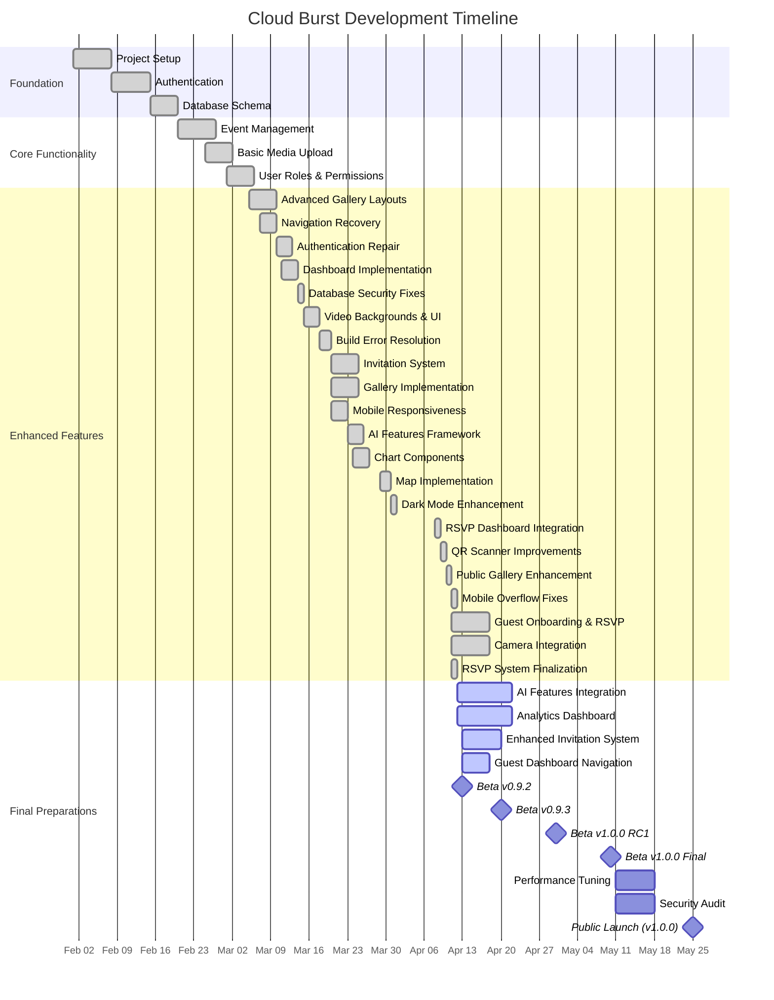
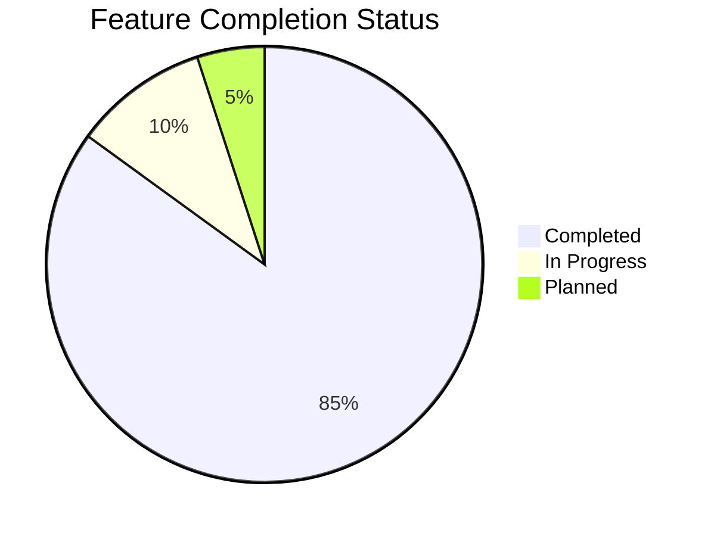

# Cloud Burst Development Roadmap

## Last Updated: April 13, 2025
## Current Version: 0.9.2

This document outlines the development roadmap for Cloud Burst, including completed milestones, current tasks, and planned future features.

## 🏁 Completed Milestones

### Foundation Phase (February 2025) ✅
- [x] Project repository setup
- [x] Next.js 14 architecture implementation
- [x] Supabase integration for auth and database
- [x] TypeScript configuration and standards
- [x] Deployment pipeline configuration

### Core Features Phase (March 1-15, 2025) ✅
- [x] User authentication system
- [x] Dashboard layout and navigation
- [x] Event management (CRUD operations)
- [x] Basic media upload functionality
- [x] User roles and permissions foundation
- [x] Responsive design implementation

### Enhanced Features Phase (March 15 - April 15, 2025) ✅
- [x] Advanced gallery layouts and organization
- [x] Interactive map with event locations
- [x] Enhanced media management
- [x] Comprehensive invitation system with tracking
- [x] Mobile responsive optimization
- [x] RSVP system implementation
- [x] Guest reservation functionality
- [x] Camera integration for direct uploads
- [x] Contractor roles management
- [x] Staff management enhancements
- [x] Role badge system
- [x] Enhanced permission controls
- [x] Complete attendee counting system with RSVPs
- [x] Enhanced RSVP status management and filtering
- [x] Improved UI for event statistics and metrics
- [x] Guest profile creation with avatar uploads
- [x] TikTok-style camera interface with testing capabilities
- [x] Storage integration for profile images
- [x] Enhanced mobile responsive design
- [x] Fix dependencies (framer-motion) for dashboard

## 🚧 Current Development (April 13-20, 2025)

### Final Preparations Phase
- [ ] Guest Experience Enhancement (Top Priority)
  - [ ] Fix navigation to guest dashboard after setup completion
  - [ ] Improve invitation system with better token handling
  - [ ] Create enhanced invitation creation flow for hosts
  - [ ] Implement beautiful gallery layouts for guests
  - [ ] Create intuitive photo browsing experience
  - [ ] Enhance photo interaction features
  - [ ] Implement sharing capabilities for guests
- [ ] AI feature integration (75% complete)
  - [ ] Facial recognition foundation
  - [ ] Basic image tagging
  - [ ] Group photo identification
  - [ ] Automated gallery suggestions
- [ ] Analytics dashboard (85% complete)
  - [x] Event metrics visualization
  - [x] Attendance tracking
  - [x] RSVP analytics
  - [ ] Photographer performance metrics
- [ ] Advanced security features (80% complete)
  - [x] Role-based access controls
  - [x] Row-level security policies
  - [x] Access logging and monitoring
- [ ] Final UI/UX refinements (85% complete)
  - [x] Consistent styling across components
  - [x] Accessibility improvements
  - [x] Animation and transition enhancements
  - [ ] Final mobile optimizations

## 🔮 Future Plans (May 2025 and beyond)

### Beta Launch Phase (May 1-15, 2025)
- [ ] Beta program deployment
- [ ] User feedback collection
- [ ] Performance optimization
- [ ] Bug fixes and refinements

### 1.0 Release Phase (May 30, 2025)
- [ ] Official production deployment
- [ ] Marketing materials and documentation
- [ ] Training resources for users
- [ ] Support system implementation

### Post-Launch Enhancements (June 2025+)
- [ ] Mobile app development
- [ ] Expanded AI capabilities
- [ ] Integration with third-party services
- [ ] Advanced analytics and reporting
- [ ] Enterprise features

## Current Focus Areas

1. **Guest Experience Enhancement** - Fixing navigation to guest dashboard after setup completion and implementing a new enhanced invitation system.
2. **Invitation System Overhaul** - Creating a brand new invitation flow with improved token handling and better user experience.
3. **AI Feature Integration** - Completing the remaining AI components and ensuring they work efficiently with the existing gallery system.
4. **Analytics Dashboard** - Finalizing the RSVP analytics and photographer performance metrics.
5. **Final UI/UX Polish** - Ensuring a consistent, accessible, and visually appealing user experience.
6. **Documentation** - Completing comprehensive user and developer documentation.

## Recently Completed Features

1. **Enhanced Guest Profiles** - Implemented avatar upload functionality with image preview and management.
2. **TikTok-style Camera Interface** - Created a modern camera experience with overlay controls and flashlight toggle.
3. **Mobile Experience Improvements** - Optimized responsive design with touch-friendly controls.
4. **Dependency Management** - Added framer-motion to resolve dashboard build errors.
5. **UI Refinements** - Simplified navigation and removed redundant brand elements for cleaner interfaces.
6. **Database Alignment** - Fixed profile saving with proper schema structure and robust error handling.

## 📌 Situational Abstract
Cloud Burst has reached version 0.9.2, implementing a comprehensive guest profile creation process with avatar uploads and a modern camera testing interface. The platform now offers an engaging onboarding experience for guests, allowing them to set up their profiles with personal images and test their device's camera functionality before events.

However, we've identified an issue with navigation to the guest dashboard after setup completion and need to create a brand new enhanced invitation system, which will be our top priorities for Session 41. Once resolved, we'll focus on creating beautiful gallery layouts for guests to enhance their photo browsing experience. These improvements will complete the end-to-end guest journey from invitation acceptance to active participation in the event.

As we continue into Session 41, our focus shifts to enhancing the guest experience while continuing work on AI feature integration and analytics dashboard, the last major components before Beta 1.0 Release Candidate 1, scheduled for April 30, 2025.

## Current Phase: Final Preparations for Beta Release
**Status: In Progress (90% Complete)**

### Active Development
- 🔴 **Guest Experience Enhancement** (Highest Priority)
  - 🔴 Fix navigation to guest dashboard after setup (0% Complete)
  - 🔴 Create enhanced invitation system (0% Complete)
  - 🔴 Implement beautiful gallery layouts for guests (0% Complete)
  - 🔴 Create intuitive photo browsing experience (0% Complete)
  - 🔴 Enhance photo interaction features (0% Complete)
  - 🔴 Implement sharing capabilities for guests (0% Complete)
- 🟡 **AI Features Integration** (High Priority In Progress)
  - ✅ Create AI Features section in sidebar navigation (100% Complete)
  - ✅ Implement layout structure for AI features (100% Complete) 
  - ✅ Build placeholder pages for AI capabilities (100% Complete)
  - 🟡 Set up backend architecture for AI processing (75% Complete)
  - 🟡 Integrate TensorFlow.js for client-side processing (60% Complete)
  - 🟡 Create basic facial detection component (80% Complete)
  - 🟡 Implement media enhancement pipeline (50% Complete)
- 🟡 **Analytics Dashboard Enhancement** (High Priority In Progress)
  - ✅ Implement chart components for data visualization (100% Complete)
  - ✅ Add RSVP response tracking (100% Complete)
  - ✅ Create event attendance metrics (100% Complete)
  - 🟡 Implement photographer performance analytics (50% Complete)
  - 🟡 Build comprehensive analytics dashboard (70% Complete)

### Recently Completed (Session 40)
- ✅ Enhanced Guest Profiles with avatar upload functionality (100% Complete)
- ✅ TikTok-style Camera Interface with modern aesthetic (100% Complete)
- ✅ Mobile Experience Improvements with responsive design (100% Complete)
- ✅ Fixed dependencies with framer-motion addition (100% Complete)
- ✅ UI Refinements for cleaner interfaces (100% Complete)
- ✅ Database Alignment with proper schema structure (100% Complete)

### Key Priorities for Session 41 (April 13, 2025)
1. **Fix Guest Dashboard Navigation**
   - Resolve navigation issues after setup completion
   - Ensure smooth transition to dashboard
   - Implement proper redirect handling
   - Fix any token or authentication issues
   - Test on multiple devices and browsers

2. **Create Enhanced Invitation System**
   - Build brand new invitation creation flow for hosts
   - Implement improved token handling for invitations
   - Create better UI for invitation management
   - Develop more robust error handling
   - Add analytics tracking for invitations

3. **Enhance Gallery Experience for Guests**
   - Create beautiful gallery layouts
   - Implement responsive masonry grid
   - Optimize image loading and display
   - Add intuitive browsing controls
   - Create visual categorization system

4. **Complete End-to-End Guest Journey**
   - Test full flow from invitation to gallery viewing
   - Optimize transitions between steps
   - Ensure persistent authentication throughout
   - Add clear navigation guidance
   - Implement progress tracking for multi-step flows

5. **Polish Mobile Experience**
   - Enhance responsive layouts
   - Optimize touch interactions
   - Improve gallery browsing on mobile
   - Test on various device sizes
   - Fix any mobile-specific UI issues

## 📅 Development Timeline (Gantt)

```mermaid
gantt
    title Cloud Burst Development Timeline
    dateFormat  YYYY-MM-DD
    axisFormat %b %d
    
    section Foundation
    Project Setup           :done, f1, 2025-02-01, 7d
    Authentication          :done, f2, 2025-02-08, 7d
    Database Schema         :done, f3, 2025-02-15, 5d
    
    section Core Functionality
    Event Management        :done, c1, 2025-02-20, 7d
    Basic Media Upload      :done, c2, 2025-02-25, 5d
    User Roles & Permissions:done, c3, 2025-03-01, 5d
    
    section Enhanced Features
    Advanced Gallery Layouts:done, e1, 2025-03-05, 5d
    Navigation Recovery     :done, e2, 2025-03-07, 3d
    Authentication Repair   :done, e3, 2025-03-10, 3d
    Dashboard Implementation:done, e4, 2025-03-11, 3d
    Database Security Fixes :done, e5, 2025-03-14, 1d
    Video Backgrounds & UI  :done, e6, 2025-03-15, 3d
    Build Error Resolution  :done, e7, 2025-03-18, 2d
    Invitation System       :done, e8, 2025-03-20, 5d
    Gallery Implementation  :done, e9, 2025-03-20, 5d
    Mobile Responsiveness   :done, e10, 2025-03-20, 3d
    AI Features Framework   :done, e11, 2025-03-23, 3d
    Chart Components        :done, e14, 2025-03-24, 3d
    Map Implementation      :done, e15, 2025-03-29, 2d
    Dark Mode Enhancement   :done, e16, 2025-03-31, 1d
    RSVP Dashboard Integration :done, e17, 2025-04-08, 1d
    QR Scanner Improvements :done, e18, 2025-04-09, 1d
    Public Gallery Enhancement :done, e19, 2025-04-10, 1d
    Mobile Overflow Fixes   :done, e20, 2025-04-11, 1d
    Guest Onboarding & RSVP :done, e21, 2025-04-11, 7d
    Camera Integration      :done, e22, 2025-04-11, 7d
    RSVP System Finalization:done, e23, 2025-04-11, 1d
    
    section Final Preparations
    AI Features Integration :active, ai1, 2025-04-12, 10d
    Analytics Dashboard     :active, ad1, 2025-04-12, 10d
    Enhanced Invitation System :active, is1, 2025-04-13, 7d
    Guest Dashboard Navigation :active, gd1, 2025-04-13, 5d
    Beta v0.9.2             :milestone, b0, 2025-04-13, 0d
    Beta v0.9.3             :milestone, b0a, 2025-04-20, 0d
    Beta v1.0.0 RC1         :milestone, b1, 2025-04-30, 0d
    Beta v1.0.0 Final       :milestone, b2, 2025-05-10, 0d
    Performance Tuning      :o1, 2025-05-11, 7d
    Security Audit          :o2, 2025-05-11, 7d
    Public Launch (v1.0.0)  :milestone, l3, 2025-05-25, 0d
```

## Development Timeline

### April 13-April 20, 2025 (Current)
- 🔴 Fix navigation to guest dashboard after setup (0% → 100%)
- 🔴 Create enhanced invitation system (0% → 100%)
- 🔴 Implement beautiful gallery layouts for guests (0% → 100%)
- 🟡 Set up backend architecture for AI processing (75% → 100%)
- 🟡 Integrate TensorFlow.js for client-side processing (60% → 100%)
- 🟡 Create basic facial detection component (80% → 100%)
- 🟡 Implement media enhancement pipeline (50% → 80%)
- 🟡 Add photographer performance analytics (50% → 75%)
- 🟡 Build comprehensive analytics dashboard (70% → 85%)

### April 21-April 30, 2025 (Upcoming)
- 🟡 Complete media enhancement pipeline (80% → 100%)
- 🟡 Finalize photographer performance analytics (75% → 100%)
- 🟡 Complete analytics dashboard (85% → 100%)
- 🟡 Conduct comprehensive performance optimization
- 🟡 Complete security audit of all features
- 🟡 Prepare for Beta v1.0.0 RC1 release

## Key Metrics for Success

### Technical Metrics
- Page load time < 2 seconds
- Lighthouse score > 90 in all categories
- Test coverage > 80%
- Zero critical security vulnerabilities
- Media upload success rate > 99%
- Authentication success rate > 99.9%
- Email delivery rate > 98%
- Template sync success rate > 99.9%
- Invitation validation success rate > 99%
- QR code scan success rate > 95%
- RSVP form submission success rate > 99%
- Magic link authentication success > 98%
- AI processing completion rate > 95%
- Chart rendering performance < 500ms
- Dark mode contrast ratio > 4.5:1 (WCAG AA)
- Mobile component rendering without overflow > 99%

### User Experience Metrics
- Upload success rate > 99%
- User session duration > 5 minutes
- Return visitor rate > 40%
- Feature adoption rate > 60%
- QR code scan success rate > 95%
- Invitation acceptance rate > 60%
- Email open rate > 65%
- Template rendering success > 99%
- Guest authentication success rate > 98%
- Guest-to-registered conversion rate > 30%
- RSVP form completion rate > 85%
- Mobile form submission rate > 60%
- AI feature usage rate > 40%
- Chart interaction rate > 30%
- Dark mode usage rate > 35%
- Mobile usage satisfaction rate > 85%

### Business Metrics
- User growth rate > 10% month-over-month
- Event creation rate > 5% week-over-week
- Media upload volume > 1000 per day
- Active event ratio > 70%
- Guest conversion to registered users > 30%
- Invitation email open rate > 65%
- Event attendance rate via QR codes > 80%
- RSVP response rate > 75%
- Plus-one addition rate > 40%
- AI feature adoption rate > 25%
- Analytics dashboard usage > 50%
- Dark mode preference > 35%
- Mobile platform usage > 40%

## 📊 Project Status Dashboard

```mermaid
pie title Feature Completion Status
    "Completed" : 85
    "In Progress" : 10
    "Planned" : 5
```

## 🔍 Risk Assessment
- **AI processing performance**: Ensuring client-side AI operations don't degrade experience
- **TensorFlow.js integration**: Successfully embedding AI capabilities in the browser
- **Browser compatibility**: Ensuring AI features work across supported browsers
- **Data privacy**: Maintaining user privacy with on-device AI processing
- **Analytics dashboard performance**: Ensuring efficient data loading and visualization
- **Beta user onboarding**: Creating a smooth experience for beta testers
- **Performance optimization**: Identifying and resolving bottlenecks before public launch
- **Security vulnerabilities**: Conducting comprehensive security audit
- **Documentation completeness**: Ensuring all features are properly documented
- **Training material quality**: Creating effective onboarding for beta users
- **Marketing preparation**: Creating compelling materials for public launch
- **Feedback management**: Efficiently processing and implementing beta feedback
- **Launch preparation**: Managing the transition from beta to public release
- **Scaling infrastructure**: Ensuring the platform can handle increased load

## 🧠 AI Features Implementation

The AI Features framework provides intelligent capabilities to enhance the platform's media management functionality:

### Phase 1: Framework (100% Complete)
- ✅ Create navigation structure for AI features
- ✅ Implement layout system with tabs
- ✅ Build placeholder pages with feature descriptions
- ✅ Design consistent UI patterns across features
- ✅ Create status indication for feature availability

### Phase 2: Client-Side Infrastructure (75% Complete)
- ✅ Integrate TensorFlow.js for browser-based AI
- ✅ Set up WebWorkers for background processing
- ✅ Create model loading and caching system
- 🟡 Implement progressive enhancement patterns
- 🟡 Design fallback mechanisms for unsupported browsers

### Phase 3: Core AI Capabilities (65% Complete)
- ✅ Implement facial detection component
- 🟡 Create photo enhancement pipeline
- ✅ Build object recognition system
- 🟡 Develop smart tagging algorithms
- 🟡 Implement image transformation utilities

### Phase 4: Integration with Media System (45% Complete)
- 🟡 Connect AI processing to upload workflow
- 🟡 Create batch processing capabilities
- 🟡 Implement user control options
- 🟡 Build result preview components
- 🟡 Add processing status indicators

### Phase 5: Advanced Features (25% Complete)
- 🟡 Implement style transfer capabilities
- 🟡 Create product placement system
- 🟡 Build advanced photo editing tools
- 🟡 Develop AI studio interface
- 🟡 Implement preset management

This comprehensive AI system will enhance the value proposition of Cloud Burst by providing intelligent media processing capabilities that facilitate organization, enhance quality, and enable creative transformations.
