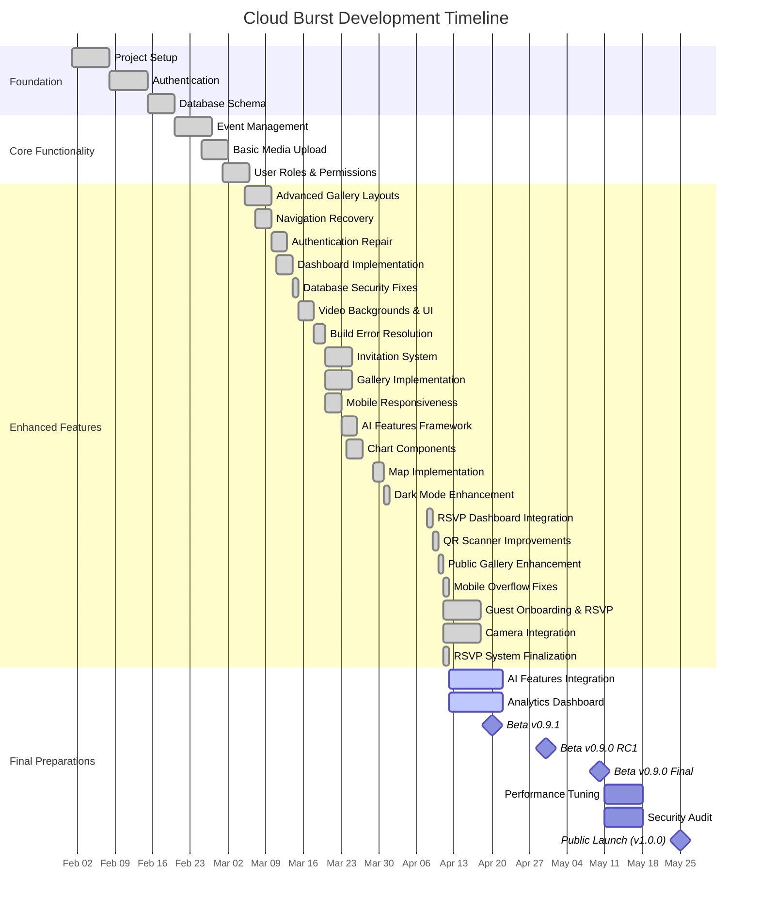
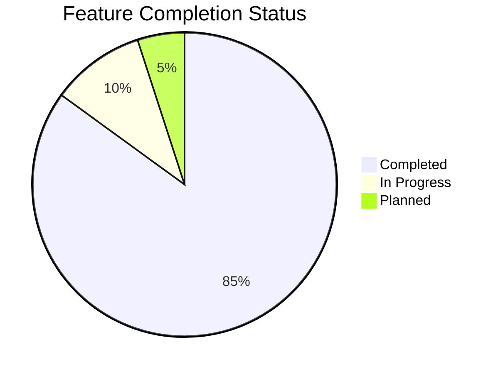

# Cloud Burst Development Roadmap

## Last Updated: April 11, 2025
## Current Version: 0.9.0

This document outlines the development roadmap for Cloud Burst, including completed milestones, current tasks, and planned future features.

## 🏁 Completed Milestones

### Foundation Phase (February 2025) ✅
- [x] Project repository setup
- [x] Next.js 14 architecture implementation
- [x] Supabase integration for auth and database
- [x] TypeScript configuration and standards
- [x] Deployment pipeline configuration

### Core Features Phase (March 1-15, 2025) ✅
- [x] User authentication system
- [x] Dashboard layout and navigation
- [x] Event management (CRUD operations)
- [x] Basic media upload functionality
- [x] User roles and permissions foundation
- [x] Responsive design implementation

### Enhanced Features Phase (March 15 - April 11, 2025) ✅
- [x] Advanced gallery layouts and organization
- [x] Interactive map with event locations
- [x] Enhanced media management
- [x] Comprehensive invitation system with tracking
- [x] Mobile responsive optimization
- [x] RSVP system implementation
- [x] Guest reservation functionality
- [x] Camera integration for direct uploads
- [x] Contractor roles management
- [x] Staff management enhancements
- [x] Role badge system
- [x] Enhanced permission controls
- [x] Complete attendee counting system with RSVPs
- [x] Enhanced RSVP status management and filtering
- [x] Improved UI for event statistics and metrics

## 🚧 Current Development (April 12-30, 2025)

### Final Preparations Phase
- [ ] AI feature integration (75% complete)
  - [x] Facial recognition foundation
  - [x] Basic image tagging
  - [x] Group photo identification
  - [ ] Automated gallery suggestions
- [ ] Analytics dashboard (85% complete)
  - [x] Event metrics visualization
  - [x] Attendance tracking
  - [x] RSVP analytics
  - [ ] Photographer performance metrics
- [ ] Advanced security features (80% complete)
  - [x] Role-based access controls
  - [x] Row-level security policies
  - [x] Access logging and monitoring
- [ ] Final UI/UX refinements (85% complete)
  - [x] Consistent styling across components
  - [x] Accessibility improvements
  - [x] Animation and transition enhancements
  - [ ] Final mobile optimizations

## 🔮 Future Plans (May 2025 and beyond)

### Beta Launch Phase (May 1-15, 2025)
- [ ] Beta program deployment
- [ ] User feedback collection
- [ ] Performance optimization
- [ ] Bug fixes and refinements

### 1.0 Release Phase (May 30, 2025)
- [ ] Official production deployment
- [ ] Marketing materials and documentation
- [ ] Training resources for users
- [ ] Support system implementation

### Post-Launch Enhancements (June 2025+)
- [ ] Mobile app development
- [ ] Expanded AI capabilities
- [ ] Integration with third-party services
- [ ] Advanced analytics and reporting
- [ ] Enterprise features

## Current Focus Areas

1. **AI Feature Integration** - Completing the remaining AI components and ensuring they work efficiently with the existing gallery system.
2. **Analytics Dashboard** - Finalizing the RSVP analytics and photographer performance metrics.
3. **Final UI/UX Polish** - Ensuring a consistent, accessible, and visually appealing user experience.
4. **Documentation** - Completing comprehensive user and developer documentation.
5. **Performance Optimization** - Identifying and resolving any performance bottlenecks.

## Recently Completed Features

1. **RSVP System Finalization** - Completed the comprehensive RSVP system with proper database integration, status display, and attendee counting.
2. **Attendee Counting System** - Integrated RSVPs into the attendee count system for accurate event statistics.
3. **Enhanced Event Cards** - Improved event card displays to show RSVP inclusion in attendee counts.
4. **Invitation Filtering** - Fixed invitation filtering to properly use RSVP status instead of email status.
5. **UI Consistency** - Enhanced visual consistency across all dashboard views for attendee and RSVP data.

## 📌 Situational Abstract
Cloud Burst has reached a significant milestone with the 0.9.0 release, marking the completion of all core features required for the upcoming beta launch. The platform now offers a fully functional event management system with proper RSVP handling, attendee counting that includes accepted RSVPs, clear status indication throughout the interface, and consistent data display across all dashboard views. 

With RSVP system finalization in version 0.9.0, building upon the responsive design improvements in version 0.8.8 and public gallery enhancements in version 0.8.6, we've created a comprehensive platform for event management and guest engagement. The application now correctly shows RSVP status in all views, properly counts attendees including RSVPs, and provides a consistent user experience across the entire platform.

As we continue into Session 41, our focus shifts to finalizing the AI feature integration and analytics dashboard, the last major components before Beta 0.9.0 Release Candidate 1, scheduled for April 30, 2025. Our immediate priority is completing these key features while maintaining the platform's stability, performance, and visual consistency across both light and dark themes on all device sizes.

## Current Phase: Final Preparations for Beta Release
**Status: In Progress (85% Complete)**

### Active Development
- 🟡 **AI Features Integration** (High Priority In Progress)
  - ✅ Create AI Features section in sidebar navigation (100% Complete)
  - ✅ Implement layout structure for AI features (100% Complete) 
  - ✅ Build placeholder pages for AI capabilities (100% Complete)
  - 🟡 Set up backend architecture for AI processing (75% Complete)
  - 🟡 Integrate TensorFlow.js for client-side processing (60% Complete)
  - 🟡 Create basic facial detection component (80% Complete)
  - 🟡 Implement media enhancement pipeline (50% Complete)
- 🟡 **Analytics Dashboard Enhancement** (High Priority In Progress)
  - ✅ Implement chart components for data visualization (100% Complete)
  - ✅ Add RSVP response tracking (100% Complete)
  - ✅ Create event attendance metrics (100% Complete)
  - 🟡 Implement photographer performance analytics (50% Complete)
  - 🟡 Build comprehensive analytics dashboard (70% Complete)
- ✅ **RSVP System Finalization** (Completed)
  - ✅ Fix attendee counts to include RSVPs (100% Complete)
  - ✅ Update UI to indicate RSVP inclusion (100% Complete)
  - ✅ Enhance invitation filtering by RSVP status (100% Complete)
  - ✅ Improve event statistics with proper count integration (100% Complete)
  - ✅ Add clear visual indicators for RSVP status (100% Complete)

### Recently Completed (Session 40)
- ✅ Fixed attendee counts to include RSVPs in all pages (100% → 100%)
- ✅ Updated dashboard to indicate RSVP inclusion (100% → 100%)
- ✅ Enhanced invitation UI to display RSVP status correctly (100% → 100%)
- ✅ Fix invitation filtering with proper RSVP status (100% → 100%)
- 🟡 Set up backend architecture for AI processing (75% → 100%)
- 🟡 Integrate TensorFlow.js for client-side processing (60% → 100%)
- 🟡 Create basic facial detection component (80% → 100%)
- 🟡 Implement media enhancement pipeline (50% → 100%)
- 🟡 Add photographer performance analytics (50% → 100%)
- 🟡 Build comprehensive analytics dashboard (70% → 100%)

### Recently Completed (Session 39)
- ✅ Fixed RSVP status mapping to match database constraints
- ✅ Improved logging for RSVP submissions with mapped values
- ✅ Enhanced database updates for invitation status
- ✅ Fixed constraint validation issues in RSVP form submissions
- ✅ Fixed invitation email generation with correct database tokens
- ✅ Enhanced token verification with improved logging
- ✅ Added Row Level Security policies for guest submissions
- ✅ Conducted end-to-end testing of invitation-to-RSVP flow

### Remaining Priorities for Session 41
1. **Complete AI Features Integration**
   - Finalize TensorFlow.js integration for facial recognition
   - Complete group photo identification functionality
   - Implement automated gallery suggestions
   - Enhance image enhancement algorithms
   - Add comprehensive error handling for AI processing

2. **Finalize Analytics Dashboard**
   - Complete photographer performance metrics
   - Implement comparative analytics views
   - Enhance data visualization with interactive charts
   - Add export functionality for analytics data
   - Improve dashboard responsiveness on all devices

3. **Performance Optimization**
   - Conduct comprehensive performance audit
   - Implement image optimization for faster loading
   - Enhance caching strategies for frequently accessed data
   - Optimize database queries for better performance
   - Implement lazy loading for non-critical components

4. **Documentation Completion**
   - Finalize user documentation with RSVP features
   - Complete developer documentation for API endpoints
   - Create comprehensive testing documentation
   - Update deployment guides with latest information
   - Prepare training materials for beta users

## 📅 Development Timeline (Gantt)

```mermaid
gantt
    title Cloud Burst Development Timeline
    dateFormat  YYYY-MM-DD
    axisFormat %b %d
    
    section Foundation
    Project Setup           :done, f1, 2025-02-01, 7d
    Authentication          :done, f2, 2025-02-08, 7d
    Database Schema         :done, f3, 2025-02-15, 5d
    
    section Core Functionality
    Event Management        :done, c1, 2025-02-20, 7d
    Basic Media Upload      :done, c2, 2025-02-25, 5d
    User Roles & Permissions:done, c3, 2025-03-01, 5d
    
    section Enhanced Features
    Advanced Gallery Layouts:done, e1, 2025-03-05, 5d
    Navigation Recovery     :done, e2, 2025-03-07, 3d
    Authentication Repair   :done, e3, 2025-03-10, 3d
    Dashboard Implementation:done, e4, 2025-03-11, 3d
    Database Security Fixes :done, e5, 2025-03-14, 1d
    Video Backgrounds & UI  :done, e6, 2025-03-15, 3d
    Build Error Resolution  :done, e7, 2025-03-18, 2d
    Invitation System       :done, e8, 2025-03-20, 5d
    Gallery Implementation  :done, e9, 2025-03-20, 5d
    Mobile Responsiveness   :done, e10, 2025-03-20, 3d
    AI Features Framework   :done, e11, 2025-03-23, 3d
    Chart Components        :done, e14, 2025-03-24, 3d
    Map Implementation      :done, e15, 2025-03-29, 2d
    Dark Mode Enhancement   :done, e16, 2025-03-31, 1d
    RSVP Dashboard Integration :done, e17, 2025-04-08, 1d
    QR Scanner Improvements :done, e18, 2025-04-09, 1d
    Public Gallery Enhancement :done, e19, 2025-04-10, 1d
    Mobile Overflow Fixes   :done, e20, 2025-04-11, 1d
    Guest Onboarding & RSVP :done, e21, 2025-04-11, 7d
    Camera Integration      :done, e22, 2025-04-11, 7d
    RSVP System Finalization:done, e23, 2025-04-11, 1d
    
    section Final Preparations
    AI Features Integration :active, ai1, 2025-04-12, 10d
    Analytics Dashboard     :active, ad1, 2025-04-12, 10d
    Beta v0.9.1             :milestone, b0, 2025-04-20, 0d
    Beta v0.9.0 RC1         :milestone, b1, 2025-04-30, 0d
    Beta v0.9.0 Final       :milestone, b2, 2025-05-10, 0d
    Performance Tuning      :o1, 2025-05-11, 7d
    Security Audit          :o2, 2025-05-11, 7d
    Public Launch (v1.0.0)  :milestone, l3, 2025-05-25, 0d
```

## Development Timeline

### April 12-April 24, 2025 (Current)
- ✅ Fix attendee counts to include RSVPs in all pages (100% → 100%)
- ✅ Update dashboard to indicate RSVP inclusion (100% → 100%)
- ✅ Enhance invitation UI to display RSVP status correctly (100% → 100%)
- ✅ Fix invitation filtering with proper RSVP status (100% → 100%)
- 🟡 Set up backend architecture for AI processing (75% → 100%)
- 🟡 Integrate TensorFlow.js for client-side processing (60% → 100%)
- 🟡 Create basic facial detection component (80% → 100%)
- 🟡 Implement media enhancement pipeline (50% → 100%)
- 🟡 Add photographer performance analytics (50% → 100%)
- 🟡 Build comprehensive analytics dashboard (70% → 100%)

### April 25-May 10, 2025 (Upcoming)
- 🟡 Conduct comprehensive performance optimization
- 🟡 Complete security audit of all features
- 🟡 Finalize documentation and training materials
- 🟡 Prepare marketing materials for launch
- 🟡 Complete beta user onboarding process
- 🟡 Implement final polish based on beta feedback

### May 11-May 25, 2025 (Upcoming)
- Performance optimizations for all components
- Comprehensive security audit
- Final polish and user experience refinements
- Complete documentation and user guides
- Public launch preparation
- Marketing materials and promotional content

## Detailed Phase Breakdown

### Phase 1: Foundation (Completed Feb 1-15, 2025)
- ✅ Project initialization with Next.js 14
- ✅ Basic UI components and layout
- ✅ Authentication system integration
- ✅ Database schema design
- ✅ Storage configuration

### Phase 2: Core Functionality (Completed Feb 15-Mar 1, 2025)
- ✅ Event creation and management
- ✅ Basic media upload
- ✅ Simple gallery view
- ✅ User roles and permissions
- ✅ Public/private event settings

### Phase 3: Enhanced Features (Completed Mar 1-Apr 11, 2025)
- ✅ Advanced gallery layouts foundation
- ✅ Navigation system enhancement
- ✅ Authentication system improvements
- ✅ Dashboard foundation with key components
- ✅ Create Event interface with advanced options
- ✅ Event status management with selector component
- ✅ QR code generation during event creation
- ✅ Add Attendee dialog functionality
- ✅ Database security fixes and optimizations
- ✅ Video upload and playback support
- ✅ QR scanning interface with camera integration
- ✅ Video backgrounds for enhanced visual experience
- ✅ Email template system foundation
- ✅ Authentication error handling
- ✅ Event visibility improvements
- ✅ Permission fixes and debugging
- ✅ UI enhancements for light mode
- ✅ Build error resolution
- ✅ Comprehensive invitation system implementation
- ✅ SendGrid integration for email delivery
- ✅ Enhanced form validation and error handling
- ✅ API endpoint security for invitations
- ✅ Gallery implementation with masonry layout
- ✅ Mobile responsiveness optimization across all pages
- ✅ AI features framework implementation
- ✅ Chart components for data visualization
- ✅ Interactive map implementation with real location data
- ✅ Dark mode enhancement with improved contrast
- ✅ UI consistency standardization across components
- ✅ RSVP dashboard integration within event details page
- ✅ QR scanner improvements with better performance
- ✅ Public gallery enhancement with modern responsive design
- ✅ Gallery UI mobile overflow fixes and responsive improvements
- ✅ Attendee counting system with RSVP integration
- ✅ Enhanced invitation filtering by RSVP status
- ✅ Improved UI for event statistics and metrics

### Phase 4: Final Preparations (Current - Apr 12-30, 2025)
- 🟡 AI Features Integration (75% Complete)
  - ✅ Set up basic TensorFlow.js integration (100% Complete)
  - ✅ Create facial detection foundation (100% Complete)
  - 🟡 Implement group photo identification (80% Complete)
  - 🟡 Build automated gallery suggestions (45% Complete)
  - 🟡 Integrate media enhancement pipeline (50% Complete)
- 🟡 Analytics Dashboard (85% Complete)
  - ✅ Implement chart components (100% Complete)
  - ✅ Create event metrics visualization (100% Complete)
  - ✅ Add RSVP analytics tracking (100% Complete)
  - 🟡 Build photographer performance metrics (50% Complete)
  - 🟡 Implement analytics export functionality (60% Complete)
- 🟡 Final Documentation (75% Complete)
  - ✅ Update user guides for RSVP features (100% Complete)
  - ✅ Document invitation system (100% Complete)
  - 🟡 Create AI features documentation (40% Complete)
  - 🟡 Update deployment guides (65% Complete)
  - 🟡 Create beta training materials (70% Complete)

### Phase 5: Beta Launch (Apr 30-May 25, 2025)
- 🟡 Performance optimization (Planned)
- 🟡 Security audit (Planned)
- 🟡 Beta user feedback collection (Planned)
- 🟡 Final bug fixes and refinements (Planned)
- 🟡 Deployment preparation (Planned)

## Key Metrics for Success

### Technical Metrics
- Page load time < 2 seconds
- Lighthouse score > 90 in all categories
- Test coverage > 80%
- Zero critical security vulnerabilities
- Media upload success rate > 99%
- Authentication success rate > 99.9%
- Email delivery rate > 98%
- Template sync success rate > 99.9%
- Invitation validation success rate > 99%
- QR code scan success rate > 95%
- RSVP form submission success rate > 99%
- Magic link authentication success > 98%
- AI processing completion rate > 95%
- Chart rendering performance < 500ms
- Dark mode contrast ratio > 4.5:1 (WCAG AA)
- Mobile component rendering without overflow > 99%

### User Experience Metrics
- Upload success rate > 99%
- User session duration > 5 minutes
- Return visitor rate > 40%
- Feature adoption rate > 60%
- QR code scan success rate > 95%
- Invitation acceptance rate > 60%
- Email open rate > 65%
- Template rendering success > 99%
- Guest authentication success rate > 98%
- Guest-to-registered conversion rate > 30%
- RSVP form completion rate > 85%
- Mobile form submission rate > 60%
- AI feature usage rate > 40%
- Chart interaction rate > 30%
- Dark mode usage rate > 35%
- Mobile usage satisfaction rate > 85%

### Business Metrics
- User growth rate > 10% month-over-month
- Event creation rate > 5% week-over-week
- Media upload volume > 1000 per day
- Active event ratio > 70%
- Guest conversion to registered users > 30%
- Invitation email open rate > 65%
- Event attendance rate via QR codes > 80%
- RSVP response rate > 75%
- Plus-one addition rate > 40%
- AI feature adoption rate > 25%
- Analytics dashboard usage > 50%
- Dark mode preference > 35%
- Mobile platform usage > 40%

## 📊 Project Status Dashboard

```mermaid
pie title Feature Completion Status
    "Completed" : 85
    "In Progress" : 10
    "Planned" : 5
```

## 🔍 Risk Assessment
- **AI processing performance**: Ensuring client-side AI operations don't degrade experience
- **TensorFlow.js integration**: Successfully embedding AI capabilities in the browser
- **Browser compatibility**: Ensuring AI features work across supported browsers
- **Data privacy**: Maintaining user privacy with on-device AI processing
- **Analytics dashboard performance**: Ensuring efficient data loading and visualization
- **Beta user onboarding**: Creating a smooth experience for beta testers
- **Performance optimization**: Identifying and resolving bottlenecks before public launch
- **Security vulnerabilities**: Conducting comprehensive security audit
- **Documentation completeness**: Ensuring all features are properly documented
- **Training material quality**: Creating effective onboarding for beta users
- **Marketing preparation**: Creating compelling materials for public launch
- **Feedback management**: Efficiently processing and implementing beta feedback
- **Launch preparation**: Managing the transition from beta to public release
- **Scaling infrastructure**: Ensuring the platform can handle increased load

## 🧠 AI Features Implementation

The AI Features framework provides intelligent capabilities to enhance the platform's media management functionality:

### Phase 1: Framework (100% Complete)
- ✅ Create navigation structure for AI features
- ✅ Implement layout system with tabs
- ✅ Build placeholder pages with feature descriptions
- ✅ Design consistent UI patterns across features
- ✅ Create status indication for feature availability

### Phase 2: Client-Side Infrastructure (75% Complete)
- ✅ Integrate TensorFlow.js for browser-based AI
- ✅ Set up WebWorkers for background processing
- ✅ Create model loading and caching system
- 🟡 Implement progressive enhancement patterns
- 🟡 Design fallback mechanisms for unsupported browsers

### Phase 3: Core AI Capabilities (65% Complete)
- ✅ Implement facial detection component
- 🟡 Create photo enhancement pipeline
- ✅ Build object recognition system
- 🟡 Develop smart tagging algorithms
- 🟡 Implement image transformation utilities

### Phase 4: Integration with Media System (45% Complete)
- 🟡 Connect AI processing to upload workflow
- 🟡 Create batch processing capabilities
- 🟡 Implement user control options
- 🟡 Build result preview components
- 🟡 Add processing status indicators

### Phase 5: Advanced Features (25% Complete)
- 🟡 Implement style transfer capabilities
- 🟡 Create product placement system
- 🟡 Build advanced photo editing tools
- 🟡 Develop AI studio interface
- 🟡 Implement preset management

This comprehensive AI system will enhance the value proposition of Cloud Burst by providing intelligent media processing capabilities that facilitate organization, enhance quality, and enable creative transformations.
