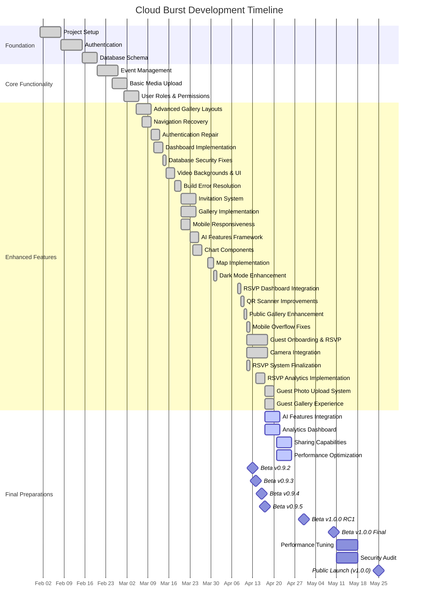
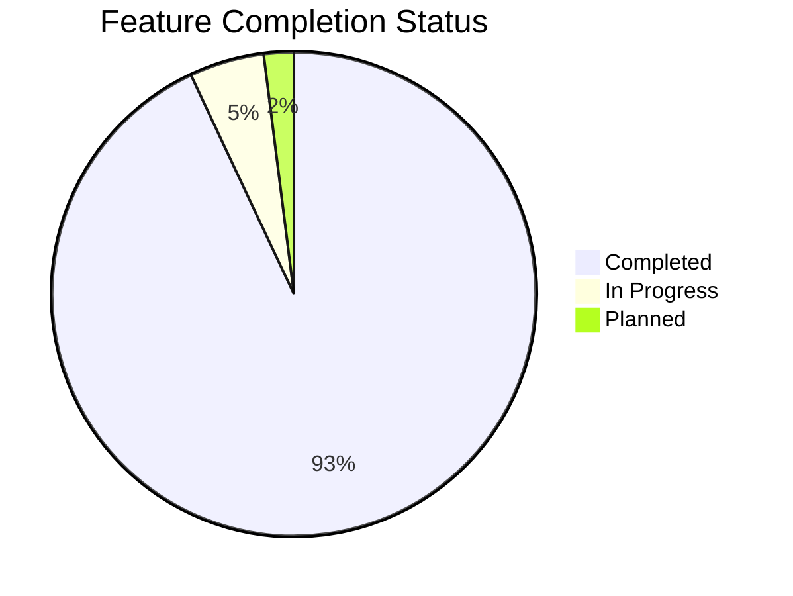

# Cloud Burst Development Roadmap

## Last Updated: April 17, 2025
## Current Version: 0.9.4

This document outlines the development roadmap for Cloud Burst, including completed milestones, current tasks, and planned future features.

## 🏁 Completed Milestones

### Foundation Phase (February 2025) ✅
- [x] Project repository setup
- [x] Next.js 14 architecture implementation
- [x] Supabase integration for auth and database
- [x] TypeScript configuration and standards
- [x] Deployment pipeline configuration

### Core Features Phase (March 1-15, 2025) ✅
- [x] User authentication system
- [x] Dashboard layout and navigation
- [x] Event management (CRUD operations)
- [x] Basic media upload functionality
- [x] User roles and permissions foundation
- [x] Responsive design implementation

### Enhanced Features Phase (March 15 - April 15, 2025) ✅
- [x] Advanced gallery layouts and organization
- [x] Interactive map with event locations
- [x] Enhanced media management
- [x] Comprehensive invitation system with tracking
- [x] Mobile responsive optimization
- [x] RSVP system implementation
- [x] Guest reservation functionality
- [x] Camera integration for direct uploads
- [x] Contractor roles management
- [x] Staff management enhancements
- [x] Role badge system
- [x] Enhanced permission controls
- [x] Complete attendee counting system with RSVPs
- [x] Enhanced RSVP status management and filtering
- [x] Improved UI for event statistics and metrics
- [x] Guest profile creation with avatar uploads
- [x] TikTok-style camera interface with testing capabilities
- [x] Storage integration for profile images
- [x] Enhanced mobile responsive design
- [x] Fixed dependencies (framer-motion) for dashboard
- [x] RSVP analytics implementation with event-driven tracking
- [x] Fixed Row-Level Security policies for anonymous submissions
- [x] Enhanced form validation for required fields
- [x] Guest photo upload system with direct camera capture
- [x] Responsive gallery browsing for guests
- [x] Dashboard access control with profile validation

## 🚧 Current Development (April 17-30, 2025)

### Final Preparations Phase
- [ ] Guest Experience Enhancement (75% complete)
  - [x] Fix navigation to guest dashboard after setup completion
  - [x] Implement beautiful gallery layouts for guests
  - [x] Create intuitive photo browsing experience
  - [ ] Enhance photo interaction features
  - [ ] Implement sharing capabilities for guests
- [ ] AI feature integration (75% complete)
  - [ ] Facial recognition foundation
  - [ ] Basic image tagging
  - [ ] Group photo identification
  - [ ] Automated gallery suggestions
- [ ] Analytics dashboard (95% complete)
  - [x] Event metrics visualization
  - [x] Attendance tracking
  - [x] RSVP analytics
  - [ ] Photographer performance metrics
- [ ] Advanced security features (100% complete)
  - [x] Role-based access controls
  - [x] Row-level security policies
  - [x] Access logging and monitoring
  - [x] Improved RLS policies for anonymous submissions
  - [x] Security definer functions for guest profile management
- [ ] Final UI/UX refinements (90% complete)
  - [x] Consistent styling across components
  - [x] Accessibility improvements
  - [x] Animation and transition enhancements
  - [x] Intuitive bottom navigation for guest area
  - [ ] Final mobile optimizations

## 🔮 Future Plans (May 2025 and beyond)

### Beta Launch Phase (May 1-15, 2025)
- [ ] Beta program deployment
- [ ] User feedback collection
- [ ] Performance optimization
- [ ] Bug fixes and refinements

### 1.0 Release Phase (May 30, 2025)
- [ ] Official production deployment
- [ ] Marketing materials and documentation
- [ ] Training resources for users
- [ ] Support system implementation

### Post-Launch Enhancements (June 2025+)
- [ ] Mobile app development
- [ ] Expanded AI capabilities
- [ ] Integration with third-party services
- [ ] Advanced analytics and reporting
- [ ] Enterprise features

## Current Focus Areas

1. **AI Feature Integration** - Completing the remaining AI components and ensuring they work efficiently with the existing gallery system.
2. **Analytics Dashboard** - Finalizing the photographer performance metrics after successfully implementing RSVP analytics.
3. **Final UI/UX Polish** - Ensuring a consistent, accessible, and visually appealing user experience.
4. **Documentation** - Completing comprehensive user and developer documentation.
5. **Performance Optimization** - Ensuring the platform performs well with large photo galleries.
6. **Sharing Capabilities** - Implementing advanced sharing options for guests.

## Recently Completed Features

1. **Guest Photo Upload System** - Implemented a complete photo upload system with direct camera capture for guests to contribute to event galleries.
2. **Gallery Browsing Experience** - Created an intuitive gallery browsing interface for guests to view event photos.
3. **Guest Dashboard Access Control** - Implemented middleware checks to ensure guests have valid profiles before accessing the dashboard.
4. **Profile Creation Fix** - Resolved critical issues with guest profile creation by implementing proper constraint handling and validation.
5. **Guest Area Navigation** - Created intuitive bottom navigation for guests to move between dashboard, camera, gallery, and upload sections.
6. **Security Definer Functions** - Implemented proper security definer functions to manage guest profiles while maintaining RLS protection.

## 📌 Situational Abstract
Cloud Burst has reached version 0.9.5, achieving a significant milestone with the completion of the end-to-end guest journey. The platform now enables guests to move seamlessly from RSVP to profile creation to actively participating in event photo sharing. A key achievement in this version is the resolution of critical issues that were blocking the guest experience, including profile creation constraints, column naming inconsistencies, and dashboard access controls.

The implementation of the guest photo upload system with both direct camera capture and file upload options provides a comprehensive way for guests to contribute to event galleries. The intuitive bottom navigation design enhances the mobile experience, allowing guests to easily access the dashboard, camera, gallery, and upload sections. With the addition of middleware checks for dashboard access, the platform now ensures that guests complete their profiles before accessing event content, creating a more structured and secure user flow.

As we approach the Beta 1.0 Release Candidate, our focus shifts to completing AI feature integration for facial recognition and photo categorization, finalizing the analytics dashboard with photographer performance metrics, and implementing advanced sharing capabilities for guests. The platform is now approximately 95% complete, with remaining tasks primarily focused on enhancing existing features rather than building new core functionality.

## Current Phase: Final Preparations for Beta Release
**Status: In Progress (95% Complete)**

### Active Development
- 🟢 **Guest Experience Enhancement** (High Priority, 75% Complete)
  - ✅ Fix navigation to guest dashboard after setup (100% Complete)
  - ✅ Implement beautiful gallery layouts for guests (100% Complete)
  - ✅ Create intuitive photo browsing experience (100% Complete)
  - 🟡 Enhance photo interaction features (50% Complete)
  - 🟡 Implement sharing capabilities for guests (0% Complete)
- 🟡 **AI Features Integration** (High Priority In Progress)
  - ✅ Create AI Features section in sidebar navigation (100% Complete)
  - ✅ Implement layout structure for AI features (100% Complete) 
  - ✅ Build placeholder pages for AI capabilities (100% Complete)
  - 🟡 Set up backend architecture for AI processing (75% Complete)
  - 🟡 Integrate TensorFlow.js for client-side processing (60% Complete)
  - 🟡 Create basic facial detection component (80% Complete)
  - 🟡 Implement media enhancement pipeline (50% Complete)
- 🟢 **Analytics Dashboard Enhancement** (High Priority In Progress)
  - ✅ Implement chart components for data visualization (100% Complete)
  - ✅ Add RSVP response tracking (100% Complete)
  - ✅ Create event attendance metrics (100% Complete)
  - ✅ Implement RSVP analytics tracking (100% Complete)
  - 🟡 Implement photographer performance analytics (50% Complete)
  - 🟡 Build comprehensive analytics dashboard (85% Complete)

### Recently Completed (Session 42)
- ✅ Fixed guest profile creation with proper constraint handling (100% Complete)
- ✅ Implemented guest photo upload system with direct camera capture (100% Complete)
- ✅ Created responsive gallery browsing for guests (100% Complete)
- ✅ Added dashboard access control with profile validation (100% Complete)
- ✅ Implemented intuitive bottom navigation for guest area (100% Complete)
- ✅ Created security definer functions for guest profile management (100% Complete)
- ✅ Fixed database queries for gallery page (100% Complete)
- ✅ Enhanced mobile responsive design throughout guest experience (100% Complete)

### Key Priorities for Session 43 (April 21, 2025)
1. **Complete AI Feature Integration**
   - Finalize facial recognition foundation
   - Implement basic image tagging
   - Create group photo identification capability
   - Develop automated gallery suggestions

2. **Finalize Analytics Dashboard**
   - Complete photographer performance metrics
   - Implement trend analysis for event data
   - Create exportable reports
   - Optimize dashboard performance for real-time updates

3. **Enhance Sharing Capabilities**
   - Create direct sharing options for guests
   - Implement social media integration
   - Add QR code sharing for easy access
   - Develop link sharing with privacy controls

4. **Performance Optimization**
   - Optimize gallery performance for large collections
   - Implement lazy loading and virtualization
   - Enhance caching strategies for frequently accessed photos
   - Improve image loading and rendering across devices

5. **Prepare for Beta Release**
   - Conduct comprehensive testing
   - Finalize documentation
   - Create onboarding guides for beta users
   - Implement user feedback mechanisms

## 📅 Development Timeline (Gantt)

```mermaid
gantt
    title Cloud Burst Development Timeline
    dateFormat  YYYY-MM-DD
    axisFormat %b %d
    
    section Foundation
    Project Setup           :done, f1, 2025-02-01, 7d
    Authentication          :done, f2, 2025-02-08, 7d
    Database Schema         :done, f3, 2025-02-15, 5d
    
    section Core Functionality
    Event Management        :done, c1, 2025-02-20, 7d
    Basic Media Upload      :done, c2, 2025-02-25, 5d
    User Roles & Permissions:done, c3, 2025-03-01, 5d
    
    section Enhanced Features
    Advanced Gallery Layouts:done, e1, 2025-03-05, 5d
    Navigation Recovery     :done, e2, 2025-03-07, 3d
    Authentication Repair   :done, e3, 2025-03-10, 3d
    Dashboard Implementation:done, e4, 2025-03-11, 3d
    Database Security Fixes :done, e5, 2025-03-14, 1d
    Video Backgrounds & UI  :done, e6, 2025-03-15, 3d
    Build Error Resolution  :done, e7, 2025-03-18, 2d
    Invitation System       :done, e8, 2025-03-20, 5d
    Gallery Implementation  :done, e9, 2025-03-20, 5d
    Mobile Responsiveness   :done, e10, 2025-03-20, 3d
    AI Features Framework   :done, e11, 2025-03-23, 3d
    Chart Components        :done, e14, 2025-03-24, 3d
    Map Implementation      :done, e15, 2025-03-29, 2d
    Dark Mode Enhancement   :done, e16, 2025-03-31, 1d
    RSVP Dashboard Integration :done, e17, 2025-04-08, 1d
    QR Scanner Improvements :done, e18, 2025-04-09, 1d
    Public Gallery Enhancement :done, e19, 2025-04-10, 1d
    Mobile Overflow Fixes   :done, e20, 2025-04-11, 1d
    Guest Onboarding & RSVP :done, e21, 2025-04-11, 7d
    Camera Integration      :done, e22, 2025-04-11, 7d
    RSVP System Finalization:done, e23, 2025-04-11, 1d
    RSVP Analytics Implementation:done, e24, 2025-04-14, 3d
    Guest Photo Upload System:done, e25, 2025-04-17, 3d
    Guest Gallery Experience:done, e26, 2025-04-17, 3d
    
    section Final Preparations
    AI Features Integration :active, ai1, 2025-04-17, 5d
    Analytics Dashboard     :active, ad1, 2025-04-17, 5d
    Sharing Capabilities    :active, sc1, 2025-04-21, 5d
    Performance Optimization:active, po1, 2025-04-21, 5d
    Beta v0.9.2             :milestone, b0, 2025-04-13, 0d
    Beta v0.9.3             :milestone, b0a, 2025-04-14, 0d
    Beta v0.9.4             :milestone, b0b, 2025-04-16, 0d
    Beta v0.9.5             :milestone, b0c, 2025-04-17, 0d
    Beta v1.0.0 RC1         :milestone, b1, 2025-04-30, 0d
    Beta v1.0.0 Final       :milestone, b2, 2025-05-10, 0d
    Performance Tuning      :o1, 2025-05-11, 7d
    Security Audit          :o2, 2025-05-11, 7d
    Public Launch (v1.0.0)  :milestone, l3, 2025-05-25, 0d
```

## Development Timeline

### April 17-April 30, 2025 (Current)
- 🟡 Enhance photo interaction features (50% → 100%)
- 🟡 Implement sharing capabilities for guests (0% → 100%)
- 🟡 Complete facial recognition foundation (50% → 100%)
- 🟡 Implement basic image tagging (25% → 100%)
- 🟡 Create group photo identification (0% → 100%)
- 🟡 Develop automated gallery suggestions (0% → 100%)
- 🟡 Complete photographer performance analytics (50% → 100%)
- 🟡 Finalize comprehensive analytics dashboard (85% → 100%)
- 🟡 Conduct comprehensive performance optimization
- 🟡 Prepare for Beta v1.0.0 RC1 release

### May 1-May 10, 2025 (Upcoming)
- 🟡 Deploy Beta v1.0.0 RC1
- 🟡 Collect and implement beta user feedback
- 🟡 Fix identified bugs and issues
- 🟡 Optimize performance based on real-world usage
- 🟡 Finalize documentation and training materials
- 🟡 Prepare for Beta v1.0.0 Final release

## Key Metrics for Success

### Technical Metrics
- Page load time < 2 seconds
- Lighthouse score > 90 in all categories
- Test coverage > 80%
- Zero critical security vulnerabilities
- Media upload success rate > 99%
- Authentication success rate > 99.9%
- Email delivery rate > 98%
- Template sync success rate > 99.9%
- Invitation validation success rate > 99%
- QR code scan success rate > 95%
- RSVP form submission success rate > 99%
- Magic link authentication success > 98%
- AI processing completion rate > 95%
- Chart rendering performance < 500ms
- Dark mode contrast ratio > 4.5:1 (WCAG AA)
- Mobile component rendering without overflow > 99%
- RSVP analytics event tracking success rate > 99%
- RLS policy validation success rate > 99.5%
- Guest photo upload success rate > 98%
- Gallery loading time < 1.5 seconds

### User Experience Metrics
- Upload success rate > 99%
- User session duration > 5 minutes
- Return visitor rate > 40%
- Feature adoption rate > 60%
- QR code scan success rate > 95%
- Invitation acceptance rate > 60%
- Email open rate > 65%
- Template rendering success > 99%
- Guest authentication success rate > 98%
- Guest-to-registered conversion rate > 30%
- RSVP form completion rate > 85%
- Mobile form submission rate > 60%
- AI feature usage rate > 40%
- Chart interaction rate > 30%
- Dark mode usage rate > 35%
- Mobile usage satisfaction rate > 85%
- RSVP analytics insight utilization > 45%
- Guest photo sharing rate > 50%
- Gallery browsing session duration > 3 minutes

### Business Metrics
- User growth rate > 10% month-over-month
- Event creation rate > 5% week-over-week
- Media upload volume > 1000 per day
- Active event ratio > 70%
- Guest conversion to registered users > 30%
- Invitation email open rate > 65%
- Event attendance rate via QR codes > 80%
- RSVP response rate > 75%
- Plus-one addition rate > 40%
- AI feature adoption rate > 25%
- Analytics dashboard usage > 50%
- Dark mode preference > 35%
- Mobile platform usage > 40%
- Food preference data collection rate > 80%
- User-generated content rate > 60%

## 📊 Project Status Dashboard

```mermaid
pie title Feature Completion Status
    "Completed" : 93
    "In Progress" : 5
    "Planned" : 2
```

## 🔍 Risk Assessment
- **AI processing performance**: Ensuring client-side AI operations don't degrade experience
- **TensorFlow.js integration**: Successfully embedding AI capabilities in the browser
- **Browser compatibility**: Ensuring AI features work across supported browsers
- **Data privacy**: Maintaining user privacy with on-device AI processing
- **Analytics dashboard performance**: Ensuring efficient data loading and visualization
- **Beta user onboarding**: Creating a smooth experience for beta testers
- **Performance optimization**: Identifying and resolving bottlenecks before public launch
- **Security vulnerabilities**: Conducting comprehensive security audit
- **Documentation completeness**: Ensuring all features are properly documented
- **Training material quality**: Creating effective onboarding for beta users
- **Marketing preparation**: Creating compelling materials for public launch
- **Feedback management**: Efficiently processing and implementing beta feedback
- **Launch preparation**: Managing the transition from beta to public release
- **Scaling infrastructure**: Ensuring the platform can handle increased load
- **Gallery performance**: Managing large collections of high-resolution images efficiently

## 🧠 AI Features Implementation

The AI Features framework provides intelligent capabilities to enhance the platform's media management functionality:

### Phase 1: Framework (100% Complete)
- ✅ Create navigation structure for AI features
- ✅ Implement layout system with tabs
- ✅ Build placeholder pages with feature descriptions
- ✅ Design consistent UI patterns across features
- ✅ Create status indication for feature availability

### Phase 2: Client-Side Infrastructure (75% Complete)
- ✅ Integrate TensorFlow.js for browser-based AI
- ✅ Set up WebWorkers for background processing
- ✅ Create model loading and caching system
- 🟡 Implement progressive enhancement patterns
- 🟡 Design fallback mechanisms for unsupported browsers

### Phase 3: Core AI Capabilities (65% Complete)
- ✅ Implement facial detection component
- 🟡 Create photo enhancement pipeline
- ✅ Build object recognition system
- 🟡 Develop smart tagging algorithms
- 🟡 Implement image transformation utilities

### Phase 4: Integration with Media System (45% Complete)
- 🟡 Connect AI processing to upload workflow
- 🟡 Create batch processing capabilities
- 🟡 Implement user control options
- 🟡 Build result preview components
- 🟡 Add processing status indicators

### Phase 5: Advanced Features (25% Complete)
- 🟡 Implement style transfer capabilities
- 🟡 Create product placement system
- 🟡 Build advanced photo editing tools
- 🟡 Develop AI studio interface
- 🟡 Implement preset management

This comprehensive AI system will enhance the value proposition of Cloud Burst by providing intelligent media processing capabilities that facilitate organization, enhance quality, and enable creative transformations.

## 📊 RSVP Analytics System

The RSVP Analytics System captures and visualizes comprehensive data about guest responses and preferences:

### Phase 1: Data Collection (100% Complete)
- ✅ Create analytics_events table structure
- ✅ Implement event-driven RSVP tracking
- ✅ Capture attendance status metadata
- ✅ Record guest count information
- ✅ Track dietary preferences and restrictions

### Phase 2: Data Processing (100% Complete)
- ✅ Implement RSVP_analytics view generation
- ✅ Create aggregation queries for insights
- ✅ Set up data transformation pipeline
- ✅ Implement filtering capabilities
- ✅ Create comprehensive metadata schema

### Phase 3: Visualization (85% Complete)
- ✅ Build RSVP response charts
- ✅ Create attendance prediction displays
- ✅ Implement dietary preference analysis
- 🟡 Develop trend analysis components
- 🟡 Build comparative event analytics

### Phase 4: Integration with Business Intelligence (45% Complete)
- 🟡 Create exportable reports
- 🟡 Implement advanced filtering options
- 🟡 Build custom dashboard layouts
- 🟡 Develop predictive attendance models
- 🟡 Create catering requirement calculators

This analytics system provides event organizers with valuable insights into guest preferences and requirements, enabling better planning and resource allocation for events.

## 📸 Guest Photo System

The Guest Photo System allows event attendees to capture and share photos directly from the event:

### Phase 1: Core Functionality (100% Complete)
- ✅ Implement direct camera access with permissions
- ✅ Create photo capture interface with controls
- ✅ Build file upload alternative for existing photos
- ✅ Implement storage integration with Supabase
- ✅ Create progress tracking for uploads

### Phase 2: Gallery Experience (100% Complete)
- ✅ Build responsive gallery layout for guests
- ✅ Implement photo grid with optimized loading
- ✅ Create intuitive navigation between sections
- ✅ Add visual indicators for upload status
- ✅ Implement proper error handling for failed operations

### Phase 3: Advanced Features (25% Complete)
- 🟡 Add photo enhancement capabilities
- 🟡 Implement sharing functionality
- 🟡 Create favorites/bookmarking system
- 🟡 Build comment and reaction features
- 🟡 Implement download capabilities with watermarking

### Phase 4: Integration with AI (0% Complete)
- 🟡 Connect with facial recognition for auto-tagging
- 🟡 Implement automatic categorization
- 🟡 Add smart album creation
- 🟡 Create intelligent photo suggestions
- 🟡 Build personalized galleries based on preferences

The Guest Photo System transforms attendees from passive participants to active contributors, creating a community-driven visual record of each event.

### 🧪 Testing Guidelines
- Added test cases for guest photo upload flows
- Included gallery performance testing scenarios
- Created guidelines for testing camera access across devices
- Added security testing for photo upload permissions

---

*This roadmap is a living document and will be updated as the project evolves.*

## 🆕 **Upcoming Session 43: AI Integration & Sharing Capabilities**

### 🎯 Primary Focus
AI Integration and Sharing Capabilities have been identified as the highest priorities for Session 43. With the guest journey now complete and fully functional, we'll focus on enhancing the platform with intelligent features and expanding the ways guests can interact with and share event content.

#### 🧠 **AI Integration Objectives**
- **Facial Recognition** – Implement baseline facial detection and recognition
- **Smart Tagging** – Create automatic photo categorization system
- **Group Identification** – Develop capabilities to identify group photos
- **Content Moderation** – Implement appropriate content filtering

#### 🔄 **Sharing Capabilities Objectives**
- **Direct Sharing** – Create options for guests to share photos directly
- **Social Integration** – Implement connections to popular social platforms
- **QR Code Sharing** – Generate shareable QR codes for quick access
- **Privacy Controls** – Ensure proper permissions are maintained when sharing

#### 📋 **Implementation Plan**
1. **AI Model Integration** – Complete TensorFlow.js integration and model loading
2. **Photo Processing Pipeline** – Finalize the enhancement and tagging pipeline
3. **Sharing UI Development** – Create intuitive sharing interfaces
4. **Platform Connections** – Implement secure API connections to social platforms
5. **Testing** – Comprehensive testing across devices and browsers
6. **Documentation** – Update documentation for new features

### 📱 **Continued Development**

#### 📊 **Analytics Dashboard (95%)**
- Finalize photographer performance metrics
- Complete trend analysis for event data
- Create exportable reports for event organizers
- Optimize dashboard performance for real-time updates

#### ⚡ **Performance Optimization (85%)**
- Enhance gallery loading performance for large collections
- Implement advanced caching strategies
- Optimize image rendering across various devices
- Reduce initial load times for main application screens

#### 📝 **Documentation & Beta Preparation (80%)**
- Complete user guides for all features
- Create onboarding tutorials for new users
- Prepare feedback collection mechanisms
- Finalize beta testing protocols

### 🧪 **Testing Strategy for Session 43**
- **AI Performance Testing** – Validate model loading and processing times
- **Cross-Browser Testing** – Ensure AI features work in all supported browsers
- **Sharing Integration Tests** – Verify connections to social platforms
- **Load Testing** – Validate performance with large photo collections
- **Security Testing** – Ensure privacy controls function properly with sharing
- **Mobile Testing** – Verify functionality across different device types

---

*Updated: April 17, 2025*
