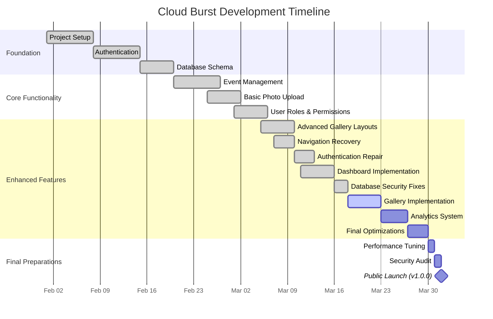
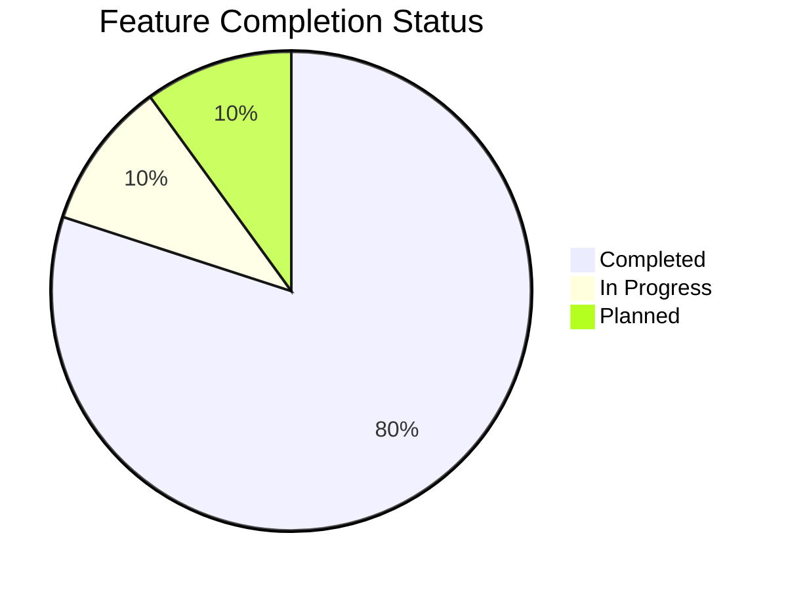

# Cloud Burst Development Roadmap

## Current Version: 0.7.6

## 📌 Situational Abstract
Cloud Burst has evolved from concept to a robust beta platform in a remarkably short timeframe since its inception in February 2025. With the successful implementation of custom event URLs, advanced gallery layouts, and tag-based organization, we've established a solid foundation for our event photography platform. The recent focus on TypeScript strict mode compliance and database security improvements has enhanced code quality and reliability, setting the stage for more advanced features.

Our platform now offers photographers and event organizers powerful tools to create, manage, and share event galleries with intuitive interfaces. The role-based access control system ensures appropriate permissions across different user types, while our improved database security provides robust protection for user data. We've successfully addressed technical debt related to database functions with mutable search paths and enhanced our authentication system to reduce API calls.

Through Session 22, we successfully implemented event status management, QR code generation during event creation, and enhanced the event details page with a status selector component. In Session 23, we've addressed critical database security issues and are now preparing to focus on completing the Gallery section, one of the core features of our platform. The Gallery page foundation is in place, though currently returning a 404 error, which will be our first focus in the upcoming development session.

As we approach the 80% completion mark of our Enhanced Features phase, we're preparing for intensive work on Gallery implementation, which will include photo uploading, album management, and moderation features. This development focus will take us to approximately 90% completion, with only Analytics and final optimizations remaining before our April 1, 2025 launch date.

The platform maintains excellent performance within our memory constraints, demonstrating the effectiveness of our optimization strategies. Our systematic approach to dashboard completion and refinement will deliver a seamless, professional-grade event photography platform that transforms how photographers and clients collaborate around life's most precious moments.

## Current Phase: Enhanced Features Implementation
**Status: In Progress (80% Complete)**

### Active Development
- ⚠️ Gallery Implementation (Starting Next Session)
- ⚠️ Photo Upload Mechanism (Planned)
- ⚠️ Album Management (Planned)
- ⚠️ Photo Moderation Features (Planned)

### Recently Completed
- ✅ Database security fixes (function search paths)
- ✅ RLS policies for role_capabilities
- ✅ Improved permissions caching to reduce API calls
- ✅ Enhanced error handling in middleware
- ✅ Event status management with status selector component
- ✅ QR code generation during event creation process
- ✅ Enhanced QR code page layout

### Next Priorities (v0.7.7)
1. Implement fully functional Gallery page
2. Create photo upload mechanism with progress indicators
3. Develop album creation and management features
4. Build photo moderation tool for event organizers
5. Enhance sidebar navigation with completed routes

## 📅 Development Timeline (Gantt)

```mermaid
gantt
    title Cloud Burst Development Timeline
    dateFormat  YYYY-MM-DD
    axisFormat %b %d
    
    section Foundation
    Project Setup           :done, f1, 2025-02-01, 7d
    Authentication          :done, f2, 2025-02-08, 7d
    Database Schema         :done, f3, 2025-02-15, 5d
    
    section Core Functionality
    Event Management        :done, c1, 2025-02-20, 7d
    Basic Photo Upload      :done, c2, 2025-02-25, 5d
    User Roles & Permissions:done, c3, 2025-03-01, 5d
    
    section Enhanced Features
    Advanced Gallery Layouts:done, e1, 2025-03-05, 5d
    Navigation Recovery     :done, e2, 2025-03-07, 3d
    Authentication Repair   :done, e3, 2025-03-10, 3d
    Dashboard Implementation:done, e4, 2025-03-11, 5d
    Database Security Fixes :done, e5, 2025-03-16, 2d
    Gallery Implementation  :active, e6, 2025-03-18, 5d
    Analytics System        :e7, 2025-03-23, 4d
    Final Optimizations     :e8, 2025-03-27, 3d
    
    section Final Preparations
    Performance Tuning      :o1, 2025-03-30, 1d
    Security Audit          :o2, 2025-03-31, 1d
    Public Launch (v1.0.0)  :milestone, l3, 2025-04-01, 0d
```

## Development Timeline

### March 11-15, 2025 (Completed)
- ✅ Implemented event status management
- ✅ Added QR code generation during event creation
- ✅ Enhanced QR code page layout
- ✅ Created Add Attendee dialog
- ✅ Fixed QR codes not appearing in listing page

### March 16-18, 2025 (Completed)
- ✅ Fixed database functions with mutable search paths
- ✅ Implemented RLS policies for role_capabilities table
- ✅ Enhanced permissions caching to reduce API calls
- ✅ Improved error handling in middleware
- ✅ Updated documentation for Session 23

### March 18-22, 2025 (Current)
- Implement fully functional Gallery page
- Create photo upload mechanism
- Develop album creation and management
- Build photo moderation features
- Complete sidebar navigation routes

### March 23-31, 2025 (Upcoming)
- Analytics system implementation
- Performance optimization
- Security audit and hardening
- Final documentation
- Pre-launch preparations

### April 1, 2025
- Public launch (v1.0.0)
- Marketing and growth initiatives
- Community building

## Detailed Phase Breakdown

### Phase 1: Foundation (Completed Feb 1-15, 2025)
- ✅ Project initialization with Next.js 14
- ✅ Basic UI components and layout
- ✅ Authentication system integration
- ✅ Database schema design
- ✅ Storage configuration

### Phase 2: Core Functionality (Completed Feb 15-Mar 1, 2025)
- ✅ Event creation and management
- ✅ Basic photo upload
- ✅ Simple gallery view
- ✅ User roles and permissions
- ✅ Public/private event settings

### Phase 3: Enhanced Features (Current - 80% Complete)
- ✅ Advanced gallery layouts (grid, masonry, slideshow)
- ✅ Navigation system recovery and enhancement
- ✅ Authentication system repair
- ✅ Dashboard foundation with key components
- ✅ Create Event interface with advanced options
- ✅ Event status management with selector component
- ✅ QR code generation during event creation
- ✅ Add Attendee dialog functionality
- ✅ Database security fixes and optimizations
- ⚠️ Gallery implementation (Starting Next Session)
- ⚠️ Photo upload mechanism (Planned)
- ⚠️ Album management (Planned)
- ⚠️ Photo moderation (Planned)
- ⚠️ Analytics and reporting (Planned)

### Phase 4: Final Preparations (Mar 27-Apr 1, 2025)
- ⚠️ Performance optimization
- ⚠️ Security audit
- ⚠️ Documentation completion
- ⚠️ Final testing
- ⚠️ Deployment preparation

## Key Metrics for Success

### Technical Metrics
- Page load time < 2 seconds
- Lighthouse score > 90 in all categories
- Test coverage > 80%
- Zero critical security vulnerabilities

### User Experience Metrics
- Upload success rate > 99%
- User session duration > 5 minutes
- Return visitor rate > 40%
- Feature adoption rate > 60%

### Business Metrics
- User growth rate > 10% month-over-month
- Event creation rate > 5% week-over-week
- Photo upload volume > 1000 per day
- Active event ratio > 70%

## 📊 Project Status Dashboard

```mermaid
pie title Feature Completion Status
    "Completed" : 80
    "In Progress" : 10
    "Planned" : 10
```

## 🔍 Risk Assessment
- **Gallery performance**: Ensuring fast loading of large image collections
- **Storage management**: Implementing efficient storage and retrieval mechanisms
- **Upload reliability**: Creating a robust upload system with error handling
- **Mobile photo browsing**: Optimizing the gallery experience for mobile devices
- **Moderation workflows**: Building intuitive tools for effective photo moderation
- **Album organization**: Designing flexible categorization systems
