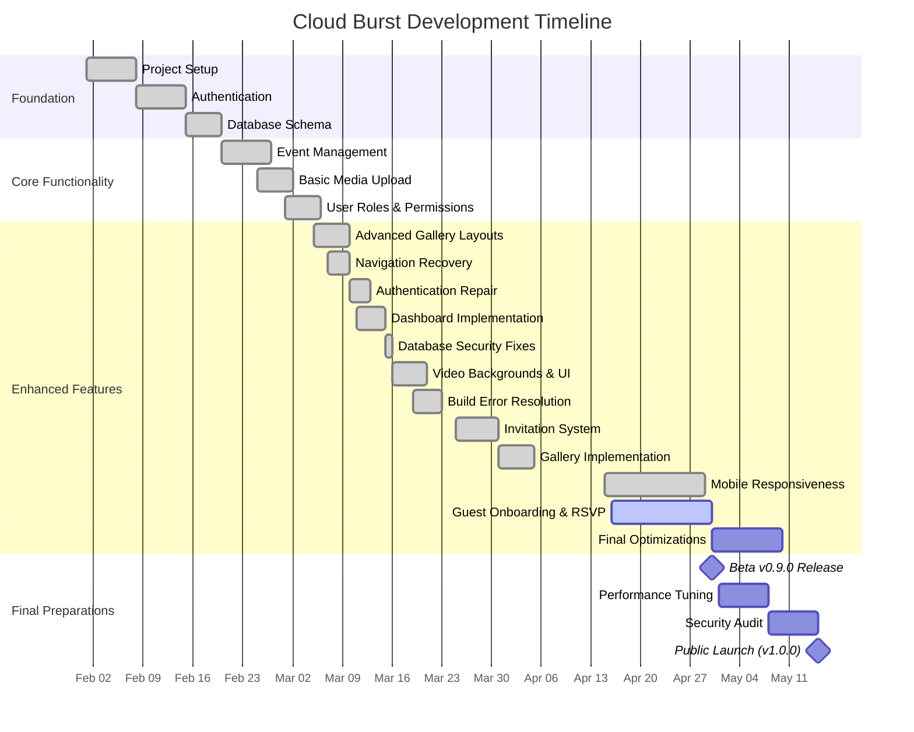
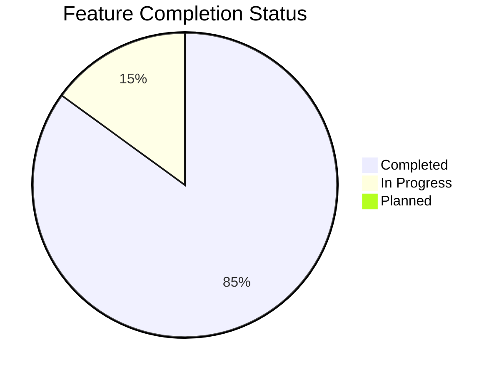

# Cloud Burst Development Roadmap

## Current Version: 0.8.3

## 📌 Situational Abstract
Cloud Burst has entered a new phase with the launch of version 0.8.3, focusing on Guest Onboarding & RSVP Flow implementation. With the successful completion of mobile responsiveness optimization in Session 31 and the gallery implementation fixes in Session 30, we've significantly improved the platform's usability across all device sizes, overall stability, and user experience.

The platform now offers a robust event management system with proper role-based access control, enhanced navigation patterns, secure authentication flows, fully responsive layouts across all pages, and a complete invitation system with SendGrid integration. Recent achievements include the successful implementation of mobile-first responsive design across all dashboard pages, fixing overflow issues in gallery views, creating responsive stacking for Gallery Event Cards, and implementing an enhanced masonry grid that adapts to screen sizes.

As we begin Session 32, our focus shifts to implementing the Guest Onboarding & RSVP Flow, which will allow event guests to easily respond to invitations from any device, provide dietary preferences, and indicate plus-one attendance. This feature is critical for enhancing engagement between event organizers and their guests, and will form a core component of our Beta 0.9.0 release.

Our immediate priority is delivering this key feature while maintaining the platform's stability, performance, and mobile responsiveness, which is essential for our upcoming Beta 0.9.0 release scheduled for April 1, 2025.

## Current Phase: Guest Onboarding & RSVP Flow Implementation
**Status: Beginning (20% Complete)**

### Active Development
- 🟡 **Guest Onboarding & RSVP Flow** (High Priority)
  - 🟡 Design RSVP user flow with state diagram (20% Complete)
  - 🟡 Enhance invitation database schema for RSVP tracking (20% Complete)
  - 🟡 Create RSVP form component with Zod validation (20% Complete)
  - 🟡 Implement magic link authentication for invitees (20% Complete)
  - 🟡 Build API endpoints for RSVP management (20% Complete)
  - 🟡 Create middleware for magic link validation (0% Complete)
  - 🟡 Design and implement RSVP status dashboard (0% Complete)
- 🟡 **QR Code & Camera Implementation** (Medium Priority)
  - ✅ Create QR code generation service (100% Complete)
  - ✅ Implement QR code scanner component (100% Complete)
  - ✅ Add camera permission handling (100% Complete)
  - 🟡 Build token validation for scanned QR codes (0% Complete)
  - 🟡 Create camera access hook for media capture (0% Complete)
  - 🟡 Implement photo capture UI for mobile (0% Complete)
- 🟡 **Analytics & Tracking** (Medium Priority)
  - 🟡 Implement invitation open tracking (0% Complete)
  - 🟡 Add QR code scan analytics (0% Complete)
  - 🟡 Create RSVP conversion metrics (0% Complete)
  - 🟡 Build dashboard for invitation effectiveness (0% Complete)
- 🟡 **Mobile Responsiveness** (Low Priority)
  - ✅ Overview Dashboard mobile (100% Complete)
  - ✅ Manage Events mobile (100% Complete)
  - ✅ Create Event mobile (100% Complete)
  - ✅ All Guests Invitations mobile (100% Complete)
  - ✅ QR Codes mobile (100% Complete)
  - ✅ Gallery (All Media) mobile (100% Complete)
  - ✅ Gallery (Event Galleries) mobile (100% Complete)
  - ✅ Gallery (Albums) mobile (100% Complete)
  - ✅ Moderation mobile (100% Complete)
  - 🟡 Engagement (Analytics) mobile (0% Complete)
  - 🟡 Performance optimization for mobile network conditions (0% Complete)

### Recently Completed (Session 31)
- ✅ Implemented mobile-first responsive design across dashboard pages
- ✅ Fixed layout issues in Gallery (All Media) page and enhanced overflow handling
- ✅ Created responsive stacking for Gallery Event Cards
- ✅ Enhanced responsive design of event details pages
- ✅ Fixed runtime errors in gallery components
- ✅ Improved mobile navigation and interaction targets
- ✅ Enhanced QR code display for mobile devices
- ✅ Implemented responsive masonry grid that adapts to screen size
- ✅ Created API route for gallery events data
- ✅ Resolved TypeScript linting errors across the codebase
- ✅ Improved touch targets and accessibility for mobile users
- ✅ Enhanced mobile-specific menu components and navigation patterns

### Recently Completed (Session 30)
- ✅ Fixed Next.js 14 App Router architecture issues in gallery components
- ✅ Added 'use client' directives to interactive components using React hooks
- ✅ Fixed client/server component separation in gallery implementation
- ✅ Resolved authentication issues in gallery pages
- ✅ Replaced client-side data fetching with server-side methods
- ✅ Fixed media item mapping to properly display photos in MasonryGrid
- ✅ Added event data to media items for better context
- ✅ Created comprehensive documentation of app router architecture patterns
- ✅ Fixed component type issues throughout gallery implementation

### Next Priorities (Session 32)
1. **Design RSVP user flow with state diagram**
   - Create user journey for invitation response
   - Define states for RSVP process
   - Design interaction patterns
   - Plan mobile-first implementation
   - Document edge cases and error states

2. **Enhance invitation database schema for RSVP tracking**
   - Add RSVP status field to invitations table
   - Create fields for dietary preferences
   - Add plus-one tracking
   - Implement timestamp for responses
   - Create indexes for performance

3. **Create RSVP form component with Zod validation**
   - Build responsive form layout
   - Implement Zod schema for validation
   - Create form state management
   - Add error handling
   - Support dietary restriction input
   - Add plus-one toggle and details

4. **Implement magic link authentication for invitees**
   - Create token generation system
   - Build email template for magic links
   - Implement auth flow for guests
   - Add session management
   - Create security measures

5. **Build API endpoints for RSVP management**
   - Create submission endpoint
   - Implement status update API
   - Add validation middleware
   - Create response handling
   - Implement error management
   - Add analytics tracking

## 📅 Development Timeline (Gantt)

```mermaid
gantt
    title Cloud Burst Development Timeline
    dateFormat  YYYY-MM-DD
    axisFormat %b %d
    
    section Foundation
    Project Setup           :done, f1, 2025-02-01, 7d
    Authentication          :done, f2, 2025-02-08, 7d
    Database Schema         :done, f3, 2025-02-15, 5d
    
    section Core Functionality
    Event Management        :done, c1, 2025-02-20, 7d
    Basic Media Upload      :done, c2, 2025-02-25, 5d
    User Roles & Permissions:done, c3, 2025-03-01, 5d
    
    section Enhanced Features
    Advanced Gallery Layouts:done, e1, 2025-03-05, 5d
    Navigation Recovery     :done, e2, 2025-03-07, 3d
    Authentication Repair   :done, e3, 2025-03-10, 3d
    Dashboard Implementation:done, e4, 2025-03-11, 4d
    Database Security Fixes :done, e5, 2025-03-15, 1d
    Video Backgrounds & UI  :done, e6, 2025-03-16, 5d
    Build Error Resolution  :done, e7, 2025-03-19, 4d
    Invitation System       :done, e8, 2025-03-25, 6d
    Gallery Implementation  :done, e9, 2025-03-31, 5d
    Mobile Responsiveness   :done, e10, 2025-04-15, 14d
    Guest Onboarding & RSVP :active, e11, 2025-04-16, 14d
    Final Optimizations     :e12, 2025-04-30, 10d
    
    section Final Preparations
    Beta v0.9.0 Release     :milestone, b1, 2025-04-30, 0d
    Performance Tuning      :o1, 2025-05-01, 7d
    Security Audit          :o2, 2025-05-08, 7d
    Public Launch (v1.0.0)  :milestone, l3, 2025-05-15, 0d
```

## Development Timeline

### March 26-March 27, 2025 (Completed)
- ✅ Implemented mobile-first responsive design across dashboard pages
- ✅ Fixed layout issues in Gallery (All Media) page and enhanced overflow handling
- ✅ Created responsive stacking for Gallery Event Cards
- ✅ Enhanced responsive design of event details pages
- ✅ Fixed runtime errors in gallery components
- ✅ Improved mobile navigation and interaction targets
- ✅ Enhanced QR code display for mobile devices
- ✅ Implemented responsive masonry grid that adapts to screen size
- ✅ Created API route for gallery events data
- ✅ Resolved TypeScript linting errors across the codebase
- ✅ Improved touch targets and accessibility for mobile users
- ✅ Enhanced mobile-specific menu components and navigation patterns

### March 27-April 1, 2025 (Current)
- 🟡 Design RSVP user flow with state diagram
- 🟡 Enhance invitation database schema for RSVP tracking
- 🟡 Create RSVP form component with Zod validation
- 🟡 Implement magic link authentication for invitees
- 🟡 Build API endpoints for RSVP management
- 🟡 Create middleware for magic link validation
- 🟡 Design and implement RSVP status dashboard
- 🟡 Build token validation for scanned QR codes
- 🟡 Create camera access hook for media capture
- 🟡 Implement photo capture UI for mobile
- 🟡 Complete mobile responsiveness for Analytics page

### April 1-15, 2025 (Upcoming)
- Performance optimizations for all components
- Comprehensive security audit
- Final polish and user experience refinements
- Complete documentation and user guides
- Public launch preparation
- Marketing materials and promotional content

### April 1-7, 2025
- Public launch (v0.9.0)
- Marketing and growth initiatives
- Community building

## Detailed Phase Breakdown

### Phase 1: Foundation (Completed Feb 1-15, 2025)
- ✅ Project initialization with Next.js 14
- ✅ Basic UI components and layout
- ✅ Authentication system integration
- ✅ Database schema design
- ✅ Storage configuration

### Phase 2: Core Functionality (Completed Feb 15-Mar 1, 2025)
- ✅ Event creation and management
- ✅ Basic media upload
- ✅ Simple gallery view
- ✅ User roles and permissions
- ✅ Public/private event settings

### Phase 3: Enhanced Features (Completed Mar 1-Apr 1, 2025)
- ✅ Advanced gallery layouts foundation
- ✅ Navigation system enhancement
- ✅ Authentication system improvements
- ✅ Dashboard foundation with key components
- ✅ Create Event interface with advanced options
- ✅ Event status management with selector component
- ✅ QR code generation during event creation
- ✅ Add Attendee dialog functionality
- ✅ Database security fixes and optimizations
- ✅ Video upload and playback support
- ✅ QR scanning interface with camera integration
- ✅ Video backgrounds for enhanced visual experience
- ✅ Email template system foundation
- ✅ Authentication error handling
- ✅ Event visibility improvements
- ✅ Permission fixes and debugging
- ✅ UI enhancements for light mode
- ✅ Build error resolution
- ✅ Comprehensive invitation system implementation
- ✅ SendGrid integration for email delivery
- ✅ Enhanced form validation and error handling
- ✅ API endpoint security for invitations
- ✅ Gallery implementation with masonry layout
- ✅ Mobile responsiveness optimization across all pages

### Phase 4: Guest Onboarding & RSVP Flow (Current - Mar 27-Apr 1, 2025)
- 🟡 Design RSVP user flow with state diagram (0% Complete)
- 🟡 Enhance invitation database schema for RSVP tracking (0% Complete)
- 🟡 Create RSVP form component with Zod validation (0% Complete)
- 🟡 Implement magic link authentication for invitees (0% Complete)
- 🟡 Build API endpoints for RSVP management (0% Complete)
- 🟡 Create middleware for magic link validation (0% Complete)
- 🟡 Design and implement RSVP status dashboard (0% Complete)
- 🟡 Build token validation for scanned QR codes (0% Complete)
- 🟡 Create camera access hook for media capture (0% Complete)
- 🟡 Implement photo capture UI for mobile (0% Complete)
- 🟡 Complete mobile responsiveness for Analytics page (0% Complete)

### Phase 5: Final Preparations (April 1-7, 2025)
- 🟡 Performance optimization (Planned)
- 🟡 Security audit (Planned)
- 🟡 Documentation completion (Planned)
- 🟡 Final testing (Planned)
- 🟡 Deployment preparation (Planned)

## Key Metrics for Success

### Technical Metrics
- Page load time < 2 seconds
- Lighthouse score > 90 in all categories
- Test coverage > 80%
- Zero critical security vulnerabilities
- Media upload success rate > 99%
- Authentication success rate > 99.9%
- Email delivery rate > 98%
- Template sync success rate > 99.9%
- Invitation validation success rate > 99%
- QR code scan success rate > 95%
- RSVP form submission success rate > 99%
- Magic link authentication success > 98%

### User Experience Metrics
- Upload success rate > 99%
- User session duration > 5 minutes
- Return visitor rate > 40%
- Feature adoption rate > 60%
- QR code scan success rate > 95%
- Invitation acceptance rate > 60%
- Email open rate > 65%
- Template rendering success > 99%
- Guest authentication success rate > 98%
- Guest-to-registered conversion rate > 30%
- RSVP form completion rate > 85%
- Mobile form submission rate > 60%

### Business Metrics
- User growth rate > 10% month-over-month
- Event creation rate > 5% week-over-week
- Media upload volume > 1000 per day
- Active event ratio > 70%
- Guest conversion to registered users > 30%
- Invitation email open rate > 65%
- Event attendance rate via QR codes > 80%
- RSVP response rate > 75%
- Plus-one addition rate > 40%

## 📊 Project Status Dashboard

```mermaid
pie title Feature Completion Status
    "Completed" : 85
    "In Progress" : 15
    "Planned" : 0
```

## 🔍 Risk Assessment
- **RSVP system complexity**: Ensuring seamless experience across different user types
- **Magic link email deliverability**: Ensuring high delivery rates and avoiding spam filters
- **RSVP form usability**: Creating an intuitive form that works well on all devices
- **Guest authentication security**: Balancing security with ease of use
- **Database schema flexibility**: Ensuring schema supports all RSVP use cases
- **API performance**: Handling potentially high volume of RSVP submissions
- **Email template rendering**: Ensuring consistent display across email clients
- **Plus-one management**: Handling complex plus-one scenarios
- **Integration with existing invitation system**: Ensuring smooth transition
- **Analytics accuracy**: Capturing meaningful metrics about RSVP conversions

## 📨 Guest Onboarding & RSVP Flow Implementation

The Guest Onboarding & RSVP Flow is a critical component that bridges the gap between event organizers and their guests. Our implementation will follow a layered approach:

### Phase 1: Data Layer (0% Complete)
- 🟡 Enhance invitation database schema for RSVP tracking
- 🟡 Add fields for dietary preferences
- 🟡 Implement plus-one tracking
- 🟡 Create performance indexes
- 🟡 Set up RLS policies

### Phase 2: API Layer (0% Complete)
- 🟡 Create server-side functions for RSVP management
- 🟡 Build API routes for submission and updates
- 🟡 Implement validation middleware
- 🟡 Add analytics tracking
- 🟡 Create error handling

### Phase 3: Authentication Layer (0% Complete)
- 🟡 Implement magic link flow for guests
- 🟡 Create token generation system
- 🟡 Build middleware for validation
- 🟡 Implement session management
- 🟡 Add security measures

### Phase 4: UI Layer (0% Complete)
- 🟡 Design and implement public RSVP form
- 🟡 Create mobile-responsive layouts
- 🟡 Build form validation with Zod
- 🟡 Implement error feedback
- 🟡 Add success states

### Phase 5: Email Layer (0% Complete)
- 🟡 Configure email templates for invitations
- 🟡 Create confirmation emails
- 🟡 Implement reminder system
- 🟡 Add tracking for analytics
- 🟡 Test across email clients

This comprehensive system will provide a seamless experience for event guests to respond to invitations, while giving event organizers valuable data about attendance, preferences, and engagement, enhancing the overall value proposition of the Cloud Burst platform.
