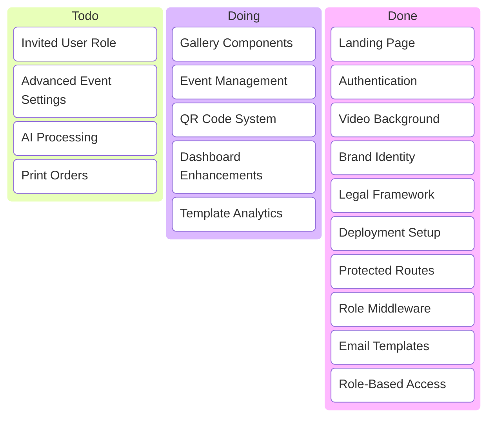
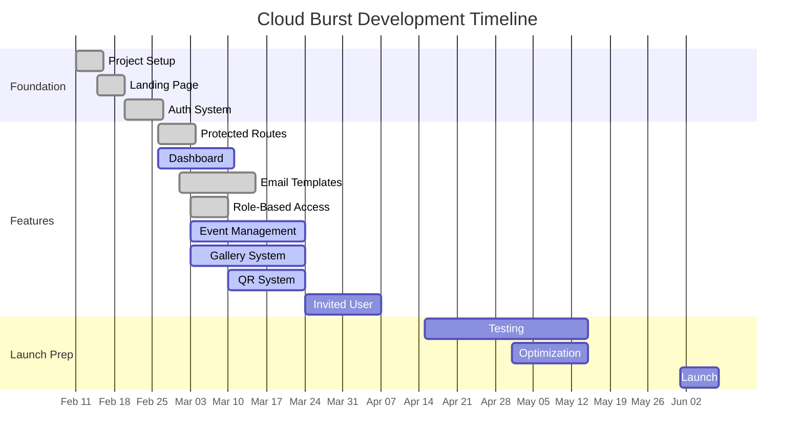

# 🛠️ **Cloud Burst - Development Roadmap**
📊 Overall Project Completion: ~75% [Beta Focus]
📅 March 3, 2025, 12:40 PM
Version: 0.1.18

## 📌 Situational Abstract
Cloud Burst has achieved significant milestones with the successful implementation of a comprehensive role-based access control (RBAC) system, enhanced event management functionality, and improved gallery components. The platform now features a secure permission system with clearly defined roles, permission-based UI rendering, and database-level access control through Row Level Security policies. The event management system has made substantial progress with the implementation of event detail pages, attendee management, and QR code display components. Gallery components have been enhanced with improved upload functionality and grid layouts. Our streamlined beta approach continues to prove effective, with stable deployment and optimized performance within memory constraints.

### 📈 Current Sprint Status
## [0.1.18] - 2025-03-03 [RBAC & EVENT MANAGEMENT]

| Component | Status | Progress |
|-----------|---------|-----------|
| 🔐 Auth System | ✅ Enhanced | 100% |
| 🔐 Protected Routes | ✅ Complete | 100% |
| 📊 Dashboard | 🟢 Active | 80% |
| 👥 Role-Based Access | ✅ Complete | 100% |
| 📧 Email Templates | ✅ Complete | 100% |
| 📅 Event Management | 🟢 Active | 45% |
| 🖼️ Gallery System | 🟢 Active | 40% |
| 🎫 QR System | 🟢 Active | 30% |

## 📊 Project Timeline Overview

| Phase | Timeline | Status | Progress |
|-------|----------|---------|-----------|
| 🏗️ Act I: Foundation | Feb-Mar 2024 | ✅ Complete | 100% |
| ⚙️ Act II: Features | Mar-Apr 2024 | 🟢 Active | 50% |
| 🚀 Act III: Launch | May-Jun 2024 | ⚪ Planned | 0% |

### 📈 Previous Sprint Status
## [0.1.17] - 2025-03-01 [EMAIL TEMPLATE SYSTEM]

| Component | Status | Progress |
|-----------|---------|-----------|
| 🔐 Auth System | ✅ Enhanced | 100% |
| 🔐 Protected Routes | ✅ Complete | 100% |
| 📊 Dashboard | 🟡 Active | 75% |
| 👥 Role Middleware | ✅ Complete | 100% |
| 📧 Email Templates | ✅ Complete | 100% |
| 🖼️ Gallery System | 🟡 Active | 25% |

## [0.1.16] - 2025-03-01 [ENHANCED FEATURES]

| Component | Status | Progress |
|-----------|---------|-----------|
| 🔐 Auth System | ✅ Enhanced | 100% |
| 🔐 Protected Routes | 🟡 Active | 75% |
| 📊 Dashboard | 🟡 Active | 65% |
| 👥 Role Middleware | ✅ Complete | 100% |
| 🖼️ Gallery System | 🟡 Starting | 15% |

## [0.1.14] - 2024-02-27 [INFRASTRUCTURE OPTIMIZATION]

| Component | Status | Owner | Due Date | Progress |
|-----------|--------|-------|----------|-----------|
| 🔧 Dev Environment | ✅ Done | @mrj0nesmtl | Feb 10, 2024 | 100% |
| 📦 Repository | ✅ Done | @mrj0nesmtl | Feb 10, 2024 | 100% |
| 🎨 UI Framework | ✅ Done | @mrj0nesmtl | Feb 15, 2024 | 100% |
| 🎨 Brand Identity | ✅ Done | @mrj0nesmtl | Feb 15, 2024 | 100% |
| 📜 Legal Framework | ✅ Done | @mrj0nesmtl | Feb 15, 2024 | 100% |
| 💰 Pricing System | ✅ Done | @mrj0nesmtl | Feb 15, 2024 | 100% |
| 🔐 Auth System | ✅ Stable | @mrj0nesmtl | Feb 24, 2024 | 100% |
| 🔐 Protected Routes | ✅ Complete | @mrj0nesmtl | Mar 5, 2024 | 100% |
| 📊 Dashboard | 🟢 Active | @mrj0nesmtl | Mar 15, 2024 | 80% |
| 👥 Role-Based Access | ✅ Complete | @mrj0nesmtl | Mar 3, 2024 | 100% |
| ⚙️ Settings System | ✅ Done | @mrj0nesmtl | Mar 5, 2024 | 100% |
| 📸 Photo Gallery | 🟢 Active | @mrj0nesmtl | Mar 30, 2024 | 40% |
| 🎫 QR System | 🟢 Active | @mrj0nesmtl | Apr 15, 2024 | 30% |

### ⚡ Core Feature Progress
- ✅ Landing page with video background
- ✅ Basic navigation and UI
- ✅ Theme system
- ✅ Protected routes
- ✅ Role-based access control
- 🟢 Event management system
- 🟢 Gallery components
- ✅ Dashboard layout
- 🟢 QR code generation
- 🟢 Attendee management

## 🎯 Primary Objectives

1. Role-Based Access Control [Complete]
   - [x] Role definitions and hierarchy
   - [x] Permission hooks and components
   - [x] Conditional UI rendering
   - [x] Route protection middleware
   - [x] Database RLS policies

2. Event Management System [In Progress]
   - [x] Event creation form
   - [x] Event detail page
   - [x] Attendee management
   - [x] QR code display
   - [ ] Event settings
   - [ ] Advanced options

3. Gallery System [In Progress]
   - [x] Basic upload component
   - [x] Gallery grid component
   - [ ] Lightbox viewer
   - [ ] Photo actions
   - [ ] Image optimization pipeline

4. QR Code System [In Progress]
   - [x] QR code generation
   - [x] Event linking
   - [ ] Access validation
   - [ ] Scanning flow

5. Invited User Role [Planned]
   - [ ] Role implementation
   - [ ] QR code-based authentication
   - [ ] Limited access controls
   - [ ] Event-specific permissions

## 🔍 Risk Assessment
- Image handling within memory constraints
- QR code generation performance
- Role-based access complexity
- State management scalability
- Email template rendering across clients
- Subscription tier verification

## 📈 Success Metrics
| Feature | Priority | Complexity | Status |
|---------|----------|------------|---------|
| Auth Flows | High | Medium | Complete |
| Email Templates | High | Medium | Complete |
| Role-Based Access | High | Medium | Complete |
| Event Management | High | High | In Progress |
| Gallery | High | High | In Progress |
| QR System | High | Medium | In Progress |
| Invited User Role | Medium | Medium | Planned |

## 📝 Notes
- System stable at cb-beta.replit.app
- Memory optimization successful
- Video background implemented
- Email template system fully functional
- RBAC system fully implemented
- Event management foundation in place
- Gallery components progressing well
- Feature development accelerating

## 📋 **Kanban Board**

```mermaid
---
title: Cloud Burst Development Kanban
---
kanban
    Todo 
        Invited User Role
        Advanced Event Settings
        AI Processing
        Print Orders
    Doing
        Gallery Components
        Event Management
        QR Code System
        Dashboard Enhancements
        Template Analytics
    Done
        Landing Page
        Authentication
        Video Background
        Brand Identity
        Legal Framework
        Deployment Setup
        Protected Routes
        Role Middleware
        Email Templates
        Role-Based Access
```

## 📅 **Project Timeline (Gantt)**

```mermaid
gantt
    title Cloud Burst Development Timeline
    dateFormat  YYYY-MM-DD
    axisFormat %b %d
    
    section Foundation
    Project Setup      :done, f1, 2024-02-11, 5d
    Landing Page      :done, f2, 2024-02-15, 5d
    Auth System       :done, f3, 2024-02-20, 7d
    
    section Features
    Protected Routes  :done, r1, 2024-02-26, 7d
    Dashboard        :active, d1, 2024-02-26, 14d
    Email Templates  :done, e1, 2024-03-01, 14d
    Role-Based Access :done, a1, 2024-03-03, 7d
    Event Management :active, m1, 2024-03-03, 21d
    Gallery System   :active, g1, 2024-03-03, 21d
    QR System       :active, q1, 2024-03-10, 14d
    Invited User    :i1, 2024-03-24, 14d
    
    section Launch Prep
    Testing         :t1, 2024-04-15, 30d
    Optimization    :o1, 2024-05-01, 14d
    Launch         :l1, 2024-06-01, 7d
```

--- 