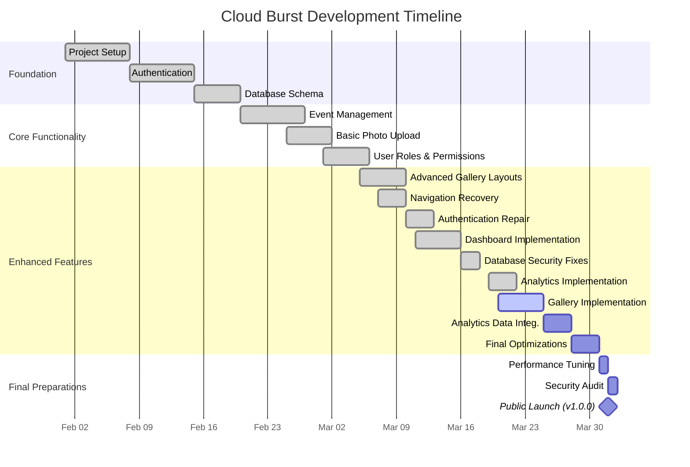
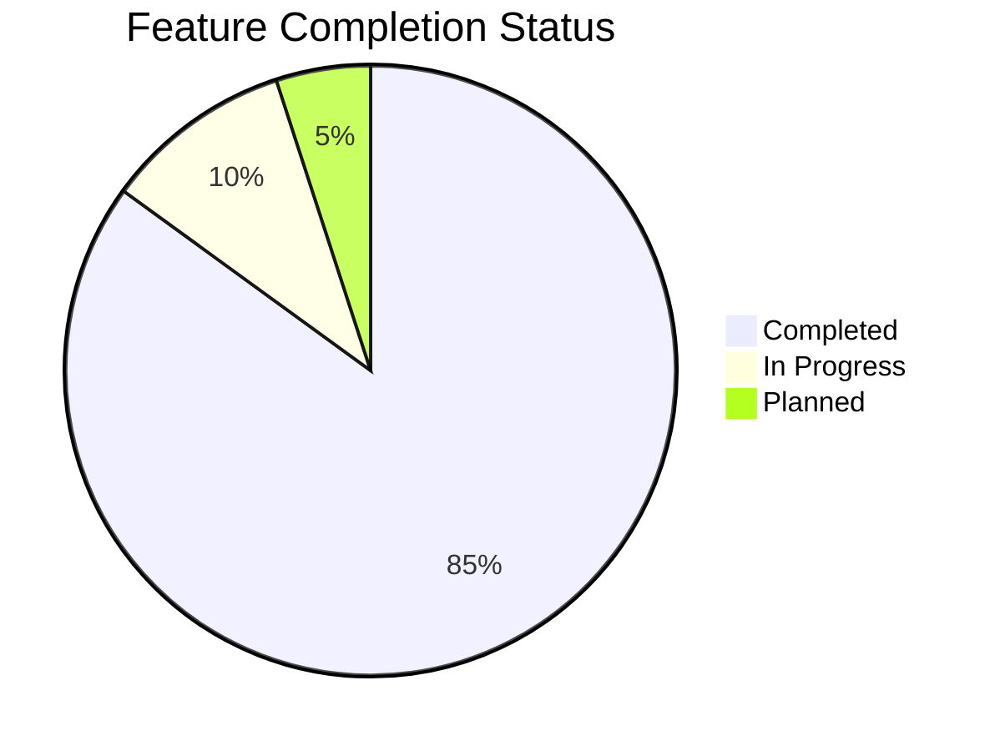

# Cloud Burst Development Roadmap

## Current Version: 0.7.7

## 📌 Situational Abstract
Cloud Burst has evolved from concept to a robust beta platform in a remarkably short timeframe since its inception in February 2025. With the successful implementation of the Analytics section and navigation improvements, we've continued to build on our solid foundation for our event photography platform. The recent focus on layout consistency and enhanced user experience has improved the overall polish of the application, setting the stage for the completion of core gallery features.

Our platform now offers photographers and event organizers powerful tools to create, manage, and share event galleries with intuitive interfaces. The role-based access control system ensures appropriate permissions across different user types, while our improved database security provides robust protection for user data. We've successfully addressed technical challenges, such as the Events Analytics page rendering issues and sidebar width constraints, resulting in a more polished and professional user experience.

Through Session 23, we successfully implemented the Engagement Metrics analytics page and created a placeholder for the upcoming Events Analytics feature. We've also made significant improvements to the navigation system, including proper top padding for gallery pages, increased sidebar width, and enhanced disabled state handling for navigation items.

As we approach the 85% completion mark of our Enhanced Features phase, we're preparing for the final stages of development, which will include completing the Gallery implementation, finalizing the Analytics section with real data, and comprehensive testing across all user roles. The platform continues to maintain excellent performance within our memory constraints, demonstrating the effectiveness of our optimization strategies.

## Current Phase: Enhanced Features Implementation
**Status: In Progress (85% Complete)**

### Active Development
- 🟡 Gallery Implementation (In Progress)
- 🟡 Analytics Data Integration (In Progress)
- 🟡 User Experience Refinement (In Progress)
- 🟡 Responsive Design Finalization (In Progress)

### Recently Completed
- ✅ New Analytics section with Engagement Metrics page
- ✅ "Coming Soon" placeholder for Events Analytics page
- ✅ Enhanced sidebar navigation with proper organization
- ✅ Fixed padding issues in Gallery layout
- ✅ Increased sidebar width for better UI layout
- ✅ Reordered Analytics menu items
- ✅ Optimized loading states for analytics pages
- ✅ Enhanced responsive design for all new pages

### Next Priorities (v0.7.8)
1. Complete Gallery implementation with upload capabilities
2. Enhance photo moderation workflow
3. Finalize album management features
4. Implement data integration for Analytics pages
5. Comprehensive testing across all user roles

## 📅 Development Timeline (Gantt)

```mermaid
gantt
    title Cloud Burst Development Timeline
    dateFormat  YYYY-MM-DD
    axisFormat %b %d
    
    section Foundation
    Project Setup           :done, f1, 2025-02-01, 7d
    Authentication          :done, f2, 2025-02-08, 7d
    Database Schema         :done, f3, 2025-02-15, 5d
    
    section Core Functionality
    Event Management        :done, c1, 2025-02-20, 7d
    Basic Photo Upload      :done, c2, 2025-02-25, 5d
    User Roles & Permissions:done, c3, 2025-03-01, 5d
    
    section Enhanced Features
    Advanced Gallery Layouts:done, e1, 2025-03-05, 5d
    Navigation Recovery     :done, e2, 2025-03-07, 3d
    Authentication Repair   :done, e3, 2025-03-10, 3d
    Dashboard Implementation:done, e4, 2025-03-11, 5d
    Database Security Fixes :done, e5, 2025-03-16, 2d
    Analytics Implementation:done, e6, 2025-03-19, 3d
    Gallery Implementation  :active, e7, 2025-03-20, 5d
    Analytics Data Integ.   :e8, 2025-03-25, 3d
    Final Optimizations     :e9, 2025-03-28, 3d
    
    section Final Preparations
    Performance Tuning      :o1, 2025-03-31, 1d
    Security Audit          :o2, 2025-04-01, 1d
    Public Launch (v1.0.0)  :milestone, l3, 2025-04-01, 0d
```

## Development Timeline

### March 11-15, 2025 (Completed)
- ✅ Implemented event status management
- ✅ Added QR code generation during event creation
- ✅ Enhanced QR code page layout
- ✅ Created Add Attendee dialog
- ✅ Fixed QR codes not appearing in listing page

### March 16-18, 2025 (Completed)
- ✅ Fixed database functions with mutable search paths
- ✅ Implemented RLS policies for role_capabilities table
- ✅ Enhanced permissions caching to reduce API calls
- ✅ Improved error handling in middleware
- ✅ Updated documentation for Session 23

### March 19-24, 2025 (Current)
- ✅ Implemented Analytics section with Engagement Metrics
- ✅ Added "Coming Soon" placeholder for Events Analytics
- ✅ Enhanced navigation and layout consistency
- 🟡 Implement Gallery features
- 🟡 Create photo upload mechanism
- 🟡 Develop album management features

### March 25-31, 2025 (Upcoming)
- Analytics data integration
- Complete photo moderation features
- Performance optimization
- Security audit and hardening
- Final documentation
- Pre-launch preparations

### April 1, 2025
- Public launch (v1.0.0)
- Marketing and growth initiatives
- Community building

## Detailed Phase Breakdown

### Phase 1: Foundation (Completed Feb 1-15, 2025)
- ✅ Project initialization with Next.js 14
- ✅ Basic UI components and layout
- ✅ Authentication system integration
- ✅ Database schema design
- ✅ Storage configuration

### Phase 2: Core Functionality (Completed Feb 15-Mar 1, 2025)
- ✅ Event creation and management
- ✅ Basic photo upload
- ✅ Simple gallery view
- ✅ User roles and permissions
- ✅ Public/private event settings

### Phase 3: Enhanced Features (Current - 85% Complete)
- ✅ Advanced gallery layouts (grid, masonry, slideshow)
- ✅ Navigation system recovery and enhancement
- ✅ Authentication system repair
- ✅ Dashboard foundation with key components
- ✅ Create Event interface with advanced options
- ✅ Event status management with selector component
- ✅ QR code generation during event creation
- ✅ Add Attendee dialog functionality
- ✅ Database security fixes and optimizations
- ✅ Analytics section with Engagement Metrics
- ✅ Navigation and layout improvements
- 🟡 Gallery implementation (In Progress)
- 🟡 Photo upload mechanism (In Progress)
- 🟡 Album management (In Progress)
- 🟡 Photo moderation (In Progress)
- 🟡 Analytics data integration (In Progress)

### Phase 4: Final Preparations (Mar 28-Apr 1, 2025)
- ⚠️ Performance optimization
- ⚠️ Security audit
- ⚠️ Documentation completion
- ⚠️ Final testing
- ⚠️ Deployment preparation

## Key Metrics for Success

### Technical Metrics
- Page load time < 2 seconds
- Lighthouse score > 90 in all categories
- Test coverage > 80%
- Zero critical security vulnerabilities

### User Experience Metrics
- Upload success rate > 99%
- User session duration > 5 minutes
- Return visitor rate > 40%
- Feature adoption rate > 60%

### Business Metrics
- User growth rate > 10% month-over-month
- Event creation rate > 5% week-over-week
- Photo upload volume > 1000 per day
- Active event ratio > 70%

## 📊 Project Status Dashboard

```mermaid
pie title Feature Completion Status
    "Completed" : 85
    "In Progress" : 10
    "Planned" : 5
```

## 🔍 Risk Assessment
- **Gallery performance**: Ensuring fast loading of large image collections
- **Storage management**: Implementing efficient storage and retrieval mechanisms
- **Upload reliability**: Creating a robust upload system with error handling
- **Mobile photo browsing**: Optimizing the gallery experience for mobile devices
- **Moderation workflows**: Building intuitive tools for effective photo moderation
- **Analytics accuracy**: Ensuring data reliability and meaningful insights
