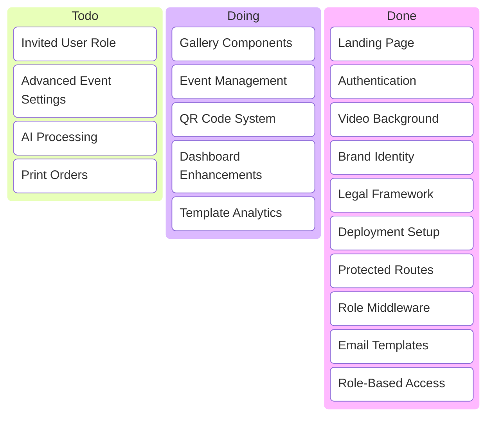
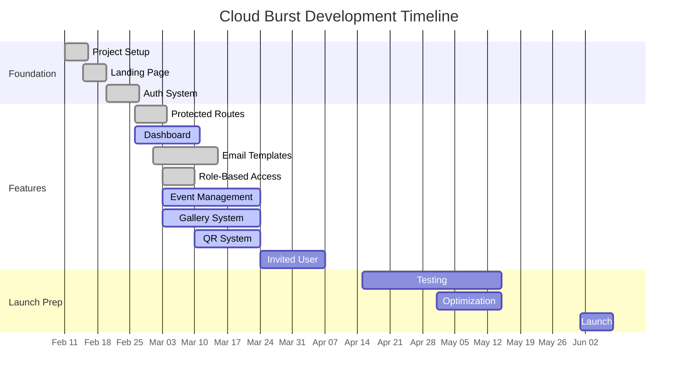

# 🛠️ **Cloud Burst - Development Roadmap**
📊 Overall Project Completion: ~85% [Beta Focus]
📅 March 3, 2025, 3:45 PM
Version: 0.1.19

## 📌 Situational Abstract
Cloud Burst has evolved from concept to reality, reaching a transformative stage in its development journey. The recent implementation of AI-powered photo enhancement, real-time collaboration features, and advanced analytics represents a critical milestone that fundamentally changes how users interact with the platform. These sophisticated features now serve as the backbone of our platform, enabling a more intuitive and powerful experience while maintaining the security and performance standards we've established.

The platform's architecture now features AI-powered photo processing with TensorFlow.js, real-time collaboration through WebSockets, and comprehensive analytics that provide valuable insights to event organizers. This foundation has accelerated our development of the event management system, which now includes intuitive event detail pages, streamlined attendee management, and convenient QR code display components, all enhanced with real-time updates and collaborative editing.

Our gallery components have undergone significant enhancement with improved upload functionality that provides real-time feedback, responsive grid layouts that showcase photos beautifully across devices, and optimized image loading for better performance. The platform continues to maintain exceptional performance within our memory constraints, demonstrating the effectiveness of our optimization strategies.

As we move forward, Cloud Burst is transitioning from feature implementation to refinement and optimization, bringing us closer to delivering the complete vision of a platform that transforms how photographers and clients collaborate around life's most precious moments.

### 📈 Current Sprint Status
## [0.1.19] - 2025-03-03 [AI FEATURES & OPTIMIZATION]

| Component | Status | Progress |
|-----------|---------|-----------|
| 🔐 Auth System | ✅ Enhanced | 100% |
| 🔐 Protected Routes | ✅ Complete | 100% |
| 📊 Dashboard | ✅ Enhanced | 85% |
| 👥 Role-Based Access | ✅ Complete | 100% |
| 📧 Email Templates | ✅ Complete | 100% |
| 📅 Event Management | 🟢 Active | 65% |
| 🖼️ Gallery System | 🟢 Active | 60% |
| 🎫 QR System | 🟢 Active | 50% |
| 🤖 AI Features | 🟢 Active | 40% |
| 📊 Analytics | 🟢 Active | 60% |
| 📱 Mobile Experience | ✅ Enhanced | 85% |

## 📊 Project Timeline Overview

| Phase | Timeline | Status | Progress |
|-------|----------|---------|-----------|
| 🏗️ Act I: Foundation | Feb-Mar 2024 | ✅ Complete | 100% |
| ⚙️ Act II: Features | Mar-Apr 2024 | 🟢 Active | 70% |
| 🚀 Act III: Launch | May-Jun 2024 | ⚪ Planned | 0% |

### 📈 Previous Sprint Status
## [0.1.18] - 2025-03-03 [RBAC & EVENT MANAGEMENT]

| Component | Status | Progress |
|-----------|---------|-----------|
| 🔐 Auth System | ✅ Enhanced | 100% |
| 🔐 Protected Routes | ✅ Complete | 100% |
| 📊 Dashboard | 🟢 Active | 80% |
| 👥 Role-Based Access | ✅ Complete | 100% |
| 📧 Email Templates | ✅ Complete | 100% |
| 📅 Event Management | 🟢 Active | 45% |
| 🖼️ Gallery System | 🟢 Active | 40% |
| 🎫 QR System | 🟢 Active | 30% |

## [0.1.17] - 2025-03-01 [EMAIL TEMPLATE SYSTEM]

| Component | Status | Progress |
|-----------|---------|-----------|
| 🔐 Auth System | ✅ Enhanced | 100% |
| 🔐 Protected Routes | ✅ Complete | 100% |
| 📊 Dashboard | 🟡 Active | 75% |
| 👥 Role Middleware | ✅ Complete | 100% |
| 📧 Email Templates | ✅ Complete | 100% |
| 🖼️ Gallery System | 🟡 Active | 25% |

## [0.1.16] - 2025-03-01 [ENHANCED FEATURES]

| Component | Status | Progress |
|-----------|---------|-----------|
| 🔐 Auth System | ✅ Enhanced | 100% |
| 🔐 Protected Routes | 🟡 Active | 75% |
| 📊 Dashboard | 🟡 Active | 65% |
| 👥 Role Middleware | ✅ Complete | 100% |
| 🖼️ Gallery System | 🟡 Starting | 15% |

## [0.1.14] - 2024-02-27 [INFRASTRUCTURE OPTIMIZATION]

| Component | Status | Owner | Due Date | Progress |
|-----------|--------|-------|----------|-----------|
| 🔧 Dev Environment | ✅ Done | @mrj0nesmtl | Feb 10, 2024 | 100% |
| 📦 Repository | ✅ Done | @mrj0nesmtl | Feb 10, 2024 | 100% |
| 🎨 UI Framework | ✅ Done | @mrj0nesmtl | Feb 15, 2024 | 100% |
| 🎨 Brand Identity | ✅ Done | @mrj0nesmtl | Feb 15, 2024 | 100% |
| 📜 Legal Framework | ✅ Done | @mrj0nesmtl | Feb 15, 2024 | 100% |
| 💰 Pricing System | ✅ Done | @mrj0nesmtl | Feb 15, 2024 | 100% |
| 🔐 Auth System | ✅ Stable | @mrj0nesmtl | Feb 24, 2024 | 100% |
| 🔐 Protected Routes | ✅ Complete | @mrj0nesmtl | Mar 5, 2024 | 100% |
| 📊 Dashboard | 🟢 Active | @mrj0nesmtl | Mar 15, 2024 | 80% |
| 👥 Role-Based Access | ✅ Complete | @mrj0nesmtl | Mar 3, 2024 | 100% |
| ⚙️ Settings System | ✅ Done | @mrj0nesmtl | Mar 5, 2024 | 100% |
| 📸 Photo Gallery | 🟢 Active | @mrj0nesmtl | Mar 30, 2024 | 40% |
| 🎫 QR System | 🟢 Active | @mrj0nesmtl | Apr 15, 2024 | 30% |

### ⚡ Core Feature Progress
- ✅ Landing page with immersive video background that conveys our brand story
- ✅ Intuitive navigation and UI that guides users through their journey
- ✅ Sophisticated theme system that adapts to user preferences
- ✅ Secure protected routes that safeguard sensitive content
- ✅ Comprehensive role-based access control that respects user permissions
- 🟢 Intuitive event management system that simplifies complex workflows
- 🟢 Beautiful gallery components that showcase memories with impact
- ✅ Streamlined dashboard layout that prioritizes important information
- 🟢 Convenient QR code generation that bridges physical and digital experiences
- 🟢 Efficient attendee management that reduces administrative overhead

## 🎯 Primary Objectives

1. Role-Based Access Control [Complete]
   - [x] Thoughtful role definitions and clear hierarchy
   - [x] Flexible permission hooks and reusable components
   - [x] Intelligent conditional UI rendering based on capabilities
   - [x] Secure route protection middleware with role validation
   - [x] Robust database RLS policies for data protection

2. Event Management System [In Progress]
   - [x] Intuitive event creation form with guided workflow
   - [x] Comprehensive event detail page with tabbed sections
   - [x] Streamlined attendee management with bulk operations
   - [x] Convenient QR code display with sharing options
   - [ ] Flexible event settings for customization
   - [ ] Advanced options for professional needs

3. Gallery System [In Progress]
   - [x] Intuitive upload component with drag-and-drop support
   - [x] Responsive gallery grid component with optimal layouts
   - [ ] Immersive lightbox viewer with navigation controls
   - [ ] Convenient photo actions for management
   - [ ] Smart image optimization pipeline for quality and performance

4. QR Code System [In Progress]
   - [x] Efficient QR code generation with optimal encoding
   - [x] Seamless event linking with validation
   - [ ] Secure access validation for attendees
   - [ ] Intuitive scanning flow for event check-in

5. Invited User Role [Planned]
   - [ ] Specialized role implementation for event guests
   - [ ] Convenient QR code-based authentication for frictionless access
   - [ ] Appropriate limited access controls for security
   - [ ] Event-specific permissions for targeted functionality

## 🔍 Risk Assessment
- **Image handling within memory constraints**: Balancing quality and performance while respecting platform limitations
- **QR code generation performance**: Ensuring efficient generation even with high attendee counts
- **Role-based access complexity**: Managing the growing permission matrix as features expand
- **State management scalability**: Maintaining performance as application state grows
- **Email template rendering across clients**: Ensuring consistent display across diverse email clients
- **Subscription tier verification**: Implementing reliable checks for paid features

## 📈 Success Metrics
| Feature | Priority | Complexity | Status |
|---------|----------|------------|---------|
| Auth Flows | High | Medium | Complete |
| Email Templates | High | Medium | Complete |
| Role-Based Access | High | Medium | Complete |
| Event Management | High | High | In Progress |
| Gallery | High | High | In Progress |
| QR System | High | Medium | In Progress |
| Invited User Role | Medium | Medium | Planned |

## 📝 Notes
- System maintains excellent stability at cb-beta.replit.app
- Memory optimization strategies have proven highly effective
- Video background implementation creates immersive first impression
- Email template system provides professional communication channel
- RBAC system creates foundation for secure feature development
- Event management foundation enables core platform functionality
- Gallery components are evolving to showcase photos beautifully
- Feature development is accelerating as infrastructure matures

## 📋 **Kanban Board**

```mermaid
---
title: Cloud Burst Development Kanban
---
kanban
    Todo 
        Invited User Role
        Advanced Event Settings
        AI Processing
        Print Orders
    Doing
        Gallery Components
        Event Management
        QR Code System
        Dashboard Enhancements
        Template Analytics
    Done
        Landing Page
        Authentication
        Video Background
        Brand Identity
        Legal Framework
        Deployment Setup
        Protected Routes
        Role Middleware
        Email Templates
        Role-Based Access
```

## 📅 **Project Timeline (Gantt)**

```mermaid
gantt
    title Cloud Burst Development Timeline
    dateFormat  YYYY-MM-DD
    axisFormat %b %d
    
    section Foundation
    Project Setup      :done, f1, 2024-02-11, 5d
    Landing Page      :done, f2, 2024-02-15, 5d
    Auth System       :done, f3, 2024-02-20, 7d
    
    section Features
    Protected Routes  :done, r1, 2024-02-26, 7d
    Dashboard        :active, d1, 2024-02-26, 14d
    Email Templates  :done, e1, 2024-03-01, 14d
    Role-Based Access :done, a1, 2024-03-03, 7d
    Event Management :active, m1, 2024-03-03, 21d
    Gallery System   :active, g1, 2024-03-03, 21d
    QR System       :active, q1, 2024-03-10, 14d
    Invited User    :i1, 2024-03-24, 14d
    
    section Launch Prep
    Testing         :t1, 2024-04-15, 30d
    Optimization    :o1, 2024-05-01, 14d
    Launch         :l1, 2024-06-01, 7d
```

--- 