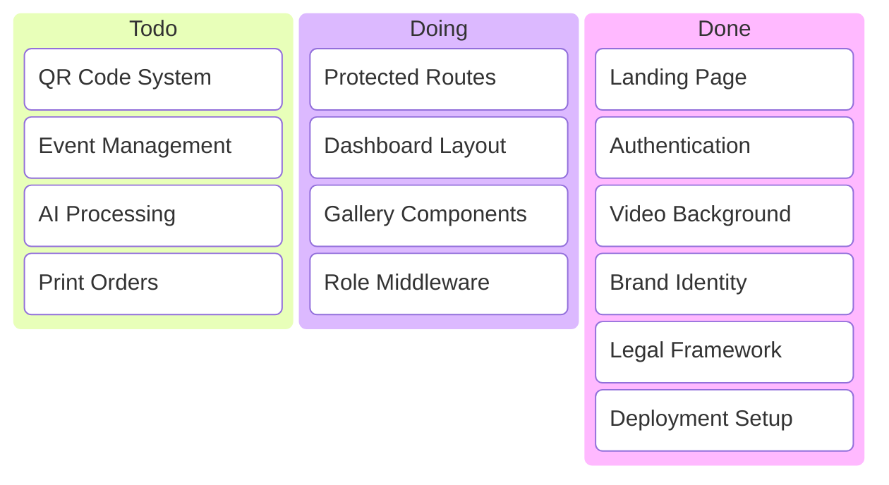
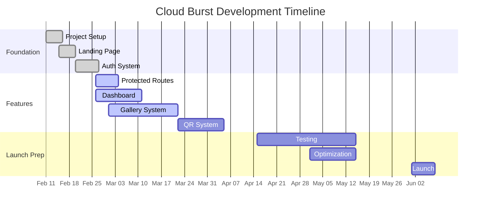

# 🛠️ **Cloud Burst - Development Roadmap**
📊 Overall Project Completion: ~65% [Beta Focus]
📅 March 1, 2025
Version: 0.1.16

## 📌 Situational Abstract
Cloud Burst has achieved significant milestones with the successful implementation of Super Admin authentication and dashboard functionality. The platform now features enhanced state management through Zustand and improved data fetching with TanStack Query. Our streamlined beta approach continues to prove effective, with stable deployment and optimized performance within memory constraints.

### 📈 Current Sprint Status
## [0.1.16] - 2025-03-01 [ENHANCED FEATURES]

| Component | Status | Progress |
|-----------|---------|-----------|
| 🔐 Auth System | ✅ Enhanced | 100% |
| 🔐 Protected Routes | 🟡 Active | 75% |
| 📊 Dashboard | 🟡 Active | 65% |
| 👥 Role Middleware | ✅ Complete | 100% |
| 🖼️ Gallery System | �� Starting | 15% |

## 📊 Project Timeline Overview

| Phase | Timeline | Status | Progress |
|-------|----------|---------|-----------|
| 🏗️ Act I: Foundation | Feb-Mar 2024 | ✅ Complete | 100% |
| ⚙️ Act II: Features | Mar-Apr 2024 | 🟡 Active | 25% |
| 🚀 Act III: Launch | May-Jun 2024 | ⚪ Planned | 0% |

### 📈 Current Sprint Status
## [0.1.14] - 2024-02-27 [INFRASTRUCTURE OPTIMIZATION]

| Component | Status | Owner | Due Date | Progress |
|-----------|--------|-------|----------|-----------|
| 🔧 Dev Environment | ✅ Done | @mrj0nesmtl | Feb 10, 2024 | 100% |
| 📦 Repository | ✅ Done | @mrj0nesmtl | Feb 10, 2024 | 100% |
| 🎨 UI Framework | ✅ Done | @mrj0nesmtl | Feb 15, 2024 | 100% |
| 🎨 Brand Identity | ✅ Done | @mrj0nesmtl | Feb 15, 2024 | 100% |
| 📜 Legal Framework | ✅ Done | @mrj0nesmtl | Feb 15, 2024 | 100% |
| 💰 Pricing System | ✅ Done | @mrj0nesmtl | Feb 15, 2024 | 100% |
| 🔐 Auth System | ✅ Stable | @mrj0nesmtl | Feb 24, 2024 | 100% |
| 🔐 Protected Routes | 🟡 Active | @mrj0nesmtl | Mar 5, 2024 | 35% |
| 📊 Dashboard | 🟡 Active | @mrj0nesmtl | Mar 15, 2024 | 25% |
| 👥 Role Middleware | ⚪ Planned | Mar 15 | 0% |
| ⚙️ Settings System | ✅ Done | @mrj0nesmtl | Mar 5, 2024 | 100% |
| 📸 Photo Gallery | 🟡 Starting | @mrj0nesmtl | Mar 30, 2024 | 10% |
| 🎫 QR System | ⚪ Planned | @mrj0nesmtl | Apr 15, 2024 | 0% |

### ⚡ Core Feature Progress
- ✅ Landing page with video background
- ✅ Basic navigation and UI
- ✅ Theme system
- 🟡 Protected routes
- 🟡 Gallery components
- 🟡 Dashboard layout
- ⚪ QR code generation
- ⚪ Event management

## 🎯 Primary Objectives

1. Protected Routes & Auth Flow
   - [ ] Dashboard layout implementation
   - [ ] Role-based middleware
   - [ ] Auth state management
   - [ ] Profile settings

2. Gallery System
   - [ ] Basic upload component
   - [ ] Image optimization pipeline
   - [ ] Gallery grid component
   - [ ] Lightbox viewer

3. QR Code System
   - [ ] QR code generation
   - [ ] Event linking
   - [ ] Access validation
   - [ ] Sharing flow

4. Event Management
   - [ ] Event creation
   - [ ] Guest management
   - [ ] Access controls
   - [ ] Analytics basics

## 🔍 Risk Assessment
- Image handling within memory constraints
- QR code generation performance
- Role-based access complexity
- State management scalability

## 📈 Success Metrics
| Feature | Priority | Complexity | Status |
|---------|----------|------------|---------|
| Auth Flows | High | Medium | In Progress |
| Gallery | High | High | Starting |
| QR System | High | Medium | Planned |
| User Roles | High | Medium | Planned |

## 📝 Notes
- System stable at cb-beta.replit.app
- Memory optimization successful
- Video background implemented
- Feature development accelerating

## 📋 **Kanban Board**

```mermaid
---
title: Cloud Burst Development Kanban
---
kanban
    Todo 
        QR Code System
        Event Management
        AI Processing
        Print Orders
    Doing
        Protected Routes
        Dashboard Layout
        Gallery Components
        Role Middleware
    Done
        Landing Page
        Authentication
        Video Background
        Brand Identity
        Legal Framework
        Deployment Setup
```

## 📅 **Project Timeline (Gantt)**

```mermaid
gantt
    title Cloud Burst Development Timeline
    dateFormat  YYYY-MM-DD
    axisFormat %b %d
    
    section Foundation
    Project Setup      :done, f1, 2024-02-11, 5d
    Landing Page      :done, f2, 2024-02-15, 5d
    Auth System       :done, f3, 2024-02-20, 7d
    
    section Features
    Protected Routes  :active, r1, 2024-02-26, 7d
    Dashboard        :active, d1, 2024-02-26, 14d
    Gallery System   :active, g1, 2024-03-01, 21d
    QR System       :q1, after g1, 14d
    
    section Launch Prep
    Testing         :t1, 2024-04-15, 30d
    Optimization    :o1, 2024-05-01, 14d
    Launch         :l1, 2024-06-01, 7d
```

--- 