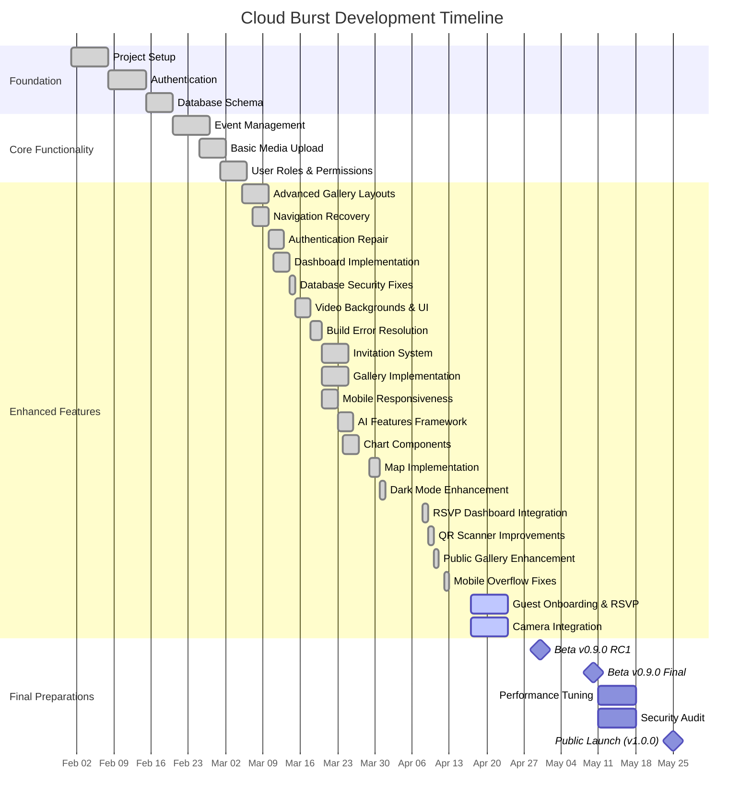
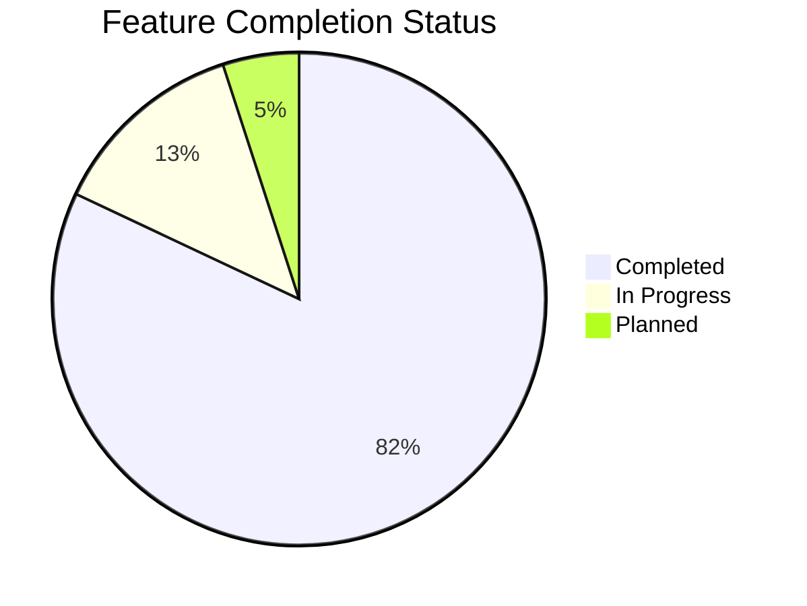

# Cloud Burst Development Roadmap

## Last Updated: April 9, 2025
## Current Version: 0.8.9

This document outlines the development roadmap for Cloud Burst, including completed milestones, current tasks, and planned future features.

## 🏁 Completed Milestones

### Foundation Phase (February 2025) ✅
- [x] Project repository setup
- [x] Next.js 14 architecture implementation
- [x] Supabase integration for auth and database
- [x] TypeScript configuration and standards
- [x] Deployment pipeline configuration

### Core Features Phase (March 1-15, 2025) ✅
- [x] User authentication system
- [x] Dashboard layout and navigation
- [x] Event management (CRUD operations)
- [x] Basic media upload functionality
- [x] User roles and permissions foundation
- [x] Responsive design implementation

### Enhanced Features Phase (March 15 - April 9, 2025) ✅
- [x] Advanced gallery layouts and organization
- [x] Interactive map with event locations
- [x] Enhanced media management
- [x] Comprehensive invitation system with tracking
- [x] Mobile responsive optimization
- [x] RSVP system implementation
- [x] Guest reservation functionality
- [x] Camera integration for direct uploads
- [x] Contractor roles management
- [x] Staff management enhancements
- [x] Role badge system
- [x] Enhanced permission controls

## 🚧 Current Development (April 10-30, 2025)

### Final Preparations Phase
- [ ] AI feature integration (65% complete)
  - [x] Facial recognition foundation
  - [x] Basic image tagging
  - [ ] Group photo identification
  - [ ] Automated gallery suggestions
- [ ] Analytics dashboard (80% complete)
  - [x] Event metrics visualization
  - [x] Attendance tracking
  - [ ] RSVP analytics
  - [ ] Photographer performance metrics
- [ ] Advanced security features (75% complete)
  - [x] Role-based access controls
  - [x] Row-level security policies
  - [ ] Access logging and monitoring
- [ ] Final UI/UX refinements (70% complete)
  - [x] Consistent styling across components
  - [x] Accessibility improvements
  - [ ] Animation and transition enhancements
  - [ ] Final mobile optimizations

## 🔮 Future Plans (May 2025 and beyond)

### Beta Launch Phase (May 1-15, 2025)
- [ ] Beta program deployment
- [ ] User feedback collection
- [ ] Performance optimization
- [ ] Bug fixes and refinements

### 1.0 Release Phase (May 30, 2025)
- [ ] Official production deployment
- [ ] Marketing materials and documentation
- [ ] Training resources for users
- [ ] Support system implementation

### Post-Launch Enhancements (June 2025+)
- [ ] Mobile app development
- [ ] Expanded AI capabilities
- [ ] Integration with third-party services
- [ ] Advanced analytics and reporting
- [ ] Enterprise features

## Current Focus Areas

1. **AI Feature Integration** - Completing the remaining AI components and ensuring they work efficiently with the existing gallery system.
2. **Analytics Dashboard** - Finalizing the RSVP analytics and photographer performance metrics.
3. **Final UI/UX Polish** - Ensuring a consistent, accessible, and visually appealing user experience.
4. **Documentation** - Completing comprehensive user and developer documentation.
5. **Performance Optimization** - Identifying and resolving any performance bottlenecks.

## Recently Completed Features

1. **Contractor Roles System** - Added specialized roles for external contractors with appropriate permissions and visual indicators.
2. **Staff Management Enhancements** - Improved the staff management interface with role badges and role-specific descriptions.
3. **Guest Reservation System** - Implemented a complete system for non-RSVP guests to register for gallery access.
4. **Camera Integration** - Added direct camera capture functionality for uploading photos.
5. **Gallery Permission System** - Implemented comprehensive permission controls for gallery access.

## 📌 Situational Abstract
Cloud Burst has entered a critical phase with the implementation of responsive design improvements in version 0.8.8, building upon the public gallery enhancements in version 0.8.6 and the QR scanner improvements in version 0.8.5. With the successful resolution of mobile overflow issues across the Gallery and Event Galleries components, we've significantly enhanced the platform's usability and visual consistency across all device sizes, especially on mobile viewports.

The platform now offers a fully responsive event management system with proper role-based access control, enhanced navigation patterns, secure authentication flows, improved layouts on all pages, a complete invitation system with SendGrid integration, a comprehensive framework for AI features, an interactive map displaying event locations, a refined dark mode experience with consistent UI patterns, an improved QR scanner with better performance, and a mobile-optimized public gallery. Recent achievements include comprehensive fixes for mobile layout issues, optimized component spacing for small screens, enhanced typography with responsive sizing, and improved card layouts with consistent styling across all device sizes.

As we continue Session 38, our focus remains on delivering the public-facing aspects of the Guest Onboarding & RSVP Flow implementation. These features are critical for our upcoming Beta 0.9.0 Release Candidate 1, scheduled for April 30, 2025. Our immediate priority is completing these key features while maintaining the platform's stability, performance, and visual consistency across both light and dark themes on all device sizes.

## Current Phase: Mobile Responsiveness & Guest Onboarding Implementation
**Status: In Progress (75% Complete)**

### Active Development
- ✅ **Gallery UI Mobile Responsiveness** (In Progress)
  - ✅ Fix mobile overflow issues in Gallery and Event Galleries components (100% Complete)
  - ✅ Improve responsive design for all gallery components (100% Complete)
  - ✅ Enhance component spacing and layout for better mobile experience (100% Complete)
  - ✅ Optimize gallery tabs for better mobile display (100% Complete)
  - ✅ Refine card components for consistent appearance across devices (100% Complete)
  - ✅ Convert inline styles to Tailwind classes for better responsiveness (100% Complete)
  - ✅ Implement consistent scrolling behavior for gallery components (100% Complete)
  - ✅ Enhance mobile typography with responsive text sizing (100% Complete)
- ✅ **Public Gallery Enhancement** (In Progress)
  - ✅ Implement modern responsive design with auto-filling grid (100% Complete)
  - ✅ Add hover effects and animations for event cards (100% Complete)
  - ✅ Improve image display with hover zoom effects (100% Complete)
  - ✅ Optimize for mobile with responsive text sizing (100% Complete)
  - ✅ Ensure accessibility with proper contrast and text clipping (100% Complete)
  - ✅ Implement consistent styling across event cards (100% Complete)
  - ✅ Add status-colored backgrounds for thumbnails (100% Complete)
- ✅ **TypeScript Error Resolution** (Completed)
  - ✅ Fix EventCount type errors in invitation components (100% Complete)
  - ✅ Resolve type safety issues in event duplication (100% Complete)
  - ✅ Enhance API response typing for better reliability (100% Complete)
  - ✅ Implement proper type assertions for complex objects (100% Complete)
- ✅ **Invitation System Verification** (Completed)
  - ✅ Test event invitation sending with database logging (100% Complete)
  - ✅ Verify stable deployment with invitation functionality (100% Complete)
  - ✅ Configure SendGrid API keys in deployment environment (100% Complete)
  - ✅ Verify end-to-end email delivery to recipients (100% Complete)
- 🟡 **Guest Onboarding & RSVP Flow** (High Priority In Progress)
  - ✅ Design RSVP user flow with state diagram (100% Complete)
  - ✅ Enhance invitation database schema for RSVP tracking (100% Complete)
  - ✅ Design and implement RSVP status dashboard (100% Complete)
  - 🟡 Create RSVP form component with Zod validation (50% Complete)
  - 🟡 Implement magic link authentication for invitees (0% Complete)
  - 🟡 Build API endpoints for RSVP management (50% Complete)
  - 🟡 Create middleware for magic link validation (0% Complete)
- 🟡 **AI Features Integration** (Medium Priority)
  - ✅ Create AI Features section in sidebar navigation (100% Complete)
  - ✅ Implement layout structure for AI features (100% Complete) 
  - ✅ Build placeholder pages for AI capabilities (100% Complete)
  - 🟡 Set up backend architecture for AI processing (0% Complete)
  - 🟡 Integrate TensorFlow.js for client-side processing (0% Complete)
  - 🟡 Create basic facial detection component (0% Complete)
  - 🟡 Implement media enhancement pipeline (0% Complete)
- 🟡 **QR Code & Camera Implementation** (Medium Priority)
  - ✅ Create QR code generation service (100% Complete)
  - ✅ Implement QR code scanner component (100% Complete)
  - ✅ Add camera permission handling (100% Complete)
  - 🟡 Build token validation for scanned QR codes (30% Complete)
  - 🟡 Create camera access hook for media capture (0% Complete)
  - 🟡 Implement photo capture UI for mobile (0% Complete)
- 🟡 **Analytics & Tracking** (Medium Priority)
  - ✅ Implement chart components for data visualization (100% Complete)
  - 🟡 Implement invitation open tracking (0% Complete)
  - 🟡 Add QR code scan analytics (0% Complete)
  - 🟡 Create RSVP conversion metrics (0% Complete)
  - 🟡 Build dashboard for invitation effectiveness (0% Complete)
- ✅ **Mobile Responsiveness** (Active)
  - ✅ Overview Dashboard mobile (100% Complete)
  - ✅ Manage Events mobile (100% Complete)
  - ✅ Create Event mobile (100% Complete)
  - ✅ All Guests Invitations mobile (100% Complete)
  - ✅ QR Codes mobile (100% Complete)
  - ✅ Gallery (All Media) mobile (100% Complete)
  - ✅ Gallery (Event Galleries) mobile (100% Complete)
  - ✅ Gallery (Albums) mobile (100% Complete)
  - ✅ Moderation mobile (100% Complete)
  - ✅ Engagement (Analytics) mobile (100% Complete)
  - ✅ Public Events gallery mobile (100% Complete)

### Recently Completed (Session 38)
- ✅ Fixed mobile overflow issues in Gallery and Event Galleries components
- ✅ Improved responsive design for all gallery components with proper Tailwind classes
- ✅ Enhanced component spacing and layout for better mobile experience
- ✅ Optimized gallery tabs with better mobile display and scroll behavior
- ✅ Refined card components for consistent appearance across all device sizes
- ✅ Converted inline styles to Tailwind classes for better responsive behavior
- ✅ Implemented consistent scrolling behavior for gallery tab components
- ✅ Enhanced mobile typography with responsive text sizing for better readability

### Recently Completed (Session 36)
- ✅ Implemented modern responsive design for public gallery with auto-filling grid
- ✅ Added hover effects and animations for event cards to improve interaction
- ✅ Improved image display with hover zoom effects and gradient overlays
- ✅ Optimized for mobile with responsive text sizing and button layouts
- ✅ Ensured accessibility with proper contrast and text clipping
- ✅ Implemented consistent styling across all event card components
- ✅ Added status-colored backgrounds for event thumbnails without images
- ✅ Enhanced visual hierarchy with improved typography and spacing

### Remaining Priorities for Session 38
1. **Complete Public-Facing RSVP System**
   - Build public invitation landing page (`/invitation/[token]`)
   - Create RSVP form component with validation
   - Implement RSVP confirmation UI components
   - Add form submission and error handling
   - Enhance security for invitation tokens

2. **Implement Magic Link Authentication for Guests**
   - Update magic link to carry invitation context
   - Create session state for invited users
   - Implement proper redirects after authentication
   - Add error handling for magic link failures
   - Create session persistence for return visits

3. **Enhance Email Notifications**
   - Create RSVP confirmation email template
   - Implement email sending on RSVP submission
   - Add reminder email functionality
   - Create email open tracking
   - Implement email template variables

4. **Testing & Documentation**
   - Create E2E test for RSVP submission
   - Add unit tests for form validation
   - Implement API endpoint tests
   - Add accessibility tests for all components
   - Create mobile responsiveness tests

## 📅 Development Timeline (Gantt)

```mermaid
gantt
    title Cloud Burst Development Timeline
    dateFormat  YYYY-MM-DD
    axisFormat %b %d
    
    section Foundation
    Project Setup           :done, f1, 2025-02-01, 7d
    Authentication          :done, f2, 2025-02-08, 7d
    Database Schema         :done, f3, 2025-02-15, 5d
    
    section Core Functionality
    Event Management        :done, c1, 2025-02-20, 7d
    Basic Media Upload      :done, c2, 2025-02-25, 5d
    User Roles & Permissions:done, c3, 2025-03-01, 5d
    
    section Enhanced Features
    Advanced Gallery Layouts:done, e1, 2025-03-05, 5d
    Navigation Recovery     :done, e2, 2025-03-07, 3d
    Authentication Repair   :done, e3, 2025-03-10, 3d
    Dashboard Implementation:done, e4, 2025-03-11, 3d
    Database Security Fixes :done, e5, 2025-03-14, 1d
    Video Backgrounds & UI  :done, e6, 2025-03-15, 3d
    Build Error Resolution  :done, e7, 2025-03-18, 2d
    Invitation System       :done, e8, 2025-03-20, 5d
    Gallery Implementation  :done, e9, 2025-03-20, 5d
    Mobile Responsiveness   :done, e10, 2025-03-20, 3d
    AI Features Framework   :done, e11, 2025-03-23, 3d
    Chart Components        :done, e14, 2025-03-24, 3d
    Map Implementation      :done, e15, 2025-03-29, 2d
    Dark Mode Enhancement   :done, e16, 2025-03-31, 1d
    RSVP Dashboard Integration :done, e17, 2025-04-08, 1d
    QR Scanner Improvements :done, e18, 2025-04-09, 1d
    Public Gallery Enhancement :done, e19, 2025-04-10, 1d
    Mobile Overflow Fixes   :done, e20, 2025-04-12, 1d
    Guest Onboarding & RSVP :active, e21, 2025-04-17, 7d
    Camera Integration      :active, e22, 2025-04-17, 7d
    
    section Final Preparations
    Beta v0.9.0 RC1         :milestone, b1, 2025-04-30, 0d
    Beta v0.9.0 Final       :milestone, b2, 2025-05-10, 0d
    Performance Tuning      :o1, 2025-05-11, 7d
    Security Audit          :o2, 2025-05-11, 7d
    Public Launch (v1.0.0)  :milestone, l3, 2025-05-25, 0d
```

## Development Timeline

### April 12-April 24, 2025 (Current)
- ✅ Fix mobile overflow issues in Gallery UI components (100% → 100%)
- 🟡 Build public invitation landing page (0% → 100%)
- 🟡 Create RSVP form component with validation (50% → 100%)
- 🟡 Implement magic link authentication for invitees (0% → 100%)
- 🟡 Create camera access hook for media capture (0% → 100%)
- 🟡 Implement photo capture UI for mobile (0% → 100%)
- 🟡 Build token validation for scanned QR codes (30% → 100%)
- 🟡 Implement RSVP confirmation UI components (0% → 100%)
- 🟡 Add form validation and submission handling (0% → 100%)
- 🟡 Enhance security for invitation tokens (0% → 100%)
- 🟡 Create RSVP confirmation email template (0% → 100%)

### April 25-May 10, 2025 (Upcoming)
- 🟡 Set up backend architecture for AI processing
- 🟡 Integrate TensorFlow.js for client-side processing
- 🟡 Create basic facial detection component
- 🟡 Implement media enhancement pipeline
- 🟡 Implement invitation open tracking
- 🟡 Add QR code scan analytics
- 🟡 Create RSVP conversion metrics
- 🟡 Build dashboard for invitation effectiveness
- 🟡 Complete performance optimization for mobile network conditions

### May 11-May 25, 2025 (Upcoming)
- Performance optimizations for all components
- Comprehensive security audit
- Final polish and user experience refinements
- Complete documentation and user guides
- Public launch preparation
- Marketing materials and promotional content

## Detailed Phase Breakdown

### Phase 1: Foundation (Completed Feb 1-15, 2025)
- ✅ Project initialization with Next.js 14
- ✅ Basic UI components and layout
- ✅ Authentication system integration
- ✅ Database schema design
- ✅ Storage configuration

### Phase 2: Core Functionality (Completed Feb 15-Mar 1, 2025)
- ✅ Event creation and management
- ✅ Basic media upload
- ✅ Simple gallery view
- ✅ User roles and permissions
- ✅ Public/private event settings

### Phase 3: Enhanced Features (Completed Mar 1-Apr 12, 2025)
- ✅ Advanced gallery layouts foundation
- ✅ Navigation system enhancement
- ✅ Authentication system improvements
- ✅ Dashboard foundation with key components
- ✅ Create Event interface with advanced options
- ✅ Event status management with selector component
- ✅ QR code generation during event creation
- ✅ Add Attendee dialog functionality
- ✅ Database security fixes and optimizations
- ✅ Video upload and playback support
- ✅ QR scanning interface with camera integration
- ✅ Video backgrounds for enhanced visual experience
- ✅ Email template system foundation
- ✅ Authentication error handling
- ✅ Event visibility improvements
- ✅ Permission fixes and debugging
- ✅ UI enhancements for light mode
- ✅ Build error resolution
- ✅ Comprehensive invitation system implementation
- ✅ SendGrid integration for email delivery
- ✅ Enhanced form validation and error handling
- ✅ API endpoint security for invitations
- ✅ Gallery implementation with masonry layout
- ✅ Mobile responsiveness optimization across all pages
- ✅ AI features framework implementation
- ✅ Chart components for data visualization
- ✅ Interactive map implementation with real location data
- ✅ Dark mode enhancement with improved contrast
- ✅ UI consistency standardization across components
- ✅ RSVP dashboard integration within event details page
- ✅ QR scanner improvements with better performance
- ✅ Public gallery enhancement with modern responsive design
- ✅ Gallery UI mobile overflow fixes and responsive improvements

### Phase 4: Guest Onboarding & RSVP Flow (Current - Apr 12-24, 2025)
- ✅ Design RSVP user flow with state diagram (100% Complete)
- ✅ Enhance invitation database schema for RSVP tracking (100% Complete)
- ✅ Design and implement RSVP status dashboard (100% Complete)
- 🟡 Create RSVP form component with Zod validation (50% Complete)
- 🟡 Implement magic link authentication for invitees (0% Complete)
- 🟡 Build API endpoints for RSVP management (50% Complete)
- 🟡 Create middleware for magic link validation (0% Complete)
- 🟡 Build public invitation landing page (0% Complete)
- 🟡 Implement RSVP confirmation UI components (0% Complete)
- 🟡 Create camera access hook for media capture (0% Complete)
- 🟡 Implement photo capture UI for mobile (0% Complete)
- 🟡 Build token validation for scanned QR codes (30% Complete)
- 🟡 Create RSVP confirmation email template (0% Complete)
- 🟡 Add form validation and submission handling (0% Complete)
- 🟡 Enhance security for invitation tokens (0% Complete)

### Phase 5: Final Preparations (Apr 25-May 25, 2025)
- 🟡 Performance optimization (Planned)
- 🟡 Security audit (Planned)
- 🟡 Documentation completion (Planned)
- 🟡 Final testing (Planned)
- 🟡 Deployment preparation (Planned)

## Key Metrics for Success

### Technical Metrics
- Page load time < 2 seconds
- Lighthouse score > 90 in all categories
- Test coverage > 80%
- Zero critical security vulnerabilities
- Media upload success rate > 99%
- Authentication success rate > 99.9%
- Email delivery rate > 98%
- Template sync success rate > 99.9%
- Invitation validation success rate > 99%
- QR code scan success rate > 95%
- RSVP form submission success rate > 99%
- Magic link authentication success > 98%
- AI processing completion rate > 95%
- Chart rendering performance < 500ms
- Dark mode contrast ratio > 4.5:1 (WCAG AA)
- Mobile component rendering without overflow > 99%

### User Experience Metrics
- Upload success rate > 99%
- User session duration > 5 minutes
- Return visitor rate > 40%
- Feature adoption rate > 60%
- QR code scan success rate > 95%
- Invitation acceptance rate > 60%
- Email open rate > 65%
- Template rendering success > 99%
- Guest authentication success rate > 98%
- Guest-to-registered conversion rate > 30%
- RSVP form completion rate > 85%
- Mobile form submission rate > 60%
- AI feature usage rate > 40%
- Chart interaction rate > 30%
- Dark mode usage rate > 35%
- Mobile usage satisfaction rate > 85%

### Business Metrics
- User growth rate > 10% month-over-month
- Event creation rate > 5% week-over-week
- Media upload volume > 1000 per day
- Active event ratio > 70%
- Guest conversion to registered users > 30%
- Invitation email open rate > 65%
- Event attendance rate via QR codes > 80%
- RSVP response rate > 75%
- Plus-one addition rate > 40%
- AI feature adoption rate > 25%
- Analytics dashboard usage > 50%
- Dark mode preference > 35%
- Mobile platform usage > 40%

## 📊 Project Status Dashboard

```mermaid
pie title Feature Completion Status
    "Completed" : 82
    "In Progress" : 13
    "Planned" : 5
```

## 🔍 Risk Assessment
- **Public RSVP form complexity**: Ensuring intuitive UX for guests without accounts
- **Magic link email deliverability**: Ensuring high delivery rates and avoiding spam filters
- **RSVP form usability**: Creating an intuitive form that works well on all devices
- **Guest authentication security**: Balancing security with ease of use
- **Camera access permissions**: Addressing browser security policies and user trust
- **API performance**: Handling potentially high volume of RSVP submissions
- **Email template rendering**: Ensuring consistent display across email clients
- **Plus-one management**: Handling complex plus-one scenarios
- **Token security**: Ensuring invitation tokens cannot be tampered with
- **Analytics accuracy**: Capturing meaningful metrics about RSVP conversions
- **AI processing performance**: Ensuring client-side AI operations don't degrade experience
- **TensorFlow.js integration**: Successfully embedding AI capabilities in the browser
- **Browser compatibility**: Ensuring AI features work across supported browsers
- **Data privacy**: Maintaining user privacy with on-device AI processing
- **QR code scanning reliability**: Ensuring consistent scanning experience across devices
- **Mobile responsiveness**: Ensuring consistent user experience across all screen sizes

## 📨 Guest Onboarding & RSVP Flow Implementation

The Guest Onboarding & RSVP Flow is a critical component that bridges the gap between event organizers and their guests. Our implementation follows a layered approach:

### Phase 1: Data Layer (100% Complete)
- ✅ Enhance invitation database schema for RSVP tracking
- ✅ Add fields for dietary preferences
- ✅ Implement plus-one tracking
- ✅ Create performance indexes
- ✅ Set up RLS policies

### Phase 2: API Layer (50% Complete)
- ✅ Create server-side functions for internal RSVP management
- 🟡 Build public API routes for submission and updates
- 🟡 Implement validation middleware
- 🟡 Add analytics tracking
- ✅ Create error handling

### Phase 3: Authentication Layer (0% Complete)
- 🟡 Implement magic link flow for guests
- 🟡 Create token generation system
- 🟡 Build middleware for validation
- 🟡 Implement session management
- 🟡 Add security measures

### Phase 4: UI Layer (50% Complete)
- ✅ Design and implement internal RSVP dashboard
- 🟡 Create public RSVP form
- ✅ Create mobile-responsive layouts
- 🟡 Build form validation with Zod
- ✅ Implement error feedback
- 🟡 Add success states

### Phase 5: Email Layer (25% Complete)
- ✅ Configure email templates structure
- ✅ Create template management system
- 🟡 Implement confirmation emails
- 🟡 Create reminder system
- 🟡 Add tracking for analytics
- 🟡 Test across email clients

## 🧠 AI Features Implementation

The AI Features framework provides intelligent capabilities to enhance the platform's media management functionality:

### Phase 1: Framework (100% Complete)
- ✅ Create navigation structure for AI features
- ✅ Implement layout system with tabs
- ✅ Build placeholder pages with feature descriptions
- ✅ Design consistent UI patterns across features
- ✅ Create status indication for feature availability

### Phase 2: Client-Side Infrastructure (0% Complete)
- 🟡 Integrate TensorFlow.js for browser-based AI
- 🟡 Set up WebWorkers for background processing
- 🟡 Create model loading and caching system
- 🟡 Implement progressive enhancement patterns
- 🟡 Design fallback mechanisms for unsupported browsers

### Phase 3: Core AI Capabilities (0% Complete)
- 🟡 Implement facial detection component
- 🟡 Create photo enhancement pipeline
- 🟡 Build object recognition system
- 🟡 Develop smart tagging algorithms
- 🟡 Implement image transformation utilities

### Phase 4: Integration with Media System (0% Complete)
- 🟡 Connect AI processing to upload workflow
- 🟡 Create batch processing capabilities
- 🟡 Implement user control options
- 🟡 Build result preview components
- 🟡 Add processing status indicators

### Phase 5: Advanced Features (0% Complete)
- 🟡 Implement style transfer capabilities
- 🟡 Create product placement system
- 🟡 Build advanced photo editing tools
- 🟡 Develop AI studio interface
- 🟡 Implement preset management

This comprehensive AI system will enhance the value proposition of Cloud Burst by providing intelligent media processing capabilities that facilitate organization, enhance quality, and enable creative transformations.
