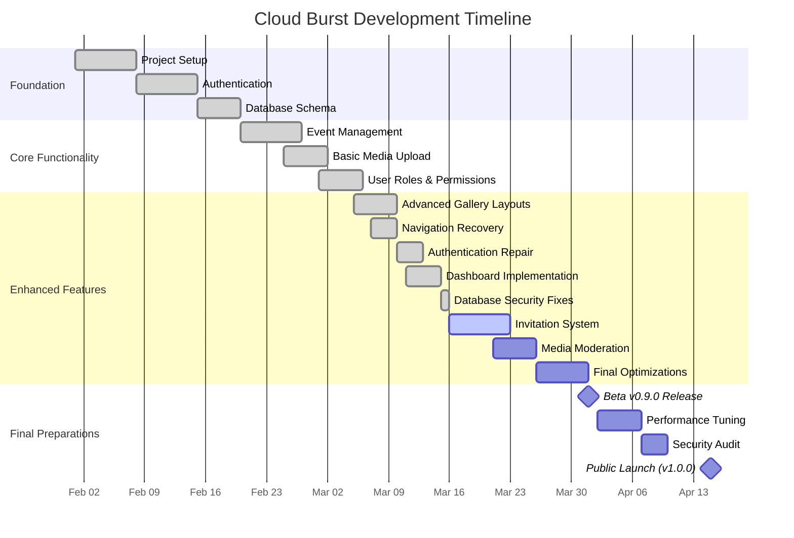
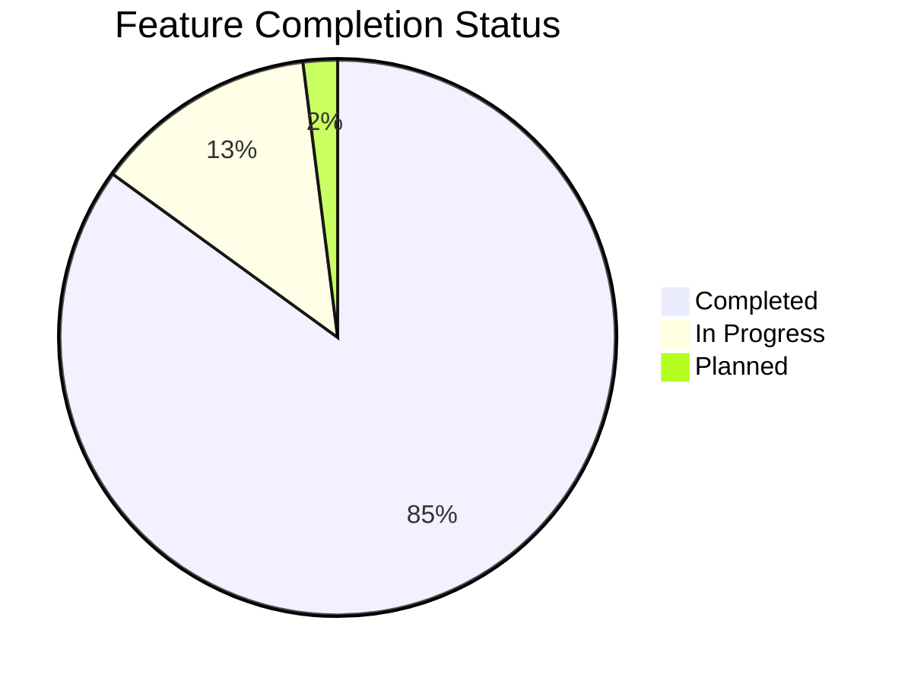

# Cloud Burst Development Roadmap

## Current Version: 0.7.8

## 📌 Situational Abstract
Cloud Burst has evolved from concept to a robust beta platform in a remarkably short timeframe since its inception in February 2025. With the successful implementation of the Analytics section, Media gallery (supporting both photos and videos), and comprehensive Invitation System, we've continued to build on our solid foundation for our event media platform. The recent focus on integration of the QR code scanning interface with direct camera access has improved the overall user experience, setting the stage for the completion of core invitation and media features.

Our platform now offers photographers and event organizers powerful tools to create, manage, and share event media with intuitive interfaces. The role-based access control system ensures appropriate permissions across different user types, while our improved database security provides robust protection for user data. We've successfully addressed technical challenges, such as the Events Analytics page rendering issues and sidebar width constraints, resulting in a more polished and professional user experience.

Through Session 25, we successfully implemented the QR code scanning interface and created a direct connection between invited users and the camera integration. We've also made significant improvements to the invitation system, including the foundation for email delivery, personalized QR codes, and tracking capabilities.

As we approach the 85% completion mark of our Enhanced Features phase, we're preparing for the final stages of development, which will include completing the Invitation tracking system, finalizing the Media gallery with moderation capabilities, and comprehensive testing across all user roles. The platform continues to maintain excellent performance within our memory constraints, demonstrating the effectiveness of our optimization strategies.

## Current Phase: Enhanced Features Implementation
**Status: In Progress (85% Complete)**

### Active Development
- 🟡 Invitation System Implementation (75% Complete)
- 🟡 Media Management & Moderation (65% Complete)
- 🟡 Analytics Data Integration (60% Complete)
- 🟡 User Experience Refinement (80% Complete)
- 🟡 QR Code Security Enhancement (85% Complete)

### Recently Completed
- ✅ QR code scanning interface with camera integration
- ✅ Media gallery with support for photos and videos
- ✅ Enhanced sidebar navigation with proper organization
- ✅ Basic invitation management interface
- ✅ Email template integration for invitations
- ✅ Database schema updates for invitation system
- ✅ Authentication flows for invited users
- ✅ Personalized QR code generation

### Next Priorities (v0.7.9)
1. Complete invitation tracking and metrics dashboard
2. Enhance media moderation workflow for photos and videos
3. Finalize email delivery system with tracking
4. Implement data integration for Analytics pages
5. Comprehensive security testing for invitation flows
6. Optimize mobile experience for invited guests

## 📅 Development Timeline (Gantt)

```mermaid
gantt
    title Cloud Burst Development Timeline
    dateFormat  YYYY-MM-DD
    axisFormat %b %d
    
    section Foundation
    Project Setup           :done, f1, 2025-02-01, 7d
    Authentication          :done, f2, 2025-02-08, 7d
    Database Schema         :done, f3, 2025-02-15, 5d
    
    section Core Functionality
    Event Management        :done, c1, 2025-02-20, 7d
    Basic Media Upload      :done, c2, 2025-02-25, 5d
    User Roles & Permissions:done, c3, 2025-03-01, 5d
    
    section Enhanced Features
    Advanced Gallery Layouts:done, e1, 2025-03-05, 5d
    Navigation Recovery     :done, e2, 2025-03-07, 3d
    Authentication Repair   :done, e3, 2025-03-10, 3d
    Dashboard Implementation:done, e4, 2025-03-11, 4d
    Database Security Fixes :done, e5, 2025-03-15, 1d
    Invitation System       :active, e6, 2025-03-16, 7d
    Media Moderation        :e7, 2025-03-21, 5d
    Final Optimizations     :e8, 2025-03-26, 6d
    
    section Final Preparations
    Beta v0.9.0 Release     :milestone, b1, 2025-04-01, 0d
    Performance Tuning      :o1, 2025-04-02, 5d
    Security Audit          :o2, 2025-04-07, 3d
    Public Launch (v1.0.0)  :milestone, l3, 2025-04-15, 0d
```

## Development Timeline

### March 1-14, 2025 (Completed)
- ✅ Implemented event status management
- ✅ Added QR code generation during event creation
- ✅ Enhanced QR code page layout
- ✅ Created Add Attendee dialog
- ✅ Fixed QR codes not appearing in listing page
- ✅ Fixed database functions with mutable search paths
- ✅ Implemented RLS policies for role_capabilities table
- ✅ Enhanced permissions caching to reduce API calls

### March 15-21, 2025 (Current)
- 🟡 Implementing invitation management dashboard
- 🟡 Enhancing QR code security and validation
- 🟡 Create database schema for invitation system
- 🟡 Develop API endpoints for invitation management
- 🟡 Implementing email template system for invitations

### March 22-31, 2025 (Upcoming)
- Email tracking and metrics implementation
- Complete media moderation system
- Finalize invitation tracking dashboard
- Security audit for invitation flows
- Final UI/UX refinements for invited guests
- Performance optimization
- Final testing for Beta 0.9.0

### April 1, 2025
- Beta 0.9.0 release for internal testing and first partner
- Comprehensive user acceptance testing
- Bug fixes and refinements
- Final documentation updates

### April 15, 2025
- Public launch (v1.0.0)
- Marketing and growth initiatives
- Community building

## Detailed Phase Breakdown

### Phase 1: Foundation (Completed Feb 1-15, 2025)
- ✅ Project initialization with Next.js 14
- ✅ Basic UI components and layout
- ✅ Authentication system integration
- ✅ Database schema design
- ✅ Storage configuration

### Phase 2: Core Functionality (Completed Feb 15-Mar 1, 2025)
- ✅ Event creation and management
- ✅ Basic media upload
- ✅ Simple gallery view
- ✅ User roles and permissions
- ✅ Public/private event settings

### Phase 3: Enhanced Features (Current - 85% Complete)
- ✅ Advanced gallery layouts (grid, masonry, slideshow)
- ✅ Navigation system recovery and enhancement
- ✅ Authentication system repair
- ✅ Dashboard foundation with key components
- ✅ Create Event interface with advanced options
- ✅ Event status management with selector component
- ✅ QR code generation during event creation
- ✅ Add Attendee dialog functionality
- ✅ Database security fixes and optimizations
- ✅ Video upload and playback support
- ✅ QR scanning interface with camera integration
- 🟡 Invitation system (75% Complete)
- 🟡 Email template integration (90% Complete)
- 🟡 Media moderation system (65% Complete)
- 🟡 Invitation tracking dashboard (55% Complete)
- 🟡 Analytics data integration (60% Complete)

### Phase 4: Final Preparations (Mar 25-Apr 15, 2025)
- 🟡 Performance optimization (In Progress)
- 🟡 Security audit (Planned)
- 🟡 Documentation completion (In Progress)
- 🟡 Final testing (Planned)
- 🟡 Deployment preparation (Planned)

## Key Metrics for Success

### Technical Metrics
- Page load time < 2 seconds
- Lighthouse score > 90 in all categories
- Test coverage > 80%
- Zero critical security vulnerabilities
- Media upload success rate > 99%

### User Experience Metrics
- Upload success rate > 99%
- User session duration > 5 minutes
- Return visitor rate > 40%
- Feature adoption rate > 60%
- QR code scan success rate > 95%
- Invitation acceptance rate > 60%

### Business Metrics
- User growth rate > 10% month-over-month
- Event creation rate > 5% week-over-week
- Media upload volume > 1000 per day
- Active event ratio > 70%
- Guest conversion to registered users > 30%
- Invitation email open rate > 65%

## 📊 Project Status Dashboard

```mermaid
pie title Feature Completion Status
    "Completed" : 85
    "In Progress" : 13
    "Planned" : 2
```

## 🔍 Risk Assessment
- **Media moderation**: Ensuring appropriate content filtering for photos and videos
- **Storage management**: Implementing efficient storage and retrieval mechanisms
- **Upload reliability**: Creating a robust upload system with error handling
- **Mobile experience**: Optimizing the QR scanning and gallery experience for mobile devices
- **Invitation security**: Ensuring secure token generation and validation
- **Email deliverability**: Maintaining high delivery rates for invitations
- **Analytics accuracy**: Ensuring data reliability and meaningful insights
- **User conversion**: Converting invited guests to registered users

## 📨 Invitation System Implementation

The invitation system is a critical component connecting the pre-event planning phase with the event-day experience. Our implementation follows a phased approach:

### Phase 1: Foundation (75% Complete)
- ✅ Database schema with invitations table
- ✅ Event-attendee relationships
- ✅ API endpoints for invitation management
- ✅ Basic invitation management UI
- ✅ QR code scanning interface
- 🟡 Security token generation and validation

### Phase 2: Core Functionality (70% Complete)
- ✅ Email template integration
- ✅ QR code generation system
- 🟡 Email delivery system
- 🟡 Tracking mechanisms for opens and clicks

### Phase 3: Authentication & Security (80% Complete)
- ✅ Guest authentication flow
- ✅ Temporary access tokens
- ✅ Role-based security policies
- 🟡 Rate limiting for invitation system

### Phase 4: User Experience (55% Complete)
- 🟡 Enhanced invitation management UI
- 🟡 Metrics dashboard for organizers
- 🟡 User profile for invited guests
- 🟡 Post-event engagement features

This comprehensive system will enhance the value proposition for event organizers while streamlining the experience for guests, ultimately driving platform adoption and user engagement.
