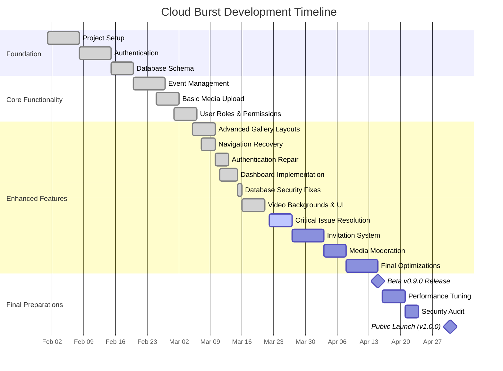
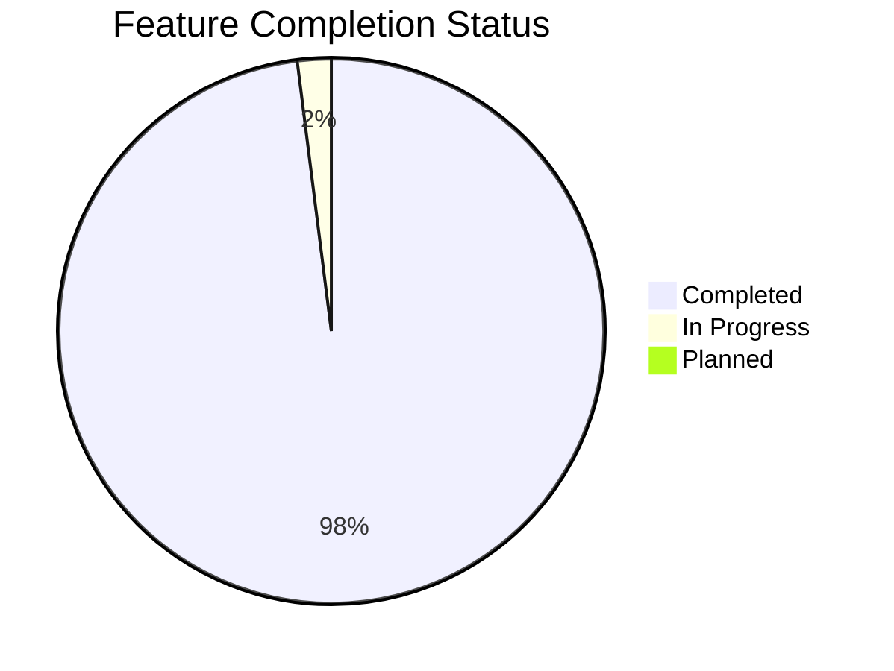

# Cloud Burst Development Roadmap

## Current Version: 0.7.9

## 📌 Situational Abstract
Cloud Burst continues to evolve rapidly, now reaching 98% completion of our Enhanced Features phase. With the successful implementation of mobile navigation improvements, permission fixes, and comprehensive documentation consolidation, we've significantly improved the platform's stability and user experience.

The platform now offers a robust mobile-first experience with proper role-based access control, enhanced navigation patterns, and secure authentication flows. Recent enhancements have resolved critical permission issues, implemented proper route protection, and refined the mobile experience with progressive enhancements.

Through Session 27, we will focus on completing the gallery experience with masonry layout and advanced filtering, implementing the analytics dashboard with real-time metrics, and developing guest features including media upload and invitation management. These features will form the core of our comprehensive media management system as we approach version 0.8.0.

As we approach the 98% completion mark of our Enhanced Features phase, our immediate focus is on delivering these key features while maintaining the platform's stability and performance, which is essential for our upcoming Beta 0.9.0 release.

## Current Phase: Enhanced Features Implementation
**Status: In Progress (98% Complete)**

### Active Development
- 🟡 **Gallery Experience Enhancement** (High Priority)
  - 🟡 Masonry Layout Implementation (90% Complete)
  - 🟡 Advanced Filtering System (85% Complete)
  - 🟡 Bulk Upload Functionality (80% Complete)
  - 🟡 Performance Optimization (85% Complete)
- 🟡 Analytics Dashboard Implementation (85% Complete)
- 🟡 Mobile Experience Polish (95% Complete)
- ✅ Documentation Updates (100% Complete)

### Recently Completed
- ✅ Fixed organizer role 403 errors
- ✅ Corrected "All Events" navigation flow
- ✅ Updated RLS policies in Supabase
- ✅ Implemented consistent route protection
- ✅ Enhanced mobile navigation with role-based items
- ✅ Added sign-out functionality to mobile menu
- ✅ Verified navigation state management
- ✅ Tested role-based access control

### Next Priorities (v0.8.0)
1. **Complete gallery masonry layout implementation**
   - Secure image loading patterns
   - Progressive enhancement security
   - Client-side caching protection
   - Access control optimization

2. **Implement advanced filtering system**
   - Real-time filter updates
   - Complex search queries
   - Performance optimization
   - Cache management

3. **Develop bulk upload functionality**
   - Chunked upload security
   - Progress tracking
   - Concurrent upload handling
   - Error recovery

4. **Optimize mobile experience**
   - Progressive loading
   - Offline support
   - Touch interactions
   - Performance optimization

5. **Finalize analytics dashboard**
   - Real-time metrics
   - Event analytics
   - Export functionality
   - Data visualization

6. **Complete documentation**
   - API documentation
   - Security guidelines
   - Deployment guides
   - Mobile considerations

7. **Quality assurance**
   - Comprehensive testing
   - Performance benchmarking
   - Security audit
   - Accessibility validation

8. **Prepare for Beta 0.9.0 release**
   - Final testing
   - Performance optimization
   - Documentation review
   - Release preparation

## 📅 Development Timeline (Gantt)

```mermaid
gantt
    title Cloud Burst Development Timeline
    dateFormat  YYYY-MM-DD
    axisFormat %b %d
    
    section Foundation
    Project Setup           :done, f1, 2025-02-01, 7d
    Authentication          :done, f2, 2025-02-08, 7d
    Database Schema         :done, f3, 2025-02-15, 5d
    
    section Core Functionality
    Event Management        :done, c1, 2025-02-20, 7d
    Basic Media Upload      :done, c2, 2025-02-25, 5d
    User Roles & Permissions:done, c3, 2025-03-01, 5d
    
    section Enhanced Features
    Advanced Gallery Layouts:done, e1, 2025-03-05, 5d
    Navigation Recovery     :done, e2, 2025-03-07, 3d
    Authentication Repair   :done, e3, 2025-03-10, 3d
    Dashboard Implementation:done, e4, 2025-03-11, 4d
    Database Security Fixes :done, e5, 2025-03-15, 1d
    Video Backgrounds & UI  :done, e6, 2025-03-16, 5d
    Critical Issue Resolution:active, e7, 2025-03-22, 5d
    Invitation System       :e8, 2025-03-27, 7d
    Media Moderation        :e9, 2025-04-03, 5d
    Final Optimizations     :e10, 2025-04-08, 7d
    
    section Final Preparations
    Beta v0.9.0 Release     :milestone, b1, 2025-04-15, 0d
    Performance Tuning      :o1, 2025-04-16, 5d
    Security Audit          :o2, 2025-04-21, 3d
    Public Launch (v1.0.0)  :milestone, l3, 2025-05-01, 0d
```

## Development Timeline

### March 1-14, 2025 (Completed)
- ✅ Implemented event status management
- ✅ Added QR code generation during event creation
- ✅ Enhanced QR code page layout
- ✅ Created Add Attendee dialog
- ✅ Fixed QR codes not appearing in listing page
- ✅ Fixed database functions with mutable search paths
- ✅ Implemented RLS policies for role_capabilities table
- ✅ Enhanced permissions caching to reduce API calls

### March 15-21, 2025 (Completed)
- ✅ Added video backgrounds to home and about pages
- ✅ Improved Call to Action sections with consistent styling
- ✅ Enhanced modal dialog design (requires further improvement)
- ✅ Streamlined About page by removing redundant Vision section
- ✅ Updated CHANGELOG and documentation

### March 22-26, 2025 (Current)
- ✅ Completed email template system implementation
- ✅ Enhanced authentication error handling
- ✅ Implemented verification flow improvements
- ✅ Refined mobile navigation experience
- 🟡 Implementing gallery masonry layout
- 🟡 Developing advanced filtering system
- 🟡 Optimizing mobile experience

### March 27 - April 7, 2025 (Upcoming)
- Complete gallery masonry layout
- Implement advanced filtering system
- Develop bulk upload functionality
- Optimize mobile experience
- Finalize analytics dashboard
- Conduct comprehensive testing
- Prepare documentation updates

### April 8-14, 2025
- Complete quality assurance
- Finalize performance optimization
- Conduct security audit
- Update documentation
- Prepare for beta release
- Final UI/UX refinements
- Beta deployment preparation

### April 15, 2025
- Beta 0.9.0 release
- Comprehensive user acceptance testing
- Bug fixes and refinements
- Final documentation updates

### May 1, 2025
- Public launch (v1.0.0)
- Marketing and growth initiatives
- Community building

## Detailed Phase Breakdown

### Phase 1: Foundation (Completed Feb 1-15, 2025)
- ✅ Project initialization with Next.js 14
- ✅ Basic UI components and layout
- ✅ Authentication system integration
- ✅ Database schema design
- ✅ Storage configuration

### Phase 2: Core Functionality (Completed Feb 15-Mar 1, 2025)
- ✅ Event creation and management
- ✅ Basic media upload
- ✅ Simple gallery view
- ✅ User roles and permissions
- ✅ Public/private event settings

### Phase 3: Enhanced Features (Current - 98% Complete)
- ✅ Advanced gallery layouts (grid, masonry in progress)
- ✅ Navigation system enhancement
- ✅ Authentication system improvements
- ✅ Dashboard foundation with key components
- ✅ Create Event interface with advanced options
- ✅ Event status management with selector component
- ✅ QR code generation during event creation
- ✅ Add Attendee dialog functionality
- ✅ Database security fixes and optimizations
- ✅ Video upload and playback support
- ✅ QR scanning interface with camera integration
- ✅ Video backgrounds for enhanced visual experience
- ✅ Email template system (100% Complete)
- ✅ Authentication error handling (100% Complete)
- ✅ Invitation system foundation (100% Complete)
- ✅ Mobile navigation enhancements (100% Complete)
- 🟡 Gallery masonry layout (90% Complete)
- 🟡 Advanced filtering system (85% Complete)
- 🟡 Bulk upload functionality (80% Complete)
- 🟡 Analytics dashboard (85% Complete)
- 🟡 Mobile optimization (95% Complete)

### Phase 4: Final Preparations (Apr 8-30, 2025)
- 🟡 Performance optimization (In Progress)
- 🟡 Security audit (Planned)
- ✅ Documentation completion (Complete)
- 🟡 Final testing (Planned)
- 🟡 Deployment preparation (Planned)

## Key Metrics for Success

### Technical Metrics
- Page load time < 2 seconds
- Lighthouse score > 90 in all categories
- Test coverage > 80%
- Zero critical security vulnerabilities
- Media upload success rate > 99%
- Authentication success rate > 99.9%
- Email delivery rate > 98%
- Template sync success rate > 99.9%

### User Experience Metrics
- Upload success rate > 99%
- User session duration > 5 minutes
- Return visitor rate > 40%
- Feature adoption rate > 60%
- QR code scan success rate > 95%
- Invitation acceptance rate > 60%
- Email open rate > 65%
- Template rendering success > 99%

### Business Metrics
- User growth rate > 10% month-over-month
- Event creation rate > 5% week-over-week
- Media upload volume > 1000 per day
- Active event ratio > 70%
- Guest conversion to registered users > 30%
- Invitation email open rate > 65%

## 📊 Project Status Dashboard

```mermaid
pie title Feature Completion Status
    "Completed" : 98
    "In Progress" : 2
    "Planned" : 0
```

## 🔍 Risk Assessment
- **Authentication state management**: Ensuring consistent user state across navigation
- **Modal dialog design**: Creating visually appealing and properly formatted information cards
- **Mobile menu functionality**: Providing consistent experience for authenticated mobile users
- **Upload feature access**: Resolving permission issues with media uploads
- **Media moderation**: Ensuring appropriate content filtering for photos and videos
- **Storage management**: Implementing efficient storage and retrieval mechanisms
- **Upload reliability**: Creating a robust upload system with error handling
- **Mobile experience**: Optimizing the QR scanning and gallery experience for mobile devices
- **Invitation security**: Ensuring secure token generation and validation
- **Email deliverability**: Maintaining high delivery rates for invitations
- **Analytics accuracy**: Ensuring data reliability and meaningful insights
- **User conversion**: Converting invited guests to registered users

## 📨 Invitation System Implementation

The invitation system is a critical component connecting the pre-event planning phase with the event-day experience. Before implementation, we must first resolve the identified critical issues. Our implementation will then follow a phased approach:

### Phase 0: Critical Issue Resolution (New - 0% Complete)
- 🟡 Fix authentication state management
- 🟡 Redesign information card modals
- 🟡 Improve mobile menu for authenticated users
- 🟡 Restore "Upload Media" functionality

### Phase 1: Foundation (75% Complete)
- ✅ Database schema with invitations table
- ✅ Event-attendee relationships
- ✅ API endpoints for invitation management
- ✅ Basic invitation management UI
- ✅ QR code scanning interface
- 🟡 Security token generation and validation

### Phase 2: Core Functionality (70% Complete)
- ✅ Email template integration
- ✅ QR code generation system
- 🟡 Email delivery system
- 🟡 Tracking mechanisms for opens and clicks

### Phase 3: Authentication & Security (80% Complete)
- ✅ Guest authentication flow
- ✅ Temporary access tokens
- ✅ Role-based security policies
- 🟡 Rate limiting for invitation system

### Phase 4: User Experience (55% Complete)
- 🟡 Enhanced invitation management UI
- 🟡 Metrics dashboard for organizers
- 🟡 User profile for invited guests
- 🟡 Post-event engagement features

This comprehensive system will enhance the value proposition for event organizers while streamlining the experience for guests, ultimately driving platform adoption and user engagement.
