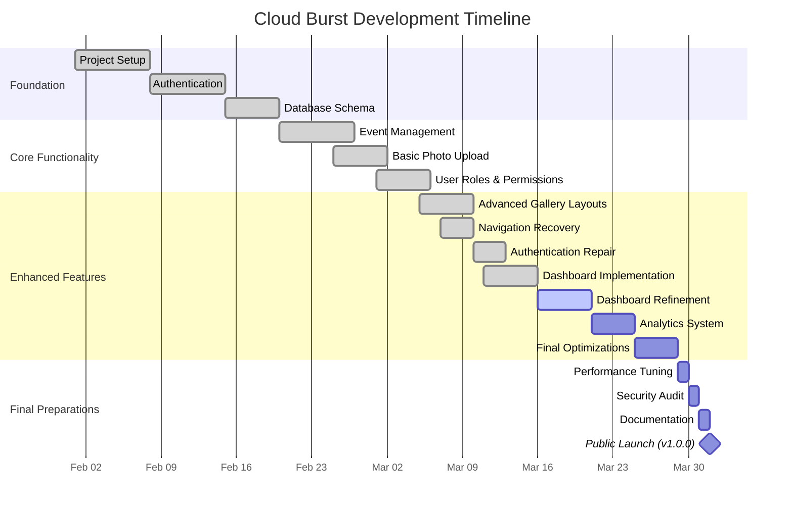
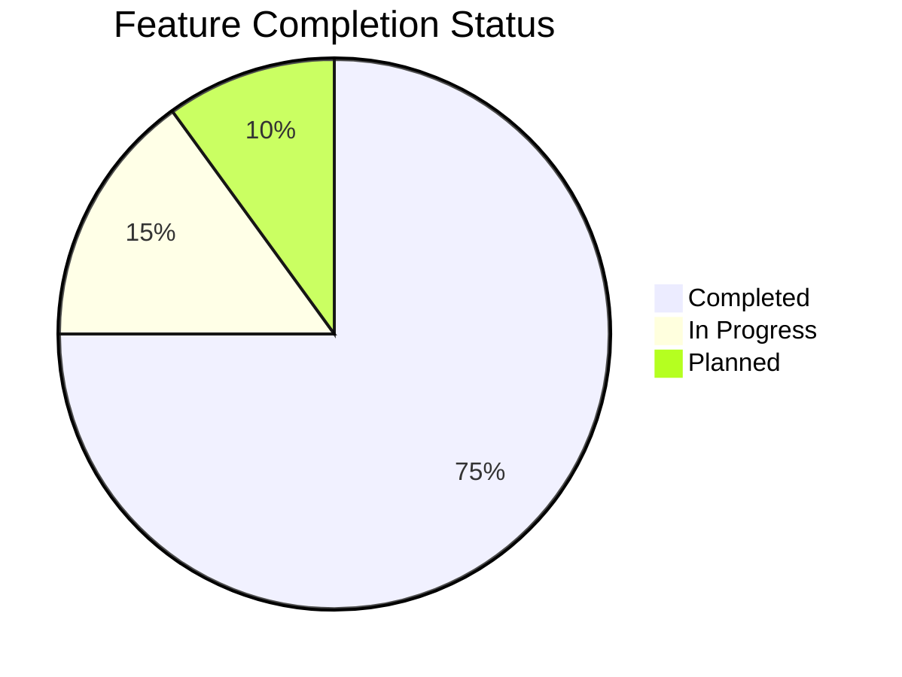

# Cloud Burst Development Roadmap

## Current Version: 0.7.5

## 📌 Situational Abstract
Cloud Burst has evolved from concept to a robust beta platform in a remarkably short timeframe since its inception in February 2025. With the successful implementation of custom event URLs, advanced gallery layouts, and tag-based organization, we've established a solid foundation for our event photography platform. The recent focus on TypeScript strict mode compliance has improved code quality and reliability, setting the stage for more advanced features.

Our platform now offers photographers and event organizers powerful tools to create, manage, and share event galleries with intuitive interfaces. The role-based access control system ensures appropriate permissions across different user types, while our gallery components provide flexible viewing options that adapt to various devices and preferences.

Through Session 22, we successfully implemented event status management, QR code generation during event creation, and enhanced the event details page with a status selector component. We also improved the QR code page layout and created a new Add Attendee dialog, though some styling issues remain to be addressed in Session 23. The platform now properly generates QR codes during event creation and displays them in the QR codes listing page, resolving a key functional issue.

As we approach the 75% completion mark of our Enhanced Features phase, we're preparing for Session 23 which will focus on polishing the event organizer experience by addressing technical debt and implementing the remaining core features. This refinement phase will take us to approximately 90% completion, with only Analytics and final optimizations remaining before our April 1, 2025 launch date.

The platform maintains excellent performance within our memory constraints, demonstrating the effectiveness of our optimization strategies. Our systematic approach to dashboard completion and refinement will deliver a seamless, professional-grade event photography platform that transforms how photographers and clients collaborate around life's most precious moments.

## Current Phase: Enhanced Features Implementation
**Status: In Progress (75% Complete)**

### Active Development
- ⚠️ Dialog Component Standardization (In Progress)
- ⚠️ QR Code Page Enhancements (In Progress)
- ⚠️ Templates, Photo Moderation, and Albums Pages (Planned)
- ⚠️ User Experience Enhancements (Planned)

### Recently Completed
- ✅ Event status management with status selector component
- ✅ QR code generation during event creation process
- ✅ Enhanced QR code page layout
- ✅ Add Attendee dialog functionality (styling needs improvement)
- ✅ Event status update functionality with visual feedback

### Next Priorities (v0.7.6)
1. Resolve technical debt from Session 22
2. Complete remaining core dashboard features
3. Enhance user experience with guided tours and contextual help
4. Improve form validation and feedback patterns
5. Ensure consistent styling across all components

## 📅 Development Timeline (Gantt)

```mermaid
gantt
    title Cloud Burst Development Timeline
    dateFormat  YYYY-MM-DD
    axisFormat %b %d
    
    section Foundation
    Project Setup           :done, f1, 2025-02-01, 7d
    Authentication          :done, f2, 2025-02-08, 7d
    Database Schema         :done, f3, 2025-02-15, 5d
    
    section Core Functionality
    Event Management        :done, c1, 2025-02-20, 7d
    Basic Photo Upload      :done, c2, 2025-02-25, 5d
    User Roles & Permissions:done, c3, 2025-03-01, 5d
    
    section Enhanced Features
    Advanced Gallery Layouts:done, e1, 2025-03-05, 5d
    Navigation Recovery     :done, e2, 2025-03-07, 3d
    Authentication Repair   :done, e3, 2025-03-10, 3d
    Dashboard Implementation:done, e4, 2025-03-11, 5d
    Dashboard Refinement    :active, e5, 2025-03-16, 5d
    Analytics System        :e6, 2025-03-21, 4d
    Final Optimizations     :e7, 2025-03-25, 4d
    
    section Final Preparations
    Performance Tuning      :o1, 2025-03-29, 1d
    Security Audit          :o2, 2025-03-30, 1d
    Documentation           :l2, 2025-03-31, 1d
    Public Launch (v1.0.0)  :milestone, l3, 2025-04-01, 0d
```

## Development Timeline

### March 1-10, 2025 (Previous)
- ✅ Resolved navigation system issues
- ✅ Repaired authentication system
- ✅ Enhanced dashboard foundation
- ✅ Improved Create Event interface
- ✅ Fixed styling and layout issues

### March 11-15, 2025 (Completed)
- ✅ Implemented event status management
- ✅ Added QR code generation during event creation
- ✅ Enhanced QR code page layout
- ✅ Created Add Attendee dialog
- ✅ Fixed QR codes not appearing in listing page

### March 16-20, 2025 (Current)
- Standardize dialog component patterns
- Enhance QR code functionality
- Complete Templates, Photo Moderation, and Albums pages
- Implement Subscription management
- Add user experience enhancements

### March 21-31, 2025 (Upcoming)
- Analytics system implementation
- Performance optimization
- Security audit and hardening
- Final documentation
- Pre-launch preparations

### April 1, 2025
- Public launch (v1.0.0)
- Marketing and growth initiatives
- Community building

## Detailed Phase Breakdown

### Phase 1: Foundation (Completed Feb 1-15, 2025)
- ✅ Project initialization with Next.js 14
- ✅ Basic UI components and layout
- ✅ Authentication system integration
- ✅ Database schema design
- ✅ Storage configuration

### Phase 2: Core Functionality (Completed Feb 15-Mar 1, 2025)
- ✅ Event creation and management
- ✅ Basic photo upload
- ✅ Simple gallery view
- ✅ User roles and permissions
- ✅ Public/private event settings

### Phase 3: Enhanced Features (Current - 75% Complete)
- ✅ Advanced gallery layouts (grid, masonry, slideshow)
- ✅ Navigation system recovery and enhancement
- ✅ Authentication system repair
- ✅ Dashboard foundation with key components
- ✅ Create Event interface with advanced options
- ✅ Event status management with selector component
- ✅ QR code generation during event creation
- ✅ Add Attendee dialog functionality
- ⚠️ Dialog component standardization (In Progress)
- ⚠️ QR code functionality enhancements (In Progress)
- ⚠️ Templates, Photo Moderation, and Albums pages (Planned)
- ⚠️ User experience enhancements (Planned)
- ⚠️ Analytics and reporting (Planned)

### Phase 4: Final Preparations (Mar 25-Apr 1, 2025)
- ⚠️ Performance optimization
- ⚠️ Security audit
- ⚠️ Documentation completion
- ⚠️ Final testing
- ⚠️ Deployment preparation

## Key Metrics for Success

### Technical Metrics
- Page load time < 2 seconds
- Lighthouse score > 90 in all categories
- Test coverage > 80%
- Zero critical security vulnerabilities

### User Experience Metrics
- Upload success rate > 99%
- User session duration > 5 minutes
- Return visitor rate > 40%
- Feature adoption rate > 60%

### Business Metrics
- User growth rate > 10% month-over-month
- Event creation rate > 5% week-over-week
- Photo upload volume > 1000 per day
- Active event ratio > 70%

## 📊 Project Status Dashboard

```mermaid
pie title Feature Completion Status
    "Completed" : 75
    "In Progress" : 15
    "Planned" : 10
```

## 🔍 Risk Assessment
- **UI consistency**: Ensuring uniform experience across all dialog components
- **Technical debt resolution**: Addressing styling issues in a systematic way
- **Feature completion timeline**: Balancing refinement with new feature implementation
- **User experience enhancements**: Creating intuitive guided tours and contextual help
- **Performance with large datasets**: Ensuring fast performance with numerous events and photos
- **Mobile responsiveness**: Maintaining consistent experience across diverse device types
