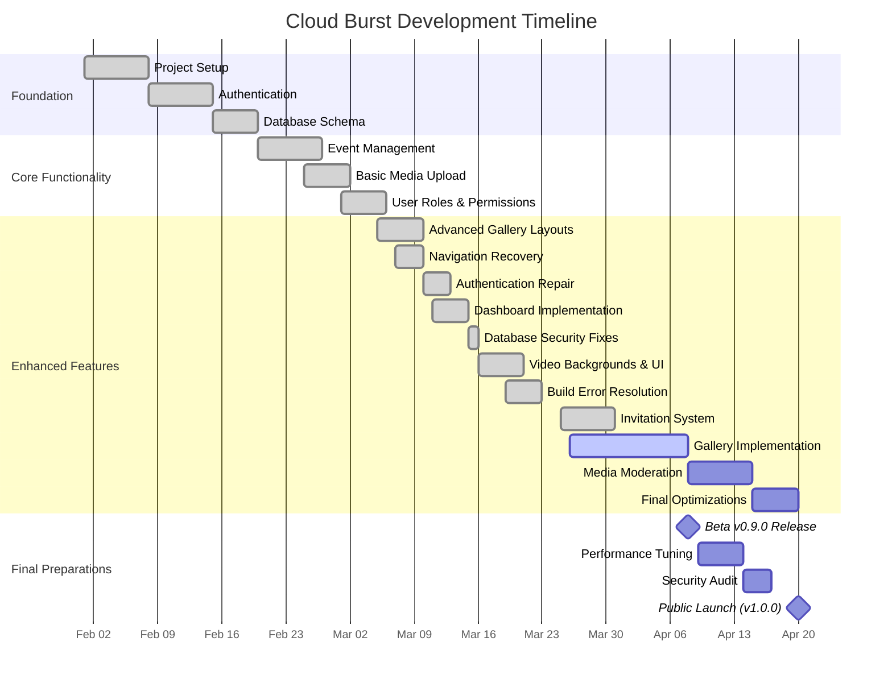
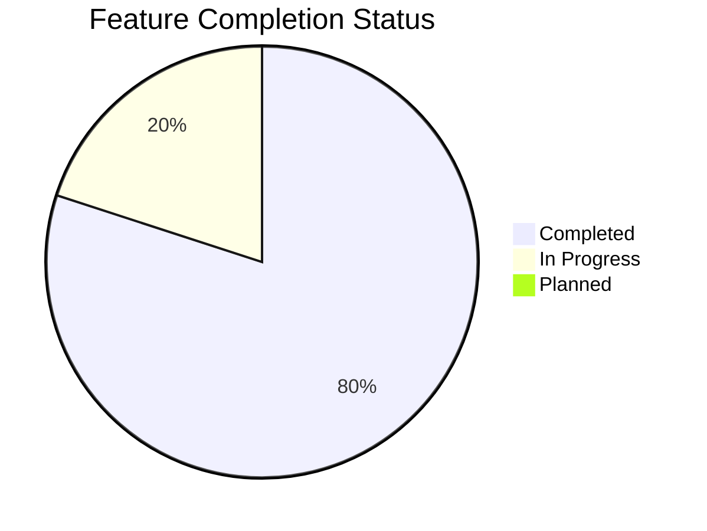

# Cloud Burst Development Roadmap

## Current Version: 0.8.0

## 📌 Situational Abstract
Cloud Burst has entered a new phase with the launch of version 0.8.0, focusing on comprehensive gallery implementation and media management. With the successful completion of the invitation system in Session 28, we've significantly improved the platform's communication capabilities and user experience.

The platform now offers a robust event management system with proper role-based access control, enhanced navigation patterns, secure authentication flows, fully responsive layouts, and a complete invitation system with SendGrid integration. During Session 29, we made substantial progress in building the foundation for our comprehensive media management system, including designing the database schema for multimedia support, creating TypeScript interfaces, and developing prototype components for the gallery implementation.

As we move into Session 30, our focus remains on completing the gallery system with masonry layout and album management, enhancing the dashboard with analytics panels, and implementing the onboarding flow for new organizers. We've already made significant strides, particularly in the database migration and initial component development, putting us in a strong position to deliver the remaining features for the Beta 0.9.0 release, now scheduled for April 8, 2025.

Our immediate priority is finalizing these key components while maintaining the platform's stability and performance, which is essential for our upcoming release.

## Current Phase: Gallery Implementation
**Status: In Progress (35% Complete)**

### Active Development
- 🟡 **Gallery System Implementation** (High Priority)
  - 🟡 Database migration from photos to media (90% Complete)
  - 🟡 Upload dropzone component (15% Complete)
  - 🟡 Media card components (15% Complete)
  - 🟡 Masonry layout implementation (10% Complete)
  - 🟡 Album management (0% Complete)
  - 🟡 Guest upload system (0% Complete)
- 🟡 **Dashboard Enhancements** (High Priority)
  - 🟡 Analytics panels (0% Complete)
  - 🟡 Performance metrics (0% Complete)
  - 🟡 Event engagement statistics (0% Complete)
  - 🟡 User activity monitoring (0% Complete)
- ✅ **Invitation System Integration** (High Priority)
  - ✅ Email templates (100% Complete)
  - ✅ QR code tracking (100% Complete)
  - ✅ Guest permissions (100% Complete)
  - ✅ RSVP functionality (100% Complete)
  - ✅ SendGrid integration (100% Complete)
  - ✅ API endpoint security (100% Complete)
- 🟡 **Onboarding Flow** (High Priority)
  - 🟡 Organizer setup process (0% Complete)
  - 🟡 Profile completion workflow (0% Complete)
  - 🟡 Event template selection (0% Complete)
  - 🟡 Welcome email automation (0% Complete)

### Recently Completed (Session 29)
- ✅ Designed database schema for multimedia support (photos, videos, audio)
- ✅ Created TypeScript interfaces for media types and album management
- ✅ Developed media card component with support for multiple media types
- ✅ Established foundation for masonry layout implementation
- ✅ Built prototype of upload dropzone component with drag-and-drop functionality
- ✅ Developed helper functions for media operations
- ✅ Created migration script for transitioning from photos to media table
- ✅ Fixed TypeScript errors throughout the codebase
- ✅ Enhanced error handling for null values in media components
- ✅ Improved overall gallery architecture and component structure

### Recently Completed (Session 28)
- ✅ Implemented comprehensive invitation system with API integration
- ✅ Integrated SendGrid for secure email delivery
- ✅ Enhanced error handling for form submissions
- ✅ Added user guidance for invitation workflows
- ✅ Improved navigation between events and guest management
- ✅ Implemented form validation with proper feedback
- ✅ Added contextual information for invitation flows
- ✅ Enhanced invitation security with proper token handling
- ✅ Fixed API endpoint connections for invitation creation
- ✅ Updated documentation to reflect new features

### Next Priorities (Session 30)
1. **Complete database migration from photos to media**
   - Finalize schema implementation
   - Deploy migration scripts
   - Update API endpoints
   - Test data integrity
   - Implement final RLS policies

2. **Finalize responsive upload dropzone component**
   - Complete drag-and-drop interface
   - Implement file validation
   - Polish progress visualization
   - Optimize for mobile
   - Add comprehensive error handling

3. **Complete media card components**
   - Finalize design
   - Implement hover states
   - Polish responsive behavior
   - Test with various media types
   - Optimize for performance

4. **Complete masonry layout implementation**
   - Finalize dynamic column system
   - Polish responsive behavior
   - Implement lazy loading
   - Optimize for performance
   - Ensure accessibility

5. **Develop album management system**
   - Implement album data structure
   - Build creation interface
   - Create media assignment workflow
   - Add sharing capabilities
   - Develop album views

6. **Create guest upload system**
   - Finalize token-based authentication
   - Implement invitation integration
   - Build secure upload interface
   - Add validation and moderation
   - Create success feedback

7. **Enhance dashboard with analytics**
   - Build analytics panels
   - Implement metrics tracking
   - Create data visualization
   - Add export functionality
   - Optimize for mobile

8. **Implement onboarding flow**
   - Create step-by-step process
   - Build profile completion
   - Implement event templates
   - Add welcome automation
   - Ensure smooth user experience

## 📅 Development Timeline (Gantt)

```mermaid
gantt
    title Cloud Burst Development Timeline
    dateFormat  YYYY-MM-DD
    axisFormat %b %d
    
    section Foundation
    Project Setup           :done, f1, 2025-02-01, 7d
    Authentication          :done, f2, 2025-02-08, 7d
    Database Schema         :done, f3, 2025-02-15, 5d
    
    section Core Functionality
    Event Management        :done, c1, 2025-02-20, 7d
    Basic Media Upload      :done, c2, 2025-02-25, 5d
    User Roles & Permissions:done, c3, 2025-03-01, 5d
    
    section Enhanced Features
    Advanced Gallery Layouts:done, e1, 2025-03-05, 5d
    Navigation Recovery     :done, e2, 2025-03-07, 3d
    Authentication Repair   :done, e3, 2025-03-10, 3d
    Dashboard Implementation:done, e4, 2025-03-11, 4d
    Database Security Fixes :done, e5, 2025-03-15, 1d
    Video Backgrounds & UI  :done, e6, 2025-03-16, 5d
    Build Error Resolution  :done, e7, 2025-03-19, 4d
    Invitation System       :done, e8, 2025-03-25, 6d
    Gallery Implementation  :active, e9, 2025-03-26, 13d
    Media Moderation        :e10, 2025-04-08, 7d
    Final Optimizations     :e11, 2025-04-15, 5d
    
    section Final Preparations
    Beta v0.9.0 Release     :milestone, b1, 2025-04-08, 0d
    Performance Tuning      :o1, 2025-04-09, 5d
    Security Audit          :o2, 2025-04-14, 3d
    Public Launch (v1.0.0)  :milestone, l3, 2025-04-20, 0d
```

## Development Timeline

### March 26-April 1, 2025 (Completed)
- ✅ Designed database schema for multimedia support
- ✅ Created TypeScript interfaces for media types and album management
- ✅ Developed media card component with support for multiple media types
- ✅ Established foundation for masonry layout implementation
- ✅ Built prototype of upload dropzone component
- ✅ Developed helper functions for media operations
- ✅ Created migration script for transitioning from photos to media
- ✅ Fixed TypeScript errors throughout the codebase
- ✅ Enhanced error handling in media components
- ✅ Improved gallery architecture and component structure

### April 1-8, 2025 (Current)
- 🟡 Complete database migration from photos to media
- 🟡 Finalize responsive upload dropzone component
- 🟡 Complete media card components
- 🟡 Implement masonry layout
- 🟡 Develop album management framework
- 🟡 Create guest upload system
- 🟡 Enhance dashboard with analytics panels
- 🟡 Implement onboarding flow for new organizers

### April 8-14, 2025 (Upcoming)
- 🟡 Implement comprehensive media moderation
- 🟡 Enhance notification system
- 🟡 Optimize mobile experience
- 🟡 Implement security enhancements
- 🟡 Conduct comprehensive testing
- 🟡 Prepare documentation updates

### April 14-20, 2025
- 🟡 Complete quality assurance
- 🟡 Finalize performance optimization
- 🟡 Conduct security audit
- 🟡 Update documentation
- 🟡 Prepare for beta release
- 🟡 Final UI/UX refinements
- 🟡 Beta deployment preparation

### April 8, 2025
- 🟡 Beta 0.9.0 release
- 🟡 Comprehensive user acceptance testing
- 🟡 Bug fixes and refinements
- 🟡 Final documentation updates

### April 20, 2025
- 🟡 Public launch (v1.0.0)
- 🟡 Marketing and growth initiatives
- 🟡 Community building

## Detailed Phase Breakdown

### Phase 1: Foundation (Completed Feb 1-15, 2025)
- ✅ Project initialization with Next.js 14
- ✅ Basic UI components and layout
- ✅ Authentication system integration
- ✅ Database schema design
- ✅ Storage configuration

### Phase 2: Core Functionality (Completed Feb 15-Mar 1, 2025)
- ✅ Event creation and management
- ✅ Basic media upload
- ✅ Simple gallery view
- ✅ User roles and permissions
- ✅ Public/private event settings

### Phase 3: Enhanced Features (Completed Mar 1-25, 2025)
- ✅ Advanced gallery layouts foundation
- ✅ Navigation system enhancement
- ✅ Authentication system improvements
- ✅ Dashboard foundation with key components
- ✅ Create Event interface with advanced options
- ✅ Event status management with selector component
- ✅ QR code generation during event creation
- ✅ Add Attendee dialog functionality
- ✅ Database security fixes and optimizations
- ✅ Video upload and playback support
- ✅ QR scanning interface with camera integration
- ✅ Video backgrounds for enhanced visual experience
- ✅ Email template system foundation
- ✅ Authentication error handling
- ✅ Event visibility improvements
- ✅ Permission fixes and debugging
- ✅ UI enhancements for light mode
- ✅ Build error resolution
- ✅ Comprehensive invitation system implementation
- ✅ SendGrid integration for email delivery
- ✅ Enhanced form validation and error handling
- ✅ API endpoint security for invitations

### Phase 4: Gallery Implementation (Current - Mar 26-Apr 1, 2025)
- 🟡 Database migration from photos to media (0% Complete)
- 🟡 Upload dropzone component (0% Complete)
- 🟡 Media card components (0% Complete)
- 🟡 Masonry layout implementation (0% Complete)
- 🟡 Album management framework (0% Complete)
- 🟡 Guest upload system (0% Complete)
- 🟡 Dashboard analytics enhancement (0% Complete)
- 🟡 Onboarding flow implementation (0% Complete)

### Phase 5: Final Preparations (Apr 1-20, 2025)
- 🟡 Performance optimization (Planned)
- 🟡 Security audit (Planned)
- 🟡 Documentation completion (Planned)
- 🟡 Final testing (Planned)
- 🟡 Deployment preparation (Planned)

## Key Metrics for Success

### Technical Metrics
- Page load time < 2 seconds
- Lighthouse score > 90 in all categories
- Test coverage > 80%
- Zero critical security vulnerabilities
- Media upload success rate > 99%
- Authentication success rate > 99.9%
- Email delivery rate > 98%
- Template sync success rate > 99.9%
- Invitation validation success rate > 99%
- QR code scan success rate > 95%

### User Experience Metrics
- Upload success rate > 99%
- User session duration > 5 minutes
- Return visitor rate > 40%
- Feature adoption rate > 60%
- QR code scan success rate > 95%
- Invitation acceptance rate > 60%
- Email open rate > 65%
- Template rendering success > 99%
- Guest authentication success rate > 98%
- Guest-to-registered conversion rate > 30%

### Business Metrics
- User growth rate > 10% month-over-month
- Event creation rate > 5% week-over-week
- Media upload volume > 1000 per day
- Active event ratio > 70%
- Guest conversion to registered users > 30%
- Invitation email open rate > 65%
- Event attendance rate via QR codes > 80%

## 📊 Project Status Dashboard

```mermaid
pie title Feature Completion Status
    "Completed" : 80
    "In Progress" : 20
    "Planned" : 0
```

## 🔍 Risk Assessment
- **Media performance**: Ensuring fast loading for large collections
- **Upload reliability**: Creating a robust upload system with error handling
- **Mobile optimization**: Optimizing the gallery experience for mobile devices
- **Invitation security**: Ensuring secure token generation and validation
- **Email deliverability**: Maintaining high delivery rates for invitations
- **Analytics accuracy**: Ensuring data reliability and meaningful insights
- **Masonry layout performance**: Optimizing complex layout calculations
- **User onboarding experience**: Creating a smooth setup process for new organizers
- **Album management complexity**: Balancing features with usability
- **Guest upload security**: Preventing abuse while enabling contribution

## 📨 Gallery System Implementation

The gallery system is a critical component providing the core media management capabilities of the platform. Our implementation will follow a phased approach:

### Phase 1: Foundation (0% Complete)
- 🟡 Database migration from photos to media
- 🟡 Basic upload functionality
- 🟡 Media card components
- 🟡 Simple grid layout
- 🟡 Basic media viewing

### Phase 2: Core Functionality (0% Complete)
- 🟡 Masonry layout implementation
- 🟡 Album management framework
- 🟡 Media filtering and sorting
- 🟡 Guest upload system
- 🟡 Basic moderation tools

### Phase 3: Advanced Features (0% Complete)
- 🟡 Enhanced filtering and search
- 🟡 Advanced album management
- 🟡 Sharing capabilities
- 🟡 Download options
- 🟡 Performance optimization

### Phase 4: User Experience (0% Complete)
- 🟡 Mobile touch optimization
- 🟡 Progressive loading
- 🟡 Offline support
- 🟡 UI polish and refinement
- 🟡 Accessibility enhancements

This comprehensive system will provide a robust media management solution for event photographers and attendees, enhancing the value proposition of the Cloud Burst platform.
