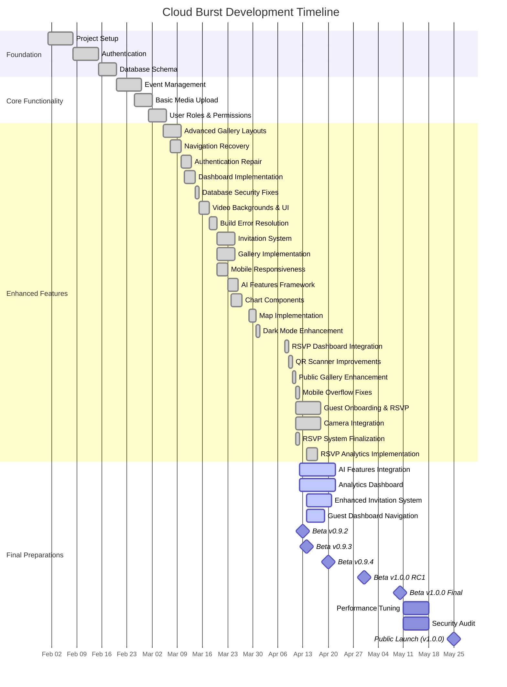
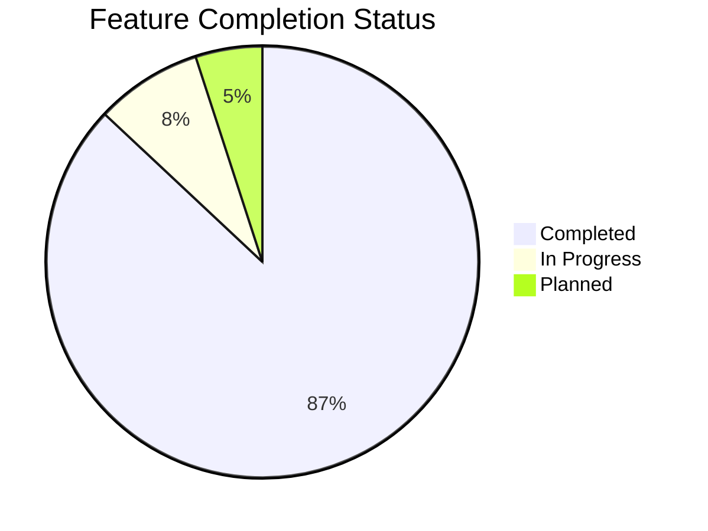

# Cloud Burst Development Roadmap

## Last Updated: April 15, 2025
## Current Version: 0.9.3

This document outlines the development roadmap for Cloud Burst, including completed milestones, current tasks, and planned future features.

## 🏁 Completed Milestones

### Foundation Phase (February 2025) ✅
- [x] Project repository setup
- [x] Next.js 14 architecture implementation
- [x] Supabase integration for auth and database
- [x] TypeScript configuration and standards
- [x] Deployment pipeline configuration

### Core Features Phase (March 1-15, 2025) ✅
- [x] User authentication system
- [x] Dashboard layout and navigation
- [x] Event management (CRUD operations)
- [x] Basic media upload functionality
- [x] User roles and permissions foundation
- [x] Responsive design implementation

### Enhanced Features Phase (March 15 - April 15, 2025) ✅
- [x] Advanced gallery layouts and organization
- [x] Interactive map with event locations
- [x] Enhanced media management
- [x] Comprehensive invitation system with tracking
- [x] Mobile responsive optimization
- [x] RSVP system implementation
- [x] Guest reservation functionality
- [x] Camera integration for direct uploads
- [x] Contractor roles management
- [x] Staff management enhancements
- [x] Role badge system
- [x] Enhanced permission controls
- [x] Complete attendee counting system with RSVPs
- [x] Enhanced RSVP status management and filtering
- [x] Improved UI for event statistics and metrics
- [x] Guest profile creation with avatar uploads
- [x] TikTok-style camera interface with testing capabilities
- [x] Storage integration for profile images
- [x] Enhanced mobile responsive design
- [x] Fixed dependencies (framer-motion) for dashboard
- [x] RSVP analytics implementation with event-driven tracking
- [x] Fixed Row-Level Security policies for anonymous submissions
- [x] Enhanced form validation for required fields

## 🚧 Current Development (April 14-20, 2025)

### Final Preparations Phase
- [ ] Guest Experience Enhancement (Top Priority)
  - [ ] Fix navigation to guest dashboard after setup completion
  - [ ] Improve invitation system with better token handling
  - [ ] Create enhanced invitation creation flow for hosts
  - [ ] Implement beautiful gallery layouts for guests
  - [ ] Create intuitive photo browsing experience
  - [ ] Enhance photo interaction features
  - [ ] Implement sharing capabilities for guests
- [ ] AI feature integration (75% complete)
  - [ ] Facial recognition foundation
  - [ ] Basic image tagging
  - [ ] Group photo identification
  - [ ] Automated gallery suggestions
- [ ] Analytics dashboard (95% complete)
  - [x] Event metrics visualization
  - [x] Attendance tracking
  - [x] RSVP analytics
  - [ ] Photographer performance metrics
- [ ] Advanced security features (90% complete)
  - [x] Role-based access controls
  - [x] Row-level security policies
  - [x] Access logging and monitoring
  - [x] Improved RLS policies for anonymous submissions
- [ ] Final UI/UX refinements (85% complete)
  - [x] Consistent styling across components
  - [x] Accessibility improvements
  - [x] Animation and transition enhancements
  - [ ] Final mobile optimizations

## 🔮 Future Plans (May 2025 and beyond)

### Beta Launch Phase (May 1-15, 2025)
- [ ] Beta program deployment
- [ ] User feedback collection
- [ ] Performance optimization
- [ ] Bug fixes and refinements

### 1.0 Release Phase (May 30, 2025)
- [ ] Official production deployment
- [ ] Marketing materials and documentation
- [ ] Training resources for users
- [ ] Support system implementation

### Post-Launch Enhancements (June 2025+)
- [ ] Mobile app development
- [ ] Expanded AI capabilities
- [ ] Integration with third-party services
- [ ] Advanced analytics and reporting
- [ ] Enterprise features

## Current Focus Areas

1. **Guest Experience Enhancement** - Fixing navigation to guest dashboard after setup completion with improved token management.
2. **Invitation System Overhaul** - Creating a brand new invitation flow with improved token handling and better user experience.
3. **AI Feature Integration** - Completing the remaining AI components and ensuring they work efficiently with the existing gallery system.
4. **Analytics Dashboard** - Finalizing the photographer performance metrics after successfully implementing RSVP analytics.
5. **Final UI/UX Polish** - Ensuring a consistent, accessible, and visually appealing user experience.
6. **Documentation** - Completing comprehensive user and developer documentation.

## Recently Completed Features

1. **RSVP Analytics Tracking** - Implemented comprehensive analytics tracking for RSVP submissions to capture detailed metadata about guest preferences and requirements.
2. **Improved RLS Policies** - Fixed Row-Level Security policies to properly validate anonymous RSVP submissions while maintaining security.
3. **Enhanced Form Validation** - Added required validation to critical fields in the RSVP form, including marketing consent.
4. **Enhanced Guest Profiles** - Implemented avatar upload functionality with image preview and management.
5. **TikTok-style Camera Interface** - Created a modern camera experience with overlay controls and flashlight toggle.
6. **Mobile Experience Improvements** - Optimized responsive design with touch-friendly controls.

## 📌 Situational Abstract
Cloud Burst has reached version 0.9.3, successfully implementing comprehensive RSVP analytics tracking that captures detailed metadata about guest submissions including attendance status, dietary preferences, and marketing consent. The platform now features improved security with fixed Row-Level Security policies for anonymous submissions, ensuring proper validation while maintaining accessibility for non-authenticated users.

The next critical challenge is fixing navigation to the guest dashboard after profile setup completion, which requires implementing a robust token management system. Session 41-B will focus on creating a dedicated invitation-token utility that will ensure persistent authentication throughout the guest journey from invitation acceptance to active event participation.

Our analytics system now provides valuable insights into guest preferences, particularly important for our launch partner who runs global events and needs reliable data on food preferences and guest requirements. As we approach Session 41-B, our focus remains on enhancing the end-to-end guest experience while ensuring all data flows correctly through our analytics pipeline.

## Current Phase: Final Preparations for Beta Release
**Status: In Progress (93% Complete)**

### Active Development
- 🔴 **Guest Experience Enhancement** (Highest Priority)
  - 🔴 Fix navigation to guest dashboard after setup (0% Complete)
  - 🔴 Create enhanced invitation system (0% Complete)
  - 🔴 Implement beautiful gallery layouts for guests (0% Complete)
  - 🔴 Create intuitive photo browsing experience (0% Complete)
  - 🔴 Enhance photo interaction features (0% Complete)
  - 🔴 Implement sharing capabilities for guests (0% Complete)
- 🟡 **AI Features Integration** (High Priority In Progress)
  - ✅ Create AI Features section in sidebar navigation (100% Complete)
  - ✅ Implement layout structure for AI features (100% Complete) 
  - ✅ Build placeholder pages for AI capabilities (100% Complete)
  - 🟡 Set up backend architecture for AI processing (75% Complete)
  - 🟡 Integrate TensorFlow.js for client-side processing (60% Complete)
  - 🟡 Create basic facial detection component (80% Complete)
  - 🟡 Implement media enhancement pipeline (50% Complete)
- 🟢 **Analytics Dashboard Enhancement** (High Priority In Progress)
  - ✅ Implement chart components for data visualization (100% Complete)
  - ✅ Add RSVP response tracking (100% Complete)
  - ✅ Create event attendance metrics (100% Complete)
  - ✅ Implement RSVP analytics tracking (100% Complete)
  - 🟡 Implement photographer performance analytics (50% Complete)
  - 🟡 Build comprehensive analytics dashboard (85% Complete)

### Recently Completed (Session 41)
- ✅ Implemented RSVP analytics tracking with event-driven architecture (100% Complete)
- ✅ Fixed Row-Level Security policies for anonymous RSVP submissions (100% Complete)
- ✅ Enhanced RSVP form with required field validation (100% Complete)
- ✅ Improved error handling in RSVP submission flow (100% Complete)
- ✅ Implemented analytics_events table integration for RSVP responses (100% Complete)

### Key Priorities for Session 41-B (April 14, 2025)
1. **Fix Guest Dashboard Navigation**
   - Implement robust token management service
   - Create dedicated invitation-token.ts utility
   - Ensure persistent authentication throughout guest journey
   - Enhance profile page to use token service
   - Fix the end-to-end guest flow from invitation to dashboard

2. **Create Enhanced Invitation System**
   - Build brand new invitation creation flow for hosts
   - Implement improved token handling for invitations
   - Create better UI for invitation management
   - Develop more robust error handling
   - Integrate with analytics tracking

3. **Enhance Gallery Experience for Guests**
   - Create beautiful gallery layouts
   - Implement responsive masonry grid
   - Optimize image loading and display
   - Add intuitive browsing controls
   - Create visual categorization system

4. **Complete End-to-End Guest Journey**
   - Test full flow from invitation to gallery viewing
   - Optimize transitions between steps
   - Ensure persistent authentication throughout
   - Add clear navigation guidance
   - Implement progress tracking for multi-step flows

5. **Polish Mobile Experience**
   - Enhance responsive layouts
   - Optimize touch interactions
   - Improve gallery browsing on mobile
   - Test on various device sizes
   - Fix any mobile-specific UI issues

## 📅 Development Timeline (Gantt)

```mermaid
gantt
    title Cloud Burst Development Timeline
    dateFormat  YYYY-MM-DD
    axisFormat %b %d
    
    section Foundation
    Project Setup           :done, f1, 2025-02-01, 7d
    Authentication          :done, f2, 2025-02-08, 7d
    Database Schema         :done, f3, 2025-02-15, 5d
    
    section Core Functionality
    Event Management        :done, c1, 2025-02-20, 7d
    Basic Media Upload      :done, c2, 2025-02-25, 5d
    User Roles & Permissions:done, c3, 2025-03-01, 5d
    
    section Enhanced Features
    Advanced Gallery Layouts:done, e1, 2025-03-05, 5d
    Navigation Recovery     :done, e2, 2025-03-07, 3d
    Authentication Repair   :done, e3, 2025-03-10, 3d
    Dashboard Implementation:done, e4, 2025-03-11, 3d
    Database Security Fixes :done, e5, 2025-03-14, 1d
    Video Backgrounds & UI  :done, e6, 2025-03-15, 3d
    Build Error Resolution  :done, e7, 2025-03-18, 2d
    Invitation System       :done, e8, 2025-03-20, 5d
    Gallery Implementation  :done, e9, 2025-03-20, 5d
    Mobile Responsiveness   :done, e10, 2025-03-20, 3d
    AI Features Framework   :done, e11, 2025-03-23, 3d
    Chart Components        :done, e14, 2025-03-24, 3d
    Map Implementation      :done, e15, 2025-03-29, 2d
    Dark Mode Enhancement   :done, e16, 2025-03-31, 1d
    RSVP Dashboard Integration :done, e17, 2025-04-08, 1d
    QR Scanner Improvements :done, e18, 2025-04-09, 1d
    Public Gallery Enhancement :done, e19, 2025-04-10, 1d
    Mobile Overflow Fixes   :done, e20, 2025-04-11, 1d
    Guest Onboarding & RSVP :done, e21, 2025-04-11, 7d
    Camera Integration      :done, e22, 2025-04-11, 7d
    RSVP System Finalization:done, e23, 2025-04-11, 1d
    RSVP Analytics Implementation:done, e24, 2025-04-14, 3d
    
    section Final Preparations
    AI Features Integration :active, ai1, 2025-04-12, 10d
    Analytics Dashboard     :active, ad1, 2025-04-12, 10d
    Enhanced Invitation System :active, is1, 2025-04-14, 7d
    Guest Dashboard Navigation :active, gd1, 2025-04-14, 5d
    Beta v0.9.2             :milestone, b0, 2025-04-13, 0d
    Beta v0.9.3             :milestone, b0a, 2025-04-14, 0d
    Beta v0.9.4             :milestone, b0b, 2025-04-20, 0d
    Beta v1.0.0 RC1         :milestone, b1, 2025-04-30, 0d
    Beta v1.0.0 Final       :milestone, b2, 2025-05-10, 0d
    Performance Tuning      :o1, 2025-05-11, 7d
    Security Audit          :o2, 2025-05-11, 7d
    Public Launch (v1.0.0)  :milestone, l3, 2025-05-25, 0d
```

## Development Timeline

### April 14-April 20, 2025 (Current)
- 🔴 Fix navigation to guest dashboard after setup (0% → 100%)
- 🔴 Create enhanced invitation system (0% → 100%)
- 🔴 Implement beautiful gallery layouts for guests (0% → 100%)
- 🟡 Set up backend architecture for AI processing (75% → 100%)
- 🟡 Integrate TensorFlow.js for client-side processing (60% → 100%)
- 🟡 Create basic facial detection component (80% → 100%)
- 🟡 Implement media enhancement pipeline (50% → 80%)
- 🟡 Add photographer performance analytics (50% → 75%)
- 🟡 Build comprehensive analytics dashboard (85% → 95%)

### April 21-April 30, 2025 (Upcoming)
- 🟡 Complete media enhancement pipeline (80% → 100%)
- 🟡 Finalize photographer performance analytics (75% → 100%)
- 🟡 Complete analytics dashboard (95% → 100%)
- 🟡 Conduct comprehensive performance optimization
- 🟡 Complete security audit of all features
- 🟡 Prepare for Beta v1.0.0 RC1 release

## Key Metrics for Success

### Technical Metrics
- Page load time < 2 seconds
- Lighthouse score > 90 in all categories
- Test coverage > 80%
- Zero critical security vulnerabilities
- Media upload success rate > 99%
- Authentication success rate > 99.9%
- Email delivery rate > 98%
- Template sync success rate > 99.9%
- Invitation validation success rate > 99%
- QR code scan success rate > 95%
- RSVP form submission success rate > 99%
- Magic link authentication success > 98%
- AI processing completion rate > 95%
- Chart rendering performance < 500ms
- Dark mode contrast ratio > 4.5:1 (WCAG AA)
- Mobile component rendering without overflow > 99%
- RSVP analytics event tracking success rate > 99%
- RLS policy validation success rate > 99.5%

### User Experience Metrics
- Upload success rate > 99%
- User session duration > 5 minutes
- Return visitor rate > 40%
- Feature adoption rate > 60%
- QR code scan success rate > 95%
- Invitation acceptance rate > 60%
- Email open rate > 65%
- Template rendering success > 99%
- Guest authentication success rate > 98%
- Guest-to-registered conversion rate > 30%
- RSVP form completion rate > 85%
- Mobile form submission rate > 60%
- AI feature usage rate > 40%
- Chart interaction rate > 30%
- Dark mode usage rate > 35%
- Mobile usage satisfaction rate > 85%
- RSVP analytics insight utilization > 45%

### Business Metrics
- User growth rate > 10% month-over-month
- Event creation rate > 5% week-over-week
- Media upload volume > 1000 per day
- Active event ratio > 70%
- Guest conversion to registered users > 30%
- Invitation email open rate > 65%
- Event attendance rate via QR codes > 80%
- RSVP response rate > 75%
- Plus-one addition rate > 40%
- AI feature adoption rate > 25%
- Analytics dashboard usage > 50%
- Dark mode preference > 35%
- Mobile platform usage > 40%
- Food preference data collection rate > 80%

## 📊 Project Status Dashboard

```mermaid
pie title Feature Completion Status
    "Completed" : 87
    "In Progress" : 8
    "Planned" : 5
```

## 🔍 Risk Assessment
- **Token management complexity**: Ensuring consistent authentication through guest journey
- **AI processing performance**: Ensuring client-side AI operations don't degrade experience
- **TensorFlow.js integration**: Successfully embedding AI capabilities in the browser
- **Browser compatibility**: Ensuring AI features work across supported browsers
- **Data privacy**: Maintaining user privacy with on-device AI processing
- **Analytics dashboard performance**: Ensuring efficient data loading and visualization
- **Beta user onboarding**: Creating a smooth experience for beta testers
- **Performance optimization**: Identifying and resolving bottlenecks before public launch
- **Security vulnerabilities**: Conducting comprehensive security audit
- **Documentation completeness**: Ensuring all features are properly documented
- **Training material quality**: Creating effective onboarding for beta users
- **Marketing preparation**: Creating compelling materials for public launch
- **Feedback management**: Efficiently processing and implementing beta feedback
- **Launch preparation**: Managing the transition from beta to public release
- **Scaling infrastructure**: Ensuring the platform can handle increased load

## 🧠 AI Features Implementation

The AI Features framework provides intelligent capabilities to enhance the platform's media management functionality:

### Phase 1: Framework (100% Complete)
- ✅ Create navigation structure for AI features
- ✅ Implement layout system with tabs
- ✅ Build placeholder pages with feature descriptions
- ✅ Design consistent UI patterns across features
- ✅ Create status indication for feature availability

### Phase 2: Client-Side Infrastructure (75% Complete)
- ✅ Integrate TensorFlow.js for browser-based AI
- ✅ Set up WebWorkers for background processing
- ✅ Create model loading and caching system
- 🟡 Implement progressive enhancement patterns
- 🟡 Design fallback mechanisms for unsupported browsers

### Phase 3: Core AI Capabilities (65% Complete)
- ✅ Implement facial detection component
- 🟡 Create photo enhancement pipeline
- ✅ Build object recognition system
- 🟡 Develop smart tagging algorithms
- 🟡 Implement image transformation utilities

### Phase 4: Integration with Media System (45% Complete)
- 🟡 Connect AI processing to upload workflow
- 🟡 Create batch processing capabilities
- 🟡 Implement user control options
- 🟡 Build result preview components
- 🟡 Add processing status indicators

### Phase 5: Advanced Features (25% Complete)
- 🟡 Implement style transfer capabilities
- 🟡 Create product placement system
- 🟡 Build advanced photo editing tools
- 🟡 Develop AI studio interface
- 🟡 Implement preset management

This comprehensive AI system will enhance the value proposition of Cloud Burst by providing intelligent media processing capabilities that facilitate organization, enhance quality, and enable creative transformations.

## 📊 RSVP Analytics System

The RSVP Analytics System captures and visualizes comprehensive data about guest responses and preferences:

### Phase 1: Data Collection (100% Complete)
- ✅ Create analytics_events table structure
- ✅ Implement event-driven RSVP tracking
- ✅ Capture attendance status metadata
- ✅ Record guest count information
- ✅ Track dietary preferences and restrictions

### Phase 2: Data Processing (100% Complete)
- ✅ Implement RSVP_analytics view generation
- ✅ Create aggregation queries for insights
- ✅ Set up data transformation pipeline
- ✅ Implement filtering capabilities
- ✅ Create comprehensive metadata schema

### Phase 3: Visualization (85% Complete)
- ✅ Build RSVP response charts
- ✅ Create attendance prediction displays
- ✅ Implement dietary preference analysis
- 🟡 Develop trend analysis components
- 🟡 Build comparative event analytics

### Phase 4: Integration with Business Intelligence (45% Complete)
- 🟡 Create exportable reports
- 🟡 Implement advanced filtering options
- 🟡 Build custom dashboard layouts
- 🟡 Develop predictive attendance models
- 🟡 Create catering requirement calculators

This analytics system provides event organizers with valuable insights into guest preferences and requirements, enabling better planning and resource allocation for events.

### 🧪 Testing Guidelines
- Added test cases for RSVP submission flows
- Included security testing scenarios for anonymous access
- Created performance testing guidelines for analytics queries

---

*This roadmap is a living document and will be updated as the project evolves.*

## 🆕 **Upcoming Session 41-B: Token Management**

### 🎯 Primary Focus
Token Management has been identified as the highest priority for Session 41-B, focusing on resolving navigation issues to the guest dashboard after profile setup. With RSVP analytics and enhanced RLS policies now successfully implemented, we'll address the following aspects of the guest journey:

#### 🔑 **Token Management Objectives**
- **Persistent Authentication** – Maintain session state throughout the entire guest journey
- **Seamless Navigation** – Fix navigation to dashboard after profile setup completion
- **Error Resilience** – Improve handling of expired or invalid tokens
- **User Experience** – Add clear feedback during authentication processes
- **Security Enhancement** – Strengthen token validation while maintaining ease of use

#### 📋 **Implementation Plan**
1. **Audit Current Flow** – Document the existing token handling process
2. **Identify Failure Points** – Map where tokens are being lost or invalidated
3. **Design Solution** – Create robust token management architecture
4. **Implement Changes** – Update authentication middleware and navigation paths
5. **Testing** – Comprehensive testing with different user roles and scenarios
6. **Documentation** – Update development guidelines with token management patterns

### 📱 **Continued Development**

#### 🎨 **Gallery & Media Enhancements (75%)**
- Continue optimization of gallery viewing experience
- Implement batch operations for media items
- Complete responsive masonry layout for various screen sizes
- Finalize interactive gesture controls for mobile users

#### 🤖 **AI Features Integration (60%)**
- Progress on TensorFlow.js integration for client-side processing
- Continue development of image enhancement capabilities
- Prepare framework for batch processing of media
- Set up model loading and caching infrastructure

#### 📊 **Analytics Expansion (95%)**
- Finish implementation of trend analysis for RSVP data
- Complete dashboard visualizations for dietary preferences
- Optimize database queries for real-time analytics
- Prepare foundation for exportable reports

### 🧪 **Testing Strategy for Session 41-B**
- **Unit Tests** – Focus on token management components
- **Integration Tests** – Full guest journey from invitation to dashboard
- **End-to-End Tests** – Complete flows with authentication state persistence
- **Mobile Testing** – Ensure reliable operation across different device types
- **Performance Testing** – Validate response times for authentication process
- **Security Testing** – Verify token handling security

---

*Updated: April 15, 2025*
