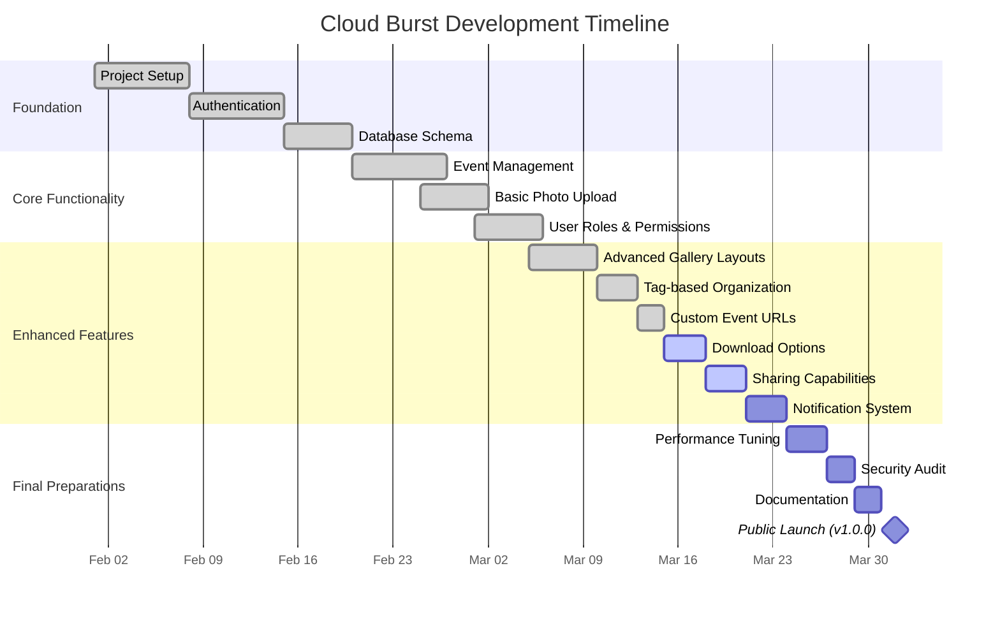
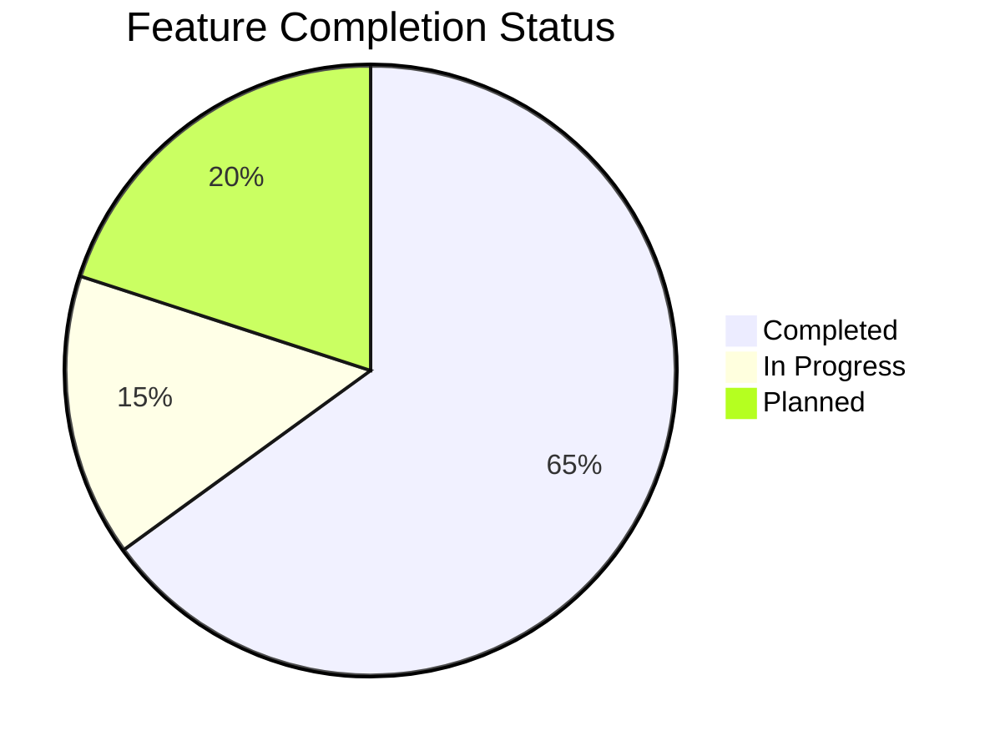

# Cloud Burst Development Roadmap

## Current Version: 0.7.0

## 📌 Situational Abstract
Cloud Burst has evolved from concept to a robust beta platform in a remarkably short timeframe since its inception in February 2025. With the successful implementation of custom event URLs, advanced gallery layouts, and tag-based organization, we've established a solid foundation for our event photography platform. The recent focus on TypeScript strict mode compliance has improved code quality and reliability, setting the stage for more advanced features.

Our platform now offers photographers and event organizers powerful tools to create, manage, and share event galleries with intuitive interfaces. The role-based access control system ensures appropriate permissions across different user types, while our gallery components provide flexible viewing options that adapt to various devices and preferences.

As we approach the 75% completion mark of our Enhanced Features phase, we're preparing for the final sprint toward our April 1, 2025 launch date. The platform maintains excellent performance within our memory constraints, demonstrating the effectiveness of our optimization strategies.

The next development sprint will focus on completing the download functionality for gallery images, implementing a notification system, and enhancing mobile responsiveness - bringing us closer to our goal of delivering a seamless, professional-grade event photography platform that transforms how photographers and clients collaborate around life's most precious moments.

## Current Phase: Enhanced Features Implementation
**Status: In Progress (75% Complete)**

### Active Development
- ⚠️ Download options for gallery images (In Progress)
- ⚠️ Enhanced sharing capabilities (In Progress)
- ⚠️ Performance optimization for gallery views (In Progress)

### Recently Completed
- ✅ Custom event URLs for improved branding and sharing
- ✅ Advanced gallery layouts (grid, masonry, slideshow)
- ✅ Tag-based photo filtering and organization
- ✅ Gallery sorting options (date, popularity)
- ✅ TypeScript error resolution and code quality improvements

### Next Priorities (v0.8.0)
1. Complete download functionality for gallery images
2. Implement notification system for event updates
3. Add batch operations for photo management
4. Enhance mobile responsiveness
5. Implement comprehensive error handling

## 📅 Development Timeline (Gantt)

```mermaid
gantt
    title Cloud Burst Development Timeline
    dateFormat  YYYY-MM-DD
    axisFormat %b %d
    
    section Foundation
    Project Setup           :done, f1, 2025-02-01, 7d
    Authentication          :done, f2, 2025-02-08, 7d
    Database Schema         :done, f3, 2025-02-15, 5d
    
    section Core Functionality
    Event Management        :done, c1, 2025-02-20, 7d
    Basic Photo Upload      :done, c2, 2025-02-25, 5d
    User Roles & Permissions:done, c3, 2025-03-01, 5d
    
    section Enhanced Features
    Advanced Gallery Layouts:done, e1, 2025-03-05, 5d
    Tag-based Organization  :done, e2, 2025-03-10, 3d
    Custom Event URLs       :done, e3, 2025-03-13, 2d
    Download Options        :active, e4, 2025-03-15, 3d
    Sharing Capabilities    :active, e5, 2025-03-18, 3d
    Notification System     :e6, 2025-03-21, 3d
    
    section Final Preparations
    Performance Tuning      :o1, 2025-03-24, 3d
    Security Audit          :o2, 2025-03-27, 2d
    Documentation           :l2, 2025-03-29, 2d
    Public Launch (v1.0.0)  :milestone, l3, 2025-04-01, 0d
```

## Development Timeline

### March 1-15, 2025 (Previous)
- ✅ Completed user roles & permissions
- ✅ Implemented advanced gallery layouts
- ✅ Added tag-based organization
- ✅ Developed custom event URLs

### March 15-31, 2025 (Current)
- Download options for gallery images
- Enhanced sharing capabilities
- Notification system implementation
- Performance optimization
- Security audit

### April 1, 2025
- Public launch (v1.0.0)
- Marketing and growth initiatives
- Community building

## Detailed Phase Breakdown

### Phase 1: Foundation (Completed Feb 1-15, 2025)
- ✅ Project initialization with Next.js 14
- ✅ Basic UI components and layout
- ✅ Authentication system integration
- ✅ Database schema design
- ✅ Storage configuration

### Phase 2: Core Functionality (Completed Feb 15-Mar 1, 2025)
- ✅ Event creation and management
- ✅ Basic photo upload
- ✅ Simple gallery view
- ✅ User roles and permissions
- ✅ Public/private event settings

### Phase 3: Enhanced Features (Current - 75% Complete)
- ✅ Advanced gallery layouts (grid, masonry, slideshow)
- ✅ Photo filtering and sorting
- ✅ Custom event URLs
- ✅ Tag-based organization
- ⚠️ Download options for photos (In Progress)
- ⚠️ Sharing capabilities (In Progress)
- ⚠️ Notification system (Planned)

### Phase 4: Final Preparations (Mar 24-Apr 1, 2025)
- ⚠️ Performance optimization
- ⚠️ Security audit
- ⚠️ Documentation completion
- ⚠️ Final testing
- ⚠️ Deployment preparation

## Key Metrics for Success

### Technical Metrics
- Page load time < 2 seconds
- Lighthouse score > 90 in all categories
- Test coverage > 80%
- Zero critical security vulnerabilities

### User Experience Metrics
- Upload success rate > 99%
- User session duration > 5 minutes
- Return visitor rate > 40%
- Feature adoption rate > 60%

### Business Metrics
- User growth rate > 10% month-over-month
- Event creation rate > 5% week-over-week
- Photo upload volume > 1000 per day
- Active event ratio > 70%

## 📊 Project Status Dashboard

```mermaid
pie title Feature Completion Status
    "Completed" : 65
    "In Progress" : 15
    "Planned" : 20
```

## 🔍 Risk Assessment
- **Tight timeline**: Compressed development schedule requires careful prioritization
- **Image handling within memory constraints**: Balancing quality and performance while respecting platform limitations
- **Launch readiness**: Ensuring all critical features are complete and stable by April 1
- **Mobile responsiveness**: Maintaining consistent experience across diverse device types and sizes
- **Security of shared content**: Protecting user data while enabling convenient sharing options
